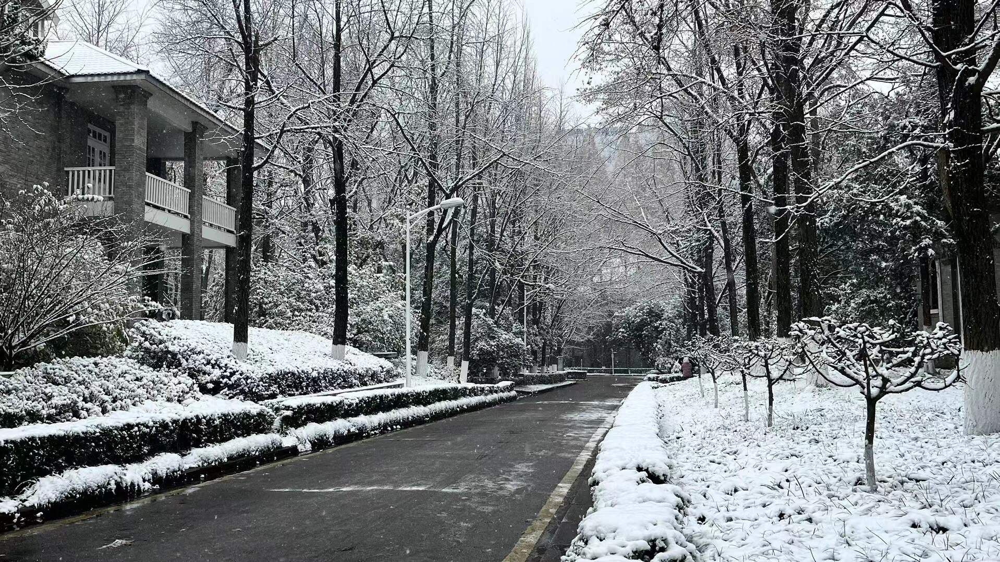

今天继续下雪！

早上起床就看到栋栋发的“外面又下雪了”，收拾好出门发现今天的雪比前两日的大许多。怎么形容？就是那种有点遮挡视线的程度。看看天气预报，这场雪要从早上下到晚上九点，于是特别激动，想着今天耍雪要耍安逸~

等到十点过考完听力，窗外已经是白茫茫的一片。看到这一幕时，我寻思着这等规模累积到傍晚雪该有多厚，玩着该有多爽。晚饭时分，积雪已相当壮观，厚度超过一根手指，连沥青路面上都开始堆积结冰，对于我这种没咋见过雪的鼠鼠来说，真是心潮澎湃，赶紧拉上栋栋去转。

操场已经变成一个巨大的滑冰场了🤣积雪把地面裹得严严实实，无法分辨跑道和足球场的界限。球场上人满为患，堆雪人打雪仗玩得不亦乐乎🤣🤣🤣校园里，道路两侧的树枝难以承载雪的重量，路过时偶尔会被天降雪块砸中，散落一身雪粉。教学楼门口的树林成为雪原，植被上覆着一层柔软丝滑的雪被。那些树木高大而茂盛，能载住大量雪花，谁能忍住这样一种冲动呢：跑到树下，使劲朝树干上推两把，等待松动的雪块从枝头滑落。上方的雪连带着下方的一同坠落，形成连锁反应，瞬间洒下，甚是好玩！代价就是，浑身被淋得浇葩湿。

对对！我给臭猪打视频带她看雪，顺便在图书馆门口堆了一个迷你小雪人。之后跟栋栋转悠的时候，又一时兴起滚了个脑袋大小的雪球。这么完美的圆球，舍不得扔，干脆跋涉到操场堆一个大雪人🤣，不过到操场后发现脑袋大小的雪球完全不够用，于是接着卖力滚雪球，直到太沉滚不动为止。这一过程硬是给我在冰天雪地里干得汗流浃背了💦。把这个雪球放在最底层作为身体，滚一个小雪球放在上方作为脑壳，脑壳上面再捏两个小坨坨当耳朵，把造型修圆，我们就得到了一个可可爱爱的小熊！

操场上的雪人千奇百怪，你不得不感叹大学生的创造力。有比我还高的五层雪人，也有捏出耳朵活灵活现的小兔叽，甚至有人拿雪捏了一朵玫瑰花，更甚至，有人直接造了个鸡哥。而且相当生动。太抽象了。哈哈哈哈。

