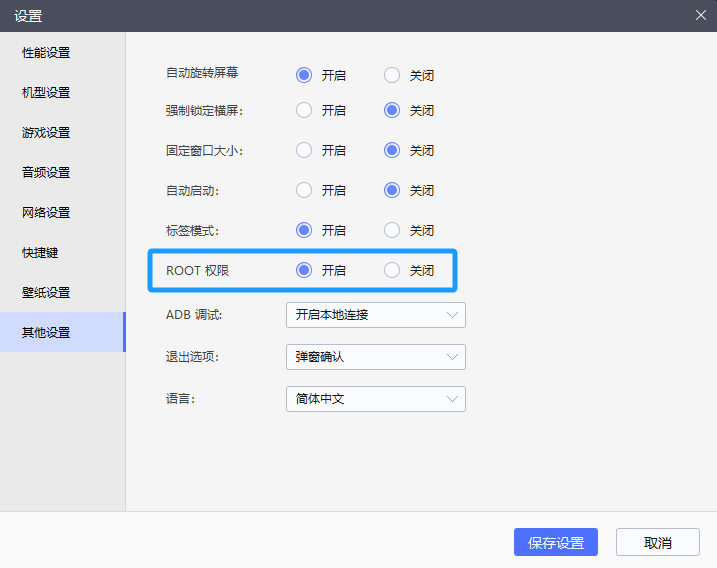
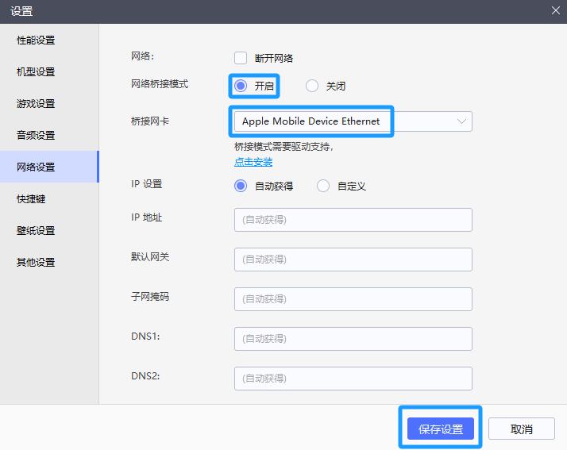

## 0 - 前期准备

可能需要使用的工具有：
- 安卓模拟器（此处使用的是[雷电模拟器](https://www.ldmnq.com/?n=6000)），软件，用于导出聊天记录数据。
- [Sqlcipher](https://link.zhihu.com/?target=https%3A//pan.baidu.com/s/1Rg35hFES-gvE6bir0SPBJA%3Fpwd%3Dooqe)，软件，用于获取聊天记录内容。
- [ROSTCM6](https://link.zhihu.com/?target=https%3A//pan.baidu.com/s/1FzBaI_jUugq9kXr5k2Zynw%3Fpwd%3Dgpba)，软件，用于统计词频。
- [MD5 散列计算器](https://link.zhihu.com/?target=https%3A//md5calculator.chromefans.org/%3Flangid%3Dzh-cn)，网页，用于计算 MD5 散列值。
- [微词云](https://www.weiciyun.com/)，网页，用于制作词云。
- [易企秀](https://store.eqxiu.com/)，网页，用于制作报告。

## 1 - 导出记录

基本思路：将手机聊天记录迁移至电脑上的模拟器（可理解为另一台手机），利用模拟器的 ROOT 权限，获得微信数据库文件 `EnMicroMsg.db`，再对其进行处理，最终生成 `.csv` 文件。

### 1.1 - 准备工作

1. 在电脑上安装[雷电模拟器](https://www.ldmnq.com/?n=6000)。
2. 在模拟器的设置中打开 ROOT 权限。以雷电模拟器为例，进行如下操作：“设置 - 其他设置 - ROOT 权限 - 开启”。  
  {: width="972" height="589"}
  _1.1 - 打开模拟器 ROOT 权限_
1. 在模拟器上安装微信。注意：此时不必登录。
2. 将手机与模拟器连接至同一网络。

> 第 4 步中，如果模拟器无法更改默认网络，可打开手机 USB 传输热点功能，将数据线接入电脑，随后在模拟器中进行如下操作：“设置 - 网络设置 - 网络桥接模式 - 开启”，在下拉菜单中，选择对应于手机热点的一项（此处笔者手机为 iPhone，对应的热点选项名称为 “Apple Mobile Device Ethernet” ）。保存设置，重启模拟器。
> {: width="972" height="589"}
> _1.1 - 使用网络桥接模式连接至同一网络_
{: .prompt-info }

### 1.2 - 传输聊天记录至电脑

1. 进入手机微信，依次点击：“设置 - 聊天 - 聊天记录备份与迁移 - 迁移 - 迁移到手机 / 平板微信”，选择需要迁移的聊天、时间跨度，选择“含图片 / 视频 / 文件”。
2. 点击“开始”，获得二维码。此时，在模拟器上登录该微信账号，用电脑自带摄像头扫描该二维码，即可开始同步。若电脑无摄像头，可先将图片传至电脑并打开，使用模拟器的“实时截取屏幕”功能扫描。
3. 同步完成后，打开模拟器中的文件管理器，根据路径：  
  `/data/data/com.tencent.mm/MicroMsg/xx...x`{: .filepath}（其中，`xx...x` 是一个 32 位字符串命名的文件夹）  
  找到 `EnMicroMsg.db` 文件，利用模拟器的共享文件夹功能，将该文件拷贝至电脑。
  {: width="972" height="589"}
  _1.2 - 模拟器的共享文件夹功能_

### 1.3 - 获取聊天记录内容

1. 下载破解软件 [Sqlcipher](https://link.zhihu.com/?target=https%3A//pan.baidu.com/s/1Rg35hFES-gvE6bir0SPBJA%3Fpwd%3Dooqe)。
2. 获取破解密码：将手机 IMEI 码与微信 uin 码直接拼接后，使用 [MD5 散列计算器](https://link.zhihu.com/?target=https%3A//md5calculator.chromefans.org/%3Flangid%3Dzh-cn)，换算成 32 位小写 MD5 散列值，取前 7 位。
   - 手机 IMEI 码获取方式：在手机拨号键盘输入 `*#06#` 后即出现。最新版本 IMEI 为固定值，为 1234567890ABCDEF，建议均尝试一次。笔者所使用的 IMEI 码即为该固定值。
   - 微信 uin 码获取方式：在模拟器中，打开文件管理器，按以下路径找到文件：  
  `/data/data/com.tencent.mm/shared_prefs/auth_info_key_prefs.xml`{: .filepath}  
  传输至电脑，用记事本打开，找到 `auth_uin`，其中 `value` 后的数值即为微信 uin 码。
3. 用 Sqlcipher 打开[步骤 1.2](#12---传输聊天记录至电脑) 中获取的 `EnMicroMsg.db` 文件，输入密码即可破解聊天记录。
4. 导出聊天内容。依次点击：“File – Export – Table as CSV file”，在下拉菜单中选择 `message`，导出，并在文件名中加上后缀 `.csv`。

## 2 - 统计数据

### 2.1 - 表格分析

打开 `.csv` 文件，参照如下表格进行分析即可。

表格一：各列所对应的内容

| 列名       | 内容                                 |
| :--------- | :----------------------------------- |
| msgld      | 每则消息对应的唯一编号               |
| type       | 消息类型（见表格二）                 |
| isSend     | 标识消息由谁发送：0 = 对方，1 = 自己 |
| createTime | 消息发送时间                         |
| talker     | 私聊的 wxid 或群聊编号 xxx@chatroom  |
| content    | 聊天内容                             |

> 注意：此处 `createTime` 列的时间为[时间戳](https://baike.baidu.com/item/%E6%97%B6%E9%97%B4%E6%88%B3/6439235)形式。如有需要，可使用[时间戳转换工具](https://tool.lu/timestamp)将其转换为常见的年 / 月 / 日形式。
{: .prompt-warning }

表格二：不同 type 值所表示的内容

| type | 表示内容   | type         | 表示内容          |
| :--- | :--------- | :----------- | :---------------- |
| 1    | 文本消息   | 10000        | 撤回 / 拍一拍提示 |
| 2    | 位置信息   | 1048625      | 照片              |
| 3    | 图片及视频 | 16777265     | 链接              |
| 34   | 语音消息   | 285212721    | 文件              |
| 42   | 名片       | 419430449    | 微信转账          |
| 43   | 图片及视频 | 436207665    | 微信红包          |
| 47   | 表情包     | 469762097    | 微信红包          |
| 48   | 定位信息   | 822083633    | 附带引用的消息    |
| 49   | 小程序链接 | ·11879048186 | 位置共享          |

### 2.2 - 统计词频

[步骤2.1](#21---表格分析) 已可获得大量统计数据。但 Excel 无法统计词频，可使用文本挖掘工具 [ROSTCM6](https://pan.baidu.com/s/1FzBaI_jUugq9kXr5k2Zynw?pwd=gpba)。该软件使用较易，可以自行搜索，主要步骤为：在 `.csv` 文件中，选中希望分析的聊天记录，粘贴至新建记事本，再使用 ROSTCM6 “功能性分析”中的“词频分析”，即可获得词频统计结果。

> 1. 先分词，再进行词频统计。
> 2. 若经常发送单独的字，则可使用“字频分析”。
> 3. “只输出排名前 ___ 名词”，此处应使数字较大些。
{: .prompt-tip }

## 3 - 生成词云

恭喜！你已完成所有主要步骤。接下来，只需将数据用别样的方式呈现即可，敬请开动想象，自由发挥！

例如：使用词云生成工具，将出现次数最多的一些词制作成词云。笔者所使用的词云生成工具是[微词云](https://www.weiciyun.com/)。

## 4 - 制作报告

除去词云外，将聊天数据制作成 H5 互动式网页，也是一种不错的选择。笔者所使用的 H5 制作工具是[易企秀](https://store.eqxiu.com/)。易企秀向所有用户提供免费制作及发布功能，免费账号制作页数上限为 15 页。尽管如此，该平台功能齐全、界面简洁、操作简便，笔者仍然在此力荐。

## 5 - 参考文献

1. 斜帽. 微信聊天记录报告制作教程（傻瓜版）. 知乎. <https://zhuanlan.zhihu.com/p/589718049>

2. xzjpanda. 微信聊天记录导出及年度报告软件使用方法. CSDN. <https://blog.csdn.net/xzjpanda/article/details/126944917?spm=1001.2014.3001.5501>

3. iphilo. 爱情大数据 - 你的专属微信聊天记录统计. CSDN. <https://blog.csdn.net/iphilo/article/details/79052325>

4. muzhicihe. 微信聊天记录提取及分析（wordcloud+pyecharts）. CSDN. <https://blog.csdn.net/muzhicihe/article/details/109902849?spm=1001.2014.3001.5506>
