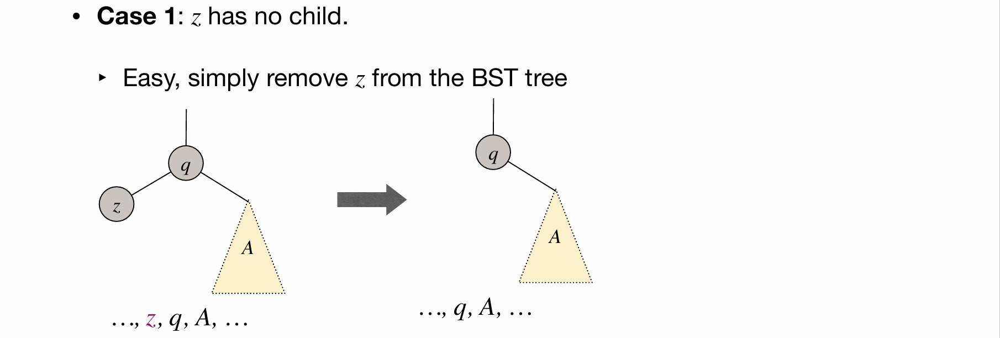
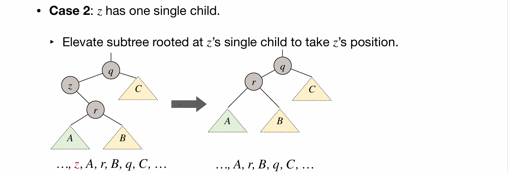
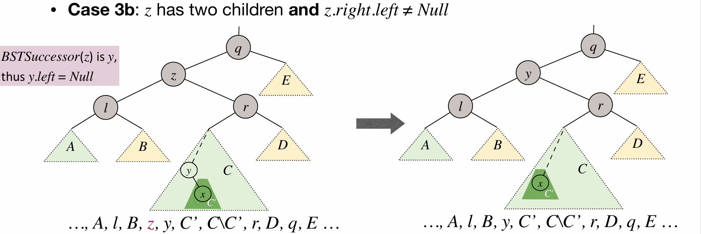

二叉搜索树又称二叉排序树，它或者是一棵空树，或者是具有以下性质的二叉树:

- 若它的左子树不为空，则左子树上所有节点的值都小于根节点的值；
- 若它的右子树不为空，则右子树上所有节点的值都大于根节点的值；
- 它的左右子树也分别为二叉搜索树。

```c++
#include <bits/stdc++.h>
using namespace std;

class Node
{
    friend class BST;

private:
    int value;
    Node *left;
    Node *right;

public:
    Node(int val)
    {
        value = val;
        left = nullptr;
        right = nullptr;
    }
};

class BST
{
private:
    Node *root;

public:
    BST()
    {
        root = nullptr;
    }
    Node *search(int key);
    void insert(int val);
    void searchRemove(int val);
    void remove(Node *cur, Node *parent);
};

Node *BST::search(int key)
{
    Node *cur = root;
    while (cur != nullptr)
    {
        if (key < cur->value)
            cur = cur->left;
        else if (key > cur->value)
            cur = cur->right;
        else
            return cur;
    }
    return nullptr;
}

void BST::insert(int val)
{
    if (root == nullptr)
        root = new Node(val);

    Node *cur = root;
    Node *parent = nullptr;

    while (cur != nullptr)
    {
        parent = cur;

        if (val < cur->value)
            cur = cur->left;
        else if (val > cur->value)
            cur = cur->right;
        else
            return;
    }

    if (val < parent->value)
        parent->left = new Node(val);
    else
        parent->right = new Node(val);

    return;
}

// 寻找删除的节点
void BST::searchRemove(int val)
{
    Node *cur = root;
    Node *parent = nullptr;

    while (cur != nullptr)
    {
        if (cur->value > val)
        {
            parent = cur;
            cur = cur->left;
        }
        else if (cur->value < val)
        {
            parent = cur;
            cur = cur->right;
        }
        else
            remove(cur, parent);
    }
    return;
}

// 删除节点的具体操作
void BST::remove(Node *del, Node *parent)
{
    // 要删除的节点是 del，其父节点是 parent
    // 根据 del 是否有左/右子树，分为三种情况

    // Case 1: 要删除的节点 del 没有左子树（或：既没有左子树，也没有右子树）
    if (del->left == nullptr)
    {
        if (del == root)
        {                      // 如果 del 是根节点
            root = del->right; // 将根节点指向 del 的右节点
        }
        else if (del == parent->right)
        {                               // 如果 del 是父节点的右节点
            parent->right = del->right; // 将父节点的右节点指向 del 的右节点
        }
        else if (del == parent->left)
        {                              // 如果 del 是父节点的左节点
            parent->left = del->right; // 将父节点的左节点指向 del 的右节点
        }
    }

    // 2. 如果要删除的节点 del 没有右子树
    else if (del->right == nullptr)
    {
        if (del == root)
        {                     // 如果 del 是根节点
            root = del->left; // 将根节点指向 del 的左节点
        }
        else if (del == parent->left)
        {                             // 如果 del 是父节点的左节点
            parent->left = del->left; // 将父节点的左节点指向 del 的左节点
        }
        else if (del == parent->right)
        {                              // 如果 del 是父节点的右节点
            parent->right = del->left; // 将父节点的右节点指向 del 的左节点
        }
    }

    // 3. 如果 del 既有左子树又有右子树：
    // 找到 del 的右子树中的最小节点，即右子树中的最左节点
    else
    {
        Node *min_node = del->right; // 初始化最小节点为 del 的右节点
        Node *prev = del;            // 记录最小节点的父节点

        while (min_node->left != nullptr) // 如果最小节点能向左移动
        {
            prev = min_node;           // 先更新最小节点的父节点
            min_node = min_node->left; // 最小节点向左移动
        }
        del->value = min_node->value; // 将 del 的值更新为最小节点的值

        if (del == prev)
        {                                 // 如果 del 的右子树没有左节点，
                                          // 即 del->right->left == NULL，
            del->right = min_node->right; // 将 del 的右节点指向最小节点的右节点
        }
        else if (del != prev)
        {                                 // 如果 del 的右子树有左节点，
                                          // 即 del->right->left != NULL，
            prev->left = min_node->right; // 将最小节点的父节点的左节点指向最小节点的右节点
        }
    }
}
```




