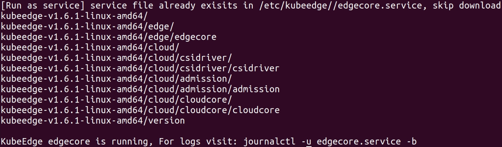
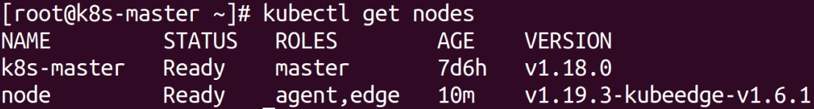

KubeEdge 由云和边缘组成。它建立在 Kubernetes 之上，为联网、应用部署和云与边缘之间的元数据同步提供核心基础设施支持。

## **资源列表**

| 类型 | 操作系统 | 主机名 | IP（内网） | 所需软件 |
| :---: | :---: | :---: | :---: | :---: |
| 云端服务器 | Centos 7.4 | k8s-master | 172.31.62.175 | Docker, Kubernetes cluster, cloudcore |
| 边缘服务器 | Ubuntu 20.04.6 | node1 | 192.168.224.132 | Docker, MQTT（选用）, edgecore |

注意：配置时使用的云端服务器 IP **均指内网 IP**，可执行 `ifconfig` 命令查询。本文中所有 IP 地址应根据实际修改。

由于云端和边缘系统不同，故操作有差异，为避免混淆，本文将分为两个部分，分别记录云端和边缘的配置过程。

## **1 - 云端服务器**

### **1.1 - 准备环境** 

关闭防火墙：
```
systemctl stop firewalld
systemctl disable firewalld
```

关闭 selinux：
```
sed -i 's/enforcing/disabled/' /etc/selinux/config  # 永久
setenforce 0  # 临时
```

关闭 swap：
```
swapoff -a  # 临时
sed -ri 's/.*swap.*/#&/' /etc/fstab  # 永久
```

根据规划设置主机名：
```
hostnamectl set-hostname k8s-master
```

添加 `/etc/hosts` 配置文件：
```
cat >> /etc/hosts << EOF
172.31.62.175 k8s-master
192.168.224.132 node1
EOF
```

将桥接的 IPv4 流量传递到 IPTABLES 的链：
```
cat > /etc/sysctl.d/k8s.conf << EOF
net.bridge.bridge-nf-call-ip6tables = 1
net.bridge.bridge-nf-call-iptables = 1
EOF
sysctl --system  # 生效
```

时间同步：
```
yum install ntpdate -y
ntpdate time.windows.com
```

### **1.2 - 安装 Docker**

拉取仓库镜像并下载：
```
wget https://mirrors.aliyun.com/docker-ce/linux/centos/docker-ce.repo -O /etc/yum.repos.d/docker-ce.repo
yum -y install docker-ce-18.06.1.ce-3.el7
```

设置开机自启，启动 Docker：
```
systemctl enable docker && systemctl start docker
```

查看 Docker 版本，检验是否安装成功：
```
docker --version
```

输出：`Docker version 18.06.1-ce, build e68fc7a`。

配置 Docker 加速镜像：
```
cat > /etc/docker/daemon.json << EOF
{
  "registry-mirrors": [
    "https://docker.hpcloud.cloud",
    "https://docker.m.daocloud.io",
    "https://docker.unsee.tech",
    "https://docker.1panel.live",
    "http://mirrors.ustc.edu.cn",
    "https://docker.chenby.cn",
    "http://mirror.azure.cn",
    "https://dockerpull.org",
    "https://dockerhub.icu",
    "https://hub.rat.dev"
  ]
}
EOF
```

重新载入 Docker 守护进程：
```
systemctl daemon-reload
```

重启 Docker：
```
systemctl restart docker
```

### **1.3 - 安装 Kubernetes**

添加阿里云 YUM 软件源：
```
cat > /etc/yum.repos.d/kubernetes.repo << EOF
[kubernetes]
name=Kubernetes
baseurl=https://mirrors.aliyun.com/kubernetes/yum/repos/kubernetes-el7-x86_64
enabled=1
gpgcheck=0
repo_gpgcheck=0
gpgkey=https://mirrors.aliyun.com/kubernetes/yum/doc/yum-key.gpg https://mirrors.aliyun.com/kubernetes/yum/doc/rpm-package-key.gpg
EOF
```

安装 kubeadm，kubelet 和 kubectl。其版本依赖较为严重，务必按照指定版本安装：
```
yum install -y kubelet-1.18.0 kubeadm-1.18.0 kubectl-1.18.0
systemctl enable kubelet
```

### **1.4 - 初始化 Kubernetes 集群**

启动 k8s 节点，注意替换 `--apiserver-advertise-address=` 为主机内网实际 IP 地址，检查 `--kubernetes-version` 与安装的 Kubernetes 版本是否一致。
```
kubeadm init \
  --apiserver-advertise-address=172.31.62.175 \
  --image-repository registry.aliyuncs.com/google_containers \
  --kubernetes-version v1.18.0 \
  --service-cidr=10.96.0.0/12 \
  --pod-network-cidr=10.244.0.0/16
```

成功后将得到以下输出：
```
Your Kubernetes control-plane has initialized successfully!

To start using your cluster, you need to run the following as a regular user:

  mkdir -p $HOME/.kube
  sudo cp -i /etc/kubernetes/admin.conf $HOME/.kube/config
  sudo chown $(id -u):$(id -g) $HOME/.kube/config

You should now deploy a pod network to the cluster.
Run "kubectl apply -f [podnetwork].yaml" with one of the options listed at:
  https://kubernetes.io/docs/concepts/cluster-administration/addons/

Then you can join any number of worker nodes by running the following on each as root:

kubeadm join 172.31.62.175:6443 --token 9lww95.rz7tw9731n8ixuwq \
    --discovery-token-ca-cert-hash sha256:da2a1c4c361399a45963eb5d147bf3db26fe8451502bf7cb2771363680f3ea51

```

启用 Kubectl：
```
mkdir -p $HOME/.kube
sudo cp -i /etc/kubernetes/admin.conf $HOME/.kube/config
sudo chown $(id -u):$(id -g) $HOME/.kube/config
```

可以执行 `kubectl get nodes` 测试主节点是否成功部署 k8s。此时主节点应为 `NotReady` 状态，需要安装网络插件 flannel。
```
NAME     STATUS      ROLES        AGE    VERSION
master   NotReady    master       4h4m   v1.18.0
```

安装 flannel：
```
wget https://raw.githubusercontent.com/coreos/flannel/master/Documentation/kube-flannel.yml
kubectl apply -f https://raw.githubusercontent.com/coreos/flannel/master/Documentation/kube-flannel.yml
```

此时执行 `kubectl get pods -n kube-system` 查看状态，发现 flannel 一直处于 `Pending`，即拉取状态。**这是因为 flannel 默认的镜像仓库在国内无法访问，因此我们需要更改镜像源**（具体操作来自[这篇文章](https://freeymw.com/article/21035.html)），将 kube-flannel.yml 文件中 `image:` 后的镜像替换为以下两个：

- registry.cn-hangzhou.aliyuncs.com/liuk8s/flannel:v0.21.5
- registry.cn-hangzhou.aliyuncs.com/liuk8s/flannel-cni-plugin:v1.1.2

执行 `kubectl apply -f `，等待片刻，再次执行 `kubectl get pods -n kube-system` 查看状态，可以发现 flannel 拉取成功，所有进程均为 `Running` 运行状态：
```
NAME                                 READY   STATUS    RESTARTS   AGE
coredns-7ff77c879f-p2j58             1/1     Running   0          8d
coredns-7ff77c879f-ttjjv             1/1     Running   0          8d
etcd-k8s-master                      1/1     Running   0          8d
kube-apiserver-k8s-master            1/1     Running   0          8d
kube-controller-manager-k8s-master   1/1     Running   0          8d
kube-proxy-9lj6x                     0/1     Pending   0          18h
kube-proxy-zg66s                     1/1     Running   0          8d
kube-scheduler-k8s-master            1/1     Running   0          8d
```

执行 `kubectl get nodes`，主节点为 `Ready` 状态。
```
NAME         STATUS     ROLES        AGE   VERSION
k8s-master   Ready      master       8d    v1.18.0
```

### **1.5 - 启动 KubeEdge 节点**

## **2 - 边缘服务器**

### **2.1 - 准备环境** 

关闭防火墙（永久）：
```
sudo systemctl disable --now ufw
```

关闭 selinux（Ubuntu 默认关闭）。可通过以下命令确认关闭：
```
sudo apt install -y policycoreutils
sestatus
```

关闭 swap（永久）：
```
sed -ri 's/.*swap.*/#&/' /etc/fstab
```

根据规划设置主机名：
```
hostnamectl set-hostname node1
```

添加 `/etc/hosts` 配置文件：
```
cat >> /etc/hosts << EOF
172.31.62.175 k8s-master
192.168.224.132 node1
EOF
```

将桥接的 IPv4 流量传递到 IPTABLES 的链：
```
cat > /etc/sysctl.d/k8s.conf << EOF
net.bridge.bridge-nf-call-ip6tables = 1
net.bridge.bridge-nf-call-iptables = 1
EOF
sysctl --system  # 生效
```

时间同步：
```
apt install ntpdate -y
ntpdate time.windows.com
```

### **2.2 - 安装 Docker**

离线安装，Docker 版本：18.09.0。

访问 [Docker 存档库](https://download.docker.com/linux/static/stable/x86_64/)，下载对应版本的安装包。

解压：
```
tar xzvf /PATH/TO/FILE.tar.gz
```

拷贝命令到 `/usr/bin` 目录下：
```
cp docker/* /usr/bin/
```

使用 `vi /usr/lib/systemd/system/docker.service`，写入如下信息：

```
docker.service
 
[Unit]
Description=Docker Application Container Engine
Documentation=https://docs.docker.com
After=network-online.target firewalld.service
Wants=network-online.target
 
[Service]
Type=notify
# the default is not to use systemd for cgroups because the delegate issues still
# exists and systemd currently does not support the cgroup feature set required
# for containers run by docker
ExecStart=/usr/bin/dockerd
ExecReload=/bin/kill -s HUP $MAINPID
# Having non-zero Limit*s causes performance problems due to accounting overhead
# in the kernel. We recommend using cgroups to do container-local accounting.
LimitNOFILE=infinity
LimitNPROC=infinity
LimitCORE=infinity
# Uncomment TasksMax if your systemd version supports it.
# Only systemd 226 and above support this version.
#TasksMax=infinity
TimeoutStartSec=0
# set delegate yes so that systemd does not reset the cgroups of docker containers
Delegate=yes
# kill only the docker process, not all processes in the cgroup
KillMode=process
# restart the docker process if it exits prematurely
Restart=on-failure
StartLimitBurst=3
StartLimitInterval=60s
 
[Install]
WantedBy=multi-user.target
```

载入 Docker 守护进程：

```
systemctl daemon-reload
```

设置开机自启，启动 Docker：
```
systemctl enable docker && systemctl start docker
```

查看 Docker 版本，检验是否安装成功：
```
docker --version
```

输出：`Docker version 18.09.0, build 4d60db4`。

配置 Docker 加速镜像：
```
cat > /etc/docker/daemon.json << EOF
{
  "registry-mirrors": [
    "https://docker.hpcloud.cloud",
    "https://docker.m.daocloud.io",
    "https://docker.unsee.tech",
    "https://docker.1panel.live",
    "http://mirrors.ustc.edu.cn",
    "https://docker.chenby.cn",
    "http://mirror.azure.cn",
    "https://dockerpull.org",
    "https://dockerhub.icu",
    "https://hub.rat.dev"
  ]
}
EOF
```

重新载入 Docker 守护进程：
```
systemctl daemon-reload
```

重启 Docker：
```
systemctl restart docker
```

### **2.3 - 安装 Kubernetes**

版本：1.19.3。

安装软件包：
```
apt-get install -y apt-transport-https ca-certificates curl
```

下载 Kubernetes GPG 密钥：
```
curl -fsSLo /usr/share/keyrings/kubernetes-archive-keyring.gpg  https://mirrors.aliyun.com/kubernetes/apt/doc/apt-key.gpg
```

将 GPG 密钥添加到 APT 的密钥管理中：
```
cat /usr/share/keyrings/kubernetes-archive-keyring.gpg |  sudo apt-key add -
```

指定软件仓库位置：
```
echo "deb https://mirrors.aliyun.com/kubernetes/apt/ kubernetes-xenial main" | sudo tee /etc/apt/sources.list.d/kubernetes.list
```

更新软件仓库：
```
apt-get update
```

安装 1.19.3 版本：
```
apt-get install -y kubelet=1.19.3-00 kubeadm=1.19.3-00 kubectl=1.19.3-00
```

锁定版本，防止自动升级：
```
apt-mark hold kubelet kubeadm kubectl
```

查看版本：
```
kubelet --version
kubeadm version
kubectl version
```

设置 Kubelet 开机启动：
```
systemctl enable kubelet
```

### **2.4 - 加入 KubeEdge 节点**

将 keadm 安装包上传到节点，解压后进入 keadm 文件夹：
```
tar -zxvf keadm-v1.6.1-linux-amd64.tar.gz
cd keadm-v1.6.1-linux-amd64/keadm
```

在执行加入节点命令之前，由于网络原因，需要提前将节点所需的文件放在 `/etc/kubeedge` 下：
- 将 crds 文件夹放置在 `/etc/kubeedge` 下；
- 将 kubeedge-v1.6.1-linux-amd64.tar.gz 放置在 `/etc/kubeedge` 下；
- 将 edgecore.service 放在 `/etc/kubeedge` 下。

此处我上传了一份已经配置好的 kubeedge 文件夹到云端服务器，因此**直接将文件夹从云端拉取到节点**即可：
```
scp -r root@8.155.19.255:/home/www/kubeedge /etc
```

通过 IPTABLES 信息包过滤系统启动云端和边缘端的端口映射（来自郭健博士论文）：
```
sudo iptables -t nat -A OUTPUT -d 172.31.62.175 -j DNAT --to-destination 8.155.19.255 # 在边缘端节点
```

执行加入命令：
```
./keadm join --cloudcore-ipport=172.31.62.175:10000 --edgenode-name=node --kubeedge-version=1.6.1 --token=<云端 keadm gettoken 返回的内容>
```

若部署过程中出现：`kubeedge-v1.8.0-linux-amd64.tar.gz in your path checksum failed and do you want to delete this file and try to download again? [y/N]:`
，输入 n 即可。

最终页面：



在云端执行 `kubectl get nodes`，输出如下：



## **附 - 重置节点**

可能因为各种原因，导致需要重新部署集群。
```
kubeadm reset
```

过程会询问是否重置，输入 y 然后回车。
```
rm -rf /root/.kube
rm -rf /etc/cni/net.d
rm -rf /etc/kubernetes/*
rm /etc/systemd/system/edgecore.service
```

kubeadm join 重新加入。