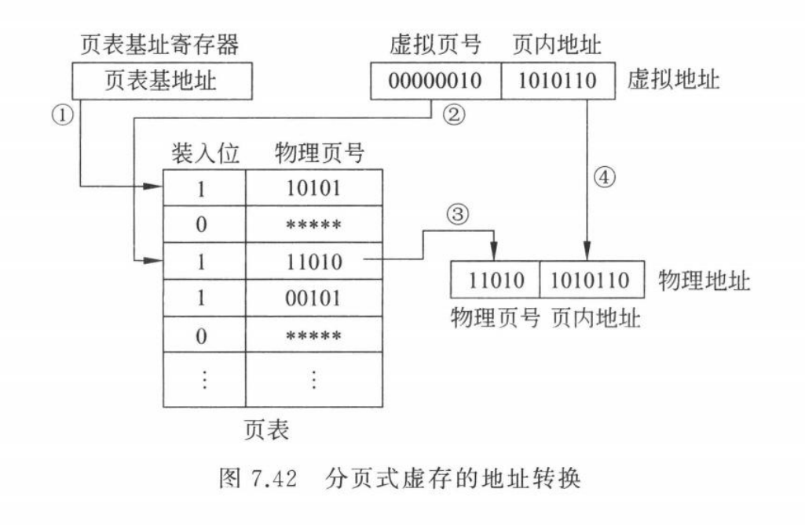

## **第 1 章 - 计算机系统概述**

- **吞吐率**：单位时间内完成的工作量。

- **响应时间**：从作业提交开始到作业完成所用的时间。

- **用户 CPU 时间 = 程序总指令条数 × CPI × 时钟周期**。

- MAR：主存地址寄存器。存在于 CPU 中，存放的是将要访问主存的地址。

- MDR：主存数据寄存器。存在于 CPU 中，存放的是某一个存储单元。

- **Amdahl 定律**：对系统中某个硬件/软件部分进行更新所带来的系统性能改进程度，取决于该硬件/软件部分被**使用的频率**，或其执行时间占总执行**时间的比例**。

    - 改进后的执行时间 = 改进部分执行时间 ÷ 改进部分的改进倍数 + 未改进部分执行时间 简记为：$\displaystyle{总时间 = \frac{改时间}{改倍数}+未改时间}$
    - 整体改进倍数 = 1 / ( 改进部分执行时间比例 ÷ 改进部分的改进倍数 + 未改进部分执行时间比例 ) 简记为：$\displaystyle{总倍数 = \frac{1}{\frac{改占比}{改倍数}+未改占比}}$

    >   **例 1.3**
    >
    >   假定计算机中的整数乘法器改进后可以加快 $10$ 倍，若整数乘法指令在程序中占 $40\%/60\%/90\%$，则整体性能分别改进多少倍？
    >
    >   **解：**改进部分的改进倍数为 $10$，整数乘法指令在程序中占 $40\%$，说明程序执行总时间中 $40\%$ 是整数乘法器所用，其他部件所用时间占 $60\%$。则整体改进倍数 $=1/(0.4/10+0.6)=1.56$。 同理，若占比例达 $60\%$ 和 $90\%$，则整体改进倍数分别为 ：$1/(0.6/10+0.4)=2.17$ 和 $1/(0.9/10+0.1)=5.26$。

## **第 2 章 - 数制和编码**

- **十进制转 $n$ 进制**：

    - 整数部分：除基取余，↑ 从下往上写；
    - 小数部分：乘基取整，↓ 从上往下写。

- **补码**：等于该数**正数原码**的**所有位** (含符号位) 取反加 $1$。

- **移码**：和补码的符号位互为相反数。

- $n$ 位带符号整数可表示的数值范围为 $-2^{n-1}～(2^{n-1}-1)$。

- **浮点数**：**注意加上隐藏的 1！**
    - $N=(-1)^S \times 1.尾数 \times 2^{阶码-127}$ $(1 \leq 阶码 \leq 254)，$
    - $N=(-1)^S \times 0.尾数 \times 2^{-126}$ $(阶码=0)，$
    - $N=\pm \infty$ $(阶码=255， 尾数=0)，$
    - $N=NaN$ $(阶码=255， 尾数 \neq 0).$
    
- **按字节编址**：对存储空间中的存储单元进行编号时，每个地址编号中存放一个字节。

## **第 3 章 - 运算方法和运算部件**

原码/补码乘除……

### 3.2 - 基本运算部件

-   串行进位加法器 (CRA)：X 与 Y 逐位相加，位间进位串行传送，所用元件较少，但进位传递时间较长。

-   并行进位加法器 (CLA)：更多位数的 CLA 只会增加逻辑门的输入端个数，而不会增加门的级数。但是由于CLA部件中连线数量和输入端个数的增多，使得实现电路中需要具有大驱动信号和大扇入门。

-   带标志位的加法器：

### 3.5 - 浮点数加减运算

需要经过**对阶、尾数加减、规格化和舍入** 4 个步骤，此外，还必须考虑溢出判断和溢出处理问题。

-   **对阶**：对阶的目的是使两数阶码相等，以使尾数可以相加减。注意：
    -   **小阶向大阶看齐，阶小的那个数的尾数右移，右移的位数等于两个阶的差的绝对值。**
    -   尾数右移时**符号位不参加移位，数值位要将隐含的一位 $1$ 右移到小数部分**，空出位补 $0$。
    -   **低位移出的位不要丢掉**，应保留成为**附加位**并参加尾数部分的运算。

-   **尾数加减**：对阶后两个浮点数的阶码相等，可对尾数进行加减。注意：
    -   IEEE 754 浮点数尾数中有一个**隐藏位**， 所以，在进行尾数加减时，**必须把隐藏位还原到尾数部分**。
    -   对阶过程中在尾数右移时保留的**附加位也要参加尾数加减运算**。

-   **尾数规格化**：IEEE 754 的规格化尾数形式为 $±1.bb…b$。根据情况进行左规/右规。
-   **尾数的舍入处理**：在对阶/尾数右规时，可能会对尾数进行右移，为保证运算精度，一般将低位移出的位保留下来，并让其参与中间过程的运算，最后再将运算结果进行舍入。主要有：**就近舍入到偶数**、朝 $\pm \infty/0$ 方向舍入
-   **溢出判断**：注意，由于浮点加减运算中需要**对阶**并最终进行**舍入**，因而可能导致**“大数吃小数”**的问题，使得浮点数运算不能满足加法结合律。(当一个“大数”和一个“小数”相加时，因为对阶使得“小数”尾数中的有效数字右移后被丢弃，从而使“小数”变为 $0$。)

>   **例 3.9**
>
>   若 $x$ 和 $y$ 为 $float$ 型变量，$x = 10.5$，$y = -120.625$，请给出 $x + y$ 的计算过程。
>
>   **解：**
>
>   $x=10.5=1010.1B=1.0101B×2^3$，机器数为 $0$ $1000$ $0010$ $010$ $1000$ $0000$ $0000$ $0000$ $0000$。$y=-120.625=-111$ $1000.101B=-1.1110$ $0010$ $1B×2^6$，机器数为 $1$ $1000$ $0101$ $111$ $0001$ $0100$ $0000$ $0000$ $0000$。
>
>   (1) 对阶。$[E_x]_移=1000$ $0010,[E_y]_移=1000$ $0101$，移码之差的绝对值为 $3$，且因此，应对 $x$ 的尾数右移 $3$ 位，对阶后，$x$ 的阶码为 $1000$ $0101$，尾数为 $0.00\mathbf{1}$ $0$ $1010$ $0000$ $0000$ $0000$ $000\mathbf{0}$ $\mathbf{00}$。**这里，粗体的 “$\mathbf{1}$” 为隐藏位，最低几位粗体数字为保留的附加位。** 
>
>   (2) 尾数相加。$0.0010$ $1010$ $0000$ $0000$ $0000$ $000\mathbf{0}$ $\mathbf{00}+(-\mathbf{1}.1110$ $0010$ $1000$ $0000$ $0000$ $000)$ $= -1.1011$ $1000$ $1000$ $0000$ $0000$ $000\mathbf{0}$ $\mathbf{00}$。 
>
>   (3) 尾数规格化。尾数相加后的结果已是规格化结果。
>
>   (4) 舍入。针对第 (3) 步得到的结果，根据确定的舍入方式，对小数点右边第 $23$ 位后的 数字进行舍入，得到最终的尾数部分。此例中，舍去的三位数字为全 $0$，因而直接丢弃即可。   
>
>   $x+y$ 的机器数为 $11000$ $0101$ $1011$ $1000$ $1000$ $0000$ $0000$ $000$。
>
>   $x+y$ 的真值为 $-1.1011$ $1000$ $1B×2^6=-11011$ $10.001B=-110.125$。

## **第 4 章 - 指令系统**

### 4.1 - 指令系统设计

-   指令地址码的个数：一条指令中必须明显或隐含地包含以下信息：
    -   操作码。指定操作类型，如移位、加、减、乘、除、传送等。 
    -   源操作数或其地址。指出一个或多个源操作数或其所在的地址，可以是主 (虚) 存地址、寄存器编号或 I/O 端口，也可在指令中直接给出一个立即数。 
    -   结果的地址。结果所存放的地址，可以是存储单元地址、寄存器编号或 I/O 端口。 
    -   下条指令地址。下条指令存放的存储单元地址。
-   操作数类型：指针或地址、数值数据、位 / 位串 / 字符 / 字符串。
-   **寻址方式**：指令给出操作数或操作数地址的方式。
    - 立即寻址：直接给出操作数本身，这种操作数称为立即数。
    - 直接寻址：给出操作数的有效地址，这种地址称为直接地址或绝对地址。
    - 间接寻址：给出存放操作数有效地址的存储单元地址。
    - 寄存器寻址：给出操作数所在寄存器的编号。优点：指令较短；操作数已在 CPU 中，不用访存，执行速度快。
    - 寄存器间接寻址：给出一个寄存器编号，该寄存器中存放的是操作数的有效地址。
    - 变址寻址：主要用于对线性表之类的数组元素进行访问。指令中的地址码字段 $A$ 给出基准地址，如数组的起始地址，而数组元素相对于基准地址的偏移量在指令中明显或隐含地由变址寄存器 $I$ 给出，这样，变址寄存器 $I$ 的内容实际上就相当于数组元素的下标，则有效地址 $EA = (I) + A$。
    - 相对寻址：若某指令操作数的有效地址或转移目标地址位于该指令所在位置的前 / 后某个固定位置上，则可用相对寻址方式，指令中的地址码字段 $A$ 给出偏移量，基准地址隐含由 $PC$ 给出。$EA = (PC) + A$。
    - 基址寻址：基址寻址方式下，指令中的地址码字段 $A$ 给出一个偏移量，基准地址可以明显或隐含地由基址寄存器 $B$ 给出。$EA = (B) + A$。

- **操作类型**：算术和逻辑运算指令、移位指令、传送指令 (mv, load, store...)、串指令、顺序控制指令 (branch, jmp, skip, call, ret...)、CPU 控制指令 (停机、开中断、关中断...)、输入输出指令。

    - 关于顺序控制指令：顺序控制指令的功能通过将转移目标地址送到 PC 中来实现。其中，调用指令 (call) 和转移指令 (branch/jmp) 的根本区别在于：执行调用指令时必须保存下条指令的地址 (称为**返回地址**)，当子程序执行结束时，根据返回地址返回到主程序继续执行；而转移指令则不返回执行，无须保存返回地址。
    
- **操作码编码**：

    - 定长操作码编码：长度固定，译码方便，指令执行速度快，但有信息冗余。

    - **扩展操作码编码**：将操作码的编码长度分成几种固定长度的格式。

        > **例 4.1** 
        >
        > 设某指令系统的指令字为 $16$ 位，每个地址码为 $6$ 位。若二地址指令 $15$ 条，单地址指令 $34$ 条，则剩下的零地址指令最多有多少条？  
        >
        > **解：** 扩展编码的基本思想就是**操作码按短到长进行扩展编码**。二地址指令操作码最短，零地址指令的操作码最长，所以，按照**二地址 → 单地址 → 零地址**的顺序进行编码。
        >
        > 二地址指令的地址码部分占 $12$ 位，故操作码只有 $4$ 位，**最多**有 $16$ 种编码，**用去** $15$ 种编码 $(0000～1110)$ 分别表示 $15$ 条指令，**还剩**一种编码 $1111$ 未使用。
        >
        > 单地址指令的地址码部分占 $6$ 位，故操作码有 $10$ 位，最高 $4$ 位为 $1111$，还剩 $6$ 位，最多可有 $2^6 = 64$ 种编码，用其中的 $32 + 2 = 34$ 种编码 $(11110 00000～11110 11111$ 和 $11111 00000～11111 00001)$ 分别表示 $34$ 条单地址指令。
        >
        > 剩下的零地址指令共有 $16$ 位操作码，编码范围为 $11111(00010～11111)(000000～111111)$，即高 $5$ 位固定为 $11111$，次 $5$ 位为 $00010～11111$，低 $6$ 位为 $000000～111111$。因此，零地址指令最多有 $30 × 2^6$ 种编码可用。 

### 4.2 - 程序的机器级表示

- **MIPS 中的栈和栈帧**：
    - MIPS 中有一个专门的栈指针寄存器 `$sp`，用来指示**栈顶**元素，入栈、出栈操作分别用 sw、lw 指令实现，需用 addi 指令调整 `$sp` 的值。
    - MIPS 中，**栈从高地址向低地址方向增长**，而**取数、存数则从低地址向高地址方向进行**。MIPS 采用大端方式，每入栈 1 个字，则 `$sp - 4 → $sp`，每出栈 1 个字，则 `$sp + 4 → $sp`。
    - 每个过程都有自己的栈区，称为**栈帧**，因此，一个栈由若干栈帧组成，每个栈帧用专门的帧指针寄存器指定起始位置，MIPS 中的帧指针寄存器是 `$fp`。当前栈帧范围在帧指针 `$fp` 和栈指针 `$sp` 指向区域之间。
    - 在程序执行过程中，每调用一次过程，都会在栈中生成一个对应的新栈帧，而在执行返回指令前对应的栈帧在栈中都已被释放。

## **第 5 章 - 中央处理器**

### 5.1 - CPU 概述

- **指令周期**：CPU 取出并执行一条指令的时间称为指令周期，不同指令的指令周期可能不同。

- **时钟周期和指令周期**：时钟周期是计算机中的最小时间单位，而指令周期是执行一条指令所需的时间，通常由多个时钟周期组成。

- **CPU 的组成**：不管 CPU 多复杂，**数据通路**和**控制器**是其**两大基本组成部分**。通常把数据通路中专门进行数据运算的部件称为**执行部件**。指令执行所用到的元件有两类：组合逻辑元件 (操作元件) 和存储元件 (状态元件)。连接这些元件的方式有两种：总线方式和分散连接方式。

    

- **数据通路**：由操作元件和状态元件通过总线或分散方式连接而成的进行数据存储、处理和传送的路径。

- **操作元件**：操作元件属于组合逻辑元件，其输出只取决于当前的输入，如多路选择器 (MUX)、加法器 (Adder)、算术逻辑部件 (ALU) 等。

- **状态元件**：状态元件属于时序逻辑电路，具有存储功能，输入状态在时钟控制下被写到电路中，并保持电路的输出值不变，直到下一个时钟到达。

### 5.2 - 单周期处理器

- **时钟周期的确定**：**CPU 执行程序的时间由 3 个关键因素决定：指令数目、时钟周期和 CPI**。指令数目由编译器和指令集决定，而时钟周期和 CPI 由处理器的设计与实现决定。**单周期处理器每条指令在一个时钟周期内完成，所以 CPI 为 1**，而时钟周期往往很长，通常取最复杂指令所用的指令周期，即 lw 指令周期。
- **单周期的缺陷**：单周期处理器的 CPI 为 1，所有指令的执行时间都以最长的 load 指令为准，时钟周期远远大于其他指令实际所需的执行时间，效率极低。

### 5.3 - 多周期处理器

- **基本思想**：将每条指令的执行分成多个大致相等的阶段，每个阶段在一个时钟周期内完成。
    - 尽量分成大致相等的若干阶段；  
    - 各阶段内最多完成一次访存，或一次寄存器读/写，或一次 ALU 操作；
    - 各阶段的执行结果在下个时钟到来时保存到相应存储单元中；
    - 时钟周期的宽度以最复杂阶段所用时间为准。
- **多周期的优点**：时钟周期短；不同指令所用周期数可以不同；允许功能部件在一条指令执行过程中被重复使用。
- **多周期处理器中，每条指令分多个阶段执行，每个阶段占一个时钟周期，称为一个状态**。因此，一条指令的执行过程由多个状态组成。

### 5.4 - 异常处理

CPU 执行每条指令的过程中，都会对异常事件和中断请求进行检测，一旦 CPU 检测到有异常事件或中断请求，就会进入异常/中断响应过程。在此过程中，CPU 完成以下两个任务：

1.   **关中断、保护断点和程序状态**：CPU 计算断点值，并将断点和程序状态字寄存器信息送到栈或特定的寄存器中，确保异常处理后正确返回到原被中断程序继续执行；
2.   **识别异常事件并转异常处理**：大多采用软件识别方式，而外部中断则可以采用软件识别或硬件识别方式，然后转到相应的处理程序。

## **第 6 章 - 指令流水线**

### 6.1 - 流水线基本内容

- **流水线概述**：理想情况下，每个时钟都有一条指令进入流水线；每个时钟周期都有一条指令完成，**每条指令的时钟周期数 (即 CPI) 都为 1**。流水线方式下，**单条指令执行时间不能缩短，但能大大提高指令吞吐率**。

- **设计原则**：指令流水段个数以最复杂指令所用的功能段个数为准；流水段的长度以最复杂的操作所花时间为准。

- **五个流水段**：  
    - Ifetch (IF) 段：取指，并**计算 PC + 4**。
    - Reg/Dec (ID) 段：**寄存器取数**，并译码。
    - Exec (Ex) 段：由具体指令确定，主要是 ALU 操作。
        - R-型 / I-型：在 ALU 中计算结果。
        - lw/sw：在 ALU 中计算地址。
        - beq：在 ALU 中做减法以比较是否相等，同时用一个加法器计算转移地址。
        - j：直接将目标地址送 PC 中。
    - Mem 段：负责存储器的读写。
        - lw：从存储器中读数据。
        - sw：将数据写入存储器。
        - beq：在比较相等的情况下，将转移目标地址写到 PC 中。
    - Wr 段：负责写入寄存器。
        - R-型 / I-型：将 ALU 中的计算结果写回寄存器。
        - lw：将读出的数据写入寄存器。
    
    |        | Exec (Ex) 段                                                 | Mem 段                                           | Wr 段                  |
    | :----- | ------------------------------------------------------------ | ------------------------------------------------ | ---------------------- |
    | R/I-型 | 在 ALU 中计算结果                                            | \                                                | 将 ALU 结果写回寄存器  |
    | lw     | 在 ALU 中计算地址                                            | 从存储器中读数据                                 | 将读出的数据写入寄存器 |
    | sw     | 在 ALU 中计算地址                                            | 将数据写入存储器                                 | \                      |
    | beq    | 在 ALU 中做减法以比较是否相等， 同时用一个加法器计算转移地址 | 在比较相等的情况下， 将转移目标地址写到 PC 中 | \                      |
    | j      | 直接将目标地址送 PC 中                                       | \                                                | \                      |
    

### 6.2 - 流水线冒险

指令流水线中，可能会遇到一些情况使得流水线无法正确执行后续指令而引起流水线阻塞或停顿，这种现象称为流水线冒险 (hazard)。

- **结构冒险**：同一个部件同时被不同指令所用，是由硬件资源竞争造成的。

    - 功能段划分原则：一个部件每条指令只能使用一次，且只能在特定时钟周期使用。
    - 设置多个独立的部件：例如，对于寄存器访问冲突，可将寄存器读口和写口独立开来；对于存储器访存冲突，可把指令存储器 IM 和数据存储器 DM 分开，从而使指令和数据的访问各自独立。

- **数据冒险**：也称为数据相关，后面指令用到前面指令结果时，前面指令结果还没产生。在非“乱序”执行的基本流水线中，所有数据冒险都属于写后读 (RAW) 数据冒险。

    - 插入空操作指令 nop：在软件上采取措施，使相关指令延迟执行。好处是硬件控制简单，但浪费了指令存储空间和指令执行时间。
    - 插入气泡 bubble：在硬件上采取措施，通过硬件阻塞方式阻止后续指令执行。这种方式控制比较复杂，需要修改数据通路，不增加指令条数，但有额外时间开销。
    - **采用转发技术：将数据通路中生成的中间数据直接转发到 ALU 的输入端。**
    - **load-use 数据冒险**：由编译器在 load 指令之后插入 nop 指令，或在程序编译时调整指令顺序，或通过插入气泡阻塞流水线来解决。其中，硬件处理方式 (气泡阻塞) 如下：
        - 检测点：load-use 冒险的检测越早越好，但是，再早也要在 load 随后的指令被取出并译码之后，因此，检测点可安排在其**译码** (ID) 阶段，可引入一个新的控制信号 **MemRead**。
        - 目标和原理：为了避免 load-use 数据冒险，必须使紧随 load 后的两条指令停顿一个时钟周期后继续执行。这可通过将这两条指令的执行结果清除并让它们延迟一个时钟周期来实现。
        - **具体过程**：
            - ① **将 ID/Ex 流水段寄存器中的所有控制信号清零** (= 插入一个气泡)；
            - ② **保持 IF/ID 流水段寄存器的值不变**，使 load 后第一条指令继续保存在 IF/ID 流水段寄存器中，在下个时钟周期，该指令重新译码/取数；
            - ③ **保持 PC 的值不变**，使 load 后第二条指令在下个时钟周期重新执行取指操作。

- **控制冒险**：由于发生了**指令执行顺序改变**而引起的流水线阻塞。

    - 分支指令引起的控制冒险 (分支冒险)：**通常把由于流水线阻塞而带来的延迟执行周期数称为延迟损失时间片 $C$。**对于分支冒险，可插入 $C$ 个气泡/空操作指令，并结合**分支预测**和延迟分支方式，降低时间损失。

        - 简单预测：静态预测方式，与指令执行历史无关，预测分支指令的条件总是不满足/满足。

        - 动态预测：利用分支指令发生转移的历史情况来进行预测，并根据实际执行情况动态调整预测位。分为一位预测位和多位预测位。

            

                
                
            

        - 延迟分支：简单讲，就是用分支前的无关指令代替 nop 来填充延迟损失时间片 $C$，不够时用 nop 填充。分支指令后面被填的指令位置称为分支延迟槽，需要填入的指令条数 (即分支延迟槽数) 等于延迟损失时间片 $C$。此方法缺点较多。

    - 异常 / 中断引起的控制冒险：

        - **处理：当检测到有异常或中断后，首先清除发生异常的指令以及其后在流水线中的所有指令，然后保存断点，并将异常处理程序的首地址送 PC 的输入端。**
        - 响应优先级：在同一个时钟周期内的指令序列中，排在最前面的指令所产生的异常最先被响应，外部中断请求最后响应。
        - 精确的异常和中断：指处理器能够确定异常和中断发生的精确位置，即处理器响应异常和中断时，所保存的断点是精确 的返回地址。
        - 以流水线方式执行指令时，异常可能发生在不同的阶段。通常，在多个流水段发生的异常的原因和断点只是被记录到特定的寄存器中，并将发生异常的标记同时记录到流水段寄存器，**发生异常的指令继续在流水线中执行**，直到最后阶段内的硬件检测本指令是否发生过异常，或此时是否有外部中断发生，若有，则清除流水线中后面所有阶段正在执行的指令，然后转到相应的异常处理程序执行。

## **第 7 章 - 存储器层次结构**

### 7.2 - 半导体随机存取存储器

-   **存储器芯片的扩展**：若干存储器芯片可构成一个内存条，此时，需要在**字方向和位方向**上进行扩展。
    -   用若干位数较少的存储器芯片构成给定字长的内存条时，需要进行位扩展。例如，用 $8$ 片 $4096 × 1$ 位的芯片构成 $4K × 8$ 位的内存条，需要在位方向上扩展 $8$ 倍，而字方向上无须扩展。 
    -   字扩展是容量的扩充，位数不变。例如，用 $16K × 8$ 位的存储芯片在字方向上扩展 $4$ 倍，可构成一个 $64K × 8$ 位的内存条。 
    -   当芯片在容量和位数都不满足存储器要求的情况下，需要对字和位同时扩展。
-   为什么数据需要对齐？
    -   如果访问的一个 int 型数据不对齐，例如，起始地址为 6，即在第 6、7、8、9 这 4 个存储单元中，则需要访问两次存储器；如果数据对齐的话，即起始地址是 4 的倍数，则只要访问一次即可。

-   **连续编址和交叉编址**

### 7.3 - 外部辅助存储器

- **定义**：通常把系统运行时**直接和主存交换信息**的存储器称为辅助存储器，简称辅存 (磁盘存储器、U盘、固态硬盘)。所有的外部辅助存储器都是非易失性的。
- **磁盘存储器的结构**：磁头、磁道、柱面、扇区。以扇区为单位进行磁盘读写。
- **磁盘读写的操作：寻道、旋转等待和读写。**
- **磁盘存储器的性能指标**：包括记录密度、存储容量、数据传输速率和平均存取时间等。
    - 记录密度：分为道密度和位密度。低密度存储方式下，每个磁道上的位数相同；高密度存储方式下，每个磁道上的位密度相同。
    - 存储容量：指整个存储器所能存放的二进制信息量。未格式化容量是指按道密度和位密度计算出来的容量，格式化后的实际容量只包含数据区。
    - **平均存取时间 = 寻道时间 + 旋转等待时间 + 数据传输时间**。
        响应时间 = 排队延迟 + 控制器时间 + 寻道时间 + 旋转等待时间 + 数据传输时间。
- **冗余磁盘阵列 RAID**：
    - 目的：
        - 将多个独立操作的磁盘按某种方式组织成磁盘阵列，以增加容量。
        - 将数据存储在多个盘体上，通过使这些盘并行工作来提高数据传输速度。
        - 用冗余磁盘技术来进行错误恢复以提高系统可靠性。
    - 特性：
        - RAID 是一组物理磁盘驱动器，在操作系统下被视为一个单逻辑驱动器。
        - 数据分布在一组物理磁盘上。
        - 冗余磁盘用于存储奇偶校验信息，保证磁盘万一损坏时能恢复数据。
    - 级别：目前已知的 RAID 方案分为 8 级 (0～7 级)，并由此派生出 RAID10 (结合 0 和 1 级) 和 RAID30 (结合 0 和 3 级) 和 RAID50 (结合 0 和 5 级)。

### 7.4 - 存储器的数据校验

- **基本原理**：采用“冗余校验”的思想，即除原数据信息外，还增加若干位附加的编码，称为校验位。当数据被存入存储器或从源部件开始传输时，对数据 M 进行某种运算，以产生相应的校验位 P。将原数据信息 M 和相应的校验位 P 一起被存储或传送，当数据被读出或传送到目标部件时，和数据信息一起被存储或传送的校验位也被得到，用于检错和纠错。
- **码字和码距**：
    - 由若干位代码组成的一个字叫“码字”；
    - 两个码字中，**不同代码的位的个数**叫这两个码字间的“距离”；
    - 码制中，**各码字间最小距离**为这个码制的“码距”。
    - 例如：“$8421$” 码的码距是几？$2(0010)$ 和 $3(0011)$ 间距离为 $1$，“$8421$” 码制的码距为 $1$。
- **奇偶校验码**：增加一位奇 (偶) 校验位并一起存储或传送。
    - 第一步：在源部件求出校验位 $P$。
        - 若采用奇校验，则 $P = b_{n-1} \oplus b_{n-2} \oplus \dots \oplus b_1 \oplus b_0 \oplus 1$。
        - 若采用偶校验，则 $P = b_{n-1} \oplus b_{n-2} \oplus \dots \oplus b_1 \oplus b_0$。
    - 第二步：在终部件求出校验位 $P'$。
    - 第三步：计算最终的校验位 $P^*$，并根据其值判断有无奇偶错。假定 $P$ 在终部件接受到的值为 $P''$，则 $P^* = P' \oplus P''$
        - 若 $P^* = 1$，则表示终部件接受的数据有奇数位错。
        - 若 $P^* = 0$，则表示终部件接受的数据正确或有偶数个错。
    - 特点：码距 $d = 2$。开销小，但只能发现奇数位出错，不能发现偶数位出错，而且也不能确定发生错误的位置，不具有纠错能力。
- 海明校验码 (略)
- 循环冗余校验码 (CRC)：通过某种数学运算来建立数据和校验位之间的约定关系，是一种具有较强检错、纠错能力的校验码。

### 7.5 - 高速缓冲存储器

- **定义**：cache 是一种小容量高速缓冲存储器，直接制作在 CPU 芯片内，速度几乎与 CPU 一样快。

- **目的**：在 CPU 和主存之间设置 cache，把主存中被频繁访问的程序块和数据块复制到 cache 中，由于程序访问的局部性，大多数情况下，CPU 能直接从 cache 中取得指令和数据，而不必访问主存，以此提高 CPU 访问指令和数据的速度。

- **程序访问的局部性**：在较短的时间间隔内，程序产生的地址往往集中在存储器的一个很小的范围，这种现象称为程序访问的局部性，包括时间局部性和空间局部性。

    - 时间局部性：被访问的某个存储单元在一个较短的时间间隔内很可能又被访问；
    - 空间局部性：被访问的某个存储单元的邻近单元在一个较短的时间间隔内很可能也被访问。空间局部性对单个变量来说没有意义。为了更好地利用程序访问的空间局部性，通常把当前访问单元以及邻近单元作为一个主存块一起调入 cache。

- **cache 与主存区域的单位**：为便于 cache 和主存间交换信息，cache 和主存空间都被划分为相等的区域。

    - 主存中的区域称为**主存块**，它是 **cache 和主存之间的信息交换单位**；
    - cache 中**存放一个主存块**的区域称为行。

- **cache 的有效位**：在系统启动或复位时，每个 cache 行都为空，其中的信息无效，只有装入了主存块后信息才有效。为了说明 cache 行中的信息是否有效，每个 cache 行需要一个有效位。有了有效位，就可通过将有效位清零来淘汰某 cache 行中的主存块 (冲刷, flush)，装入一个新主存块时，再使有效位置 1。

- **CPU 在 cache 中的访问过程**：CPU 执行程序过程中，需要从主存中取指令或读数据时，先检查 cache 中有没有要访问的信息。若有，就直接从 cache 中读取，而不用访问主存；若没有，再从主存中**把当前访问信息所在的一个主存块**复制到 cache 中。因此，cache 中的内容是主存中部分内容的副本。

- **cache-主存层次的平均访问时间**：在访存过程中，命中时，CPU 在 cache 中直接存取信息，所用的时间开销就是访问 cache 的时间 $T_c$，称为命中时间 (hit time)；缺失时，需要从主存读取一个主存块送 cache，同时将所需信息送 CPU，因此，所用时间开销为访问主存的时间 $T_m$ 和 $T_c$ 之和。通常把从主存读入一个主存块到 cache 的时间 **$T_m$ 称为缺失损失**。CPU 在 cache-主存层次的平均访问时间为：$T=p \times T_c + (1-p) \times (T_m + T_c)$。

- **cache 行和主存块之间的映射方式**：

    - **直接映射**：每个主存块映射到 cache 的**固定行**中，也称模映射，映射关系：
        $$
        cache \ 行号 = 主存块号 \ mod \ (cache \ 行数)。
        $$

        

        - 主存地址划分方法：标记 + cache 行号 + 块内地址 (如上图)。

            | 标记 | cache 行号 | 块内地址 |
            | :--: | :--------: | :------: |

            - 中间是要装入的 cache 行号，位数由 cache 行数决定。
            - 低位块内地址即数据在每个主存块内的地址，位数由主存块大小决定。
            - 剩余高位部分为标记。

        - 访存过程：首先根据行号，直接找到对应的 cache 行，比较标记是否相等。

            - 若标记相等且有效位为 1，则命中，此时，根据主存地址中低位的块内地址，在对应的 cache 行中存取信息；
            - 若不相等或有效位为 0，则不命中，此时，CPU 从主存中读出该地址所在的一块信息送到对应的 cache 行中，将有效位置 1，设置标记，同时将该地址中的内容送 CPU。

        - 优点：容易实现，命中时间短。

        - 缺点：不够灵活，cache 存储空间得不到充分利用，命中率较低。

    - **全相联映射**：每个主存块映射到 cache 的**任意行**中。

        - 主存地址划分方法：标记 + 块内地址

            | 标记 | 块内地址 |
            | :--: | :------: |

            - 标记用于指出该行取自主存的哪个块。
            - 低位块内地址即数据在每个主存块内的地址，位数由主存块大小决定。

        - 访存过程：直接将主存地址的标记与 cache 中每个行的标记进行比较。

            - 若有一个相等并且对应有效位为 1，则命中，此时，根据主存地址中低位的块内地址，在对应的 cache 行中存取信息；
            - 若都不相等或有效位为 0，则不命中，此时，CPU 从主存中读出该地址所在的一块信息送到 cache 的任意一个空闲行中，将有效位置 1，设置标记，同时将该地址中的内容送 CPU。

        - 优点：灵活，充分利用 cache 存储空间，块冲突率低。

        - 缺点：时间开销和所用元件开销都较大，不适合容量较大的 cache。

    - **组相联映射**：每个主存块映射到 cache **固定组**的**任意行**中，采用**组间模映射、组内全映射**的方式，映射关系：
        $$
        cache \ 组号 = 主存块号 \ mod \ (cache \ 组数)。
        $$

        

        - 主存地址划分方法：标记 + cache 组号 + 块内地址

            | 标记 | cache 组号 | 块内地址 |
            | :--: | :--------: | :------: |

            - 将 cache 分成 $2^q$ 组，**每组有 $2^s$ 行，称为为 $2^s$ 路组相联映射**。中间是要装入的 cache 组号，位数由 cache 组数决定。
            - 标记表示数据位于该 cache 组的哪一行。
            - 低位块内地址即数据在每个主存块内的地址，位数由主存块大小决定。

        - 访存过程：**首先根据组号，直接找到对应的 cache 组，将对应 cache 组中每个行的标记与主存地址的高位标记进行比较。**

            - 若有一个相等并且有效位为 1，则命中，此时，根据主存地址中的块内地址，在对应 cache 行中存取信息；
            - 若都不相等或有效位为 0，则不命中，此时，CPU 从主存中读出该地址所在的一块信息送到 cache 对应组的任意一个空闲行中，将有效位置 1，并设置标记，同时将该地址中的内容送 CPU。

        - s 的选取决定了块冲突的概率和相联比较的复杂性。s 越大，则 cache 发生块冲突的概率越低，相联比较电路越复杂。

    - **关联度**：一个主存块映射到 cache 中时可能存放的位置个数。直接映射关联度 = 1；全相联映射关联度 = cache 的总行数；N 路组相联映射关联度 = N。

- **cache 中主存块的替换算法**：先进先出 (FIFO)、**最近最少用** (LRU)、最不经常用 (LFU)、随机替换算法。

    - **最近最少用 (LRU)**：总是选择淘汰近期最少使用的主存块。LRU 算法的**每个 cache 行有一个计数器**，用计数值来记录主存块的使用情况，这个计数值称为 **LRU 位**，**其位数与 cache 组大小有关**，**$n$ 路时 LRU 位为 $log_2 n$**。

- **cache 的一致性问题**：因为 cache 中的内容是主存块副本，当对 cache 中的内容进行更新时，就存在 cache 和 主存如何保持一致的问题。解决的关键是处理好写操作，通常有两种基本的写操作方式。

    - **全写法** (write through)：采用对主存块信息及其所有副本信息**全都直接同步更新**的做法。
        写操作时，若写命中，则同时写 cache + 主存；若写不命中，则有以下两种处理方式。
        - 写分配法：更新主存单元 + cache。
        - 非写分配法：仅更新主存单元。
        - 优点：cache 和主存的一致性能得到充分保证。
        - 缺点：大大增加写操作的开销。为了减少这种开销，通常在 cache 和主存之间加一个写缓冲。
    - **回写法** (write back)：采用**回头再写或最后一次性写**的做法。
        写操作时，若写命中，则信息只被写入 cache，不被写入主存；若写不命中，则更新主存单元 + cache (即写分配法)。在 CPU 执行写操作时，回写法不会更新主存单元，只有当 cache 行中的主存块被替换时，才将该块内容一次性写回主存。**为了减少写回主存块的开销，每个 cache 行设置了一个修改位 (dirty bit)。**
        - 优点：减少写主存的次数，大大降低主存带宽需求。
        - 缺点：存在 cache 和主存内容不一致的潜在隐患，需要其他的同步机制来保证存储信息的一致性。

- **cache 缺失对总体性能的影响**：当发生 cache 缺失时，需要等待主存访问，此时，CPU 处于阻塞状态，CPU 时间的计算公式如下：

    - CPU 时间 = (CPU 执行时钟数 + cache 缺失引起阻塞的时钟数) × 时钟周期
    - cache 缺失引起阻塞的时钟数 = 程序中访存次数 × 缺失率 × 缺失损失
        = 程序的指令条数 × (缺失数 / 指令) × 缺失损失

- cache 设计应考虑的问题：单级/多级 cache、联合/分离 cache 的选择问题；主存-总线-cache 间的连接结构问题；DRAM 结构、总线事务类型与 cache 的配合问题。

>   **求 cache 的总容量**：每一行有：数据区 + **标记 + 有效位**。检查：**是否回写需要修改位？是否需要 LRU 位？**
{: .prompt-warning }

### 7.6 - 虚拟存储器

- **定义**：借用外存为程序提供的很大的虚拟存储空间称为虚拟存储器，用于解决**主存容量受限** (技术、成本) 和程序要求更大主存容量的矛盾。

- **实质**：

    

 

    - 程序员在比实际主存空间大得多的**虚拟地址空间中编写程序**；
    - 程序执行时，把**当前需要的程序段和相应的数据块调入主存，其他暂不用的部分存放在磁盘**上；
    - 指令执行时，CPU 通过 **MMU (存储器管理部件)** 将指令中的虚拟地址 (VA) **转换**为主存的物理地址 (PA)；
    - 在发生程序或数据访问失效 (缺页) 时，由操作系统进行主存和磁盘之间的信息交换。

- **分页式虚拟存储器**：

    - 概述：

        - **虚拟地址空间被划分成大小相等的页面，外存和主存之间按页面为单位交换信息**。
            虚拟地址页：虚拟页/逻辑页/虚页，VP；**主存空间：页框/页帧**/物理页/实页，PF/PP。
        - 没有和任何内容相关联的页称为“未分配页”，反之称为“已分配页”，“已分配页”包含：已调入主存而被缓存在 DRAM 中的“缓存页”；未调入主存而存在外存上的“未缓存页”。
        - 主存页框和虚拟页之间采用**全相联**映射方式，在处理一致性问题时，采用**回写**方式。

    - **页表**：

        

 

        - 定义：进程中的**每个虚拟页在页表中都有一个对应的表项，称为页表项**，用于建立各个虚拟页与存放的主存页框号或磁盘上存储位置之间的**关系** (与 cache 类似)。
        - 内容：该虚拟页的存放位置、装入位、修改位、使用位、访问权限位和禁止缓存位等。其中，存放位置字段：建立虚拟页和物理页框之间的映射，用于进行虚拟地址到物理地址的转换。
        - 分类：
            - 未分配页：存放位置 = “null”；
            - 已分配的缓存页：有内容对应且装入位 = 1；
            - 已分配的未缓存页：有内容对应但装入位 = 0。

    - **缺页** (page fault)：CPU 访问数据时，**某个信息所在页不在主存**，称为缺页异常。即**数据在虚拟页中，但装入位 = 0** (例如上图 VP6)。缺页异常处理程序根据“存放位置”字段，从磁盘中读出缺失页面，然后找一个空闲的物理页框存放。若主存中没有空闲的页框，则回写替换。

    - **地址转换**：

        - **虚拟地址 = 虚拟页号 + 页内地址，物理地址 (主存) = 物理页号 + 页内地址。由于页表相同，两者的页内地址相等。**

        - 地址变换过程：首先根据页表基址寄存器的内容，找到主存中对应的页表起始位置 (页表基地址)，然后**将虚拟地址中的虚拟页号作为索引，找到对应的页表项**，若装入位为 1，则**取出物理页号，和虚拟地址中的页内地址拼接，形成访问主存时实际的物理地址**；若装入位为 0，则说明缺页。

            

    - **快表 TLB** ：

        

 

        - 定义：在 **cache 中的页表项组成的页表**称为后备转换缓冲器 **(TLB)**，通常称为快表。相应地称**主存中的页表为慢表**。
        - 目的：在地址转换时，首先到快表中查页表项，如果命中，则无须访问主存中的页表，从而减少访存次数和访存时间开销。
        - 特点：快表比页表小得多，大多采用**全相联 / 组相联**方式。每个表项的内容由页表项内容加上一个  **TLB 标记字段**组成。**TLB 标记字段的内容由映射方式决定**，在全相联方式下就是该页表项对应的虚拟页号；组相联方式下则是对应虚拟页号中的高位部分，低位部分则作为 TLB 组索引用于选择 TLB 组。
        - 查询过程：上图中，MMU 对 TLB 查表时，20 位的虚拟页号被分成“标记 + 组索引”两部分，首先由组索引确定在 TLB 的哪一组进行查找。查找时将标记与 TLB 中该组每个标记同时进行比较，若有某个相等且有效位 = 1，则 TLB 命中，可直接通过 TLB 进行地址转换；否则 TLB 缺失，需要访问主存去查慢表。虚拟页号被分成“页目录索引 + 页表索引”两部分，据这两部分可得到对应的页表项，从而进行地址转换，并将对应页表项的内容送入 TLB。若 TLB 已满，还要进行 TLB 替换 (随机替换策略)。

        - **CPU 的访存过程**：主要为 CPU 虚拟地址 → TLB → 主存慢表 → cache。

            

 

- 分段式虚拟存储器：根据程序的模块化性质，可按程序的逻辑结构划分成多个相对独立的部分，这些相对独立的部分被称为段。可以把段作为基本信息单位在主存和外存之间传送和定位。

- 段页式虚拟存储器：在段页式虚拟存储器中，程序按模块分段，段内再分页，用段表和页表 (每段一个页表) 进行两级定位管理。

## **第 8 章 - 系统互连及输入输出组织**

### 8.3 - 外设与 CPU 和主存的互连

-   **总线**：将多个部件连接到一组**公共信息传输线**上，这种方式称为总线连接。主要优点是灵活和成本低，主要缺点是可能产生通信瓶颈。
    -   系统总线：指连接处理器芯片、存储器芯片和各种 I/O 模块等主要部件的总线，通常所说的总线是指这类在系统主要模块之间互连的总线。
    -   数据线：用来承载在源部件和目的部件之间传输的信息。
    -   地址线：用来给出源数据或目的数据所在的主存单元或 I/O模块的地址。
    -   控制线：用来控制对数据线和地址线的访问和使用。
    
    - **总线宽度 (位 / 次，即一次传送多少位)**：总线中数据线的条数称为总线宽度，它决定了每次能同时传输的信息的位数。
    
    - **总线工作频率 (次 / 秒，即一秒内传送多少次)**：等于总线的时钟频率 (一秒内产生的周期数) / 一次传送所用的周期数。
    
    - **总线带宽 (位 / 秒)**：总线带宽指总线的**最大数据传输率**，即总线在进行数据传输时**单位时间内最多可传输的数据量**，计算公式为 B = W × F / N，其中，W 为总线宽度，F 为总线的时钟频率，N 为一次传送所用的周期数。F / N 为总线工作频率。
    
-   **I/O 接口**：在各个外设和主机之间解决同步与协调、工作速度的匹配、数据格式的转换等问题的逻辑部件。主要职能可概括为以下几方面：

    -   数据缓冲：主存和 CPU 寄存器的存取速度非常快，而外设速度则较低，所以在 I/O 接口中引入数据缓冲寄存器，可以实现主机和外设工作速度的匹配。 
    -   错误或状态检测：在 I/O 接口中提供状态寄存器，以保存各种状态信息，供 CPU 查用。
    -    控制和定时：提供控制和定时逻辑，以接收从 I/O 总线传来的控制命令和定时信号。
    -   数据格式转换：提供数据格式转换部件，使通过外部接口得到的数据转换为内部接口需要的格式，或在相反的方向进行数据格式转换。

-   **I/O 端口及其编址：**I/O 端口实际上就是 I/O 接口中的寄存器。为了便于 CPU 对 I/O 设备的快速选择和对 I/O 端口的方便寻址，必须给所有 I/O 接口中各个可访问的寄存器进行编址。

    -   独立编址方式：对所有的 I/O 端口单独进行编号，使它们成为一个独立的 I/O 地址空间。这种情况下，指令系统中需要有专门的 I/O 指令来访问 I/O 端口，在 I/O 指令的地址码部分给出 I/O 端口号。
    -   统一编址方式：统一编址方式下，I/O 地址空间与主存地址空间统一编号，即从主存地址空间中分出一 部分地址给 I/O 端口进行编号。因为这种方法是将 I/O 端口映射到主存空间的某个地址段上，所以，也被称为“存储器映射方式”。

### 8.4 - I/O 数据传送控制方式

- **程序直接控制**：直接通过查询程序来控制主机和外设之间的数据交换，通常有无条件传送和条件传送两种方式。特点是简单、易控制、外围接口控制逻辑少。但是，CPU 需要从外设接口读取状态，并在外设未就绪时一直处于忙等待，由于外设速度比处理器慢得多，所以浪费了许多处理器时间。
- **中断控制**：
    - 基本思想：某进程 P1 需要 I/O 操作时，将其挂起，执行另一就绪进程 P2，此时，外设在准备 P1 所需的数据，CPU 在执行 P2，二者并行工作。外设就绪后，中止 P2，执行 I/O，完成后再返回 P2 断点处。
    - **中断优先级**：
        - 中断**响应**优先级：由电路决定，反映**多个中断同时请求时选择哪个先被响应**。
        - 中断**处理**优先级：由中断处理优先级通过在每个中断服务程序中设置对应的**中断屏蔽字**实现，反映了**本中断与其他所有中断之间的处理优先关系**。
    - 优点：在外设准备数据时，CPU 被安排执行其他程序，外设和 CPU 并行工作，因而 CPU 在外设准备数据时没有开销，只有响应和处理中断来进行数据传送时 CPU 才需要花费时间为 I/O 服务。
    - 缺点：对于硬盘这种高速外设的数据传送，中断请求频率高，CPU 被频繁打断，中断响应和中断处理的额外开销很大。
- **DMA 控制**：DMA (direct memory access) 称为**直接**存储器存取，用专门的 DMA 接口硬件来控制外设与主存间的直接数据交换，**数据不通过 CPU**。进行 DMA 传送时，CPU 让出总线控制权，由 DMA 控制器控制总线，通过“窃取”一个主存存储周期或独占若干存储周期完成和主存之间的数据交换，主要用于磁盘等高速设备的数据传送。DMA 方式与中断 I/O 方式一样，也是采用“请求-响应”的方式，只是**中断 I/O 方式请求的是处理器的时间，而 DMA 方式下请求的是总线控制权**。
    - CPU 停止法：DMA 传输时，由 DMA 控制器发一个停止信号给 CPU，使 CPU 脱离总线，停止访问主存，直到 DMA 传送一块数据结束。
    - **周期挪用法**：DMA 传输时，CPU 让出一个总线事务周期，由 DMA 控制器**挪用一个存储周期**来访问主存，传送完一个数据后立即释放总线。这是一种单数据传送方式。
    - 交替分时访问法：每个存储周期分成两个时间片，一个给 CPU，另一个给 DMA 控制器，这样在每个存储周期内，CPU 和 DMA 控制器都可访问存储器。
- DMA 和中断的区别：DMA 方式是以数据块为单位传输的，在所要求传送的数据块全部传送结束时要求 CPU 进行中断处理，这样大大减少 CPU 进行中断处理的次数。 **DMA 方式不需 CPU 干预传送操作** ，不占用 CPU 任何资源， **整个数据传输操作在一个称为“DMA 控制器”的控制下进行的。CPU 除了在数据传输开始和结束时做一点处理外，在传输过程中 CPU 可以进行其他的工作。这样，在大部分时间里，CPU 和输入输出都处于并行操作。因此，使整个计算机系统的效率大大提高。** 中断方式是程序切换，每次操作需要保护和恢复现场，中断次数多，CPU 需要花较多的时间处理中断，中断次数多也会导致数据丢失。**但是 DMA 是必须利用中断的，否则 CPU 无法得到数据已经传输结束，当数据传输开始结束的时候，需要给 CPU 一个中断信号，CPU 进行处理，这样就节约了 CPU 的资源。**

## **总复习清单**

### 1 - 计算机系统概述

-   [x] &nbsp; 计算机硬件的基本组成？

    >   运算器、控制器、存储器、输入设备和输出设备 (简记为：**控制运存出入**)

-   [x] &nbsp; 计算机软件的分类？ 

    >    应用软件 & 系统软件 (为有效、安全地使用和管理计算机及为开发和运行应用软件而提供的各种软件)

-   [x] &nbsp; 计算机系统的抽象层及其转换？ 

    > 

 

-   [x] &nbsp; 用户 CPU 时间计算？ 

-   [x] &nbsp; Amdahl 定律？

    >   $\displaystyle{总时间 = \frac{改时间}{改倍数}+未改时间}, \ \displaystyle{总倍数 = \frac{1}{\frac{改占比}{改倍数}+未改占比}}.$

### 2 - 数据的机器级表示

-   [x] &nbsp; 二进制、八进制、十六进制、十进制数之间的转换？ 

-   [x] &nbsp; 原码、补码、移码表示法？

    >   注：补码等于该数**正数原码**的**所有位** (含符号位) 取反加 1！

-   [x] &nbsp; 无符号整数、带符号整数表示？ 

-   [x] &nbsp; 浮点数的表示？IEEE 754 浮点数表示？（若涉及特殊情况，会给出提示或解释） 

-   [x] &nbsp; C 语言中的整数、浮点数类型？ 

-   [x] &nbsp; 数据的存储和排列顺序？

### 3 - 运算方法和运算部件

-   [x] &nbsp; 理解并能写出常见的汇编指令，尤其是算术运算、逻辑运算涉及的指令？ 

-   [x] &nbsp; 串行、并行、带标志的加法器原理？ 

-   [x] &nbsp; 补码加减运算？ （原码乘除、补码乘除：若涉及，会给出计算规则） 

-   [x] &nbsp; 乘除运算溢出判断，常量乘除运算？ 

    >   n 位**无符号**整数相乘，**取 2n 位乘积中的低 n 位为结果** ($mod \ 2^n$)。若**丢弃的高 n 位是 0**，则不溢出；
    >   n 位**带符号**整数相乘，若乘积**高 n 位中每一位都与低 n 位的最高位相同**，则不溢出。

-   [x] &nbsp; 浮点数加减运算、舍入方式？

### 4 - 指令系统

-   [x] &nbsp; 指令格式设计？ 

    >   一条指令中必须明显或隐含地包含以下信息：操作码、源操作数或其地址、结果的地址、下条指令地址。

-   [x] &nbsp; 操作数类型、寻址方式、操作类型、操作码编码？

-   [x] &nbsp; 异常、中断的区别？ 

    >   **异常**：处理器在执行某条指令时**发生在 CPU 内部**的事件，如整除 0、溢出、非法操作码、缺页等。
    >
    >   **中断**：程序执行过程中，若**外设**完成任务或发生某些特殊事件，会向  CPU 发中断请求，要求 CPU 对这些情况进行处理。**中断事件与执行的指令无关，由 CPU 外部的 I/O 部件发出**。

-   [x] &nbsp; MIPS 指令格式和寻址方式？ （若涉及机器代码，会给出指令格式和机器代码之间的关系） 

-   [x] &nbsp; 选择结构、循环结构的汇编指令表示？ （若涉及机器代码，会给出指令格式和机器代码之间的关系） 

-   [x] &nbsp; 过程调用的指令、执行步骤、栈和栈帧的变化？

### 5 - 中央处理器

-   [x] &nbsp; CPU 执行指令过程？ 

    >   取指，译码并计算下条指令地址，计算源操作数地址并取数，运算，计算目的操作数地址并存结果。

-   [x] &nbsp; CPU 的基本组成？操作元件和状态元件的区别？ 

    >   

    >
    >   两大基本组成部分：**数据通路**和**控制器**。数据通路中，进行数据运算的部件：**执行部件**。
    >指令执行用到的元件：**操作元件 & 状态元件**。连接这些元件的方式：**总线方式 / 分散连接方式**。
    >   
    >**数据通路**：由操作元件和状态元件通过总线或分散方式连接而成的进行数据存储、处理和传送的路径。
    >   **操作元件**：属于组合逻辑元件，不含存储信号，其输出只取决于当前的输入。
    >**状态元件**：属于时序逻辑电路，包含存储信号，具有存储功能。
    
-   [x] &nbsp; 指令周期？时钟周期？ 

-   [x] &nbsp; MIPS 指令格式，典型的 MIPS 指令以及功能描述（书本 134-135 页）？ 

-   [x] &nbsp; 典型的 MIPS 指令数据通路？能够理解单周期数据通路设计，**画出局部数据通路**， 明确控制信号取值。 

-   [x] &nbsp; 多周期数据通路设计？能够理解多周期数据通路设计，明确控制信号取值、指令执行状态转换图。 

-   [x] &nbsp; *微程序控制器的基本思想、基本结构、执行、编码方式？ 

    >   基本思想：仿照程序设计方法，**编制每个指令对应的微程序**，**每个微程序由若干条微指令组成**，**各微指令包含若干条微命令**。执行某条指令时，取出对应微程序中的各条微指令，对微指令译码产生对应的微命令，这个微命令就是控制信号。

-   [x] &nbsp; *带异常处理的数据通路、有限状态机？

### 6 - 指令流水线

-   [x] &nbsp; 指令流水线由哪些流水段组成？各流水段的功能？

    >   ① 取指令 (IF)：从**存储器**取指令；② 指令译码 (ID)：产生指令执行所需的控制信号；③ 取操作数 (OF)：读取操作数；④ 执行 (EX)：对操作数完成指定操作；⑤ 写回 (WB)：将结果写回。

-   [x] &nbsp; 典型 MIPS 指令的功能段划分、流水线数据通路的设计、控制信号的取值？（能够理解流水段寄存器，理解流水线数据通路，但不要求自己画出数据通路）

    >   五个功能段：Ifetch, Reg/Dec, Exec, Mem, Write。

-   [x] &nbsp; 结构冒险现象及其解决方法？ 

-   [x] &nbsp; 数据冒险现象及其解决方法？需要深入理解转发技术、load-use 数据冒险的检测和处理方法。 

-   [x] &nbsp; 控制冒险现象及其解决方法？静态预测、动态预测、延迟分支？ 

-   [x] &nbsp; 异常和中断引起的控制冒险、处理方法？

    >   当检测到有异常或中断后，首先**清除**发生异常的指令以及其后在流水线中的所有指令，然后**保存断点**，并将异常处理程序的首地址**送 PC** 的输入端。

### 7 - 存储器层次结构

-   [x] &nbsp; 存储器的分类、主存储器的组成和基本操作、存储器的层次化结构？ 

    >   **随机存取存储器 (RAM)**：特点是按地址访问存储单元，每个单元的访问时间是一个常数，与地址无关。
    >
    >   **编址单位**：具有相同地址的位元构成的一个单位。**编址方式**：对存储单元进行编号的方式。

-   [x] &nbsp; SRAM 和 DRAM 的区别？ (static RAM & dynamic RAM，静态存储元件 & 动态存储元件)

    >   **SRAM**：功耗大，集成度低，无须刷新，无须读后再生，读写速度快，其存储原理可看作是对带时钟的 RS 触发器的读写过程。价格比较昂贵，适合做**高速小容量**的半导体存储器，如 cache。 
    >
    >   **DRAM**：功耗小，集成度很高，必须定时刷新，需读后再生，读写速度相对 SRAM 慢得多， 其存储原理可看作对电容充、放电的过程。价格相对较低，适合做**慢速大容量**的半导体存储器，如主存。

-   [x] &nbsp; 存储器芯片的扩展？ 

-   [x] &nbsp; 连续编址方式、交叉编址方式？ 

    >   连续编址：从某单元开始，连续在同一模块访问，然后才跳到下一个模块。不能提高存储器的吞吐率。
    >
    >   交叉编址：从某个单元开始后，总是在所有模块间交替进行。能提高吞吐率。

-   [x] &nbsp; 磁盘读写的三个步骤？ 

    >   寻道 (为磁头移动到指定磁道)、旋转等待 (指要读写的扇区旋转到磁头下方)、读写。

-   [x] &nbsp; 磁盘存储器的性能指标？ 

    >   记录密度、存储容量、数据传输速率、平均存取时间等。
    >
    >   **平均存取时间 = 寻道时间 + 旋转等待时间 + 数据传输时间**。

-   [x] &nbsp; 数据校验的基本原理？奇偶校验码？循环冗余校验码？ 

-   [x] &nbsp; 程序访问的局部性？ 

-   [x] &nbsp; cache 的基本工作原理？ 

-   [x] &nbsp; 直接映射、全相连映射、组相连映射？（命中率、命中时间、缺失损失、平均访问时间） 

-   [x] &nbsp; 先进先出算法、最近最少用算法？ 

-   [x] &nbsp; 全写法、回写法的区别？ 

-   [x] &nbsp; 虚拟存储器的基本概念？ 

-   [x] &nbsp; *进程的虚拟地址空间划分？ 

-   [x] &nbsp; 分页式虚拟存储器的工作原理？（页表、地址转换、快表、CPU 访存过程）

### 8 - 系统互连及输入输出组织

-   [x] &nbsp; 外设的分类？ 

    >   按信息的传输方向：输入设备、输出设备与输入 / 输出设备；
    >
    >   按功能：人机交互设备、存储设备和机-机通信设备。

-   [x] &nbsp; 总线、系统总线、数据线、地址线、控制线？ 

    >**总线：计算机内数据传输的公共路径，用于实现两个或两个以上部件之间的信息交换。** 
    >
    >系统总线：连接处理器芯片、存储器芯片和各种 I/O 模块等主要部件的总线。 
    >
    >-   数据线：承载在源和目部件之间传输的信息。数据线的宽度反映一次能传送的数据的位数。
    >
    >-   地址线：给出源数据或目的数据所在的主存单元或 I/O 端口的地址。地址线宽度反映最大寻址空间。
    >
    >-   控制线：控制对数据线和地址线的访问和使用。用来传输定时信号和命令信息。

-   [x] &nbsp; *基于总线的互连结构？ （主要模块以及连接的总线） 

    >   主要模块：CPU、主存储器、I/O 控制卡 (如声卡、视频卡)、北桥芯片、南桥芯片。
    >
    >   连接的总线：处理器总线、存储器总线和 I/O 总线。

-   [x] &nbsp; *I/O 接口的职能？I/O 口的通用结构？ 

    >   职能：数据缓冲、错误或状态检测、控制和定时、数据格式转换、与主机和设备通信。

-   [x] &nbsp; I/O 端口的独立编址方式、统一编址方式？ 

    >   I/O 端口：将 I/O 控制器中 CPU 能够访问的各类寄存器称为 I/O 端口，对外设的访问通过向 I/O 端口发命令、读状态、读/写数据来进行。
    >
    >   统一编址方式 / 内存映射方式：与主存空间统一编址，将主存空间分出一部分地址给 I/O 端口进行编号。
    >
    >   独立编址方式：不和主存单元一起编号，而是单独编号，使成为一个独立的 I/O 地址空间。

-   [x] &nbsp; 程序直接控制 I/O 方式、中断控制 I/O 方式、DMA 方式的工作原理、区别？ 

-   [x] &nbsp; 中断响应、中断处理？中断优先权的动态分配？ 

-   [x] &nbsp; 3 种 DMA 方式：CPU 停止法、周期挪用法、交替分时访问法？ 

-   [x] &nbsp; *I/O 子系统层次结构？每层的基本功能？ 

    >   

-   [x] &nbsp; *用户程序、C 语言库、内核之间的关系？

    >   用户程序通过调用 C 语言库函数来执行各种操作，C 语言库函数内部通过系统调用与内核交互，内核接收到系统调用请求后，执行相应的操作。

