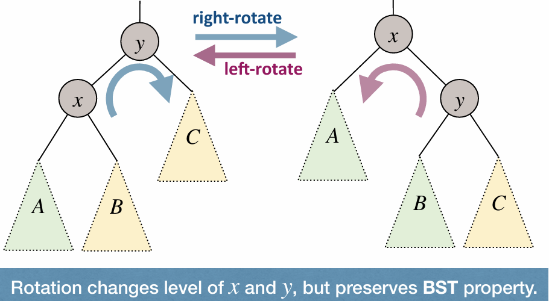

A Treap (Binary-Search-Tree + Heap) is a binary tree in which each node has a key value, and a priority value (usually randomly assigned).
- The key values must satisfy the BST-property.
- The priority values must satisfy the MinHeap-property.

How do we build a Treap?
- Starting from an empty Treap, whenever we are given a node $x$ that needs to be added, we assign a random priority for node $x$, and insert the node into the Treap. A Treap is like a randomly built BST, regardless of the order of the insert operations!

**Rotation**: rotation changes level of $x$ and $y$, but preserves BST property.

**Insert in Treap**:
- Step 1: Assign a random priority to the node to be added.
- Step 2: Insert the node following BST-property.
- Step 3: Fix MinHeap-property (without violating BST-property).

**Remove in Treap** (just invert the process of insertion):
- Step 1: Use rotations to push-down the node till it is a leaf.
- Step 2: Remove the leaf.
