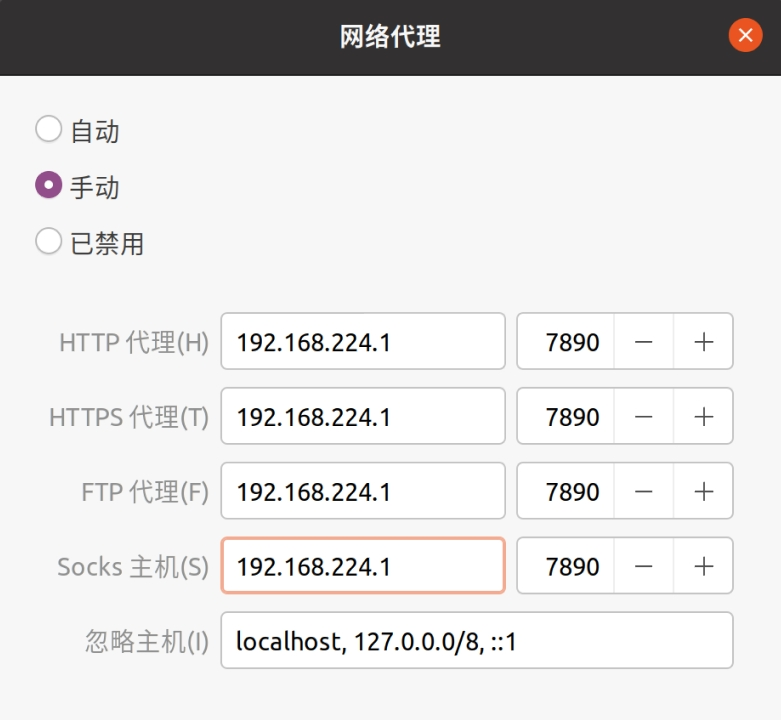

## 目的与条件

目的：让运行在 VMware 的 Ubuntu 虚拟机使用主机代理 (Clash)。  
条件：主机已配置代理，虚拟机可联网，但无法使用代理。

## 操作

### 1 - 查询虚拟机 IP

提供两种方式：

-   第一种，打开 Clash，在 “常规” 栏中找到 “允许局域网接入 Clash” 选项，单击选项标题旁的按钮，在弹出的页面中查看 VMware Network Adapter VMnet8 的地址为 `192.168.224.1`。

<div style="text-align: center">
  
</div>

-   第二种，在主机命令行窗口中输入：`ipconfig`，查看 VMware Network Adapter VMnet8 网络：

    ```
    以太网适配器 VMware Network Adapter VMnet8:
    
       连接特定的 DNS 后缀 . . . . . . . :
       本地链接 IPv6 地址. . . . . . . . : fe80::6b5d:8902:db8d:8c3b%3
       IPv4 地址 . . . . . . . . . . . . : 192.168.224.1
       子网掩码  . . . . . . . . . . . . : 255.255.255.0
       默认网关. . . . . . . . . . . . . :
    ```

    其中，IPv4 地址为 `192.168.224.1`。

### 2 - 查询代理 端口

打开 Clash，在 “常规” 栏中找到 “允许局域网接入 Clash” 选项，轻击按钮开启，并记录端口号为 7890。

<div style="text-align: center">
  
</div>

### 3 - 修改虚拟机网络代理配置

在 Ubuntu “设置” - “网络” 中，点击 “网络代理”，在弹出的窗口中，将模式更改为 “手动”，并依次输入前文获取到的 IPv4 地址及端口号。配置完成后，虚拟机即可连接代理。

<div style="text-align: center">
  
  
</div>