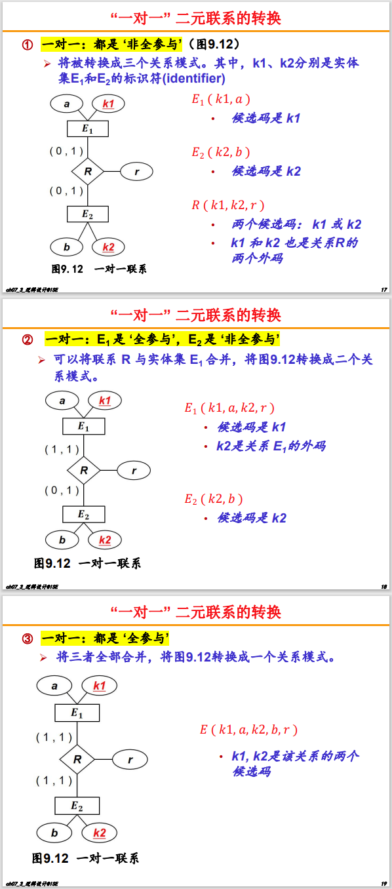
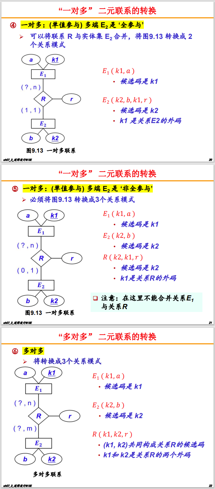

## 重要概念

-   能够被称为**关系**的二维表一般应满足下面的 6 条性质：
    1.  列的同质性：每一列中的分量是同一类型的数据，来自同一个域。
    2.  列的唯一性（属性名的唯一性）：不同的列可出自同一个域，其中的每一列称为一个属性，不同的属性要给予不同的属性名。
    3.  列的无序性（属性的无序性）：列的排列顺序无所谓，列与列之间的次序可以任意交换。
    4.  行的唯一性（元组的唯一性）：任意两个元组在“候选码”属性上的取值不能相同。
    5.  行的无序性（元组的无序性）：行的排列顺序无所谓，行与行之间的次序可以任意交换。
    6.  分量（属性）的原子性：每一个分量都必须是不可分的数据项。
-   数据模型是由**数据结构、数据操作、数据约束**三部分组成的。
-   **数据库的三级模式结构**：把数据库的描述分成三层，每层关注点不同，方便数据独立性和安全性。
    1. **外模式（视图/用户模式）**  
       - 面向用户：用户看到什么？
       - 每个用户看到的数据/视图。可以只看自己关心的部分，隐藏其他数据。
    2. **模式（逻辑模式/概念模式）**  
       - 面向全局：数据库整体长什么样？
       - 描述数据库中所有数据的逻辑结构和联系（比如表、字段、关系）。独立于具体存储和机器。
    3. **内模式（存储模式）**  
        - 面向物理存储：数据怎么存到硬盘？
        - 描述数据在磁盘上的实际存储方式（如文件结构、索引、存储路径等）。
-   **数据完整性约束（三类）**
    1. **实体完整性**：每一行数据都能被唯一标识（主键不能有空值，不能重复）。
    
    2. **参照完整性**：外键必须指向主表中真实存在的主键，不能“乱指”或“悬空”。
    
    3. **用户定义完整性**：针对具体业务自定义的规则，比如“年龄必须大于0”，“成绩只能在0~100之间”。
-   数据库设计的基本步骤：
    1.   需求分析阶段：是否充分与准确，决定了构建数据库的速度和质量。
    2.   概念结构设计阶段：通过对用户需求进行综合、归纳与抽象，形成一个**独立于具体数据库管理系统的概念模型：E-R 图**。
    3.   逻辑结构设计阶段：将概念结构 E-R 图转换为某个数据库管理系统所支持的数据模型，并对其进行优化。
    4.   物理结构设计阶段：为逻辑数据结构选取一个最适合应用环境的物理结构，包括存储结构和存取方法。
    5.   数据库实施阶段：根据逻辑设计和物理设计的结果构建数据库，编写与调试应用程序，组织数据入库并进行试运行。
    6.   数据库运行和维护阶段：经过试运行后即可投入正式运行，在运行过程中必须不断对其进行评估、调整与修改。
-   数据库事务四个特征：原子性、一致性、持续性、隔离性。

## 第 2 章 关系数据库

-   象集：在一个关系中，某属性取某个特定值时，其他属性的所有取值的集合。
-   并、交、差，两个关系要具有相等个数的属性。
-   投影不仅过滤了原关系中的某些列，而且还可能消除某些元组，避免重复行。
-   **连接**：从两个关系的**笛卡尔积**中选取属性间满足一定条件的元组。
    -   等值连接：关系为 $$=$$ 的连接运算（不去除重复列）$$\Rightarrow$$ 自然连接：自动用两表中“同名字段”做等值连接条件（去除重复列）。
    -   外连接：在连接时，某一边的某些行没有在公共属性上值相等的元组，称为悬浮元组。外连接能将悬浮元组保留下来。
        -   左/右外连接：只保留左/右边关系中的悬浮元组。
-   除：常用于找出那些对“所有”都成立的对象。（“所有”必须是个定值）
-   基本运算：并、差、选择、投影、笛卡尔积。其他均为扩充运算。

### “不使用除运算”

例如：

顾客C (cid, cname, city, discnt) 商品P (pid, pname, city, quantity, price) 
供应商A (aid, aname, city, percent) 订单O (ordno, orddate, cid, aid, pid, qty, dols)

查询满足下述条件的供应商的编号：向居住在 ‘苏州’ 市的所有顾客都销售过商品。

即：全部供应商 - 没给某个苏州顾客销售过商品的供应商

其中，没给某个苏州顾客销售过商品的供应商 = 所有苏州顾客 C 和供应商 A 的排列组合 - 现在已经存在的排列组合 O

## 第 3 章 SQL 语言

核心功能：

-   数据定义：CREATE，DROP，ALTER 
-   数据查询：SELECT 
-   数据操作：INSERT，UPDATE，DELETE 
-   数据控制：GRANT，REVOKE

### 单表查询

```
SELECT [ALL | DISTINCT] <目标列表达式>[, <目标列表达式> ] ...
FROM <表名或视图名>[, <表名或视图名> ]... | (SELECT 语句) [AS] <别名>
[ WHERE <条件表达式> ]
[ GROUP BY <列名1> [ HAVING <条件表达式> ]]
[ ORDER BY <列名2> [ ASC | DESC ]];
```

| 查询条件 | 谓词                                          |
| -------- | --------------------------------------------- |
| 比较     | =, >, <, >=, <=, !=, <>, !>, !<               |
| 确定范围 | BETWEEN ... AND ... , NOT BETWEEN ... AND ... |
| 确定集合 | IN, NOT IN                                    |
| 字符匹配 | LIKE, NOT LIKE                                |
| 空值     | IS NULL, IS NOT NULL                          |
| 逻辑运算 | AND, OR, NOT                                  |

| 聚集函数（忽略 NULL 值！）      | 功能描述                               |
| ------------------------------- | -------------------------------------- |
| COUNT(*)                        | 统计元组个数                           |
| COUNT([DISTINCT \| ALL] <列名>) | 统计一列中值的个数                     |
| SUM([DISTINCT \| ALL] <列名>)   | 计算一列值的总和（此列必须为数值型）   |
| AVG([DISTINCT \| ALL] <列名>)   | 计算一列值的平均值（此列必须为数值型） |
| MAX([DISTINCT \| ALL] <列名>)   | 求一列值中的最大值                     |
| MIN([DISTINCT \| ALL] <列名>)   | 求一列值中的最小值                     |

-   HAVING 短语与 WHERE 子句的区别：作用对象不同。
    -   WHERE 子句作用于**基表/视图**，从中选择满足条件的元组。
    -   HAVING 短语作用于**组**，根据 GROUP BY 子句的分组结果，从中选择满足条件的组。
-   WHERE 子句中不能用聚集函数作为条件表达式，写成 WHERE AVG(Grade)>=9 是错误的，应该用 HAVING AVG(Grade)>=9。

### 连接查询

外连接与普通连接的区别：
-   普通连接操作只输出满足连接条件的元组。
-   外连接操作以指定表为连接主体，将主体表中不满足连接条件的元组一并输出。

### 嵌套查询

-   **相关子查询**：找出每个学生超过他选修课程平均成绩的课程号。

    ```
    SELECT Sno, Cno
    FROM SC x
    WHERE Grade >= ( 
        SELECT AVG(Grade)
    	FROM SC y
    	WHERE y.Sno = x.Sno);
    ```

    1.   从外层查询中取出 SC 的一个元组 x(201215121, 1, 92)，将元组 x 的 Sno 值**传送给内层查询（用 201215121 代替内层查询中的 x.Sno)**，则内层查询变为：

         ```
         SELECT AVG(Grade)
         FROM SC y
         WHERE y.Sno='201215121';
         ```

    2.   执行这个内层查询，得到值 88，用该值代替内层查询，得到外层查询的 WHERE 子句：WHERE Grade >= 88; 
    3.   将元组 x 的 Grade 列值 92 代入上述的条件表达式进行判断。

-   **带有 EXISTS 谓词的子查询**：
    -   不返回任何数据，只产生逻辑真值 “true” 或逻辑假值 “false”。
    -   由 EXISTS 引出的子查询，其**目标列表达式通常都用 *** ，因为只返回真/假，给出列名无实际意义。

-   **两次嵌套查询**：查询选修了全部课程的学生姓名。 （“选修了全部课程” = “不存在一门课程是该学生不选修的”）

    ```
    SELECT Sname
    FROM Student
    WHERE NOT EXISTS (
    	SELECT *
    	FROM Course
    	WHERE NOT EXISTS (
    		SELECT *
    		FROM SC
    		WHERE SC.Sno = Student.Sno
    			AND SC.Cno = Course.Cno));
    ```

    1.  **最内层子查询**：对于某门**指定**的课程，某个学生是否修过。思路是：

        “对于**当前**考虑的学生和**当前**考虑的课程，是否能够在选课记录中找到一条记录表明该学生修了这门课？”

        如果找到了，则说明这个学生选修了这门课程；如果没有找到，则说明缺失。

    2.   **中间层子查询**：收集所有该学生未通过的人工智能学院课程。
    
         如果结果集不为空，就说明存在学生没有修过（或通过）的某门人工智能学院课程。
    
    3.   **最外层查询**：“选择那些使得中间层查询 ‘该学生未通过的人工智能学院课程’ 没有返回任何记录的学生”。也就是说，这些学生 ”没有任何一门课程没通过“，即全部通过。

​	**总结：最外层是主表，中间层是副表，最内层是关系表（将主表与附表联系起来的表）**

### 其他语法

```
# 插入数据
INSERT
INTO <表名> [(<属性列1>[,<属性列2 >…)]
VALUES (<常量1> [,<常量2>]… );
            
# 更新数据
UPDATE <表名>
SET <列名> = <表达式> [ , <列名> = <表达式> ] …
[WHERE <条件>] ;
            
# 删除数据
DELETE
FROM <表名>
[ WHERE <条件> ] ;
        
# 建立视图 —> 虚表，只存放视图的定义，不存放对应的数据
CREATE VIEW <视图名> [(<列名> [,<列名>]…)]
AS <子查询>
[WITH CHECK OPTION]; # 对视图进行操作时要保证操作的行满足视图定义中的谓词条件

# 删除视图
DROP VIEW <视图名> [CASCADE]
            
# 外码约束的违约处理规则
CASCADE # 当主表（被参照表）中的记录被删除或更新时，从表（参照表）中所有相关的记录也会自动被删除或更新（级联操作）。
RESTRICT # 当主表中的记录被删除或更新时，如果从表中存在相关记录，则拒绝删除或更新主表记录（限制操作）。
SET NULL # 当主表中的记录被删除或更新时，从表中所有相关的外键字段会被自动设置为 NULL。
            
# 授权
GRANT <权限> [, <权限>]...
ON <对象类型> <对象名> [, <对象类型> <对象名>]…
TO <用户> [, <用户>] ... 
[WITH GRANT OPTION]; # 允许被授权者将获得的权限再授予其他用户
     
# 收回
REVOKE <权限> [, <权限>] ... 
ON <对象类型> <对象名> [, <对象类型> <对象名>]…
FROM <用户> [, <用户>] ... [CASCADE | RESTRICT];
            
# 触发器（Trigger）是用户定义在关系表上的一类由事件驱动的特殊过程。
CREATE TRIGGER <触发器名>
{ BEFORE | AFTER } <触发事件> ON <表名> # 触发事件及执行先后
REFERENCING NEW | OLD ROW AS <变量>
FOR EACH { ROW | STATEMENT } # 触发器类型：行级/语句级
[ WHEN <触发条件>] <触发动作体> # 对<触发条件>进行检查，如果成立，则执行<触发动作体>
            
# 事务控制语言
START TRANSACTION; # 或 BEGIN [WORK];
COMMIT [WORK]; # 将当前事务中的所有修改永久保存到数据库
ROLLBACK [WORK]; # 结束当前事务，并撤销当前事务中所有未提交的修改
SAVEPOINT <保存点名>; # 在事务内部创建一个可以回滚到的点
        
# 游标            
DECLARE <游标名> CURSOR FOR <SELECT语句>; -- 声明游标
OPEN <游标名>; -- 打开游标
FETCH [NEXT | PRIOR | FIRST | LAST | ABSOLUTE n | RELATIVE n]
    FROM <游标名> INTO <宿主变量列表>; -- 提取数据
CLOSE <游标名>; -- 关闭游标          
```

## 第 6 章 关系规范化理论

### 函数依赖

判断依赖：如果 A 到 B 有一对多关系，那么 AB 不存在依赖。若为一对一/多对一，则可能存在。

平凡函数依赖 & 非平凡函数依赖

-   平凡函数依赖：若依赖 X→Y 中，Y 完全是 X 的子集（Y⊆X），就称为平凡函数依赖。平凡函数依赖必然成立，它不反映新的语义。
-   非平凡函数依赖：若依赖 X→Y 中，Y 不是 X 的子集（Y⊄X），就称为非平凡依赖。

**完全函数依赖 & 部分函数依赖**

-   完全函数依赖：在 X→Y 中，Y 不依赖于 X 的任何真子集。也就是说，去掉 X 中的任意属性，都无法决定 Y。记作 $$X \overset{F}\rightarrow Y$$。
-   部分函数依赖：在 X→Y 中，**Y 可以由 X 的真子集决定**。记作 $$X \overset{P}\rightarrow Y$$

传递函数依赖

### 码和超码

超码（Superkey）：任何能“唯一定位一行记录”的属性集合，都叫超码。

候选码（Candidate Key）：是一种“最精简的超码”。意思是，你不能再去掉其中任何一个属性，否则就不能保持唯一性了。
-   主属性 & 非主属性：**包含在任何一个候选码中的属性，称为主属性。不包含在任何码中的属性，称为非主属性。**
-   主码：如果一个表有多个候选码，可任选一个作为主码。
-   全码：如果一个表的所有属性构成一个候选码，就称为全码。
-   外码：如果一个表 A 的属性不是它的码，而是另一个表 B 的码，就称这个属性为 A 的外码。

**找候选码**：在给定关系模式 R(U) 和函数依赖集 F 的前提下，找出能“决定”全体属性 U 且最小的属性集。

1.  找出必然要有的属性：所有只在依赖左边出现过的属性，**不会被任何依赖推到**，因此**必须**作为候选码的一部分。
2.  从剩下的属性里补齐，直到求闭包等于全体属性。

### 范式与规范化

一个“好”的关系模式：不会发生插入异常、删除异常、更新异常，数据冗余应尽可能少。

一个低一级范式的关系模式，通过模式分解可以转换为若干个高一级范式的关系模式的集合，这种过程就叫规范化。

-   1NF：每一列都是“原子”的，不可再拆。避免一列里混合多值或可再细分的信息。
-   **2NF：去除部分依赖。**不存在非主属性对候选码的部分函数依赖。如：候选码是 (Sno, Cno)，但存在依赖 Sno→Sdept，则不是 2NF。
-   **3NF：去除传递依赖。**不存在非主属性对候选码的传递依赖。如：非主属性是 {Sdept, Sloc}，但存在依赖 Sno→Sdept，Sdept→Sloc，则不是 3NF。
-   **BCNF：保证每一个属性集左侧都包含候选码（即：都是超码）。**即：对任意非平凡函数依赖 X→Y，都要求 X 是超码。

### Armstrong 公理系统

1.  自反律（Reflexivity）：如果属性集 Y 是 X 的子集，那么 X→Y 必然成立。
2.  增广律（Augmentation）：若 X→Y 成立，则在两边同时“加上”同一属性集 Z，依然成立：XZ→YZ。
3.  传递律（Transitivity）：若 X→Y 且 Y→Z 成立，则可传导出 X→Z。

扩充规则：

4.   合并规则（Union）：若 X→Y 及 X→Z，则 X→YZ。
5.   分解规则（Decomposition）：若 X→Y 及 Z ⊆ Y，则 X→Z。
6.   伪传递规则（Pseudo transitivity）：若 X→Y 及 WY→Z，则 XW→Z。

**属性集闭包**：在已知一组属性集 $$X$$ 和若干函数依赖 $$F$$ 的情况下，能“推”出并收集到的所有属性的集合，记作 $$X_F^+$$。

-   初始化：$$X_F^+ := X$$
-   扫描 $$F$$ 中每条依赖 $$U→V$$，如果 $$U ⊆ X^+$$，就把 $$V$$ 加入 $$X_F^+$$
-   重复上一步，直到 $$X_F^+$$ 不再变化

### 函数依赖集

**覆盖**：设一个关系模式 R，F 和 G 是 R 上的两个函数依赖集，如果 **F 逻辑蕴涵 G 中的所有函数依赖**，则称：F 覆盖 G，G ⊆ F+。

等价：如果两个函数依赖集的闭包相等（即 F+ = G+），则称 F 与 G 等价。

——引理：**两个函数依赖集相互等价的充分必要条件是它们相互覆盖**。

证明等价：

1.   使用 Armstrong 公理系统的推导证明
2.   使用属性集闭包计算算法证明

**极小函数依赖集**：如果函数依赖集 $$F$$ 满足下列条件，则称 $$F$$ 为一个极小函数依赖集，亦称为最小依赖集或最小覆盖。 

1.   右侧单属性：把所有 $$X→Y$$ 中的 $$Y$$ 拆成单个属性，比如把 $$X→AB$$ 拆成 $$X→A$$ 和 $$X→B$$。
2.   左侧无部分函数依赖：对于每条依赖 $$X→A$$，尝试去掉 $$X$$ 中的某个属性 $$B$$，看 $$X–\{B\} →A$$ 在原依赖集中是否成立（求闭包）。
     -   能推出来，则 $$B$$ 是冗余的，可以删掉；
     -   推不出来，则 $$B$$ 必须保留。
3.   无冗余函数依赖：检查每一条依赖能否由“剩下的其它依赖”推导出。

     -   如果能，就说明它是多余的，可以删掉；

     -   如果不能，就保留。

### 模式分解

模式分解，就是把一个“大表”拆成若干个“小表”，以降低冗余、避免更新/插入/删除异常，同时又能通过“联接”把数据“拼”回来。

分解的两大原则：

1.  **无损连接**：将原始关系 R 分解成 R₁ 和 R₂ 后，通过自然连接 R₁ 和 R₂ 能够不多不少地恢复出原始关系 R 中的所有数据。

    判定：只要两个子表的“重叠列”能在某一张子表里当主键，就能保证联接时不丢行也不断行。$$R = R_1 ⋈ R_2$$。

2.   **保持函数依赖**：原来大表上的每个函数依赖都能在某个小表内检查，不需要跨多表再去验证。

     判定：分解后，原来每一条 “X→Y” 都能在某张子表里单独推导出来，不用再跨多张表去验证。$$ (F_1 ∪ F_2)^+ = F^+$$。

**到 3NF 的模式分解**：

1.  求 $$F$$ 的极小函数依赖集。
2.  按每条最小依赖生成子模式：对极小依赖集里的每个 $$X→A$$，构造一个子模式 $$R_i = X \cup \{A\}$$。
    -   这样保证了这些依赖都能在各自的子模式中“局部验证”，依赖保持性自然成立。
3.  确保无损连接：检查所有子模式 $$\{R_1, \cdots, R_k\}$$ 是否已有某个 $$R_i$$ **完整包含原模式的某个候选码** $$K$$：
    -   若有，则分解必无损；
    -   若没有，再添加一个子模式 $$R_0 = K$$。

**到 BCNF 的模式分解**：

1.   找出一条违背 BCNF 的 $$X→Y$$，即 $$X$$ 不完整包含候选码。
2.   选这条 $$X→Y$$，做一次分解：
     -   $$R_1 = X ∪ Y$$，给 $$X$$ 和 $$Y$$ 新建一个子模式
     -   $$R_2 = U – Y$$，从原来的子模式里删除 $$Y$$，因为它已经和 $$X$$ 去了新的子模式
     -   由于 $$X$$ 在 $$R_1$$、$$R_2$$ 中都保留，保证了无损连接：$$R_1 ⋈ R_2 = R$$
3.   返回步骤 2，直到所有子模式都满足 BCNF 为止。

## 第 7 章 数据库设计

### 逻辑结构设计 - 联系的转换

<div align="center">
    
    
</div>

1.  **一对一 (1:1) 联系**
    *   **方法一（合并）**：如果是完全参与，可直接合并两个实体/联系的属性。
    *   **方法二（独立表+外键）**：如果非完全参与，就转换为独立的表，彼此带有对方的候选码。
2.  **一对多 (1:N) 联系**
    *   在“多”端（N 端）的表中，添加一个外键，该外键引用“一”的那端（1 端，即班级表）的主键。
    *   联系本身的属性（如果有的话）也放在“多”的那端表中。
3.  **多对多 (M:N) 联系**
    *   创建一个新的中间表，主键通常是参与联系的两个实体主键的组合。
    *   联系本身的属性（例如：学生选课的“成绩”）放在这个中间表中。
4.  单个实体集内部的联系
    -   一对一、一对多：$$E(k1, k2, a, r)$$，全部合并。注意区别 $$k1, k2$$。
    -   多对多：$$E(k, a), R(k1, k2, r)$$，即连接和实体分开。注意区别 $$k1, k2$$。

## 附：MySQL 关键字

MySQL 关键字非常多，下面列出常用和常考的**主要关键字及其作用**，并按类别归纳，便于理解和记忆：

### 一、数据定义（DDL）

| 关键字         | 作用说明                         |
| -------------- | -------------------------------- |
| CREATE         | 创建数据库、表、视图、索引等     |
| DROP           | 删除数据库、表、视图、索引等     |
| ALTER          | 修改数据库、表结构、字段、约束等 |
| RENAME         | 重命名数据库、表等               |
| TRUNCATE       | 快速清空表中所有数据（重置自增） |
| INDEX          | 创建索引                         |
| PRIMARY KEY    | 定义主键                         |
| FOREIGN KEY    | 定义外键                         |
| UNIQUE         | 定义唯一约束                     |
| CHECK          | 定义检查约束（MySQL 8.0+支持）   |
| DEFAULT        | 指定默认值                       |
| AUTO_INCREMENT | 自增字段                         |
| CASCADE        | 级联操作（外键约束）             |
| RESTRICT       | 限制操作（外键约束）             |
| SET NULL       | 设为NULL（外键约束）             |
| ENGINE         | 指定存储引擎                     |

---

### 二、数据操作（DML）

| 关键字   | 作用说明                   |
| -------- | -------------------------- |
| SELECT   | 查询数据                   |
| INSERT   | 插入数据                   |
| UPDATE   | 更新数据                   |
| DELETE   | 删除数据                   |
| VALUES   | 指定插入的数据值           |
| INTO     | 指定插入目标表             |
| FROM     | 指定查询或删除的数据来源表 |
| WHERE    | 条件筛选                   |
| GROUP BY | 分组                       |
| HAVING   | 分组后筛选                 |
| ORDER BY | 排序                       |
| LIMIT    | 限制返回行数               |
| DISTINCT | 去重                       |

---

### 三、数据控制（DCL）

| 关键字   | 作用说明 |
| -------- | -------- |
| GRANT    | 授权     |
| REVOKE   | 收回权限 |
| USER     | 用户相关 |
| PASSWORD | 密码相关 |

---

### 四、事务控制（TCL）

| 关键字                    | 作用说明   |
| ------------------------- | ---------- |
| BEGIN / START TRANSACTION | 开始事务   |
| COMMIT                    | 提交事务   |
| ROLLBACK                  | 回滚事务   |
| SAVEPOINT                 | 设置保存点 |
| RELEASE SAVEPOINT         | 释放保存点 |

---

### 五、完整性与约束

| 关键字     | 作用说明         |
| ---------- | ---------------- |
| NOT NULL   | 非空约束         |
| NULL       | 允许为空         |
| REFERENCES | 外键参照         |
| ON DELETE  | 外键删除时的操作 |
| ON UPDATE  | 外键更新时的操作 |

---

### 六、连接与集合操作

| 关键字                        | 作用说明                                  |
| ----------------------------- | ----------------------------------------- |
| JOIN                          | 连接表                                    |
| INNER JOIN                    | 内连接                                    |
| LEFT JOIN / LEFT OUTER JOIN   | 左外连接                                  |
| RIGHT JOIN / RIGHT OUTER JOIN | 右外连接                                  |
| CROSS JOIN                    | 笛卡尔积                                  |
| NATURAL JOIN                  | 自然连接                                  |
| UNION                         | 并集（去重）                              |
| UNION ALL                     | 并集（不去重）                            |
| INTERSECT                     | 交集（MySQL不直接支持，可用IN等模拟）     |
| EXCEPT / MINUS                | 差集（MySQL不直接支持，可用NOT IN等模拟） |

---

### 七、子查询与条件

| 关键字     | 作用说明             |
| ---------- | -------------------- |
| EXISTS     | 判断子查询是否有结果 |
| IN         | 判断是否在集合中     |
| ANY / SOME | 满足集合中任一值     |
| ALL        | 满足集合中所有值     |
| LIKE       | 模糊匹配             |
| BETWEEN    | 区间判断             |
| IS NULL    | 判断是否为NULL       |

---

### 八、视图、存储过程、触发器等

| 关键字                          | 作用说明           |
| ------------------------------- | ------------------ |
| VIEW                            | 视图               |
| CREATE VIEW                     | 创建视图           |
| DROP VIEW                       | 删除视图           |
| PROCEDURE                       | 存储过程           |
| FUNCTION                        | 存储函数           |
| TRIGGER                         | 触发器             |
| CURSOR                          | 游标               |
| DECLARE                         | 声明变量、游标等   |
| BEGIN ... END                   | 过程/触发器/函数体 |
| IF ... THEN ... ELSE ... END IF | 条件语句           |
| CASE                            | 条件表达式         |
| LOOP / WHILE / REPEAT           | 循环语句           |
| RETURN                          | 返回值（函数）     |

---

### 九、其他常用关键字

| 关键字          | 作用说明                 |
| --------------- | ------------------------ |
| AS              | 别名                     |
| DATABASE        | 数据库相关操作           |
| USE             | 选择数据库               |
| SHOW            | 显示数据库、表、列等信息 |
| DESCRIBE / DESC | 查看表结构               |
| EXPLAIN         | 查看SQL执行计划          |
| LOCK            | 锁表/行                  |
| AUTO_INCREMENT  | 自增                     |
| COMMENT         | 注释                     |

---

**说明：**
- MySQL 关键字远不止这些，但上面是最常用、最常考的部分。
- 有些关键字（如 `CHECK`、`INTERSECT`、`EXCEPT`）在 MySQL 8.0 之前支持有限或不直接支持。
- 具体用法可查阅 [MySQL官方文档关键字列表](https://dev.mysql.com/doc/refman/8.0/en/keywords.html)。

如需详细语法示例，可继续提问！
