## 第 1 章 计算机网络和因特网

-   主机 host = 端系统 end system，是网络的终端设备。
-   **分组**：为了从源端系统向目的端系统发送报文，源将长报文划分为较小的数据块，称为分组。
-   **协议**：协议控制因特网中信息的接收和发送，它定义了在两个或多个通信实体之间交换的报文的格式和顺序，以及报文的发送/接收或其他事件所采取的操作。
-   **电路交换**：在电路交换网络中，通信双方在通信开始前需要建立一个专用的通信路径 （电路），该网络在两台主机之间创建一条专用的端到端连接。该路径在通信过程中始终保持不变。这种方式保证了固定带宽和顺序到达，但资源利用效率较低。 
-   **分组交换**：在分组交换网络中，数据被分割成分组，每个分组独立地通过网络传输，可能经过不同的路径到达目的地。这种方式资源利用效率高，但可能会引入时延和分组失序。
-   **分组交换机**：负责根据分组首部字段中的值，从输入链路接口到输出链路接口转移分组的分组交换设备。主要分为路由器（网络层设备）和链路层交换机（链路层设备）两类。
-   **丢包**：缓存空间大小有限，一个到达的分组可能发现该缓存已被其他等待传输的分组完全充满。在此情况下，将出现丢包，到达的分组或已经排队的分组之一将被丢弃。
-   四种时延：处理时延、排队时延、传输时延、传播时延。
    -   处理时延：数据包在节点处理时所消耗的时间，包括检查分组头部、查找路由表等。

    -   排队时延：分组在节点的队列中等待处理的时间，受网络负载影响较大。

    -   传输时延：路由器推出分组所需要的时间，等于分组大小除以链路带宽。

    -   传播时延：一个比特从一台路由器传播到另一台路由器所需要的时间，等于链路长度除以信号传播速度。
-   **吞吐量**：单位时间内通过网络的有效数据量，通常以 bps 为单位。
-   **协议栈**：各层的所有协议称为协议栈。因特网的协议栈：物理、链路、网络、运输、应用。
    1.   应用层：网络应用程序及它们的应用层协议存留的地方。应用层信息分组称为**报文** message。
    1.   运输层：在应用程序端点之间传送应用层报文，如 TCP/UDP。运输层的分组称为**报文段** segment。
    1.   网络层：负责将**数据报** datagram 从一台主机移动到另一台主机。
    1.   链路层：负责在同一链路上的节点间可靠传输数据帧。链路层分组称为**帧** frame。
    1.   物理层：将链路层帧中的一个个比特从一个节点移动到下一个节点。如电缆、光纤等。

## 第 2 章 应用层

### 2.1 - 网络应用原理

-   **客户/服务器**：发起通信的进程被标识为客户，在会话开始时等待联系的进程是服务器。
-   **客户-服务器体系结构**：服务器服务于来自客户的请求，客户之间不直接通信，依赖于数据中心创建强大的虚拟服务器。
-   **对等 p2p 体系结构**：所有节点都是对等的，各个节点直接通信，既可以是客户端，也可以是服务器。
-   **套接字**：进程通过一个称为套接字的软件接口向网络发送报文和从网络接收报文。也称为应用编程接口 API。
-   因特网提供的运输服务：
    -   TCP 服务：面向连接的服务（全双工）、可靠数据传输服务、有拥塞控制机制。
    -   UDP 服务：无连接（不握手）、不可靠数据传输服务、无拥塞控制机制。轻量级、仅提供最低限度服务。

### 2.2 - Web 和 HTTP

-   HTTP 定义了 Web 客户向 Web 服务器请求 Web 页面的方式，以及服务器向客户传送 Web 页面的方式。它是一个无状态协议，服务器向客户发送被请求的文件，而不存储任何关于该客户的状态信息。

#### 2.2.2 - 非持续连接和持续连接

-   对于客户发出的一系列请求，如果每个请求/响应对经一个单独的 TCP 连接发送，称为**非持续连接**；
    如果所有的请求及其响应经相同的 TCP 连接发送，称为**持续连接**。
-   在非持续连接中，每个 TCP 连接在服务器发送一个对象后就关闭，不会为其他对象持续下来；
    在持续连接中，服务器发送响应后保持该 TCP 连接打开，当经过一定时间间隔未被使用后才关闭。
-   **往返时间** Round-Trip Time/RTT：一个短分组从客户到服务器然后再返回客户所花费的时间。
-   当用户点击超链接时，通过**“三次握手”**发起一个 TCP 连接，总响应时间 = 2 * RTT + 文件传输时间。
    1.   客户向服务器发送一个小 TCP 报文段；
    2.   服务器用一个小 TCP 报文段做出确认和回应；
    3.   客户向服务器返回确认，同时发送一个 HTTP 请求报文；
    4.   报文到达服务器，HTTP 响应，服务器发送文件。
-   非持续连接缺点：
    -   必须为每个请求的对象建立和维护一个全新的连接，给 Web 服务器带来严重负担；
    -   每个对象必须经受两倍 RTT 的交付时延（一个 RTT 用于创建 TCP，另一个 RTT 用于请求和接收一个对象）。
    
-   URL / Uniform Resource Locator = 存放对象的服务器主机名 +  对象的路径名。

#### 2.2.4 - 用户与服务器的交互：cookie

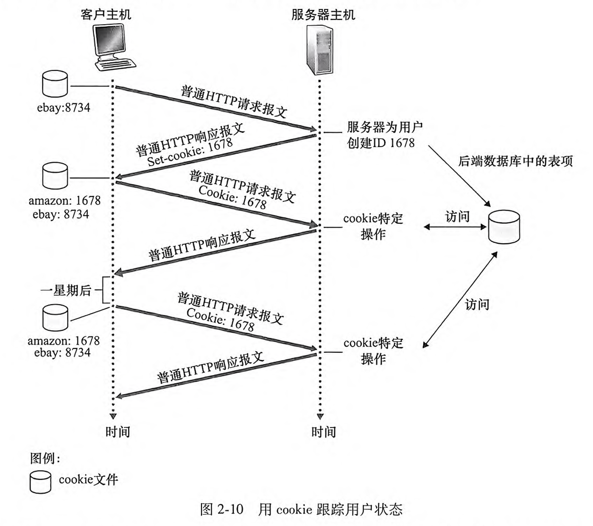

#### 2.2.5 - Web 缓存 / 代理服务器

-   **Web 缓存器**也叫**代理服务器**，它是能够代表初始 Web 服务器来满足 HTTP 请求的网络实体。
-   当浏览器请求某个对象时，将发生如下情况：
    1.   浏览器创建一个到 Web 缓存器的 TCP 连接，并向 Web 缓存器中的对象发送一个 HTTP 请求。
    2.   Web 缓存器进行检查，看本地是否存储了该对象副本。如果有，Web 缓存器就向客户浏览器用 HTTP 响应报文返回该对象。
    3.   如果没有，它就打开一个与该对象的初始服务器的 TCP 连接，在这个缓存器到服务器的 TCP 连接上发送一个对该对象的 HTTP 请求。在收到该请求后，初始服务器向该 Web 缓存器发送具有该对象的 HTTP 响应。
    4.   当 Web 缓存器接收到该对象时，它在本地存储空间存储一份副本，并通过客户浏览器和 Web 缓存器之间现有的 TCP 连接，向客户的浏览器用 HTTP 响应报文发送该副本。
-   Web 缓存器的优点：
    1.   大大减少对客户请求的响应时间，特别是当客户与初始服务器之间的瓶颈带宽远低于客户与 Web 缓存器之间的瓶颈带宽时，Web 缓存器可以迅速将对象交付给用户。
    2.   大大减少一个机构的接入链路到因特网的通信量，降低费用。
    3.   大大减少因特网上的 Web 流量，从而改善所有应用的性能。

### 2.3 - 因特网中的电子邮件

-   邮件系统组成：用户代理 user agent、邮件服务器 mail server、简单邮件传输协议 SMTP。

    -   **用户代理**： 提供用户界面，用于编写、发送、接收和阅读邮件。如 Outlook、 Thunderbird。 
    -   **邮件服务器**：存储和管理用户邮件，处理邮件的发送和接收请求。如 SMTP 服务器、IMAP 服务器。 
    -   **简单邮件传输协议 SMTP**：使用 TCP 可靠数据传输服务，从发送方的邮件服务器向接收方的邮件服务器发送邮件。

-   **推协议**：服务器主动将数据发送给客户端。如 SMTP。 

-   **拉协议**：客户端主动从服务器请求数据。如 HTTP、IMAP、 POP3。

-   Alice 发送邮件给 Bob 的主要过程：
    1.   Alice 调用邮件代理将报文发到 Alice 的邮件服务器，在那里该报文被放在报文队列中。

    2.   运行在 Alice 的邮件服务器的上的 SMTP 客户创建一个到运行在 Bob 的邮件服务器上的 SMTP 服务器的 TCP 连接，发送 Alice 的报文。在 Bob 的邮件服务器上，SMTP 的服务器接收该报文，放入 Bob 的邮箱中。

    3.   在 Bob 方便的时候，他通过 HTTP/IMAP 调用用户代理阅读该报文。注意：Bob 的用户代理不能使用 SMTP 得到该报文，因为取报文是一个拉操作，而 SMTP 是一个推协议。

         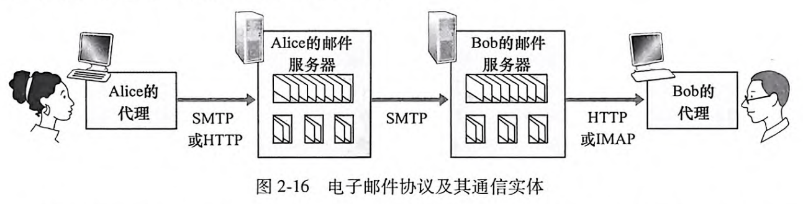

### 2.4 - DNS：因特网的目录服务

-   **域名系统 DNS**：提供主机名 → IP 地址转换的服务，运行在 UDP 上。它是一个由分层的 DNS 服务器实现的分布式数据库，也是一个使得主机能够查询分布式数据库的应用层协议。
-   将主机名解析为 IP 地址的过程：
    1.   同一台用户主机上运行着 DNS 应用的客户端，浏览器将主机名传给它。
    2.   DNS 客户向 DNS 服务器发送一个包含主机名的请求，DNS 客户最终收到一份回答报文，其中含有对应于该主机名的地址。
    3.   一旦浏览器接收到来自 DNS 的该 IP 地址，它就向位于该 IP 地址 80 端口的 HTTP 服务器进程发起一个 TCP 连接。

-   **DNS 分布式、层次数据库**：
    -   层次结构：根 DNS 服务器（管理顶级域）、顶级域（TLD）DNS 服务器（管理某顶级域下的所有二级域）、权威 DNS 服务器。
    -   **本地 DNS 服务器**：当主机发出 DNS 请求时，该请求被发往本地 DNS 服务器，它起着代理的作用，并将该请求转发到 DNS 服务器层次结构中。
    -   查询方式：递归查询、迭代查询
        -   递归查询：本地 DNS 服务器向上游服务器发起查询，上游服务器若无缓存，则依次向根、TLD、权威服务器查询，一直“查到底“。客户端只发起一次请求，由上游服务器承担所有中间查询的负担。
        -   迭代查询：本地 DNS 服务器向上游服务器查询时，上游服务器只返回它所知的最优解，客户端根据推荐再去下一个服务器查询。查询过程由本地 DNS 多次发起，多次往返。
-   **DNS 缓存**：在一个请求链中，当某 DNS 服务器接收一个 DNS 回答时，它能将映射缓存在本地存储器中。

## 第 3 章 运输层

### 3.1 - 概述和运输层服务

-   运输层协议：为运行在不同主机上的*应用进程之间*提供了逻辑通信功能。运输层协议只工作在端系统中，将来自应用进程的报文移动到网络层，但对有关这些报文在网络核心如何移动并不做任何规定。
-   UDP/TCP 的基本责任：（TCP 还有可靠数据传输、拥塞控制）
    -   数据交付：将两个端系统间 IP 的交付服务扩展为运行在端系统上的*两个进程之间*的交付服务。将主机间交付扩展到进程间交付被称为运输层的**多路复用**与**多路分解**。
    -   差错检查：在报文段首部中包括差错检查字段而提供完整性检查。
-   **多路分解**：将运输层报文段中的数据交付到正确的套接字的工作，称为多路分解。
    过程：在主机上的每个套接字能够分配一个端口号（**一个端口可以对应多个套接字**），当报文段到达主机时，运输层检查报文段中的目的端口号，并将其定向到相应的套接字。
-   **多路复用**：在源主机从不同套接字中收集数据块，并为每个数据块封装上首部信息（这将在以后用于分解）从而生成报文段，然后将报文段传递到网络层，所有这些工作称为多路复用。
-   运输层多路复用要求：1. **套接字有唯一标识符（IP 地址 + 端口号）**；2. 每个报文段有特殊字段（源端口号字段、目的端口号字段）来指示该报文段所要交付到的套接字。
-   多路复用和多路分解的实现依靠运输层的端口号，通过端口号区分不同的应用进程。
-   UDP 套接字由**二元组**标识：目的 IP 地址、目的端口号。
-   TCP 套接字由**四元组**标识：源 IP 地址、源端口号、目的 IP 地址和目的端口号。

### 3.3 - 无连接传输：UDP

-   无连接：使用 UDP 时，在发送报文前，发送方和接收方的运输层实体之间没有握手，因此是无连接的。
-   优点：
    -   关于发送什么数据以及何时发送的应用层控制更为精细：因为实时应用通常要求最小的发送速率，不希望过分地延迟报文段的传送，且能容忍一些数据丢失，TCP 服务模型并不是特别适合这些应用的需要。
    -   无须连接建立：TCP 在开始数据传输之前要经过三次握手。UDP 却不需要任何准备即可进行数据传输。因此 UDP 不会引入建立连接的时延。
    -   无连接状态、分组首部开销小。
-   UDP 报文结构：源端口号、目的端口号、长度、检验和 + 应用数据（报文）。
-   **UDP 检验和** checksum：将所有 16 比特的字相加后，取反，便得到了检验和。注意，**在相加时若最高位产生进位，要进行回卷，即给最后的结果加上 1**。

### 3.4 - 可靠数据传输原理 RDT

-   自动重传请求协议：差错检测 + 接收方反馈（肯定确认/否定确认）+ 重传。

-   停等协议：发送方每次发送一个数据帧，等待接收方确认后再发送下一个数据帧。简单，但效率非常低。

-   比特交替协议：具有比特差错的丢包信道的可靠数据传输。

-   **流水线可靠传输协议**：不以停等方式运行，允许发送方连续发送多个分组，无须等待确认。因为许多从发送方向接收方输送的分组可以被看成是填充到一条流水线中，故这种技术被称为流水线。
    
    -   **回退 N 步协议 GBN**
        -   收到一个 ACK：**累积确认，按序接收**。如果某个包（比如 3 号包）丢失或出错，接收方只会确认到 2 号包。
        -   发送方一旦发现有包没被确认，就会从这个包开始，把后面的所有包都重新发送一遍，即“回退 N 步”。
        -   **特点：只要有一个包出错，后面所有已发但未确认的包都要重发。**
    -   **选择重传 SR**
        -   接收方将确认一个正确接收的分组而**不管其是否按序**，失序的分组将被缓存，直到所有丢失分组皆被收到，并交付。
        -   如果某个包丢失或出错，接收方会只要求重发这一个包，已经收到的其他包不用重发。
        -   **特点：只重发出错的包，节省带宽和时间。**
    
    

        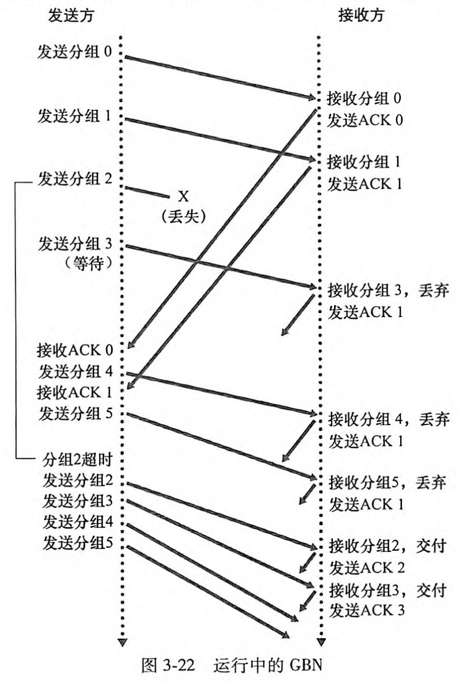
        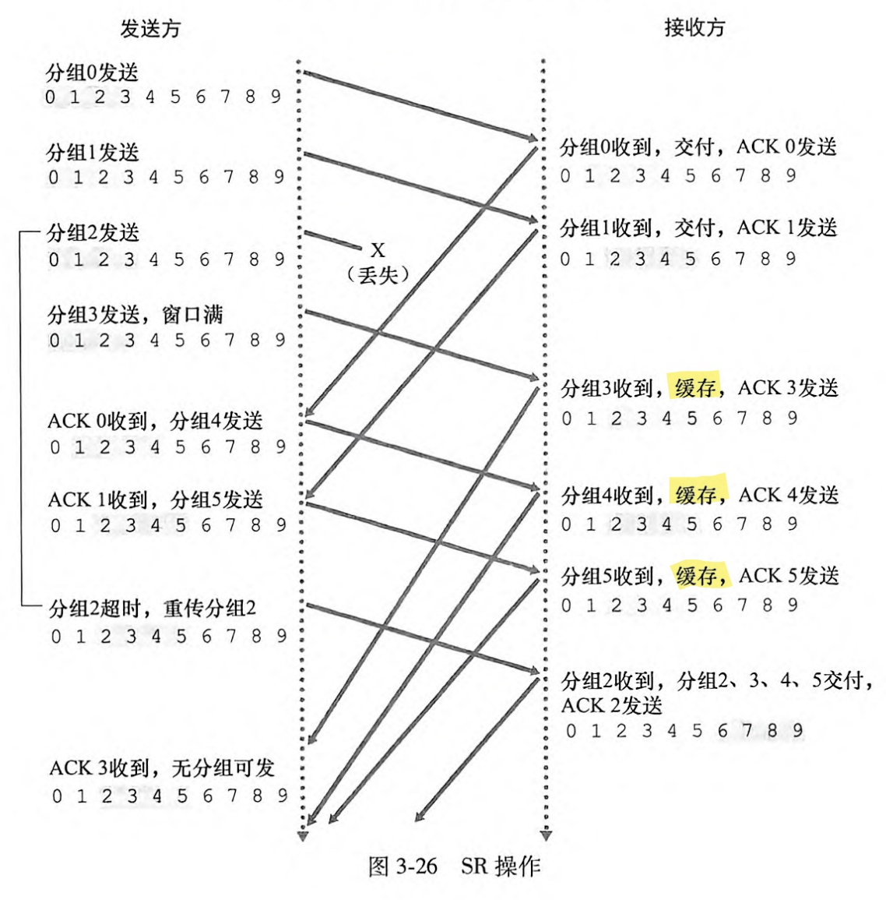
    

### 3.5 - 面向连接的运输：TCP

-   **最大报文段长度 MSS/Maximum Segment Size**：指 TCP 报文段里应用层*数据*的最大长度，不包含首部。
-   最大传输单元 MTU = MSS + TCP/IP 首部长度（通常 40 字节）。
-   **序号 Seq**：一个报文段的序号是该报文段**首字节**的字节流编号。
-   **确认号 ACK**：主机 A 填充进报文段的确认号是**主机 A 期望从主机 B 收到的下一字节**的序号。
-   往返时间的估计：$EstimatedRTT = 0.875 * EstimatedRTT + 0.125 * SampleRTT$。
-   重传超时间隔：$TimeoutInterval = EstimatedRTT + 4 * DevRTT$（RTT 偏差）。
-   **快速重传：当 TCP 接收方发现某个包丢失或乱序时，会不断重复发送对最后按序到达的数据包的 ACK。**一旦收到 **3 个冗余 ACK**，TCP 发送方就认为发生了丢包，然后执行**快速重传**，而不用等超时到期。用于弥补超时周期较长，效率不高的问题。
-   **流量控制**：
    -   目的：**消除发送方使接收方缓存溢出的可能性**。与拥塞控制不同，**拥塞控制是解决 IP 网络的拥塞**。
    -   **接收窗口 rwnd/receive window**：放入 TCP 报文段的接口字段中，用于告诉发送方，**接收方剩余的缓存空间大小**。
        -   接收方：$rwnd = RcvBuffer - [LastByteRcvd - LastByteRead] \geq 0$
        -   发送方：$LastByteSent - LastByteAcked \leq rwnd$
-   TCP 的 3 次握手：
    1.   客户首先向服务器发送一个 SYN 报文段，SYN 比特 → 1；
    2.   服务器向客户发送允许连接的报文段，即 SYNACK 报文段，该报文段不包含应用层数据；
    3.   客户向服务器发送报文段，对服务器允许连接的报文段进行确认，SYN 比特 → 0。第三步可在报文段负载中携带应用层数据。

### 3.7 - TCP 拥塞控制

-   方法：让每一个发送方根据所感知到的网络拥塞程度来限制其能向连接发送流量的速率。
-   **拥塞窗口 cwnd：表示 TCP 发送方在未收到确认前，最多能“飞行”在网络中的数据量。即一轮 RTT 内最多能发的数据量。一轮 RTT 内收到了 cwnd 这么多个数据，每一个数据都让他增长 MSS/cwnd，这样一轮 RTT 后 cwnd + 1。**
    拥塞窗口对一个 TCP 发送方能向网络中发送流量的速率进行了限制。在一个发送方中，未被确认的数据量不会超过 cwnd 与 rwnd 中的最小值，即 $LastByteSent-LastByteAcked \leq \min \{cwnd,\ rwnd\}$。
-   **慢启动阈值 ssthresh/slow start threshold**：用于区分慢启动和拥塞避免两种模式的阈值。

#### 一、慢启动

初始时，设置拥塞窗口 $cwnd = 1$，每次收到一轮确认后，cwnd 加倍。

-   何时结束慢启动？
    1.   **cwnd 到达/超过 sshthresh**：结束慢启动，转移到拥塞避免模式。
    2.   **超时**：TCP 发送方设置 $ssthresh = cwnd / 2$，$cwnd = 1$，然后重新开始慢启动。
    3.   **检测到 3 个冗余 ACK**：$ssthresh = cwnd / 2$，$cwnd = ssthresh + 3$**（3 个冗余 ACK）**，然后进入快速恢复状态。

#### 二、拥塞避免

超过慢启动阈值后，每次收到一轮确认，仅将 cwnd 加 1，逐步增加传输速率，避免拥塞。

-   何时结束拥塞避免？
    1.   **超时**：TCP 发送方设置 $ssthresh = cwnd / 2$，$cwnd = 1$，然后重新开始慢启动。
    2.   **检测到 3 个冗余 ACK**：$ssthresh = cwnd / 2$，$cwnd = ssthresh + 3$**（3 个冗余 ACK）**，然后进入快速恢复状态。

#### 三、快速恢复

在检测到丢包 / 3 个冗余 ACK 并完成重传后，进入快速恢复阶段，更快地恢复到丢包前的发送速率。

1.   **超时**：TCP 发送方设置 $ssthresh = cwnd / 2$，$cwnd = 1$，然后重新开始慢启动。
2.   **继续收到冗余 ACK**：cwnd 加 1。
3.   **丢失报文段的 ACK 到达，重传完毕**：TCP 在降低 cwnd 至 ssthresh 后，结束快速恢复，进入拥塞避免状态。

-   TCP Tahoe：无快速恢复。对于一切丢包事件，都无条件地将 cwnd 减至 1 个 MSS，并进入慢启动阶段。
-   TCP Reno：综合了快速恢复。

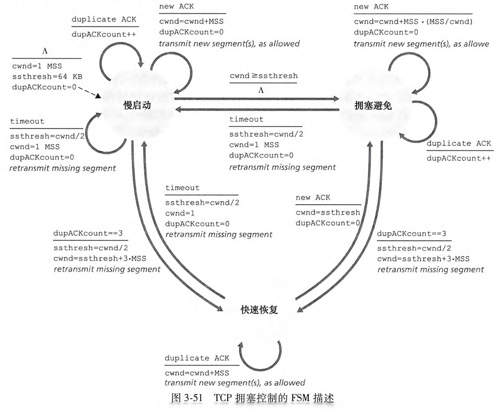

## 第 4 章 网络层：数据平面

-   **数据平面**：负责数据报在网络设备（如路由器）中的实际转发。
-   **控制平面**：负责管理和更新路由表，交换路由信息，计算最佳路径。
-   **转发**：将分组从一个输入链路接口转移到适当的输出链路接口的路由器本地操作。
-   **路由选择**：确定分组从源到目的地所采取的端到端路径的网络范围处理过程。

### 4.2 - 路由器工作原理

-   路由器的 4 个组件：
    1.   输入端口：终结入物理链路，与位于入链路远端的数据链路层交互操作，查询转发表。
    2.   交换结构：将路由器的输入端口连接到它的输出端口。
    3.   输出端口：存储从交换结构接收的分组，并通过执行必要的链路层和物理层功能在输出链路上传输这些分组。 
    4.   路由选择处理器：执行控制平面功能。 在传统的路由器中，它执行路由选择协议，维护路由选择表与关联链路状态信息，并为该路由器计算转发表。 在 SDN 路由器中，它负责与远程控制器通信，接收由远程控制器计算的转发表项，并在该路由器的输入端口安装这些表项。
-   **最长前缀匹配规则**：用于在路由表中查找最精确的路由条目。路由器选择具有最长匹配前缀的路由条目，这样可以更精确地确定数据包的传输路径。
-   三种交换技术
    -   经内存交换：输入端口与输出端口之间的交换是在 CPU 的直接控制下完成的。
    -   经总线交换：输入端口经一根共享总线，将分组直接传送到输出端口。
    -   经互联网络交换：纵横式交换机是非阻塞的。

### 4.3 - 网际协议：IPv4、寻址、IPv6 及其他

-   一个 IP 地址与一个接口关联，因此，IP 要求每台主机和路由器接口拥有自己的 IP 地址。

-   IPv4 地址是 32 位二进制数，通常以点分十进制记法表示。

-   **子网**：分开主机和路由器的每个接口，产生几个隔离的网络岛，使用接口端接这些隔离的网络的端点。这些隔离的网络中的每一个都叫做一个子网。

-   **子网掩码**：例如 255.255.255.0/24，/24 指 32 比特中的左侧 24 比特定义了子网地址。

-   无类别域间路由选择 CIDR： 即**子网寻址**策略，允许更灵活的 IP 地址划分和聚合，通过前缀表示网络地址。 

-   广播地址 255.255.255.255：当一台主机付出一个目的地址为 255.255.255.255 的数据报时，该报文会交付给同一网络中的所有主机。

-   **动态主机配置协议 DHCP**

    -   目的：DHCP 用于主机自动获取地址，常被称为即插即用协议或零配置协议。

    1.   DHCP 服务器发现：客户端在 UDP 分组中向端口 67 广播 DHCP 发现报文，寻找 DHCP 服务器。
    2.   DHCP 服务器提供：服务器广播提供报文，包含可用的 IP 地址和配置参数等。
    3.   DHCP 请求：客户从一个或多个服务器提供中选择一个，并向选中的服务器提供用 DHCP 请求报文进行响应。
    4.   DHCP 确认：服务器用 DHCP ACK 报文对 DHCP 请求报文进行响应，证实所要求的参数。

-   **网络地址转换 NAT**：通过 NAT 转换表，将私有 IP 地址转换为公有 IP 地址，允许多个设备共享一个公有 IP 地址，节省 IP 地址资源。

-   IPv4 向 IPv6 迁移的建**隧道**方法：将 IPv6 数据包封装在 IPv4 数据包的数据字段中，由隧道中间的 IPv4 提供路由，接收时再取出。

## 第 5 章 网络层：控制平面

### 5.1 - 概述

-   每路由器控制
    -   **每个路由器独立运行其路由算法**，基于本地信息和邻居交换的信息进行路由决策。
    -   优点：去中心化，增强了网络的鲁棒性。
    -   缺点：可能导致全局最优路由的难以实现，路由器间需要频繁交换信息。
-   逻辑集中式控制： 
    -   **通过一个集中控制器来计算和分发全局路由信息**，各个路由器执行由控制器提供的指令。
    -   优点：易于实现全局最优路由，集中管理和控制更为简单。
    -   缺点：集中控制器的失效可能导致整个网络瘫痪，存在单点故障风险。

### 5.2 - 路由选择算法

-   **链路状态算法 LS**：属于**集中式**路由选择算法。每个路由器都要了解整个网络的拓扑结构。

    1.   链路状态通告 LSA：每个路由器定期或状态变化时向全网通告自身链路状态。

    2.   构建拓扑库：收到的 LSA 存入本地数据库，同步全网拓扑。

    3.   **运行 Dijkstra 算法**：以自己为根节点，计算到各目的的最短路径。在初始化步骤，得到直接相连的邻居的最低开销路径； 在迭代中，**找出在前一次迭代结束时，具有最低开销的节点**，若经过该节点到达其邻居的距离更短，则添加。直到添加进所有节点。

         表格信息：步骤、节点集合（一步步添加所有节点）、每个节点：**距离 + 前一个点**

    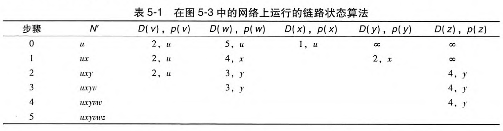

-   **距离向量算法 DV**：属于**分散式**路由选择算法。每个路由器维护一个到所有目的地的距离向量。 

    1.   距离向量更新：路由器周期性地**发送自己的（只发送自己的！）**距离向量给所有邻居。

    2.   距离向量计算：每个路由器根据邻居的距离向量**更新自己的（只更新自己的！）**距离向量，选择最短路径。

    3.   Bellman-Ford 算法：用来更新和计算最短路径。该算法停留在静止状态，直到一条链路开销发生变化。
         问题：可能出现路由环路和计数到无穷大的问题，通常通过水平分割等技术解决。

         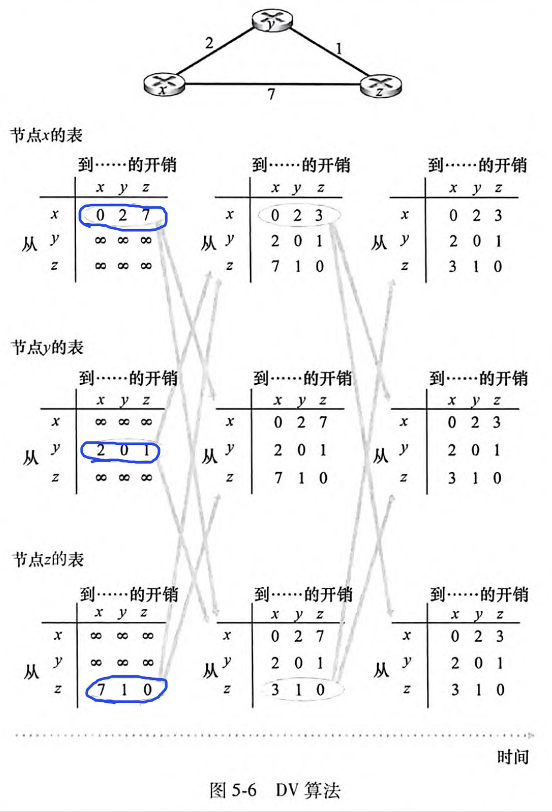

### 5.3 - 5.7

-   **开放最短路径优先 OSPF**：在**同一个自治系统 AS 内部**，根据链路成本，用 Dijkstra 计算最短路径。
-   **边界网关协议 BGP**：**用于不同自治系统 AS 之间的路由选择**，负责互联网上各个网络如何相互找到最优路径。
    -   BGP 分为 eBGP 和 iBGP：
        -   **eBGP (External BGP)**：在**不同自治系统 (AS) 之间交换路由信息**。这是互联网的核心路由协议。
        -   **iBGP (Internal BGP)**：用于在**同一个自治系统 (AS) 内部传递从 eBGP 邻居学到的外部路由信息**。确保 AS 内部所有 BGP 路由器对外部路由有一致的视图。它本身**不用于 AS 内部的路由计算**（那是 OSPF 或 RIP 等 IGP 的工作）。
    -   BGP 属性：AS-PATH（已通过的 AS 列表）、NEXT-HOP（AS-PATH 起始的路由器接口的 IP 地址）。
    -   热土豆路由选择：尽可能快地将分组用最低开销送出其 AS，而不管其 AS 外部到目的地的余下部分的开销。
    -   路由器选择算法：本地偏好 → 最短 AS-PATH → 热土豆路由选择 → BGP 标识符。
-   **SDN 软件定义网络**：一种新型的网络架构思想。**将网络的控制平面和数据平面分离**，网络设备仅负责数据包转发，控制逻辑集中在 SDN 控制器中。 
    -   4 个特征：基于流的转发、数据平面与控制平面分离、网络控制功能：位于数据平面交换机外部、可编程性的网络。
-   **ICMP 因特网控制报文协议**：一种**网络层**协议，用于网络设备之间彼此沟通网络层的**错误报告和诊断信息**，帮助维护网络正常运行。
    -   主要功能：错误报告、网络诊断、跟踪从一台主机到任意一台主机之间的路由。
-   **NMS 网络管理系统**：一种软件系统或平台，用于集中监控、管理、维护网络设备和资源。通常使用 SNMP 协议与网络设备通信。
    -   关键组件：管理服务器、被管设备、数据、网络管理代理、网络管理协议。
-   **SNMP 简单网络管理协议**：一种**应用层**协议，用于网络设备监控与管理，是 NMS 的常用协议。
    -   主要组件： 管理站 Manager（运行管理软件，发起 SNMP 请求）、代理 Agent（运行在网络设备上，响应 SNMP 请求并报告设备状态）、管理信息库 MIB（定义设备的管理信息和属性）。
    -   主要操作： 请求响应模式（管理服务器向代理发送请求）、陷阱报文（代理向管理服务器发送非请求报文，通知异常情况）。

| 特性         | RIP              | OSPF               | eBGP                        | iBGP                             |
| ------------ | ---------------- | ------------------ | --------------------------- | -------------------------------- |
| **类型**     | IGP              | IGP                | EGP                         | 用于 AS 内部传递 BGP 信息        |
| **范围**     | AS 内部          | AS 内部            | AS 之间                     | AS 内部 (用于 BGP 路由)          |
| **算法**     | 距离向量         | 链路状态           | 路径向量                    | 路径向量 (传递 BGP 属性)         |
| **目标**     | AS 内最短路径    | AS 内最短路径      | AS 间路由选择               | 在 AS 内同步外部路由信息         |
| **复杂度**   | 简单             | 较复杂             | 非常复杂                    | 复杂 (依赖 BGP 规则)             |
| **主要用途** | 小型 AS 内部路由 | 大中型 AS 内部路由 | 互联网骨干路由，连接不同 AS | 将 eBGP 学到的路由在 AS 内部分发 |

## 第 6 章 链路层和局域网

### 6.1 - 链路层概述

-   **节点**：运行链路层协议的任何设备都是节点，包括主机、路由器、交换机和 WiFi 接入点。
-   **链路**：把沿着通信路径连接相邻节点的通信信道称为链路。
-   链路层提供的可能服务包括：成帧、链路接入、可靠交付、差错检测和纠正。
-   链路层控制器的大部分功能是在硬件中实现的。

### 6.2 - 差错检测和纠正技术

-   奇偶校验：单个奇偶校验，使 1 的总数为奇数/偶数；二维奇偶校验，具有前向纠错功能。

-   检验和方法：将数据的字节作为 **16 比特**的整数对待并求和（**注意溢出回卷**），这个和的反码就是检验和。

-   **循环冗余检测 CRC**

    1.   考虑 $d$ 比特要发送的数据 $D$，发送方将 $r$ 个附加比特 $R$ 附加到 $D$ 上。
    2.   **生成多项式 $G$**：双方事先协商一个 $r+1$ 比特模式，称为生成多项式。满足：**发送的 $d+r$ 比特模式用模 2 算术能被 $G$ 整除**。
    3.   接收方用 $G$ 去除接收到的 $d+r$ 比特。如果余数为非零，接收方知道出现了差错。

    -   模 2 算术：在加法中不进位，在减法中不借位，等价于按位异或 (XOR)。乘除法与一般的二进制算术相同。
    -   **如何求 $R$？**由于 $D+R$ 数据要被 $G$ 整除，不妨先把 $R$ 填 0，用补 0 后的 $D+R$ 除 $G$，得到的余数就是 $R$。

    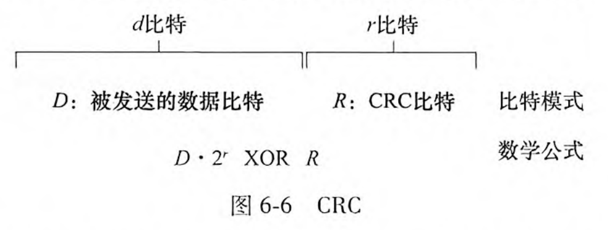

### 6.3 - 多路访问链路和协议

如何协调多个发送和接收节点对一个共享广播信道的访问，这就是多路访问问题。协议：信道划分协议、随机接入协议、轮流协议。

#### 6.3.1 - 信道划分协议

-   简介：将信道分为多个时间片 / 频率带 / 代码，每个用户占用一个独立的信道段。
-   时分多路复用 TDM：将时间划分为时间帧，再把每个时间帧划分为 $N$ 个时隙。每个时隙分配给 $N$ 个节点的其中之一。TDM 消除了碰撞且非常公平，但不适用于有帧要发送的节点唯一的情况，因为速率受限于 $R/N$ bps，且需要等待传输序列中的轮次。
-   频分多路复用 FDM：将信道划分为不同频段，把每个频率分配给 $N$ 个节点的其中之一。优缺点与 TDM 类似。
-   码分多址 CDMA：为每个节点分配一种不同的编码。

#### 6.3.2 - 随机接入协议

随机接入协议：一个传输节点总是以信道的全部速率进行发送。当有碰撞时，涉及碰撞的每个节点等待一个随机时延，然后重发该帧，直到该帧无碰撞地通过为止。主要有 ALOHA 协议和 CSMA 协议。

1.   时隙 ALOHA：多个活跃节点时，一旦碰撞，时隙将浪费，且概率传输导致部分时隙空闲，效率不高。

     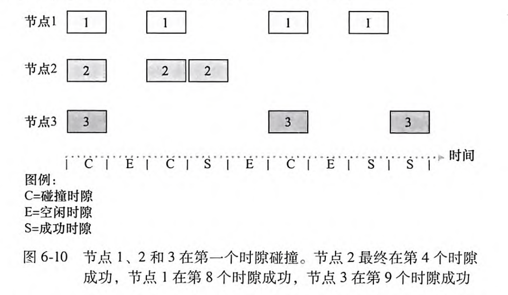

2.   **具有碰撞检测的载波侦听多路访问 CSMA/CD**：

     -   载波侦听：一个节点在传输前先听信道。如果来自另一个节点的帧正向信道上发送，节点则等待直至检测到一小段时间没有传输，然后开始传输。

     -   碰撞检测：一个节点在传输时一直在侦听此信道。如果它检测到另一个节点正在传输干扰帧，它就停止传输，在重复循环之前等待一段随机时间。

     -   信道传播时延：信号从一个节点传播到另一个节点所花费的时间。

     -   **二进制指数后退算法（用于计算节点传输完成后的等待时间）**：当传输一个给定帧时，在

     -   该帧经历了一连串的 $n$ 次碰撞后，节点随机地从 $\{0,1,2,\cdots,2^n-1\}$（即 $0 \sim 2^n-1$）中选择一个 $K$ 值。对于以太网，节点等待的实际时间是 $K \cdot 512$ 比特时间（即发送 $512$ 比特进入以太网所需时间量的 $K$ 倍）。

     -   **与 CSMA 的区别：CSMA 只能重发，CSMA/CD 能即时检测并中止，节省信道资源。**
     
         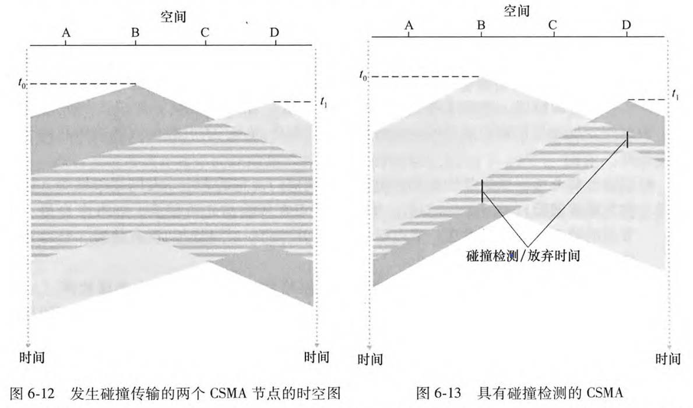

#### 6.3.3 - 轮流协议

-   轮询协议：要求节点之一为主节点，主节点以循环方式轮询每个节点。优：消除了碰撞与空时隙，效率高。缺：不适用于仅一个节点活跃的情况，轮询浪费速率。同时主节点故障时，整个信道瘫痪。
-   令牌传输协议：无主节点，令牌在节点间交换，持有令牌才能发送帧。优：分散，效率高。缺：一个节点故障可能会影响整个信道。

### 6.4 - 交换局域网

-   MAC 地址：即链路层地址，全球唯一。48 位二进制数，通常用 12 个十六进制数表示，如 00:1A:2B:3C:4D:5E。
-   **ARP 地址解析协议**：将 IP 解析为 MAC 地址。
    -   与 DNS 的区别：ARP 只为在同一个子网上的主机和路由器接口解析 IP 地址。

-   集线器：是一种物理层设备，作用于各个比特而不是作用于帧，负责将收到的比特能量强度放大，并向其他所有接口传输出去。
-   **交换机和路由器的区别**
    -   交换机： 工作在链路层，通过 MAC 地址过滤和转发数据帧。负责局域网内的通信。 
    -   路由器： 工作在网络层，通过 IP 地址转发数据包。负责不同子网或网络之间的通信。
-   多协议标签交换技术 MPLS：在网络层和链路层之间增加一个标签，可以标识数据报，用于快速转发数据报。 
-   数据中心网络的等级拓扑：也称三层架构，是传统数据中心常用的网络结构，主要分为三层：核心层、汇聚层和接入层。

## 第 7 章 无线网络和移动网络

### 7.1 & 7.2 - 概述、无线链路和网络特征

-   无线主机：连接到无线网络的终端设备，如智能手机、笔记本电脑、平板电脑等。
-   **无线链路**：无线主机之间或无线主机与基站之间的通信通道。包括 Wi-Fi、蓝牙、蜂窝网络等。
-   **基站**：负责向与之关联的无线主机发送数据，并从主机那里接收数据，协调传输。如蜂窝网络中的蜂窝塔。
-   **基础设施模式**：**依赖基站**的无线网络架构，所有通信都必须经过基站。例如：Wi-Fi 网络中的无线路由器、蜂窝网络中的基站。
-   **自组织网络**：**无需基站**的无线网络架构，节点之间直接通信。节点充当路由器，动态地建立和维护网络连接。
-   **多径传播**：电磁波的一部分受物体和地面反射，从多个路径到达接收端，出现多径传播，导致信号干扰和衰减。
-   **信噪比** SNR：信号强度/背景噪声强度。较大的 SNR 意味着更好的通信质量。
-   **隐藏终端问题**：两个终端都与基站通信，但彼此不可见，导致它们在发送数据时不能检测到对方的信道状态，从而可能引发冲突。
    例如：当 A 向 B 发送数据时，A 认为信道空闲；此时 C 也向 B 发送数据，A 听不到 C 的“占用”，C 也听不到 A 的“占用”，就会同时传给 B，导致在 B 处发生碰撞，包丢失。
-   **CMDA 码分多址协议**：靠码序列区分不同用户。各终端使用不同的伪随机码序列将数据*扩展到整个频谱*上，同时传输。接收端使用相同的码序列解码*特定终端*的信号，同时忽略其他信号，实现多用户共享同一频谱。

### 7.3 - WiFi：802.11 无线局域网

-   基本构件模块：基本服务集 BSS、接入点 AP。

-   **主动扫描和被动扫描**：

    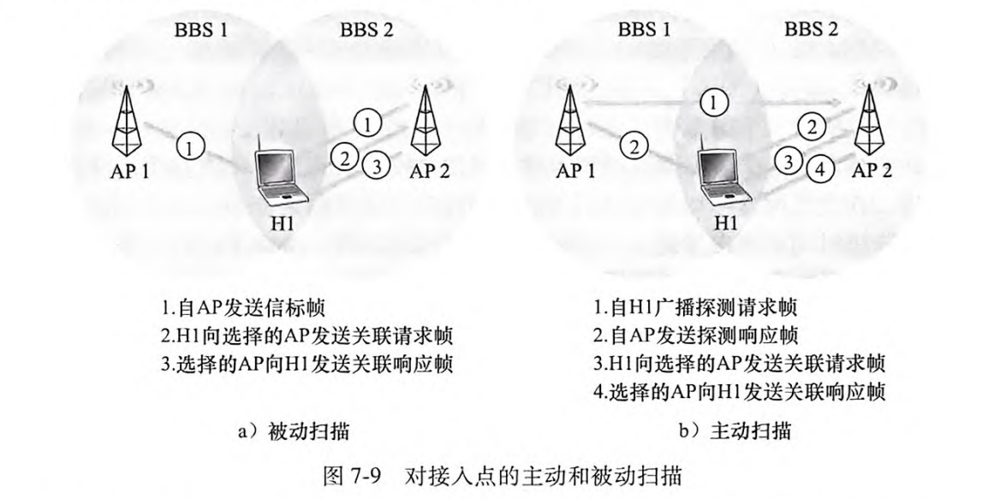

-   **CSMA/CA**（带碰撞避免的载波侦听多路访问 ）：使用碰撞避免技术而非碰撞检测。一旦开始发送，就完全发送，不会返回。这使得碰撞的代价非常高。所以，使用 CSMA/CA，站点在倒计数时抑制传输，即使侦听到该信道空闲也是如此。

    1.   如果某站点最初监听到信道空闲，它将在一个被称作分布式帧间间隔的短时间段后发送该帧（目的是确保空闲）。
    2.   否则，**该站点选取一个随机回退值**，并且在侦当侦听到信道忙时，计数值保持不变。听到信道空闲时递减该值。
    3.   当计数值减为 0 时（只可能发生在信道被侦听为空闲时），该站点发送整个数据帧，并等待确认。
    4.   如果收到确认，传输站知道它的帧已被目的站正确接收了。**如果该站点要发送另一帧，它将从第二步开始（为什么？为了避免碰撞）**。如果未收到确认，传输站将重新进入第二步中的回退阶段，并从一个更大的范围内选取随机值。
    
-   CSMA/CD（载波监听多路访问/冲突检测）

    -   工作原理
        -   发送前先监听信道是否空闲；
        -   如果空闲就发送数据；
        -   如果发生冲突，立即停止发送，并发送冲突信号，等待随机时间后重试。
    -   应用场景
        -   以太网（有线局域网，尤其是早期的共享总线以太网）
    -   特点
        -   只能在能检测到冲突的环境下使用（如有线网络）

    CSMA/CA（载波监听多路访问/冲突避免）

    -   工作原理
        -   发送前先监听信道是否空闲；
        -   如果空闲，不是马上发送，而是先等待一段随机时间（避免多个设备同时发送）；
        -   通过避免冲突的方式减少数据重传。
    -   应用场景
        -   无线局域网（如 Wi-Fi，IEEE 802.11）
    -   特点
        -   无线环境下无法检测冲突，只能尽量避免冲突

### 7.4 - 蜂窝网络：4G 和 5G

-   4G LTE / 4G 长期演化标准 的部件：移动设备、基站、归属用户服务器、服务网关等其他网络路由器、移动性管理实体。

-   小区和基站：蜂窝网络覆盖的区域被划分成许多地理覆盖区域，称为小区。每个小区都有一个基站，向小区内的移动设备发送信号，并从其接收信号。

-   到移动设备的间接路由：数据包先送到“归属网络”，再由归属网络转发到移动设备当前所在的“访问网络”。路径绕远，效率低。

-   到移动设备的直接路由：数据包直接从外部主机通过访问网络路由到移动设备，无需经过归属网络。路径更短，效率高。

-   移动设备从源基站切换到目标基站的步骤（P389-390）

    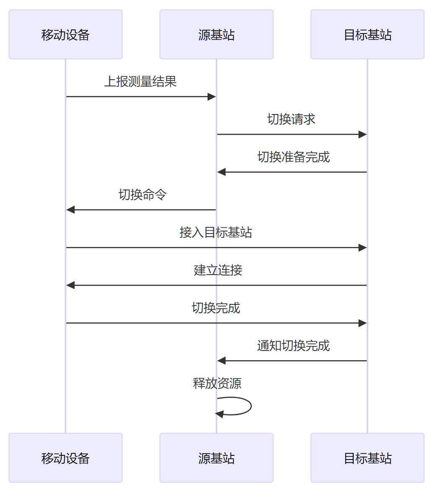

## 第 8 章 计算机网络中的安全

-   安全通信的性质：机密性、报文完整性、端点鉴别、运行安全性。

-   **对称密钥系统**： 加密、解密使用相同的密钥，速度快，适合大数据量加密，但密钥分发和管理困难，尤其在大规模网络中。 

    -   块密码：要加密的报文被划分为许多 $k$ 比特的块，每块采用一对一映射，独立加密。
    -   密码块链接：每个密文块都依赖于前一个密文块，相同明文块在不同位置加密结果不同，增强了安全性。

-   **公开密钥系统**： 使用一对密钥（公开密钥、私有密钥），便于密钥分发和管理，但加密速度较慢。

    -   **RSA 算法**

        1.   选择两个大素数 $p$ 和 $q$，计算 $n=pq$，$z=(p-1)(q-1)$。
        2.   选择 $e$ 使 $e<n$ 且 $e,\ z$ 互素；求 $d$ 使 $ed \bmod z = 1$。
        3.   公钥：$(n,\ e)$；私钥：$(n,\ d)$。

        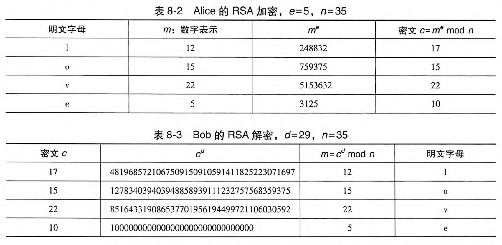

    -   **会话密钥**：在一次通信会话期间临时生成、仅用于本次会话的数据加密和解密的对称密钥。可通过 RSA 加密该密钥以告知对方。

-   报文完整性 / 报文鉴别

    -   **密码散列函数**：理想条件下，报文和它的散列值是一对一的。不可能找到任意两个不同的报文 $x$ 和 $y$ 使得 $H(x)=H(y)$。
    -   **报文鉴别码 MAC**：将报文 $m$ 与鉴别密钥 $s$ 级联，计算出的散列 $H(m+s)$，被称为报文鉴别码。

-   **数字签名**：发送方用私钥对报文进行加密，接收方用发送方公钥解密。由于私钥仅有发送方知道，故可证明身份。

-   公钥认证、证书：由权威机构 CA 签发，证明公钥确实属于你。其他人收到证书后，可以用 CA 的公钥验证证书的真实性。

-   端点鉴别：网络通信中，确认通信双方的身份。

-   回放攻击：攻击者在网络中“窃听”到合法用户的通信内容（比如登录请求、认证信息等），然后在之后的某个时刻，把这些内容“原封不动”地重新发送给服务器，试图冒充合法用户进行操作。防御的关键是让每次请求都具有唯一性和时效性，例如使用不重数。

    例如：假设你用用户名和密码登录网站，攻击者截获了你的登录请求包，然后他把这个包再发一次，服务器如果没有防护措施，就会认为又是你本人登录，从而被攻击者冒充成功。

-   TLS：

    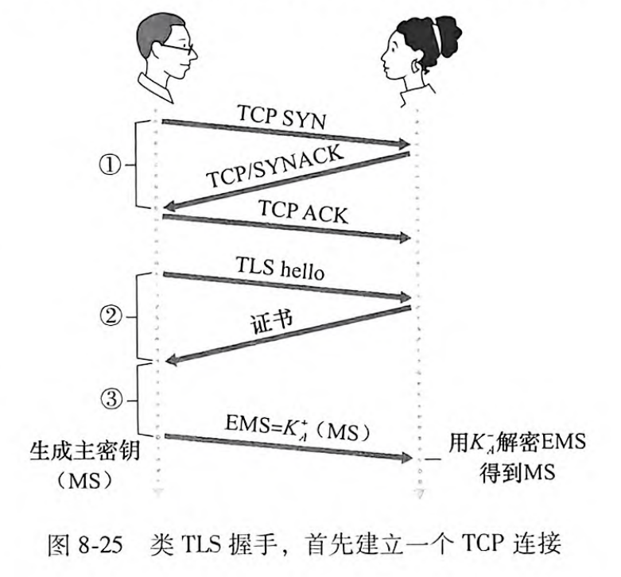

-   **IPSec（Internet Protocol Security）协议**：是一套用于在 IP 网络中实现安全通信的协议标准。它在网络层工作，主要用于保护 IP 数据包的机密性、完整性和认证，常见于虚拟专用网（VPN）等场景。

    -   传输模式：只加密 IP 数据包的有效载荷，常用于端到端通信（如主机到主机）。
    -   隧道模式：加密整个 IP 数据包，并封装在新的 IP 包中，常用于 VPN（如网关到网关）。
    -   AH（Authentication Header，鉴别首部）
        -   作用：提供数据包的完整性校验和身份认证，确保数据没有被篡改、来源可信。
        -   特点：**不加密数据内容**，只做认证和完整性保护。
    -   ESP（Encapsulating Security Payload，封装安全性载荷）
        -   作用：提供数据包的加密（保护隐私）、完整性校验和身份认证。
        -   特点：**既能加密数据内容，也能做认证和完整性保护**，是实际应用中最常用的协议。

-   防火墙：防火墙将一个机构的内部网络与整个因特网隔离开，允许或阻止特定的数据包通过。（“门卫”）

    | 类型             | 检查层次      | 检查内容                                       | 安全性 | 性能 |
    | ---------------- | ------------- | ---------------------------------------------- | ------ | ---- |
    | 传统的分组过滤器 | 网络 / 运输层 | 数据包头部信息，如 IP 地址、端口号、协议类型等 | 较低   | 很高 |
    | 状态分组过滤器   | 网络 / 运输层 | 数据包头部信息 + 跟踪连接状态                  | 较高   | 较高 |
    | 应用程序网关     | 应用层        | 分析和过滤应用层的数据内容                     | 最高   | 较低 |

-   入侵检测系统 IDS：是一种用于监控网络或系统活动，检测是否有恶意行为或未授权访问的安全设备或软件。（“警报器”）

    | 对比项   | 防火墙                     | IDS（入侵检测系统）              |
    | -------- | -------------------------- | -------------------------------- |
    | 主要作用 | 阻挡、过滤不安全的数据流   | 监控、检测异常或恶意行为         |
    | 工作方式 | 主动防御，直接拦截非法访问 | 被动检测，发现异常后报警         |
    | 处理方式 | 拒绝或允许数据包通过       | 记录、分析、报警，不直接阻断流量 |
    
    
