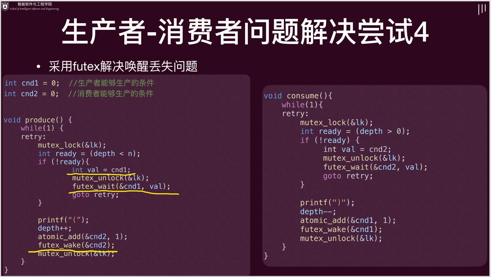
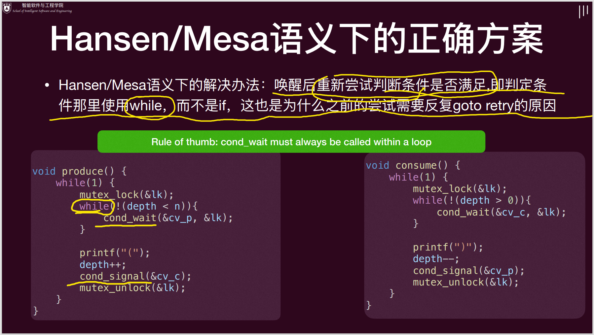
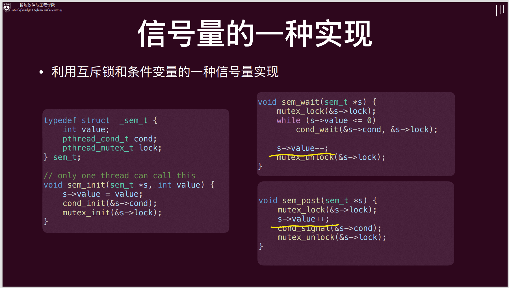
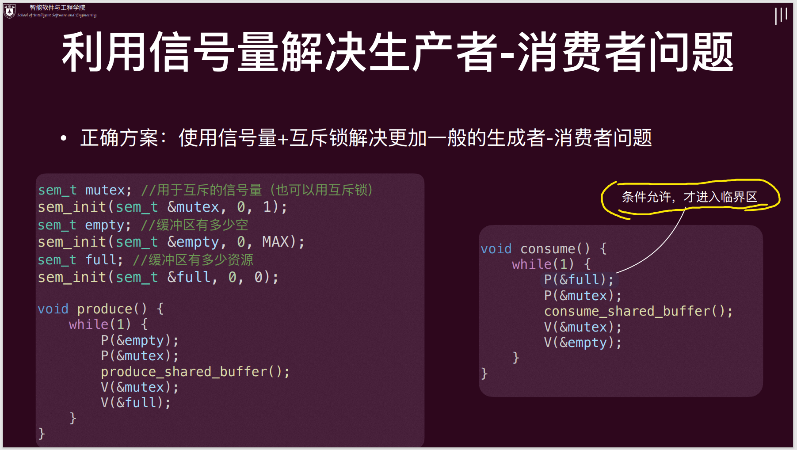
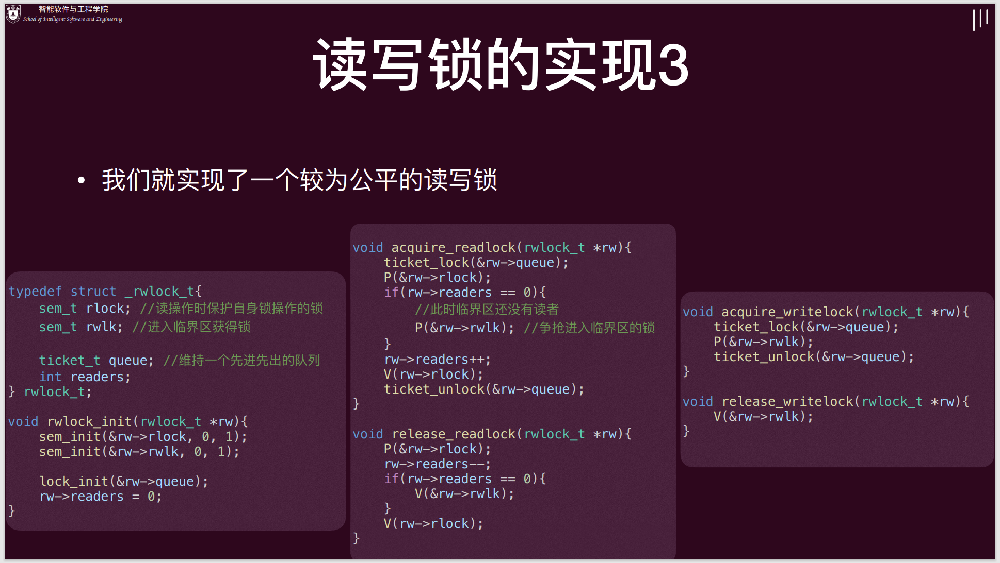
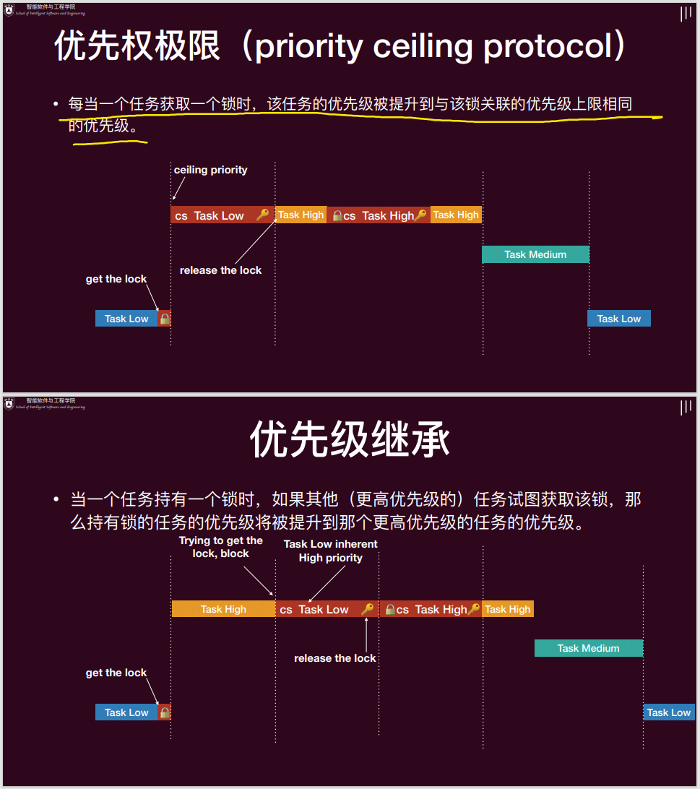
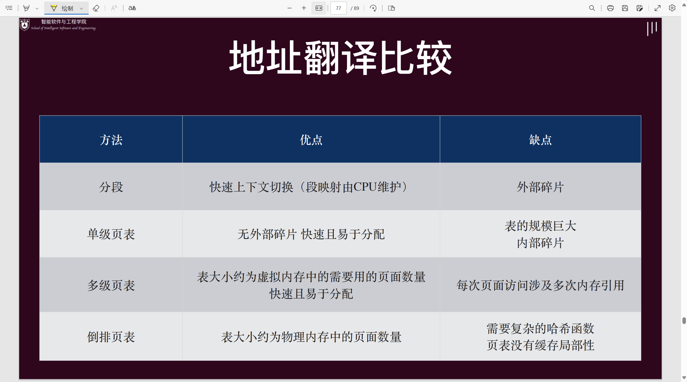

## 3 - 多处理器编程

-   进程（Process）
    -   是操作系统分配资源（如内存、文件等）的**基本单位**。
    -   每个进程有**独立的地址空间**，互不干扰。
    -   进程之间通信（IPC）比较复杂，开销较大。
    -   比如：你同时打开了微信和 QQ，这两个就是两个进程。
-   线程（Thread）
    -   是操作系统调度 CPU 的**基本单位**，也叫“轻量级进程”。
    -   同一个进程里的多个线程**共享进程的资源**（如内存、文件），但每个线程有自己的栈和寄存器。
    -   线程之间通信简单，切换开销小，适合并发处理。
    -   比如：微信里一个线程负责界面显示，另一个线程负责消息收发。
-    线程调度的挑战：

     1.   **原子性丧失**：本来应该“一步到位”的操作，被拆成了多步，结果中间被其他线程/进程插手，导致数据出错。
          -   原子性：指一个操作或一组操作要么全部完成，要么全部不做，中间不会被打断，也不会出现“只做了一半”的情况。
     2.   **顺序性丧失**：本来应该按特定顺序执行的操作，结果顺序被打乱，导致逻辑错误。
     3.   **全局一致性丧失**：多个操作本应保证系统整体状态一致，但由于并发或分布式环境下同步不当，导致各线程看到的数据不一致。

## 4, 5 - 互斥

-   **临界区** (critical section)：访问共享资源的一段**代码**，资源通常是一个变量或数据结构。

-   **竞态条件** (race condition)：出现在多个执行线程大致同时进入临界区时，它们都试图更新共享的数据结构，导致非预期的结果。

-   临界区的解决方案需满足的条件：互斥（最多一个）、行进（终将进入）、有界等待（不可一直等待）。

-   **锁 mutex**：锁是一个变量，其保存了锁在某一时刻的状态。它要么是可用的，表示没有线程持有锁；要么是被占用的，表示有一个线程持有锁，正处于临界区。通过给临界区加锁，保证临界区内只有一个活跃变量（互斥）。

    ```c
    #include <pthread.h>
    pthread_mutex_t mtx = PTHREAD_MUTEX_INITIALIZER;
    
    void* thread_func(void* arg) {
        pthread_mutex_lock(&mtx); 
        // 试图获得 lk，如果失败 (lk 已被持有)，利用系统调用阻塞该线程（此时不是就绪态，无法被调度了），
        // 让出 CPU 并将其加入等待锁的队列之中。否则，成功获得锁进入临界区。
        /* ... 临界区，操作共享资源 ... */
        pthread_mutex_unlock(&mtx); 
        // 释放锁，如果等待该锁的队列里有线程就利用系统调用选择一个唤醒，
        // 使其变成就绪态（ready），从这个等待队列删除，并进入就绪的队列，可以被再次调度。
        return NULL;
    }
    ```

-   自旋锁：如果锁被占用，线程不会睡眠，而是在原地“自旋”等待锁释放（不断尝试获取锁）。

    ```c
    int flag = 0; 
    
    void lock(){ 
        while (flag == 1); // 自旋的观测 flag
        flag = 1; // 设置锁
    }
    
    void unlock(){ 
        flag = 0; // 释放锁
    }
    ```

## 6, 7 - 同步

-   **同步** (Synchronization)：控制并发，两个或两个以上随时间变化的量在变化过程中保持一定的相对关系。互斥也是一种同步。

### 生产者-消费者问题

一个/多个线程共享一个有界数据缓冲区的问题。线程分为生产者（生产数据）和消费者（消费数据）。



### **条件变量**

用来“等待”和“唤醒”线程的工具，适用于一切同步条件。有两种操作：

-   `cond_wait(cond_t *cv, mutex_t *lk)`：在条件变量 `cv` 上阻塞。 
    -   调用前，默认假设 `lk` 已经持有锁 `lk`。
    -   调用后，原子地阻塞线程和释放锁。
    -   被唤醒时，重新获取锁。
-   `cond_signal(cond_t *cv)`：唤醒一个等在条件变量 `cv` 上的阻塞线程。

条件变量的使用法则：

-   **每次从 `wait` 中唤醒，要重新进行条件检查（因为通知 + 唤醒过程不是原子的）——使用 while 循环！**

-   **针对不同的条件使用不同的条件变量（除非使用 broadcast 唤醒）**。

-   条件变量不记录“现在能不能生产/消费”，还得有共享的状态用来进行判定。

-    使用互斥锁来保护共享的状态以及条件变量的操作。

-   在做 `wait`/`signal`/`broadcast` 时需要持有互斥锁。


用条件变量解决消费者-生产者问题：



### 信号量 (Semaphores)

有记忆的同步原语。可以看成一个更高端的互斥锁，方便但不能胜任所有事情。可以由条件变量 + 互斥锁来实现。

-   `P(sem_t *sem)`：如果 `sem` 的值不是正数就阻塞自己，否则将 `sem` 的值减 1 后返回运行。
-   `V(sem_t *sem)`：将信号量 `sem` 的值加 1，如果有一个或多个线程阻塞在这个信号量上，选择一个唤醒。

可以将这个值看成初始“资源数”。$$P-,\ V+$$。

-   初始“资源数”为 1，意味着互斥，只有一个能够获得这个资源，其释放这个资源，其他线程才能获取这个资源。
-   初始“资源数”为 0，意味着阻塞，当前线程必须等待，只有未来某个线程增加一个资源，该阻塞线程才能继续行进。





### 读者-写者问题

多个线程想要读取某个数据，有一个或多个线程需要写某个数据。

-   对于读者而言，如果临界区为空或者临界区有其他读者，那么就可进入（读-读不互斥，读-写互斥）。
-   对于写者而言，只有临界区为空才可进入（读-写互斥，写-写互斥）。

直接对所有线程加上互斥锁当然可以解决此问题，但是性能太低，因为这会限制读者之间无需互斥的自由。为此，我们需要实现一个新的锁——“读写锁”，其可以允许多个“读者”同时访问共享数据，但一次只能有一个“写者”可以持有读写锁进入临界区修改数据。

1.   读者优先：一直等到最后一个读者退出临界区，才会释放锁。对写不友好，可能让写饿死。
2.   写者优先：同理，对读不友好。
3.   给线程排队：每个线程在尝试获取锁时，都会先调用 `ticket_lock`，在 `queue` 队列中排队，只有排到自己号的线程才会继续后续的加锁操作。当线程完成加锁流程后，调用 `ticket_unlock`，让下一个排队的线程有机会继续。



```
int read_count = 0;       // 当前读者数量
sem_t mutex = 1;          // 保护 read_count 的互斥锁
sem_t rw_mutex = 1;       // 控制对共享资源的访问 (读者和写者共享)

Function Reader():
  P(mutex);                     // 获取对 read_count 的独占访问
  read_count = read_count + 1;
  If read_count == 1 Then     // 如果是第一个读者
    P(rw_mutex);              // 则需要获取资源访问权，阻止写者
  V(mutex);                     // 释放对 read_count 的独占访问

  // --- 临界区：读取共享数据 ---
  ReadSharedData();
  // --- 临界区结束 ---

  P(mutex);                     // 获取对 read_count 的独占访问
  read_count = read_count - 1;
  If read_count == 0 Then     // 如果是最后一个读者
    V(rw_mutex);              // 则释放资源访问权，允许写者
  V(mutex);                     // 释放对 read_count 的独占访问
End Function
    
Function Writer():
  P(rw_mutex);                  // 获取对共享资源的独占访问

  // --- 临界区：写入共享数据 ---
  WriteSharedData();
  // --- 临界区结束 ---

  V(rw_mutex);                  // 释放对共享资源的独占访问
End Function
```
## 8 - 并发 bugs


### 哲学家就餐问题

```c
// 无需额外的互斥锁。给筷子编号！总是拿编号小的！
void philosopher(int i){ 
    while(1){ 
        think(); 
        if (left(i) < right(i)){ 
            P(forks[left(i)]);  // Pick up left fork
            P(forks[right(i)]); // Pick up right fork
        } else{ 
            P(forks[right(i)]); // Pick up right fork
            P(forks[left(i)]);  // Pick up left fork
        } 
        eat(); 
        V(forks[left(i)]);  // Put down left fork
        V(forks[right(i)]); // Put down right fork
    } 
}
```

### 死锁

指某个小组中的成员因为每个成员都在等待另一个成员 （包括自己）采取行动，因此无法继续执行的状态。

-   AA 型死锁：一个线程在已经持有一把锁的情况下再次尝试获得这把锁。
-   ABBA 型死锁：线程 1 拿到了锁 A，需要锁 B；线程 2 拿到了锁 B，需要锁 A。这时两个线程都无法行进。（哲学家就餐问题）

**死锁产生的必要条件**：

1.   互斥 Mutual-exclusion：所需要的资源是互斥的。
2.   持有并等待 Hold and wait：持有某个资源并等待更多资源。
3.   非抢占性 No-preemption：不可直接“抢”别人持有的资源，只有等持有的人主动释放。
4.   循环等待 Circular wait condition：形成循环等待的环。（可破坏！强制在锁在申请时按照规定的顺序来！）

锁的申请过程就是构造一个关于锁的有向图 $$G$$ 的过程，因此按照一个全局的顺序就不会产生死锁。

### 银行家算法

银行家算法的关键：判断未来是否可以满足。

1.   找一个线程 $$i$$，看看其未来还需要的最大资源数 (最大资源需求数-目前持有资源数) 是否能够被目前系统尚存的资源数所满足 (系统初始资源数-被所有线程所持有的资源数)，如果所有线程都不能被满足，就是一个“不可挽回”的不安全状态，最终会进入死锁状态。
2.   对满足需求的线程 $$i$$，标记其为未来可满足状态，即其可以在目前状态下存在一个分配方式 (立即全部分配其所有资源) 终止。那么也就存在这样的一个好的局面：我们可以将其资源都回收。
3.   在步骤 2 的更好的局面上，重复之前的步骤，一直到所有线程都可以终止，那么该系统状态就是“可挽回”的状态。

然而，这个算法是不实用的：我们一般没法知道“最大”需求矩阵，且系统的资源是动态变化的。因此常用的是：让死锁发生吧， 然后我们检测并处理，通过 DFS 算法检测是否有锁申请环（死锁的动态侦测）。

## 9 - 进程

进程控制块 PCB：与线程的线程控制块（Thread Control Block, TCB）一样，进程也需要一些元信息，用来描述（抽象）进程，方便操作系统管理，即进程控制块（Process  Control Block, PCB）。

进程的生命周期：New - Ready - Running (- Waiting) -Finished。

### **上下文切换**

将 CPU 从一个任务切换到另一个任务，保存当前任务的运行状态，并恢复下一个任务的运行状态。

-   保存当前任务的上下文：“上下文”是指一个进程或线程在 CPU 上的执行状态，包括 CPU 寄存器、程序计数器、堆栈指针等信息。
-   恢复下一个任务的上下文：把下一个任务上次运行时保存的状态重新加载到 CPU。
-   切换过程由操作系统内核完成，实现多任务并发，让多个进程或线程“轮流”使用 CPU。
-   同时，保证每个任务都能正确恢复到上次暂停的位置继续运行。

### fork

通过做一份当前进程完整的复制 (内存、寄存器现场)，创建一个新的子进程。

-   子进程和父进程会**各自独立**地继续执行 `fork` 之后的指令。
-   区分父子进程：**子进程返回 0，父进程返回子进程的 process ID**。

### execve

将当前进程重置成一个可执行文件描述状态机的初始状态。

写时复制 (Copy-On-Write, COW)：两个进程共享一份物理内存，只有当一个进程尝试去写这个物理内存时，才会真正在物理内存中复制一份副本供它写入。

### exit

终止当前进程，释放资源，返回状态给父进程。

## 10 - 调度

-   **老化**： 是操作系统调度中的一种防止“饥饿”（某些低优先级进程长期得不到服务）的方法。
    -   老化机制规定：**随着等待时间的增加，进程的优先级会逐渐提高**。
-   **周转时间 = 作业完成时间 − 作业提交时间**，等待时间 = 周转时间 - 获得 CPU 执行的时间
-   平均周转时间 = 所有作业的周转时间之和 ÷ 作业总数
-   **作业调度**：决定哪些作业可以从外存进入内存，成为进程。
-   **进程调度**：决定内存中哪个就绪进程获得 CPU 执行权。
-   非抢占式调度算法：选择一个进程来运行，然后就让它一直运行，直到它被阻塞，或者自愿释放 CPU。
-   抢占式调度算法：选择一个进程，并允许其运行一段固定的最长时间。如果在时间间隔结束时它仍在运行，则被挂起，调度器选择另一个进程来运行。（需要时间中断的机制支持）

### 批处理任务的调度

1. **先来先服务（FCFS, First-Come First-Served）**
    - **原理**：按作业到达的先后顺序依次调度，谁先来谁先执行。
    - **优点**：实现简单，公平。
    - **缺点**：长作业可能让短作业等待很久，平均周转时间可能较长（护航效应）。

2. **最短任务优先（SJF, Shortest Job First）**
    - **原理**：每次选择估计运行时间最短的任务先执行。
    - **优点**：平均周转时间最短，系统吞吐量高。就平均等待时间而言，SJF 是最优的。
    - **缺点**：难以准确预估任务运行时间，长任务可能饿死，以及可以被轻易愚弄。
3. **最短剩余时间优先 （Shortest Remaining Time First, SRTF）**
    -   最短任务优先的可抢占版本。

### 交互性任务的调度

1. **时间片轮转（Round Robin, RR）**
    - **原理**：为每个作业分配一段固定时间的资源，即时间片，轮流执行，时间片用完就切换到下一个作业。
    - **优点**：公平，响应快，适合交互式系统。
    - **缺点**：时间片太短切换开销大，太长又退化为 FCFS。
2. **优先级调度（Priority Scheduling）**
    - **原理**：每个作业分配一个优先级，优先级高的作业先执行。
    - **优点**：能保证重要作业优先完成。
    - **缺点**：低优先级作业可能饿死，需配合“老化”，随着时间的推移增加进程的优先级。
3. **多级反馈队列（Multilevel Feedback Queue, MFQ）**
    - **原理**：把就绪进程分到多个优先级队列，每个队列有不同的时间片长度和优先级。进程可来回移动。
    - **优点**：灵活，能动态改变优先级，兼顾多种作业类型。
    - **缺点**：实现复杂，队列间切换需设计好策略。仍存在饥饿问题，需要老化机制。
4. **乐透调度**

### 实时系统的调度

1.   单调速率调度：周期较短的任务具有较高的优先级，而周期较长的任务具有较低的优先级。
2.   最早截止日期优先（Earliest Deadline First Scheduling, EDF）：截止期限越早，优先级越高。截止期限越晚，优先级越低。

### 优先级反转问题

假设系统中有两个线程：T1（低优先级）和 T2（高优先级）。现在假设 T1 首先运行（T2 此时还不可运行），并获得了一个自旋锁，并进入其临界区。然后 T2 开始运行，调度器立即调度 T2 取代 T1 运行。但 T2 尝试获取锁，并开始忙等待。由于 T2 运行时永远不会调度 T1，因此 T1 没有机会离开临界区，而 T2 则永远循环下去。

解决方法：

-   优先权极限：每当一个任务获取一个锁时，该任务的优先级立即被提升到与该锁关联的优先级上限相同的优先级。
-   优先权继承：当一个任务持有一个锁时，如果其他更高优先级的任务试图获取该锁，那么持有锁的任务的优先级将被提升到那个更高优先级的任务的优先级。



## **11 - 地址空间**

### 内存分配策略

1.   **固定分配（固定分区）**
     -   **做法**：内存提前划分成若干固定大小的分区，每个分区只能装一个作业或进程。
     -   **优点**：实现简单，分配速度快。
     -   **缺点**：内碎片严重，灵活性差，分区数和大小一旦确定就不能变。

2. **可变分配（可变分区）**
    - **做法**：内存不预先划分，来一个作业就分配一块刚好够用的连续空间，作业结束后回收，相邻空闲区可以合并。
    - **优点**：灵活，基本没有内碎片。
    - **缺点**：容易产生外碎片，分配和回收时需要查找和合并空闲区，效率较低。

3. **伙伴系统（Buddy System）**
    - **做法**：内存按 2 的幂次方大小分块，需要分配时找最合适的块，不够就把大块一分为二。回收时，如果相邻的“伙伴”也空闲，就合并成更大的块。
    - **优点**：分配和回收速度快，合并简单，很少有外碎片。
    - **缺点**：只能分配 2 的幂次方大小的块，可能有内碎片。

4. **Slab 分配器**
    - **做法**：**用伙伴系统**，把内存分成多个“缓存池”（slab），每个缓存池专门用来存放某种类型、固定大小的对象（如进程控制块、文件描述符等）。分配时直接从池里拿，释放时回收到池里，方便复用。
    - **优点**：分配和释放速度极快，适合频繁分配/释放小对象，内存利用率高。
    - **缺点**：主要用于内核小对象，不适合大块内存分配。

### **可变分区内存分配策略**

- First-Fit：碰到就给，快但低地址碎片多。  
- Next-Fit：上次分到哪，下次从哪找，碎片分布更均匀。  
- Best-Fit：最省空间，但容易留下外部碎片。  
- Worst-Fit：每次都切最大块，理论上减少外部碎片。

### 分段

段是虚拟内存空间的连续区域，是一个逻辑单元。每个段独立映射到物理内存中的一组连续地址
-   没有特定的顺序
-   不需要映射未使用的虚拟地址
-   **可以消除内部碎片**
-   不同的段可以独立增长或缩减
-   支持共享：多个虚拟地址空间可以映射到内存中的同一物理段

问题：分配的粒度太粗，随着时间的推移**会产生外部碎片**

### 分页

更细粒度的内存管理，物理内存被划分成连续、等长的物理页（页框），虚拟内存也被划分为相同大小虚拟页（页 / 虚页）。

-   任意虚拟页可以映射到任意物理页，非常灵活，不需要是连续的空间。
-   由于都是按照页为单位分配内存，故没有外部碎片。
-   支持共享：共享相同的物理页面——在两个页表中的条目指向相同的页帧。
-   常见控制位
    -   **有效位 / 存在位**：标记该虚拟页是否在物理内存中，如果页面不在内存，访问会产生缺页中断。
    -   **保护位**：控制页面的访问权限。
    -   **引用位**：记录页面最近是否被访问，用于页面置换算法判断页面活跃性。
    -   **脏位**：记录页面自调入内存后是否被修改过。如果页面被修改，换出时需写回磁盘。


虚拟地址 = 虚拟页号 + 页内偏移。

每个进程都有一个页表，每个页表项包含一个物理页号，也叫物理帧号，指示每个页在物理内存中的基地址。

**多级页表**：允许页表中出现空洞，减小空间占用。若某级页表中的某条目为空，那么对应的下一级页表无需存在。

**倒排页表**：不再为每个进程分别维护多个页表，而是保留一个单一的页表，每个物理页对应一个条目。

### 地址翻译方法



### 交换

如果没有足够的空间来容纳所有进程怎么办？ 

-   一个进程可以被暂时换出内存到后备存储
-   然后在需要继续执行时再换回内存
-   进程的总物理内存空间可以超过物理内存

### 页面置换算法

找到内存中的一个页面，但实际上并未使用，将其换出。选择一个受害者帧行驱逐，将所需的页面调入（新）空闲帧。

-   **FIFO**：替换最老的页面，使用一个 FIFO 队列来跟踪页面的老化（aging）程度。
    -   Belady 异常：增加帧数反而可能会降低命中率（帧数越少，缺页异常越少）。
    -   Belady's Anomaly 会发生在任何页面替换算法中（比如随机替换），只要它不遵循“栈算法”属性。
    -   栈算法属性：随着页面帧数的增加，先前存在的页面应始终保留在内存中。
-   **Least Recently Used (LRU)**：替换那些在最长时间内没有被使用的页面。需要维护特殊队列，代价较大，无法在实际系统实现。
-   **二次机会算法**：将所有页面帧以时钟形式放在一个循环列表中，发生缺页异常时，检查当前指向的页面。采取的操作取决于 $$R$$： 
    -   $$R = 0$$：驱逐该页面。
    -   $$R = 1$$：将 $$R=0$$ 并将指针向前移。
-   **Not Recently Used，NRU**：通过两个状态位——引用位 $$R$$ 和修改位 $$M$$ 来近似 LRU，从最低编号的非空类中随机移除一个页面。
    -   $$R=0,\ M=0$$：既未被访问，也未被修改（最好淘汰）
    -   $$R=0,\ M=1$$：未被访问，但被修改
    -   $$R=1,\ M=0$$：被访问过，但未被修改
    -   $$R=1,\ M=1$$：被访问过，也被修改


### 抖动

一个进程花费所有时间在页面间进行交换。如果一个进程没有足够的页面，缺页率可能会非常高，此时大部分 CPU 时间都被用来处理缺页异常，仅剩小部分的时间用于执行真正有意义的工作。

## 13 - 设备管理

### 典型的系统架构

CPU 和设备的通信：

-   端口映射：为每个设备分配端口号，CPU 通过专门的指令（如 x86 的 `in`/`out`）访问这些端口，实现与设备的数据交换。
-   内存映射：将所有控制寄存器映射到内存空间中，CPU 像访问普通内存一样访问这些地址，实际上是在和设备通信。

获知设备通信状态：轮询（开销低，但浪费 CPU 周期）、I/O 中断（不浪费 CPU 周期，但开销高）。

**DMA 直接内存访问**：是一种让外部设备（如硬盘、网卡、声卡等）可以**绕过 CPU，直接和内存交换数据**的技术。

-   **提高效率**：DMA 使数据传输过程不依赖 CPU，能够实现高效的数据传输。
-   **释放 CPU**：减轻 CPU 的负担，CPU 可以去做别的事情，不用被数据搬运“绑住”。
-   **实时性高**：DMA 的周期模式可以实现实时数据传输，适用于实时性要求高的应用。

### 硬件抽象

操作系统通过一套统一的接口，把底层各种不同的硬件设备“抽象”成标准化的对象或服务。

设备**驱动程序**是实现**硬件抽象**的基础。驱动程序屏蔽了硬件细节，操作系统通过驱动实现对硬件的统一管理和访问。

-   上半部分：在系统调用的调用路径中访问，实现一组标准的、跨设备的调用，这是内核与设备驱动程序的接口。
-   下半部分：作为中断例程运行，获取输入或传输下一块输出。

### 磁头调度策略

通过磁头调度来最小化磁头移动，从而最大化磁盘 I/O 吞吐量。

1.   先到先服务（FCFS）：按请求到达的顺序处理磁盘请求。效率很低。
2.   最短寻道时间优先 (Shortest Seek Time First, SSTF)：
     -   **原理**：每次选择距离当前磁头位置最近的请求。
     -   **优点**：平均寻道距离短，效率高。
     -   **缺点**：可能导致远端请求长期得不到服务（饥饿）。
3.   电梯算法 (SCAN)：
     -   **原理**：磁头像电梯一样，朝一个方向移动，依次处理经过的请求，直到该方向上的请求全部处理完，再返向。
     -   **优点**：减少磁头来回跳跃，平均等待时间较短，避免饥饿。
     -   F-SCAN：在执行扫描时暂时冻结要处理的队列（避免远距离请求的饥饿）。
     -   C-SCAN：只沿一个方向扫描，到达末端后重置到磁盘另一端起始位置，再继续沿相同方向扫描。
4.   SPTF（Shortest Positioning Time First，最短定位时间优先）
     -   **原理**：综合考虑寻道时间和旋转延迟，选择总定位时间最短的请求。
     -   **优点**：理论上效率最高，但实现复杂，实际应用较少。

## 14 - 文件系统

### inode 与多级索引

inode 是类 Unix 文件系统中用来描述**文件元数据**的数据结构，记录了文件的所有重要信息（如位置、大小、所有者等）。

-   **inode 的索引项（也叫指针块地址或数据块指针）是用来指向文件实际内容存储在磁盘上的数据块的。**
-   **一个文件的数据内容可能会很大，需要占用磁盘上的多个数据块。inode 通过这些索引项来记录这些数据块的具体位置（地址）。**
-   索引项存在于 inode 结构体内部。每个 inode 都有固定的一部分空间专门用来存放这些索引项。
-   **文件**的核心是由 **inode**（存储元数据和指向数据块的指针）和 **数据块**（存储实际内容）组成的。
-   而我们作为用户或程序，通常是通过**文件名**来识别和访问文件的。
-   为了能从文件名找到对应的 inode，文件系统依赖于**目录项**。目录项存储在目录文件中，它建立了**文件名和 inode 之间的映射关系**。

所以，整个流程可以概括为：

-   **文件名 → (通过目录项查找) → inode 号 → (通过 inode 号访问) → inode**
-   **inode → (读取 inode 中的索引项) → 索引项（包含数据块地址） → (根据数据块地址访问) → 数据块 (文件内容)**

**inode 多级索引**是类 Unix 文件系统用来管理大文件的一种数据块寻址方式。

-   inode 结构中有固定数量的指针，只能直接指向有限数量的数据块。
-   如果文件很大，单靠这些直接指针远远不够，需要用“多级索引”来扩展寻址能力。
-   将索引块中的指针指向一个由指针组成的数据块，其中每个指针再指向数据块
-   这样的优点是，既能高效管理小文件（直接指针快），又能支持超大文件（多级索引扩展寻址范围）。

### 共享文件

通过将一个新文件名链接到一个旧文件名，我们可以创建另一种**引用同一文件**的方式。

-   **硬链接**：在目录中**创建另一个名称**，并将其指向原始文件的相同 inode 号，**本质上是 inode 号的别名。**
    -   所有硬链接都平等，删除任意一个名字，文件内容不会丢失。只有最后一个硬链接被删除时，文件才真正被释放。
    -   不能链接到另一个文件系统上的文件，因为 inode 号只在一个文件系统内是唯一的。
    -   不允许链接到目录，防止在目录层次结构中创建循环，避免父目录的不明确性。
-   **软链接**：**创建一种特殊的（链接类型）的文件，里面保存了另一个文件的路径**，类似于 Windows 的快捷方式。
    -   软链接是路径名的别名，可以链接到目录，或跨文件系统链接。
    -   当需要解析路径名时，软链接被解析，找到目标文件的名称，并使用新名称打开。
    -   目标可以是另一个软链接（递归解析），比硬链接效率低。
    -   当删除软链接时，目标文件保持不变。但当目标文件被删除时，软链接会变成悬挂链接，指向一个已不存在的路径名。

| 对比项       | 硬链接           | 软链接（符号链接）     |
| ------------ | ---------------- | ---------------------- |
| 指向对象     | 文件的 inode     | 文件路径               |
| 是否可跨分区 | 否               | 是                     |
| 是否可对目录 | 否               | 是                     |
| 删除原文件   | 不影响其他硬链接 | 软链接失效（悬挂）     |
| 占用空间     | 很小（目录项）   | 很小（保存路径的文件） |

### 日志

日志是对系统运行过程、操作、事件等信息的记录。文件的更新被作为事务（transaction）保存在日志中。

-   写入 TxB（transaction begin，事务开始），其包括事务标识符和其他相关信息 （例如，块 I[v2]、B[v2] 和 Db 的地址）。
-   将除 TxE（transaction end 事务结束）之外的所有块写入日志，并等待这些写入完成（日志写入）。如 inode（I[v2]）、位图（B[v2]）和数据块（Db）的具体更新等。
-   发出 TxE 块（512 字节以内，保证原子性）的写入请求，等待写入完成（日志提交）， 使日志处于安全状态。
-   将更新内容（元数据和数据）写入它们的最终磁盘位置（检查点）。

当需要从崩溃中恢复时，文件系统会扫描日志并查找已提交到磁盘的事务。

-   如果在日志提交之前发生崩溃，则忽略待处理的更新
-   如果在日志提交之后但在检查点之前发生崩溃，则按顺序重放已提交的事务（重做日志）

主要作用

1.  故障排查：通过日志可以追踪系统或程序出错的原因。
2.  安全审计：记录用户操作、访问行为，便于安全分析。
3.  数据恢复：如数据库和文件系统的日志，可以在系统崩溃后恢复数据一致性。
4.  性能分析：通过分析日志了解系统运行状态和瓶颈。