## 第 1 章 基本概念

- **数据集**：一堆数据的集合（比如一批西瓜的信息）
- **示例 instance**：数据集中的一条记录（比如一个西瓜的信息）
- **属性 attribute/特征 feature**：描述对象某个方面的 表现或性质（比如"色泽"、"根蒂"）
- **属性值**：属性的具体取值（比如色泽="青绿"）
- **属性空间/样本空间**：所有属性组成的坐标系（比如用色泽、根蒂、敲声做三个轴）
- **特征向量**：把一个样本表示成向量的形式（比如(青绿, 蜷缩, 浊响)）
- **维数**：样本空间的维度
- **学习/训练**：让机器从数据中找规律、建立模型的过程
- **训练数据/训练样本/训练集**：用来训练模型的那些数据
- **假设 hypothesis/模型**：机器学得的模型，对应数据的某种潜在规律
- **真相 ground-truth**：数据背后真正的规律（我们想要逼近的目标）
- **学习器**：模型的另一种称呼
- **标记/类别 label**：样本的"答案"或"结果"（比如"好瓜"或"坏瓜"）
- **样例 example**：带有标记信息的样本（既有特征，又有标记），与“示例”的区别：示例没有标记结果
- **标记空间/输出空间**：所有标记的集合

## 第 2 章 模型评估与选择

### 2.1 - 经验误差与过拟合

- **错误率**：分类错误的样本数占样本总数的比例。
- **精度 accuracy**：分类正确的样本数占样本总数的比例。精度 = 1 − 错误率。
- **误差**：模型预测输出与真实输出之间的差异。
  - **训练误差/经验误差**：模型在训练集上的误差。经验误差不是越小越好，可能会出现过拟合！
  - **泛化误差**：模型在新样本（未见过的数据）上的误差。泛化误差越小越好。
- **过拟合**：模型学习能力过强，**把训练样本的特殊性当成了普遍规律**，训练误差很小，但泛化误差很大。
  - 增加数据量、剪枝、正则化、早停

- **欠拟合**：模型学习能力太弱，连训练数据的基本规律都没学好，训练误差和泛化误差都很大。
  - 拓展分支、增加模型复杂度、增加训练轮数

### 2.2 - 评估方法

研究如何将数据集划分为训练集+测试集，以在训练集上训练，在测试集上进行评估。

1. **留出法**：把数据集 $D$ 直接分成两个互斥的部分，训练集 $S$ 和测试集 $T$。
   - 分层采样：划分时要保持各类别样本的比例一致，避免引入偏差。
   - 多次重复：单次划分结果不稳定，通常进行多次随机划分，取平均值。
   - 优缺点：简单直接。但：训练集大、测试集小 $\to$ 评估不稳定；训练集小、测试集大 $\to$ 结果保真性低。
2. **交叉验证法**：把数据集 $D$ 分成 $k$ 个大小相似的子集，每次用 $k-1$ 个子集训练，剩下 1 个测试，重复 $k$ 次，取平均值。
   - 常见形式：$k=10$​（10 折交叉验证）。特例：留一法，$k=m$（样本总数），每个子集只有一个样本。
   - 优缺点：不受随机样本划分方式影响，结果比较准确，但计算开销巨大。
3. **自助法**：随机有放回采样。给定包含 $m$ 个样本的数据集 $D$，从中**随机有放回抽取** $m$ 次，生成新数据集 $D'$ 作为训练集，未被抽到的样本（约 36.8%）作为测试集。
   - 优缺点：适合数据集较小、难以划分训练/测试集时，且能从初始数据集中产生多个不同的训练集，有利于集成学习。但改变了原始数据分布，引入估计偏差。

### 2.3 - 性能度量（分类任务）

#### 2.3.2 - 查准率、查全率、F1

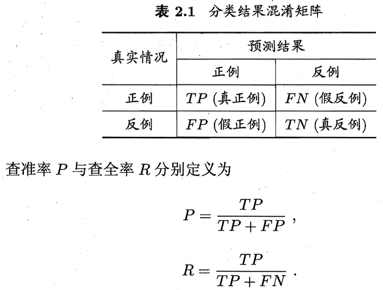
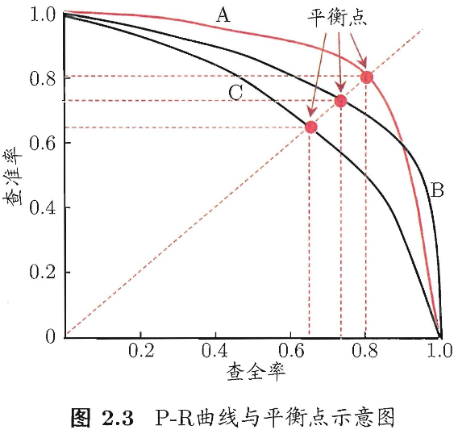
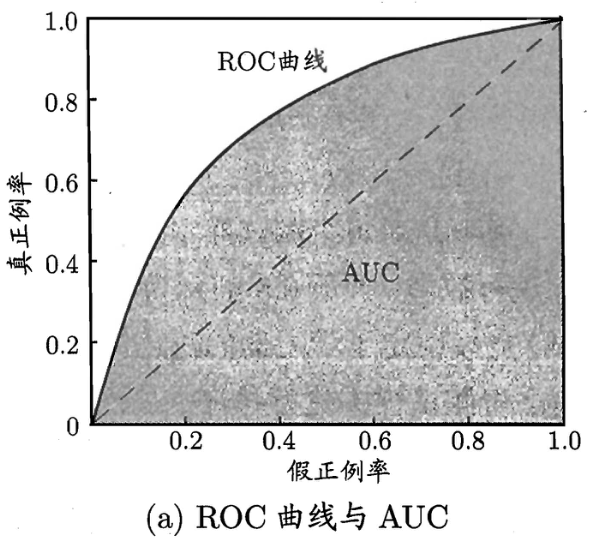

- **查准率 precision**：预测的所有正例里面，有多少是真的正例？侧重于查得**准不准**。$\displaystyle{P = \frac{TP}{TP + FP}}$
- **查全率 recall**：所有真的正例里面，有多少预测出来了？侧重于查得**全不全**。$\displaystyle{R = \frac{TP}{TP + FN}}$
- **$P-R$ 曲线**：以查准率 $P$ 为纵轴、查全率 $R$ 为横轴，根据学习器对样本“是正例”的置信度排序，依次将**每个样本的预测值**设为一个新的分类阈值，计算对应的 $P$ 和查全率 $R$，描点连线形成的曲线。用于直观展示分类器在不同阈值下查准率 $P$ 和查全率 $R$ 的权衡关系。
  - 若一条曲线完全“包住”另一条，则前者性能更优。若曲线交叉，可通过曲线下面积、平衡点、使用 $F1$ 度量来比较。
- **$F1$ 度量**：$\displaystyle{F1 = \frac{2 \times P \times R}{P+R}=\frac{2 \times TP}{样例总数+TP-TN}}$，本质为基于调和平均定义 $\displaystyle{\frac{1}{F1}=\frac{1}{2} \cdot \left(\frac{1}{P}+\frac{1}{R}\right)}$。
  - 若对查准率/查全率有不同偏好：$\displaystyle{\frac{1}{F_{\beta}}=\frac{1}{1+\beta^2} \cdot \left(\frac{1}{P}+\frac{\beta^2}{R}\right)}$，$\beta>1$ 时查全率有更大影响，$\beta<1$ 时查准率有更大影响。

  - **宏平均（关注类别，看整体）**：$\displaystyle{\text{macro-P} = \frac{1}{n}\sum_{i=1}^n P_i, \ \text{macro-R} = \frac{1}{n}\sum_{i=1}^n R_i, \ \text{macro-F1} = \frac{2 \times \text{macro-P} \times \text{macro-R}}{\text{macro-P} + \text{macro-R}}}$

    先在每个混淆矩阵上分别计算 $(P_1,R_1),(P_2,R_2),\dots ,(P_n,R_n)$，再求平均值。宏平均将**每个类别**视为一个平等的主体。无论某个类别有 1000 个样本还是只有 10 个样本，它**在最终的平均值中所占的比重都是 $\frac{1}{n}$。**每个类别被平等对待，不考虑类别样本数量的多少。
    
  - **微平均（关注样本，看个体）**：$\displaystyle{\text{micro-P} = \frac{\overline{TP}}{\overline{TP} + \overline{FP}}, \ \text{micro-R} = \frac{\overline{TP}}{\overline{TP} + \overline{FN}}, \ \text{micro-F1} = \frac{2 \times \text{micro-P} \times \text{micro-R}}{\text{micro-P} + \text{micro-R}}}$

    先将所有混淆矩阵对应元素求平均 $\overline{TP},\overline{FP},\overline{FN}$，再基于平均值计算 $P$ 和 $R$。微平均关注的是模型在所有**单个样本**上的表现。它实际上是计算了模型在整个数据集上的**总体准确率**。考虑样本数量的多少，样本多的类别影响更大。

#### 2.3.3 - ROC 与 AUC

- $P$、$R$ 等指标通常依赖于某个具体的分类阈值（比如概率大于 0.5 就判为正例），而 ROC 曲线和 AUC 指标可以全面反映模型在所有可能阈值下的性能。

- **真正例率 TPR**（查全率）：在所有**实际为正例**的样本中，有多少被模型**正确识别**出来。$\displaystyle{TPR = \frac{TP}{TP + FN}}$

- **假正例率 FPR**：在所有**实际为反例**的样本中，有多少被模型**错误地判为正例**。$\displaystyle{FPR = \frac{FP}{TN + FP}}$

- **ROC 曲线**：以真正例率 TPR 为纵轴、假正例率 FPR 为横轴形成的曲线。关注的是在**不同分类阈值**下，模型的**真正例率**和**假正例率**。
  
  - 绘图方法：根据学习器预测结果对样例进行排序，然后把分类阈值设为最大，即把所有样例均预测为反例，此时真正例率和假正例率均为 0，在坐标 $( 0,0 )$ 处标记一个点。然后，依次将**每个样本的预测值**设为一个新的分类阈值，并按此阈值将样本划分。
  - **包围关系：** 如果一个学习器的 ROC 曲线被另一个学习器的曲线**完全包住**，则可以断言后者的性能优于前者。
  
- **AUC**：ROC 曲线下的面积。本质上考虑的是**样本预测的排序质量**，与排序误差有紧密关系（如图）。

  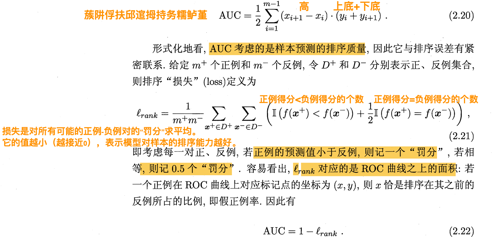

### 2.4 - 比较检验

比较学习器不能简单地“比大小”，因为测试错误率不等于泛化错误率。为了得到具有统计说服力的结论，必须引入**统计假设检验**。

- **假设检验**：在一次随机试验中，如果某个事件发生的概率极小，**小于我们设定的显著性水平** $\alpha$，那么我们就有理由认为该事件在本次试验中**不可能发生**。如果它真的发生了，我们就认为**原假设是错误的**。

  - **原假设 ($H_0$)：** 也称虚无假设，是我们希望推翻的假设，通常是**保守的、没有改变的**陈述。

  - **备择假设 ($H_1$)：** 也称对立假设，是我们希望接受的假设，通常是**有显著差异的**或**有改变的**陈述。

  1. **计算检验统计量：** 基于采集的样本数据，计算出检验统计量的实际值。

  1. **计算 $p$ 值：** $p$ 值是**在原假设 $H_0$ 成立**的前提下，观察到当前样本结果（或比当前结果更极端）的概率。

  3. **决策规则：**

     - **如果 $p \leq \alpha$：** $p$ 值很小，表明在 $H_0$ 成立的情况下，我们观察到的样本结果是一个**小概率事件**。根据小概率原理，我们**拒绝原假设 $H_0$**，接受备择假设 $H_1$。
       
  - **如果 $p > \alpha$：** $p$ 值较大，表明观察到的样本结果并不罕见。我们**没有足够的证据拒绝原假设 $H_0$**。
  
- **交叉验证 $t$ 检验**：

  - 基本思想：如果两个算法 $A$ 和 $B$ 性能相同，那么它们的错误率应该是一样的。
  - 做法：
    1. 我们先做 $k$ 折交叉验证，**产生 $k$ 对测试错误率**。
    2. 若两个算法性能相同，那么差值均值应为 $0$。
    3. 因此，**对这 $k$ 对错误率求差 $\Delta$，计算差值的均值 $\mu$ 和方差 $\sigma^2$，代入公式计算 $\tau$，与临界值比较。 **
    4. 如果 $\tau$ 小于临界值，说明假设不能被拒绝，两个算法性能相同。反之则不同。

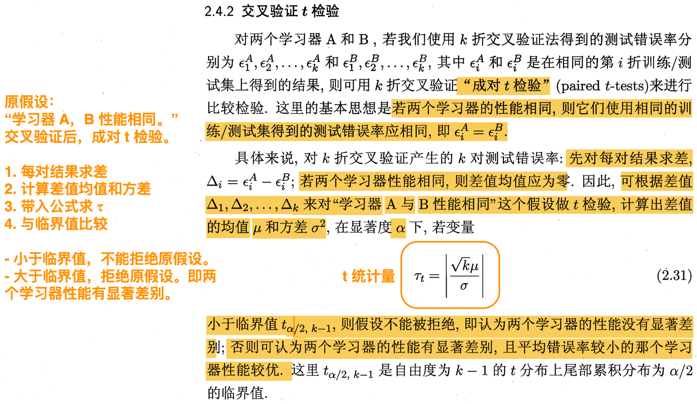

### 2.5 - 偏差与方差

- 偏差 bias：算法的输出与真实值之间的差距。体现了学习算法的能力。
- 方差 variance：算法本身存在的扰动。体现了数据的充分性。
- 噪声 noise：数据本身的随机性或不可预测部分，不可能完全消除。体现了学习任务本身的难度。

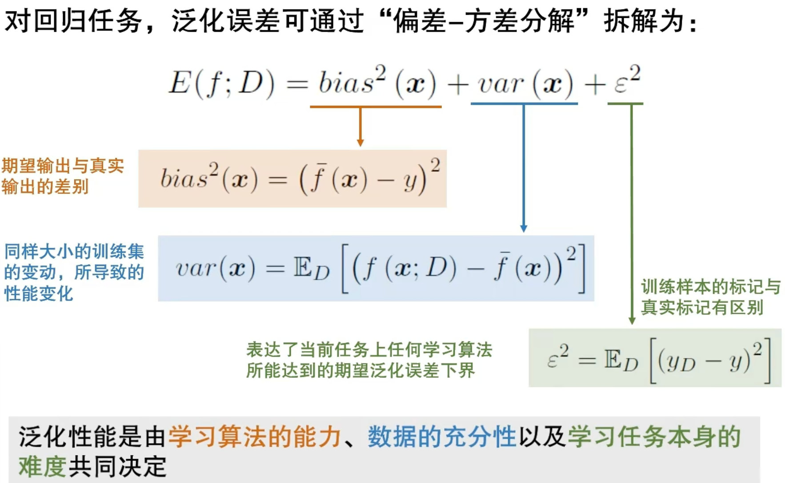

## 第 3 章 线性模型

- 均方误差最小化：试图找到一条直线，使所有样本到直线上的欧氏距离之和最小。$\displaystyle{\left(\boldsymbol{w}^{*}, b^{*}\right)=\underset{(\boldsymbol{w}, b)}{\arg \min } \sum_{i=1}^{m}\left(y_{i}-\left(\boldsymbol{w}^\mathrm{T}\boldsymbol{x}_{i}+b\right)\right)^{2}}.$​

- **多元线性回归（多个属性）推导过程**：目标：$\hat{\boldsymbol{w}}^*=\arg \min_\limits{\hat{\boldsymbol{w}}}(\boldsymbol{y} - \mathbf{X}\hat{\boldsymbol{w}})^{\text{T}}(\boldsymbol{y} - \mathbf{X}\hat{\boldsymbol{w}}).$
  先列出式子：$E_{\hat{\boldsymbol{w}}} = (\boldsymbol{y} - \mathbf{X}\hat{\boldsymbol{w}})^{\text{T}}(\boldsymbol{y} - \mathbf{X}\hat{\boldsymbol{w}}) = \boldsymbol{y}^{\text{T}}\boldsymbol{y} - \boldsymbol{y}^{\text{T}}\mathbf{X}\hat{\boldsymbol{w}} - (\mathbf{X}\hat{\boldsymbol{w}})^{\text{T}}\boldsymbol{y} + (\mathbf{X}\hat{\boldsymbol{w}})^{\text{T}}\mathbf{X}\hat{\boldsymbol{w}}.$

  对 $\hat{\boldsymbol{w}}$ 求偏导。这里需要用到两个矩阵求导常用公式：$\displaystyle{\frac{\partial (\boldsymbol{a}^{\text{T}}\boldsymbol{x})}{\partial \boldsymbol{x}} = \boldsymbol{a}, \quad\frac{\partial (\boldsymbol{x}^{\text{T}}\mathbf{A}\boldsymbol{x})}{\partial \boldsymbol{x}} = (\mathbf{A} + \mathbf{A}^{\text{T}})\boldsymbol{x}}.$

  求偏导得 $$\displaystyle{\frac{\partial E_{\hat{\boldsymbol{w}}}}{\partial \hat{\boldsymbol{w}}} = 2\mathbf{X}^{\text{T}}(\mathbf{X}\hat{\boldsymbol{w}} - \boldsymbol{y})}$$，设导数为零来寻找极值点，则有 $$\mathbf{X}^{\text{T}}\mathbf{X}\hat{\boldsymbol{w}} = \mathbf{X}^{\text{T}}\boldsymbol{y}.$$

  如果 $\mathbf{X}^{\text{T}}\mathbf{X}$ 是满秩矩阵（即它是可逆的），我们可以在等式两边**左乘**它的逆矩阵 $(\mathbf{X}^{\text{T}}\mathbf{X})^{-1}$，从而 $$\hat{\boldsymbol{w}}^* = (\mathbf{X}^{\text{T}}\mathbf{X})^{-1}\mathbf{X}^{\text{T}}\boldsymbol{y}.$$

- 对数线性回归 $\to$ 广义线性回归
  
- **用线性模型做分类：**

  - **对数几率回归**：和线性回归类似，先对输入特征做**线性组合**。$z = w_0 + w_1x_1 + w_2x_2 + \cdots$。但不同的是，线性回归直接输出 $z$，而对数几率回归会把 $z$ **通过对数几率函数 $\displaystyle{y=\frac{1}{1+e^{-z}}}$，把输出“压缩”到 0 到 1 之间**，表示属于某一类别的概率。

  - **线性判别分析** LDA（“直接”做分类）：

    - 给定训练样例集，设法将样例投影到一条直线上，使得同类样例的投影点尽可能接近、异类样例的投影点尽可能远离。

    - 在对新样本进行分类时，将其投影到同样的这条直线上，再根据投影点的位置来确定新样本的类别。
      - 目标：最大化 $\mathbf{S}_b$ 与 $\mathbf{S}_w$ 的广义瑞利商 $\displaystyle{J = \frac{\| \boldsymbol{w}^{\mathrm{T}} \boldsymbol{\mu}_0 - \boldsymbol{w}^{\mathrm{T}} \boldsymbol{\mu}_1 \|_2^2}{\boldsymbol{w}^{\mathrm{T}} \boldsymbol{\Sigma}_0 \boldsymbol{w} + \boldsymbol{w}^{\mathrm{T}} \boldsymbol{\Sigma}_1 \boldsymbol{w}}
        = \frac{\boldsymbol{w}^{\mathrm{T}} (\boldsymbol{\mu}_0 - \boldsymbol{\mu}_1) (\boldsymbol{\mu}_0 - \boldsymbol{\mu}_1)^{\mathrm{T}} \boldsymbol{w}}{\boldsymbol{w}^{\mathrm{T}} (\boldsymbol{\Sigma}_0 + \boldsymbol{\Sigma}_1) \boldsymbol{w}} = \frac{\boldsymbol{w}^{\mathrm{T}} \mathbf{S}_b \boldsymbol{w}}{\boldsymbol{w}^{\mathrm{T}} \mathbf{S}_w \boldsymbol{w}}}$，其中分子表示类间距离，分母表示类内抖动。
    

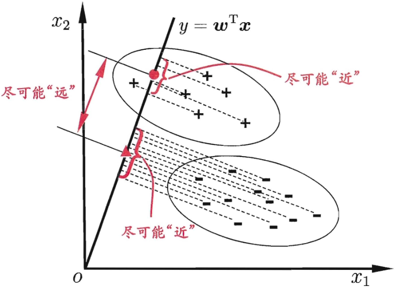
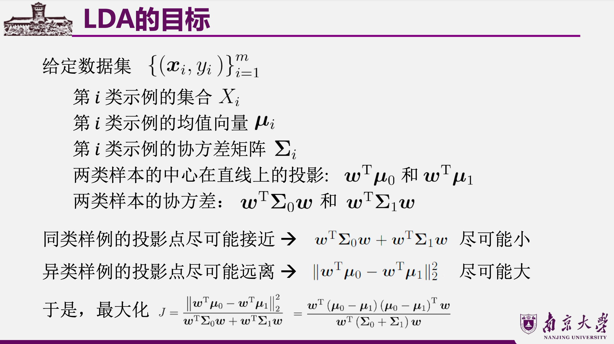

- **多分类学习——拆解法**：先将问题拆成多个二分类任务，然后为拆出的每个二分类任务训练一个分类器。在测试时，对这些分类器的预测结果进行集成，以获得最终的多分类结果。
  - 一对一 OvO：将 $N$ 个类别两两配对，一个作为正例，一个作为负例，产生 $N(N−1)/2$​ 个二分类任务。新样本提交给**所有**分类器，会得到 $N(N−1)/2$ 个分类结果。最终结果通过投票产生，被预测次数最多的类别被选为最终分类结果。
  - 一对其余 OvR：每次将一个类的样例作为正例，所有其他类的样例作为反例，对于 $N$ 个类别，总共训练 $N$ 个分类器。
  
- **类别不平衡问题——再缩放**：如果正例只有 2 个，反例有 998 个，学习器只需永远预测为反例，就能达到 99.8% 的精度。

  - 解决方法：**再缩放**。令 $m^+$ 表示正例数目，$m^-$ 表示反例数目。只要分类器的预测几率高于**观测几率** $\displaystyle{\frac{m^+}{m^-}}$，就应判定为正例。
  - 通过调整预测值 $y$ 为 $y'$，使得模型在基于阈值 $0.5$ 决策时，实际上是在执行上述修正后的规则：$$\displaystyle{\frac{y'}{1-y'} = \frac{y}{1-y} \times \frac{m^-}{m^+}}$$

## 第 4 章 决策树

- **决策树**：基于“树”结构进行决策。每个“内部结点”对应于某个属性上的“测试”，每个分支对应于该测试的一种可能结果（即该属性的某个取值），每个“叶结点”对应于一个“预测结果”。**关键：如何选择最优划分属性——经过一次划分后，得到的东西比原来更“纯净”。**

  - 学习过程：通过对训练样本的分析来确定“划分属性”。

  - 预测过程：将测试示例从根结点开始沿着划分属性所构成的“判定测试序列”下行，直到叶结点。 

- **信息熵** Entropy：$p\log_2p$。度量样本集合**纯度**，**熵越小纯度越高**。即：**还要多少信息，才能把样本划分干净。**
  假定当前样本集合 $D$ 中第 $k$ 类（eg：正例、负例）样本所占的比例为 $p_k$，则 $\displaystyle{\textrm{Ent}(D) = - \sum_{k=1}^{\left|\mathcal{Y}\right|}p_k \log_2 p_k}$

- **信息增益（ID3）**：衡量用某个属性 $a$ 划分样本 $D$ **获得的纯度提升**。由于不同分支的样本数不同，所以要给分支赋予权重。$\displaystyle{\mathrm{Gain}(D,a) = \mathrm{Ent}(D) - \sum_{v=1}^{V}\frac{|D^v|}{|D|}\mathrm{Ent}(D^v) }$
  信息增益准则**对可取值数目较多的属性有所偏好（极端情况：用编号来划分）**！为减少这种偏好可能带来的不利影响，可使用**增益率**来选择最优划分属性。

- **增益率（C4.5）**：$\displaystyle{\mathrm{GainRatio}(D,a) = \frac{\mathrm{Gain}(D,a)}{\mathrm{IV}(a)}, \mathrm{IV}(a) = -\sum_{v=1}^{V}\frac{|D^v|}{|D|}\log_2\frac{|D^v|}{|D|}}$
  其中 $\mathrm{IV}(a)$ 可看作 $p\log_2p$ 的形式，把样本划分当作概率 $p$，代表：什么属性都不考虑，仅由分支数目造成的熵减。

- **基尼指数（基尼值加权得到）（CART）**：
  $\displaystyle{\mathrm{Gini}(D) =\sum_{k=1}^{\mathcal{|Y|}}\sum_{k' \neq k}p_kp_{k'}= 1 - \sum_{k=1}^{|\mathcal{Y}|}p_k^2}$ 反映了从 $D$ 中**随机抽取两个样例，其类别标记不一致的概率**；
  $\displaystyle{\mathrm{Gini\_index}(D,a) = \sum_{v=1}^{V}\frac{|D^v|}{|D|}\mathrm{Gini}(D^v)}$ 在候选属性集合中，选取那个使**划分后基尼指数最小**的属性。
  
- **剪枝** prunning：决策树对付过拟合的主要手段。包含**预剪枝**（提前终止某些分支的生长）、**后剪枝**（生成完全树，再回头去剪枝）。

  - 方法：对比划分前后数据在验证集上的**精度是否提升**。若有提升则保留，否则剪枝。

  

      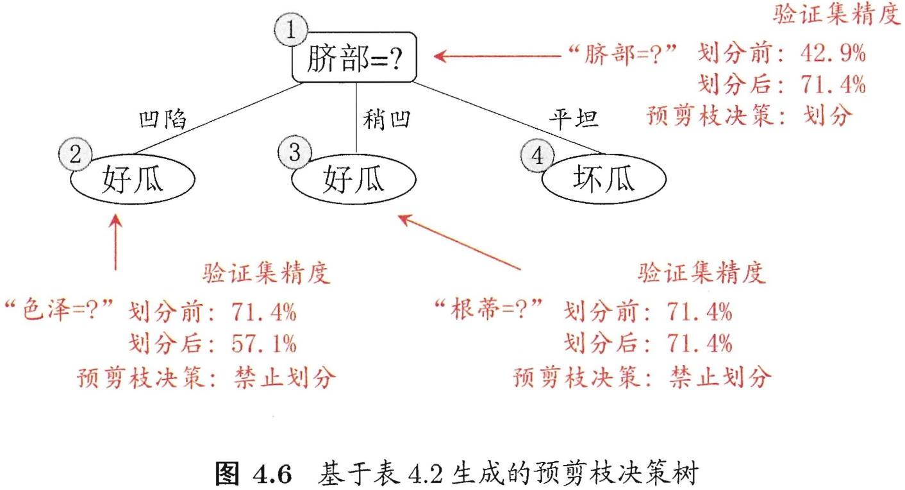
      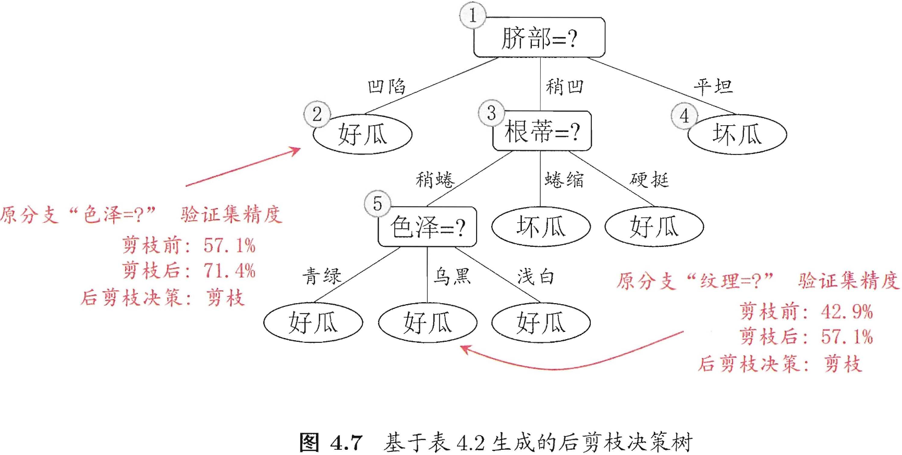
  

- **连续值的处理：离散化**，常见做法为**二分法**。假定 $a$ 在 $D$ 上出现了 $n$ 个属性值，可用 $n-1$ 个**中位点**作为候选划分，然后就可将它们当做 $n-1$ 个离散属性值处理 $\displaystyle{T_a=\left\{\frac{a_i+a_{i+1}}{2} \mid 1 \leq i \leq n-1\right\}}$。

- **缺失值的处理：样本赋权，权重划分。**$\displaystyle{\mathrm{Gain}(\tilde{D},a) = \mathrm{Ent}(\tilde{D}) - \sum_{v=1}^{V}\tilde{r}_v\mathrm{Ent}(D^v) }$，$\displaystyle{\mathrm{Gain}(D,a) = \rho \times \mathrm{Gain}(\tilde{D},a)}$

  1. 在属性值缺失的情况下，如何选择划分属性（如何算信息增益）？

     **仅通过无缺失值的样例，计算出信息增益**，来判断划分属性的优劣。最后，**给这个信息增益赋权，乘以无缺失值的占比**。

  2. 给定划分属性，若样本在该属性上的值缺失，如何对样本进行划分？

     **缺失值样本同时进入所有分支，但是要按照各分支的大小赋权。**相当于表达了缺失值样本进入每个分支的概率。

  

      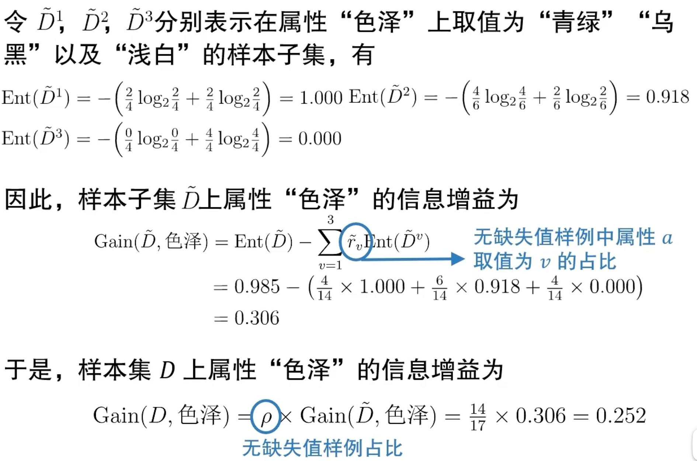
      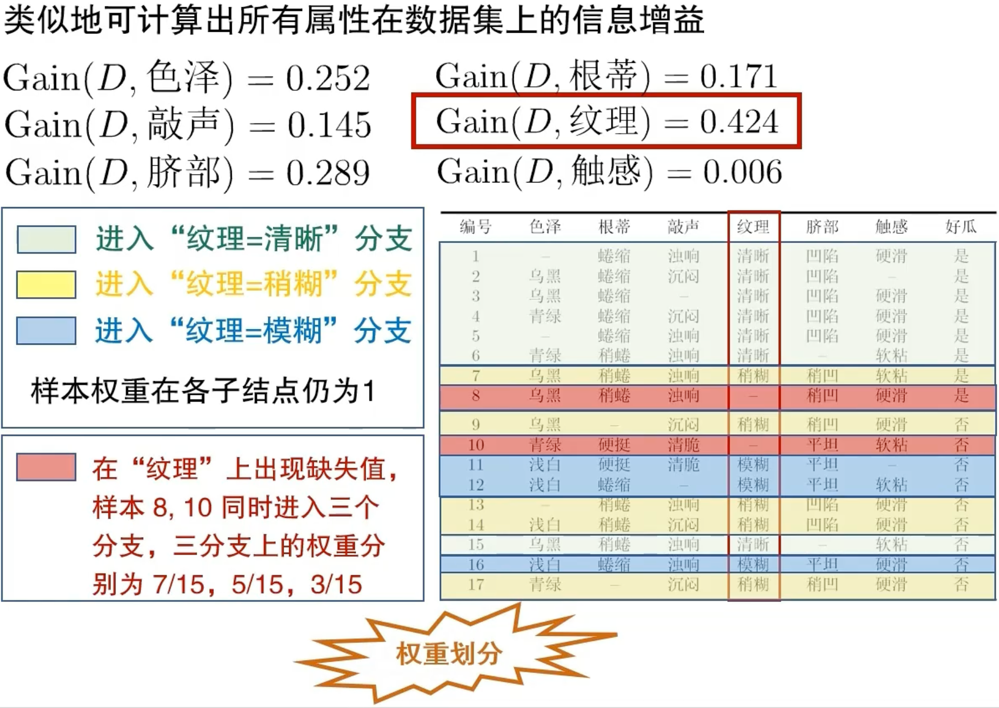
  

- （不考）多变量决策树：分类边界不再是**轴平行**的，学习过程不是为每个非叶结点寻找一个最优划分属性，而是试图建立一个合适的**线性分类器**。

## 第 5 章 神经网络

- **神经网络**：由具有适应性的简单单元组成的广泛并行互连的网络。

- M-P 神经元模型、多层前馈神经网络：每层神经元与下层神经元全互连，神经元之间不存在同层连接，也不存在跨层连接。

- **学习过程**：根据训练数据来**调整神经元之间的“连接权”以及每个功能神经元的阈值。**

- **误差逆传播算法 BP**：标准 BP 算法、累积 BP 算法。正向传播-输出结果-计算误差-反向传播-更新参数。

  - 标准：每次更新只针对**单个样例**。每读入一个训练样本，算法就会计算一次误差并更新一次模型参数。

    - 优点：参数更新非常频繁。在处理非常大的训练集时，往往能更快地获得较好的解。
    - 缺点：由于针对不同样例进行更新，效果可能会出现“抵消”现象。为了达到同样的累积误差极小点，通常需要进行更多次数的迭代（轮次）。

  - 累积：直接针对**累积误差最小化**。它在读取完整个训练集一遍（即完成一个 epoch）之后，才对参数进行一次统一更新。

    - 优点：参数更新的频率低得多。它直接最小化训练集上的总误差，过程更加稳定。
  - 缺点：在很多任务中，当累积误差下降到一定程度后，进一步下降的速度会变得非常缓慢。

- **缓解 BP 过拟合**：

  - 早停：若训练误差连续 *a* 轮的变化小于 *b*, 则停止训练；使用验证集：若训练误差降低、验证误差升高, 则停止训练

  - 正则化：在误差目标函数中增加一项描述网络复杂度

- **全局最小与局部极小**：跳出局部极小，追求全局最小。几种策略如下：

  - **随机初始化**：在开始训练前，不使用固定值，而是随机赋予连接权重不同的初值。
  - **模拟退火**：在每一轮搜索中，算法以一定的概率接受比当前解更差的结果。
  - 随机梯度下降：与标准梯度下降（使用全部数据计算梯度）不同，随机梯度下降在每次更新时仅使用一个或一小部分随机选取的样本。

  

  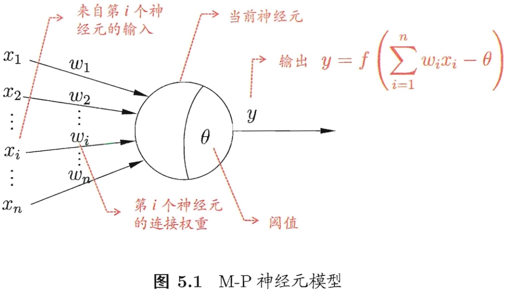
  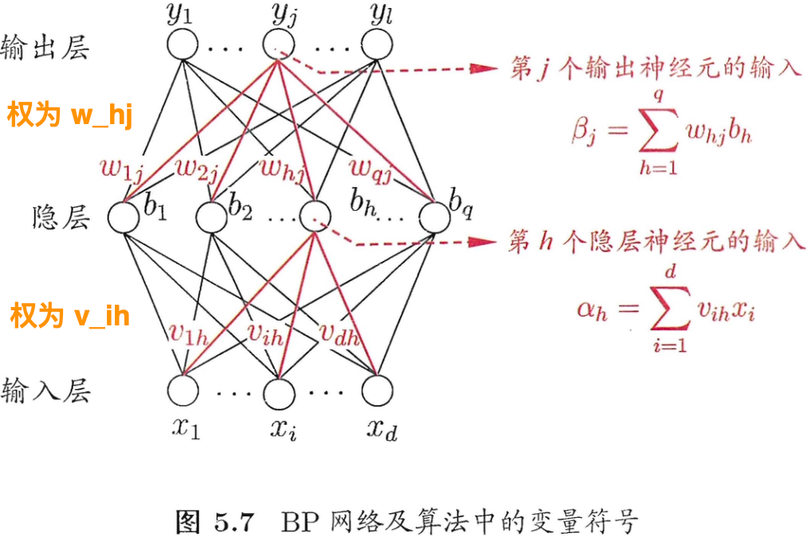
  

  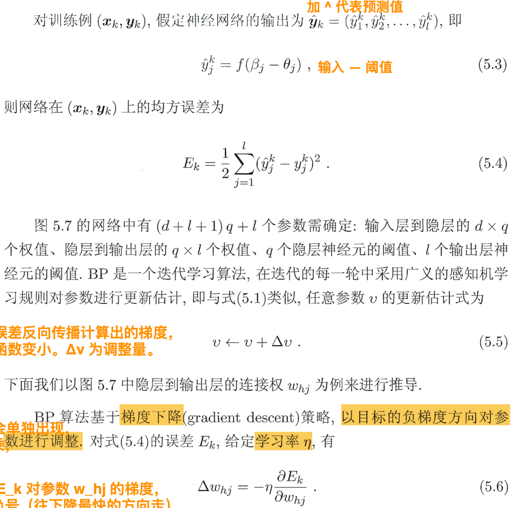
  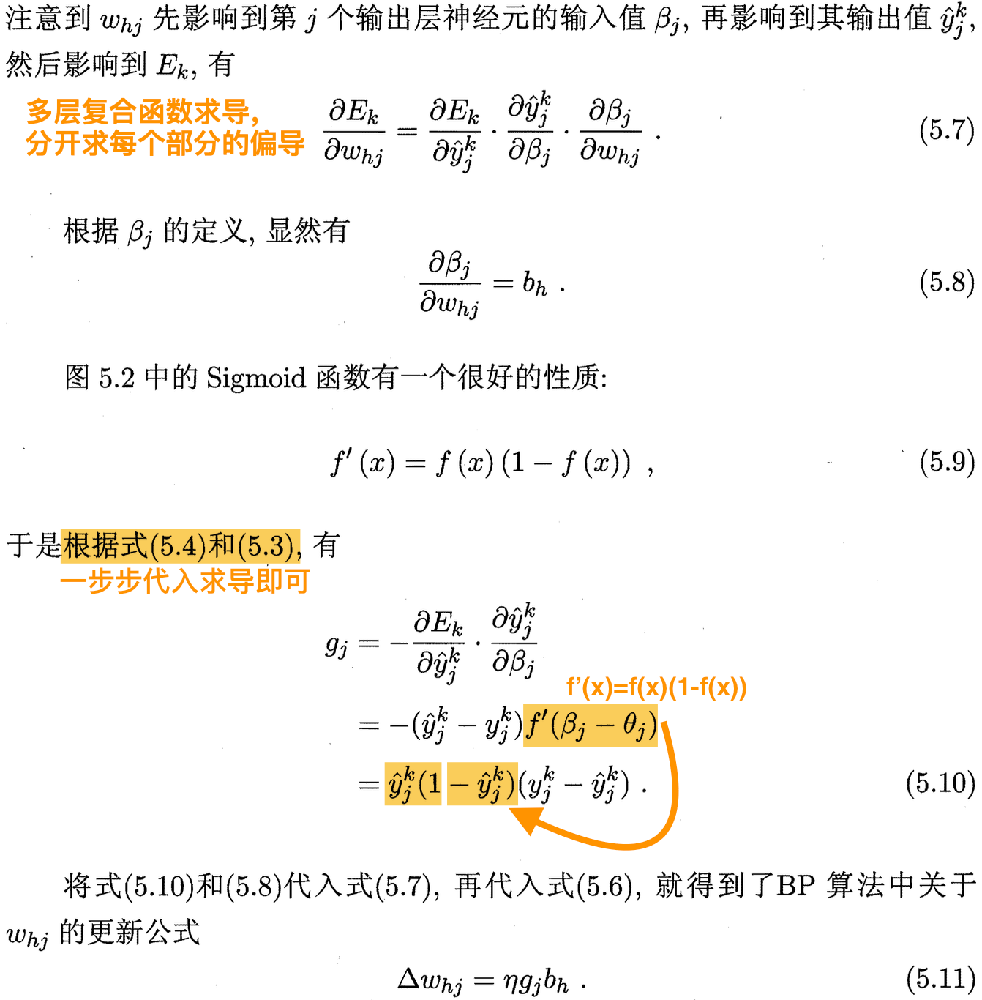

- 深度学习（Deep Learning）：是以**多层神经网络**为代表的复杂模型，其核心特征是通过增加隐层的数目来提高模型的“容量”，从而处理更复杂的学习任务。可采用无监督逐层训练（“预训练+微调”）。

## 【Hard】第 6 章 支持向量机 SVM

- **支持向量** Support Vectors：指那些距离超平面最近的训练样本点。它们直接决定了分类边界的位置和方向，确定了最优超平面。
- **间隔** margin：两个异类支持向量到超平面的距离之和，表示为 $\displaystyle{\gamma=\frac{2}{||\boldsymbol{w}||}}$。
- **SVM 的基本型**：$\displaystyle{\min\limits_{\boldsymbol{w},b} \frac{1}{2}||\boldsymbol{w}||^2 } \quad \text{s.t.} \ y_i(\boldsymbol{w}^\text{T}\boldsymbol{x}_i+b) \geq1$。
  - **找到具有“最大间隔”的划分超平面**（下图）。此处约束条件的含义为：在确保**分类正确**的前提下，让间隔尽可能大。
  - 使用拉格朗日乘子法，可写为 $\displaystyle{L(\boldsymbol{w},b,\boldsymbol{\alpha})=\frac{1}{2}||\boldsymbol{w}||^2+\sum^m_{i=1}\alpha_i(1-y_i(\boldsymbol{w}^\text{T}\boldsymbol{x}_i+b))}.$
  - 最终的对偶问题为 $\displaystyle{\max_{\boldsymbol{\alpha}} \sum_{i=1}^{m} \alpha_i - \frac{1}{2} \sum_{i=1}^{m} \sum_{j=1}^{m} \alpha_i \alpha_j y_i y_j \boldsymbol{x}_i^{\mathrm{T}} \boldsymbol{x}_j \quad \text{s.t.} \sum_{i=1}^{m} \alpha_i y_i = 0, 
         \alpha_i \geqslant 0.}$

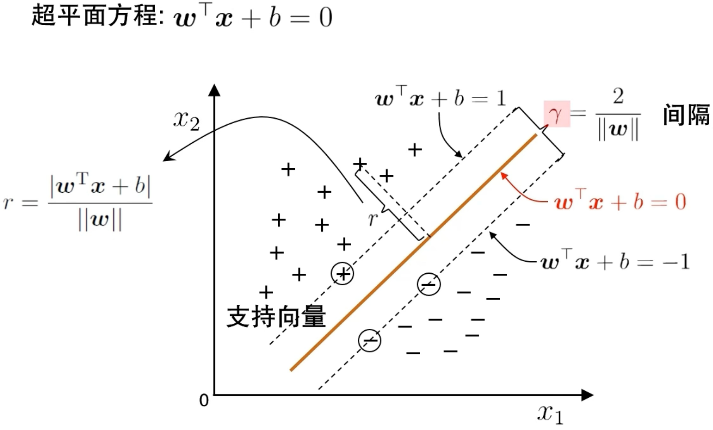

    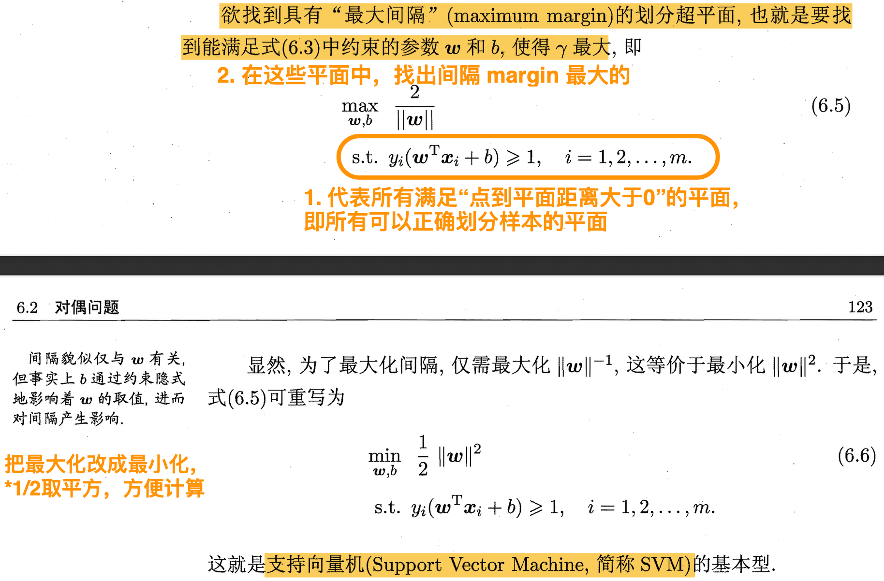
    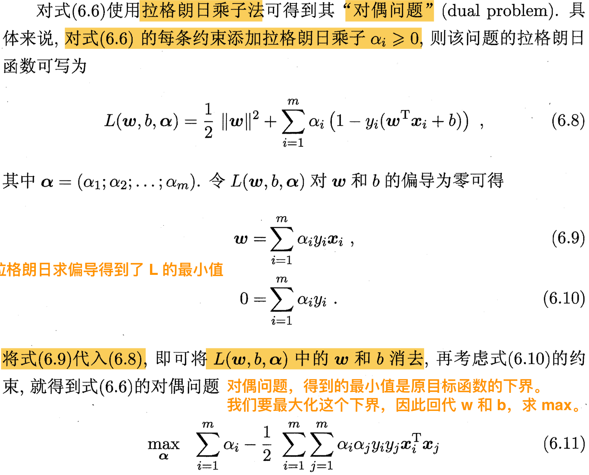

- 解的稀疏性：训练完成后，大部分的训练样本都不需保留，**最终模型仅取决于支持向量。支持向量机由此得名。**
- **特征空间映射**：在现实任务中，原始样本空间内也许**并不存在**一个能正确划分两类样本的超平面。因此，我们将样本从原始空间**映射**到一个更高维的特征空间，使得样本在这个特征空间内线性可分。$\displaystyle{\min\limits_{\boldsymbol{w},b} \frac{1}{2}||\boldsymbol{w}||^2 } \quad \text{s.t.} \ y_i(\boldsymbol{w}^\text{T}\phi(\boldsymbol{x}_i)+b) \geq1$
- **核函数** kernel function：显式考虑特征映射以及计算高维内积是很困难的。因此，我们设计核函数，**将求高维向量内积转化为在低维空间中对核函数求值。**$\kappa(\boldsymbol{x}_i,\boldsymbol{x}_j)=\phi(\boldsymbol{x}_i)^{\text{T}}\phi(\boldsymbol{x}_j)$

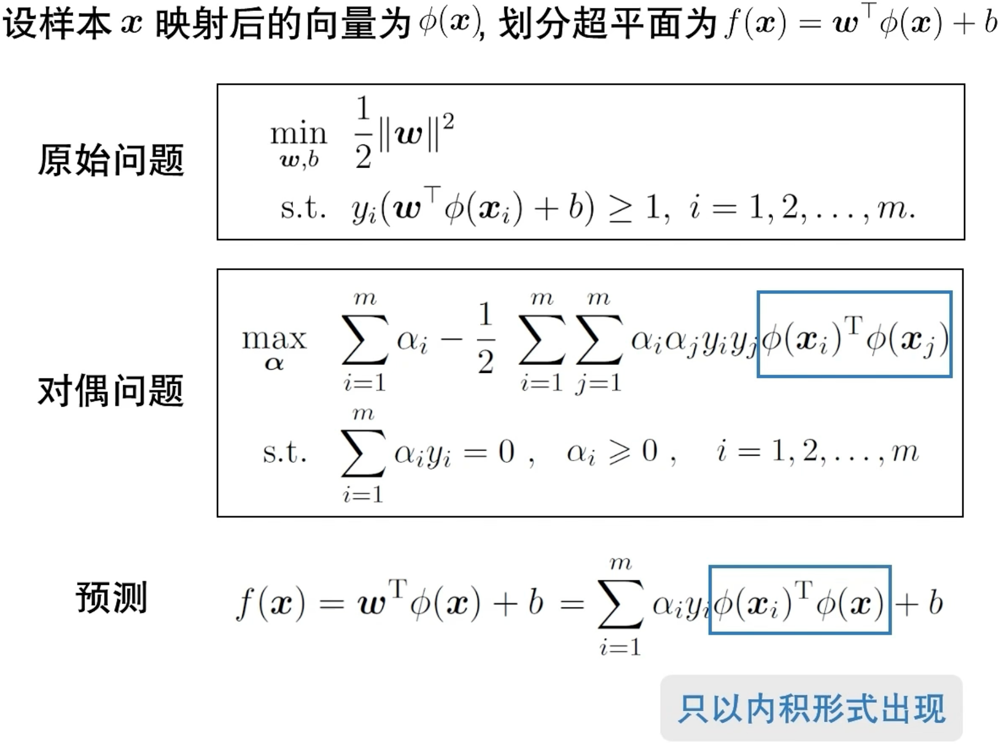
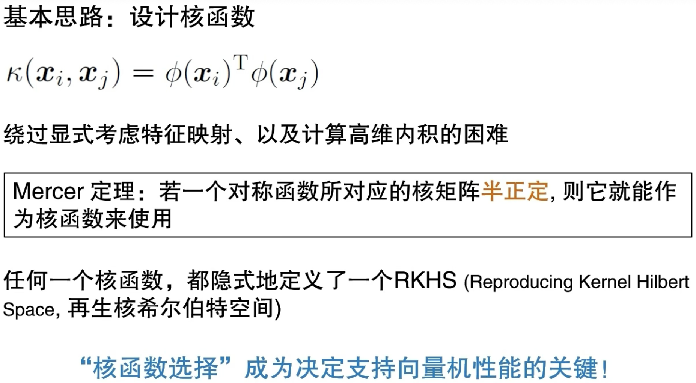

- （关于核函数的更多信息，来自 Gemini 3）

  问题：凭什么高维空间的内积可以用核函数来算？核函数不也是通过一一相乘的办法来计算内积？和直接算有啥区别？

  **核函数并不是先算出高维坐标再相乘，而是通过一个巧妙的代数公式直接“抄近路”得到了结果。**

  ### 1. 核心区别：计算路径不同

  我们通过一个经典的例子：**多项式核**来对比两种算法的差异。

  假设原始数据只有 2 维：$\mathbf{x} = (x_1, x_2)$，我们要映射到 3 维空间。

  映射函数定义为：$\phi(\mathbf{x}) = (x_1^2, \sqrt{2}x_1x_2, x_2^2)$。

  #### **方法 A：直接在高维算（笨办法）**

  1. **映射**：先把 $\mathbf{x}_i$ 变成 $(x_{i1}^2, \sqrt{2}x_{i1}x_{i2}, x_{i2}^2)$。
  2. **映射**：再把 $\mathbf{x}_j$ 变成 $(x_{j1}^2, \sqrt{2}x_{j1}x_{j2}, x_{j2}^2)$。
  3. **乘加**：计算它们的内积：$x_{i1}^2x_{j1}^2 + 2x_{i1}x_{i2}x_{j1}x_{j2} + x_{i2}^2x_{j2}^2$。

  #### **方法 B：用核函数算（核技巧）**

  我们设计核函数 $\kappa(\mathbf{x}_i, \mathbf{x}_j) = (\mathbf{x}_i^{\mathrm{T}}\mathbf{x}_j)^2$。

  1. **低维内积**：先算原始维度的内积：$(x_{i1}x_{j1} + x_{i2}x_{j2})$。
  2. **简单平方**：把这个数直接平方。

  **奇迹发生了**：你会发现 $(x_{i1}x_{j1} + x_{i2}x_{j2})^2$ 展开后，**结果完全等同于**方法 A 算出来的那个复杂式子！

  ### 2. 为什么它比直接算快得多？

  当维度极高时，两者的差别是天壤之别：

  - **复杂度爆炸**：如果原始数据是 100 维，映射到 2 阶多项式空间后约有 5000 维。如果映射到 10 阶，维度将达到 $10^{14}$ 级。直接计算内积需要做 $10^{14}$ 次乘法，计算机直接宕机。
  - **核函数的稳定**：无论映射后的空间是多少亿维，核函数 $\kappa(\mathbf{x}_i, \mathbf{x}_j) = (\mathbf{x}_i^{\mathrm{T}}\mathbf{x}_j + 1)^{10}$ 永远只需要在 100 维空间做一次内积，再加 1，最后开 10 次方。**计算量几乎不随映射维度的增加而增加。**

  ### 3. 凭什么这个等式能成立？（数学依据）

  你可能会问：凭什么随手写个函数，就能代表高维内积？

  这就是你之前提到的 **Mercer 定理** 在起作用：

  - 定理告诉我们：只要你的函数 $\kappa$ 满足“对称”和“半正定”这两个数学特性，那么在数学上**一定存在**一个映射 $\phi$，使得 $\kappa(\mathbf{x}_i, \mathbf{x}_j) = \phi(\mathbf{x}_i)^{\mathrm{T}}\phi(\mathbf{x}_j)$。
  - 这意味着，我们**不需要真的去找出那个 $\phi$**，也不需要管 $\phi$ 把数据变成了多少维，只要 $\kappa$ 合法，我们就默认“内积已经算好了”。

  ### 4. 终极案例：高斯核（RBF）

  最常用的**高斯核** $\kappa(\mathbf{x}, \mathbf{z}) = \exp(-\frac{\|\mathbf{x}-\mathbf{z}\|^2}{2\sigma^2})$ 更加神奇。

  - 通过泰勒级数展开可以证明，高斯核对应的特征空间是**无穷维**的。
  - **结论**：如果你想“直接算内积”，你需要处理两个无穷维的向量相乘，这在物理上是不可能的。但用核函数，你只需要算一个指数函数，就瞬间得到了无穷维空间的内积结果。

  **总结**：核函数不是“一一相乘”计算高维内积的，它是通过**低维空间的代数运算（如平方、指数等）**，巧妙地模拟了高维空间内积的结果。

- **软间隔** soft margin（下图）：在现实任务中，往往很难确定合适的核函数，使得训练样本在特征空间中线性可分。因此，引入软间隔的概念，**允许支持向量机在一些样本上出错**，避免过拟合。
  
  - $\displaystyle{\min\limits_{\boldsymbol{w},b}\frac{1}{2}||\boldsymbol{w}||^2+C\sum^m_{i=1}\ell_{0/1}(y_i(\boldsymbol{w}^\text{T}\boldsymbol{x}_i+b)-1), \quad \ell_{0/1}(z) = \begin{cases}
        1, & \text{if } z < 0; \\
        0, & \text{otherwise.}
    \end{cases}}$
  - 注意此处的 $\ell_{0/1}(z)$ 是一个**函数**，而不是数值！$C$ 是一个常数，代表对不满足约束的“容忍度”。审美
  
- **软间隔支持向量机**：$\displaystyle{\min\limits_{\boldsymbol{w},b,\xi_i} \frac{1}{2}||\boldsymbol{w}||^2+C\sum_{i=1}^m \xi_i } \quad \text{s.t.} \ y_i(\boldsymbol{w}^\text{T}\boldsymbol{x}_i+b) \geq1-\xi_i, \quad \xi_i\geq 0$
  - 约束条件含义：要求点到超平面距离最小为 1，但可以容忍大小为 $ξ$ 的违背（“松弛变量”），因此，距离不得小于 $1-ξ$。
  - 最终的对偶问题为 $\displaystyle{\max_{\boldsymbol{\alpha}} \sum_{i=1}^{m} \alpha_i - \frac{1}{2} \sum_{i=1}^{m} \sum_{j=1}^{m} \alpha_i \alpha_j y_i y_j \boldsymbol{x}_i^{\mathrm{T}} \boldsymbol{x}_j \quad \text{s.t.} \sum_{i=1}^{m} \alpha_i y_i = 0, 
        0 \leq \alpha_i \leq C.}$
  - **对比 SVM 的基本型**：$$\displaystyle{\min\limits_{\boldsymbol{w},b} \frac{1}{2}||\boldsymbol{w}||^2 } \quad \text{s.t.} \ y_i(\boldsymbol{w}^\text{T}\boldsymbol{x}_i+b) \geq1$$
  
- **正则化** regularization：在模型的损失函数中添加一个额外的**惩罚项**，以限制模型复杂度，缓解过拟合。$\displaystyle{\min\limits_f \Omega(f)+C\sum^m_{i=1}\ell(f(\boldsymbol{x}_i),y_i)}$

    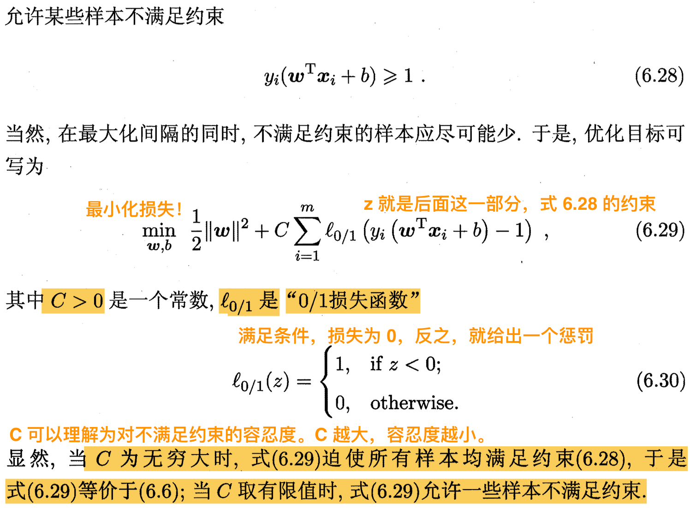
    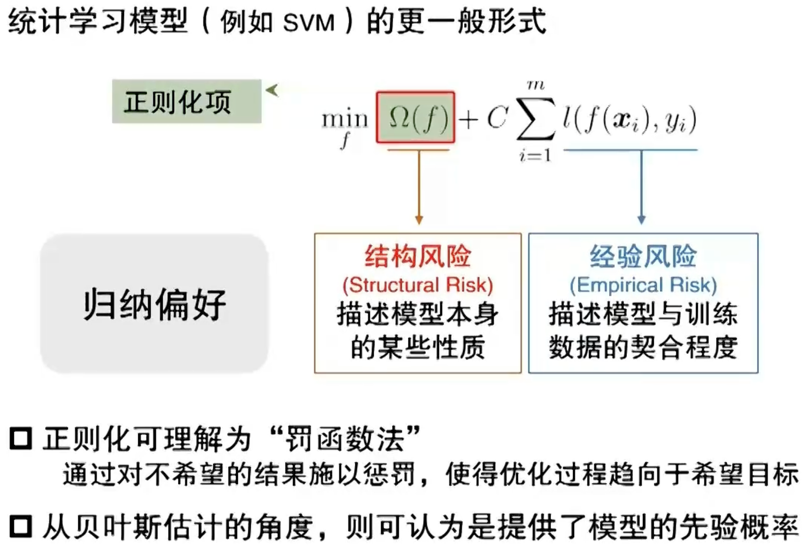

- **支持向量回归** SVR：与传统回归模型力求让模型输出 $f(\boldsymbol{x})$ 与真实输出 $y$ 完全相同不同，SVR 引入了“容忍度”的概念，核心假设是：我们能容忍 $f(\boldsymbol{x})$ 与 $y$ 之间最多有 $\epsilon$ 的偏差。
  - 如图，落入 $2\epsilon$ 间隔带内的训练样本，都不计损失。
  - $$\displaystyle{\min_{\boldsymbol{w}, b} \frac{1}{2}\|\boldsymbol{w}\|^2 + C \sum_{i=1}^{m} \ell_{\epsilon}(f(\boldsymbol{x}_i) - y_i), \quad \ell_{\epsilon}(z) = \begin{cases}
        0, & \text{if } |z| < \epsilon; \\
        |z|-\epsilon, & \text{otherwise.}
    \end{cases}}$$
  - **稀疏性（Sparsity）**：这是 SVR 最显著的特点。最终模型的参数仅由落在隔离带**边界上及边界外**的样本决定，这些样本被称为“支持向量”。落在隔离带内部的大量样本对最终模型没有影响，这极大减少了计算和存储负担。
  - **非线性拟合**：通过引入**核函数（Kernel Trick）**，SVR 可以轻松处理复杂的非线性回归问题，将数据映射到高维空间进行线性回归。
  - **泛化性能强**：得益于最大化间隔（间隔带）的思想，SVR 在小样本集上通常比普通线性回归表现得更稳健。

    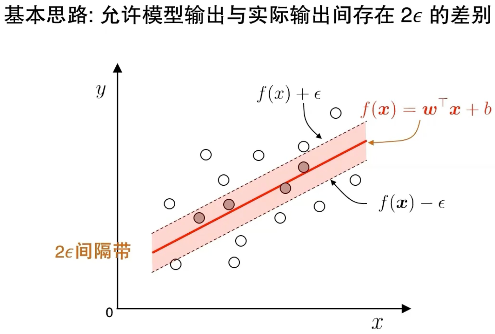
    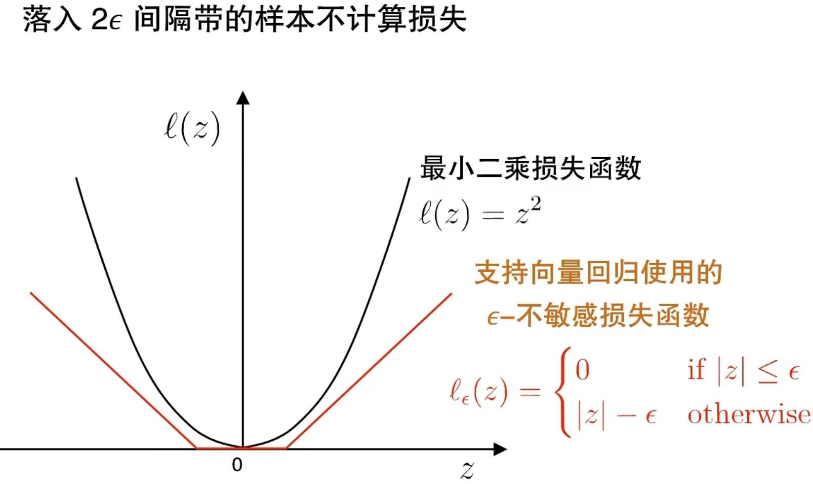

- **核方法与表示定理**：

  - 对于一般的损失函数和正则化项，优化问题的**最优解都可表示为核函数的线性组合**。
  
  - **通过引入核函数，将原本只能处理线性问题的模型（如 SVM）拓展开来，使其具备了处理非线性复杂任务的能力。**
  
    | **原始线性模型**       | **拓展后的非线性模型**                 | **增强的能力**                                               |
    | ---------------------- | -------------------------------------- | ------------------------------------------------------------ |
    | **支持向量机 (SVM)**   | **核支持向量机 (Kernel SVM)**          | 最典型的应用。可以处理如“环形分布”或“异或”等线性不可分的数据。 |
    | **主成分分析 (PCA)**   | **核主成分分析 (KPCA)**                | 传统 PCA 只能找直线的投影方向；KPCA 能在弯曲的流形（曲线面）上提取特征，捕捉非线性结构。 |
    | **线性判别分析 (LDA)** | **核线性判别分析 (KLDA)**              | 允许在映射后的高维空间寻找能让类间距离最大、类内抖动最小的投影方向。 |
    | **线性回归 / 岭回归**  | **核岭回归 (Kernel Ridge Regression)** | 不再是用直线拟合，而是可以用复杂的波浪线（非线性函数）拟合数据点。 |

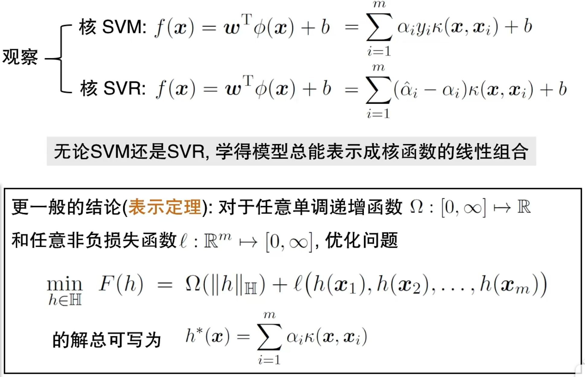

## 第 7 章 贝叶斯分类器【x 为样本，c 为类别】

### 7.1 - 贝叶斯决策论

- **先验概率 $P(c)$** ：在观测到具体样本特征之前，根据以往经验对该类别发生概率的预估。
- **后验概率 $P(c\mid x)$** ：在观测到具体样本特征 $x$（如色泽、敲声）之后，该样本属于类别 $c$ 的概率。
- 目标：在所有相关概率都已知的理想情形下，贝叶斯决策论考虑如何基于这些概率和误判损失来**选择最优的类别标记**。
- $P(c∣x)$ 在现实中通常难以直接获得，从这个角度来看，机器学习所要实现的是**基于有限的训练样本尽可能准确地估计出后验概率**。
  - **判别式模型**：直道而行。直接对条件概率 $P(c∣x)$ 进行建模来预测 $c$，如**决策树**、**BP 神经网络**、**支持向量机 (SVM)**。
  - **生成式模型**：绕道而行。先对联合概率分布 $P(x,c)$ 进行建模，然后再由此+贝叶斯定理获得后验概率 $P(c∣x)$，如贝叶斯分类器。

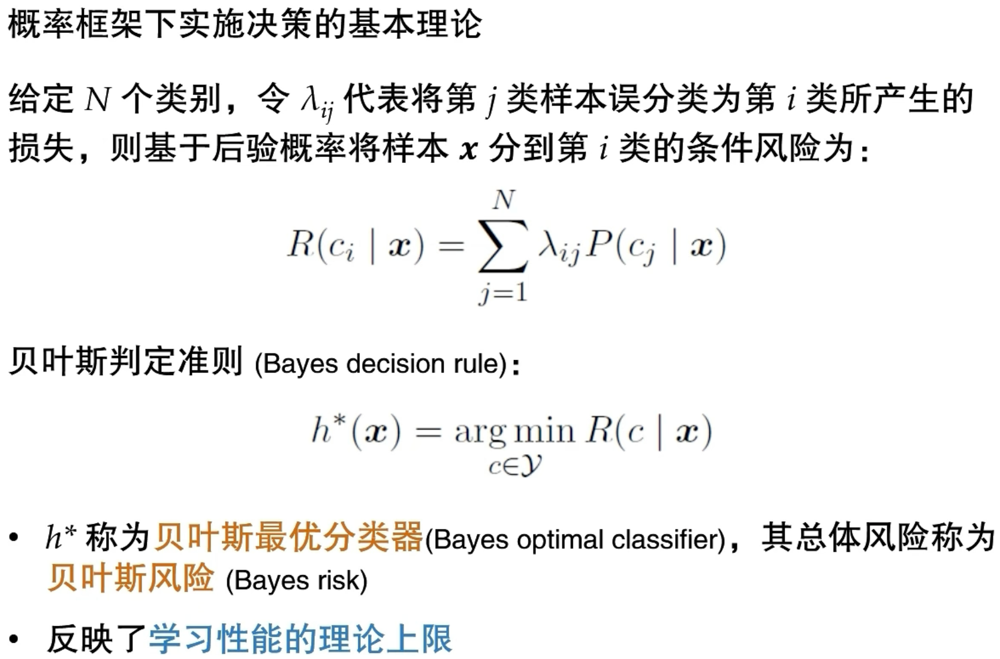

### 7.2 - 极大似然估计（结合[抛硬币的例子](https://www.matongxue.com/madocs/447)）

- **似然 likelihood $P(x\mid c)$：** **“从结果推参数”**。在给定一组观测到的结果后，反推可能得到当前结果的模型参数。
- **极大似然估计** MLE：试图在**参数 $\theta_c$ 的所有可能的取值中**，找到一个能使数据出现的可能性最大的值。
  - 左侧：给定参数下，观测到整个数据集的概率；右侧：该数据集中，给定参数下，观察到单个样本的概率（并连乘）。

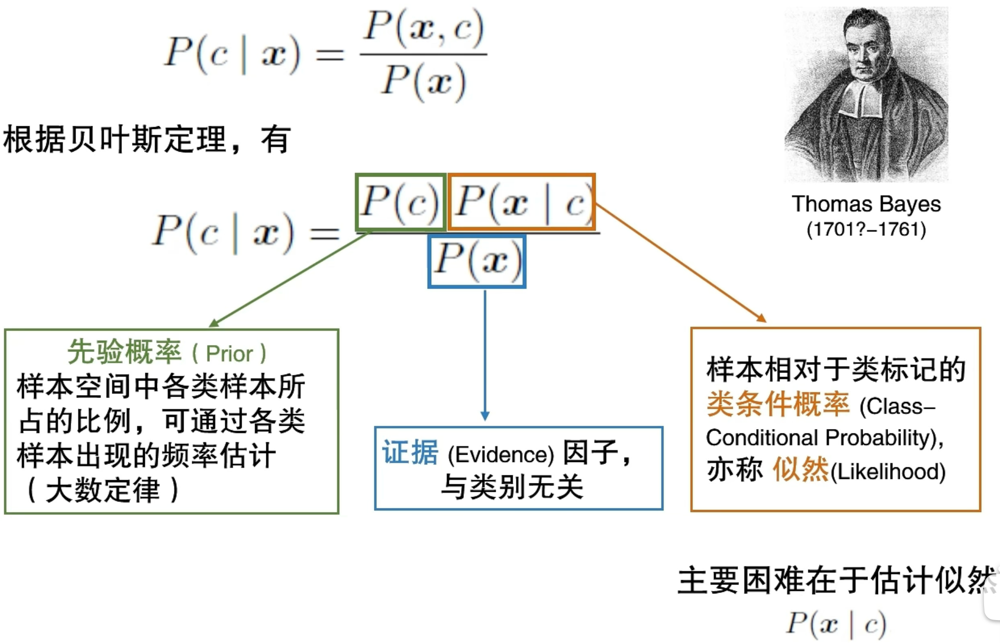
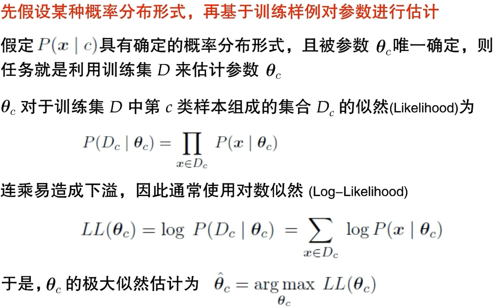

- 区分：后验概率和类条件概率（似然）

  | 名称               | 符号表示                   | 含义                                                         |
  | ------------------ | -------------------------- | ------------------------------------------------------------ |
  | 后验概率           | $P(c \mid \boldsymbol{x})$ | 给定样本属性 $\boldsymbol{x}$，它应该属于哪个类别？（从参数正推结果） |
  | 类条件概率（似然） | $P(\boldsymbol{x} \mid c)$ | 给定一个类别（结果），反推其表现出属性 $\boldsymbol{x}$ 的概率。（从结果反推参数） |

### 7.3 - 朴素贝叶斯分类器 P150

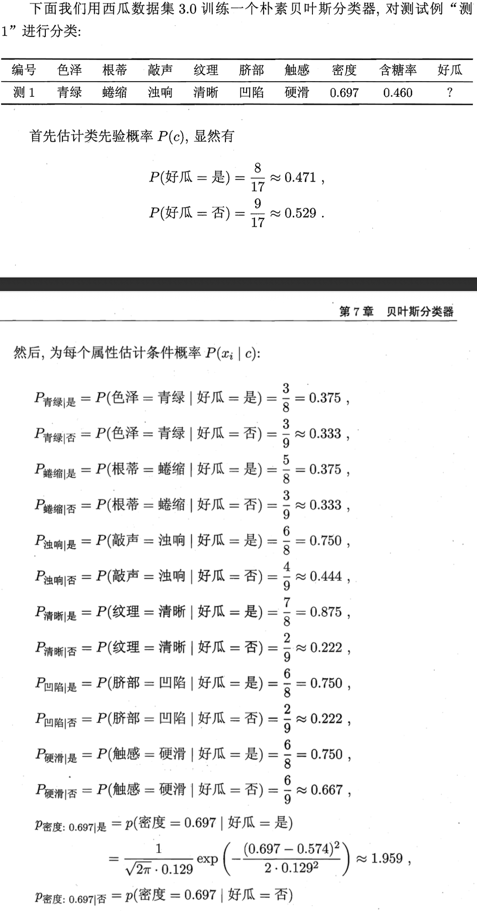
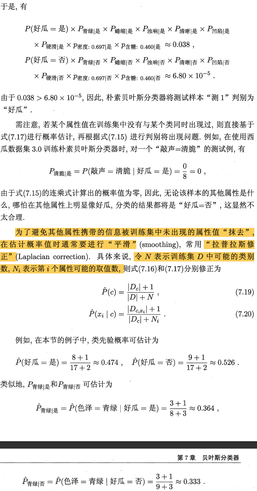

- 问题：要进行贝叶斯决策，我们需要估计后验概率 $P(c | \boldsymbol{x}) = \frac{P(\boldsymbol{x} | c) P(c)}{P(\boldsymbol{x})}$，其中 $P(c)$ 是先验概率，容易样本频率估计。而**类条件概率 $P(\boldsymbol{x} | c) = P(x_1, x_2, \dots, x_d | c)$** 则是真正的难点，它表示在类别 $c$ 的条件下，观测到这 $d$ 个属性同时取特定值的概率。这是一个联合概率，如果要准确估计，就会出现维数灾难（属性个数 $\times$ 不同取值 = 可能的组合爆炸式增长） + 稀疏问题（绝大多数**可能的样本组合** $\boldsymbol{x}$，在有限的训练集 $D_c$ 中**从未出现过**。）。

- 解决方案：朴素贝叶斯**“属性条件独立性假设”**，对已知类别，假设所有属性都相互独立 $$\displaystyle{P(c | \boldsymbol{x}) = \frac{P(c) P(\boldsymbol{x} | c)}{P(\boldsymbol{x})} = \frac{P(c)}{P(\boldsymbol{x})} \prod_{i=1}^{d} P(x_i | c)}$$，将原本难以计算的联合概率 $P(\boldsymbol{x} | c)$，转化为了 $d$ 个易于估计的**单属性条件概率 $P(x_i | c)$** 的乘积。

- 训练过程：朴素贝叶斯的训练非常简单，它不需要复杂的迭代优化，只需要**统计计数**：
  1. **估计先验概率 $P(c)$：** 统计训练集 $D$ 中，属于每个类别 $c$ 的样本所占的比例。
  1. **估计条件概率 $P(x_i | c)$：** 统计在每个类别 $c$ 中，第 $i$ 个属性取值 $x_i$ 的样本所占的比例。
  
- 【重要】**拉普拉斯修正**：为了避免其他属性携带的信息被训练集中未出现的属性值”抹去“，通过**给所有计数项都加上一个正数（通常是 1），以保证任何概率值都不会为零，并且修正后的概率总和仍然为 1（对分母的处理）**。

  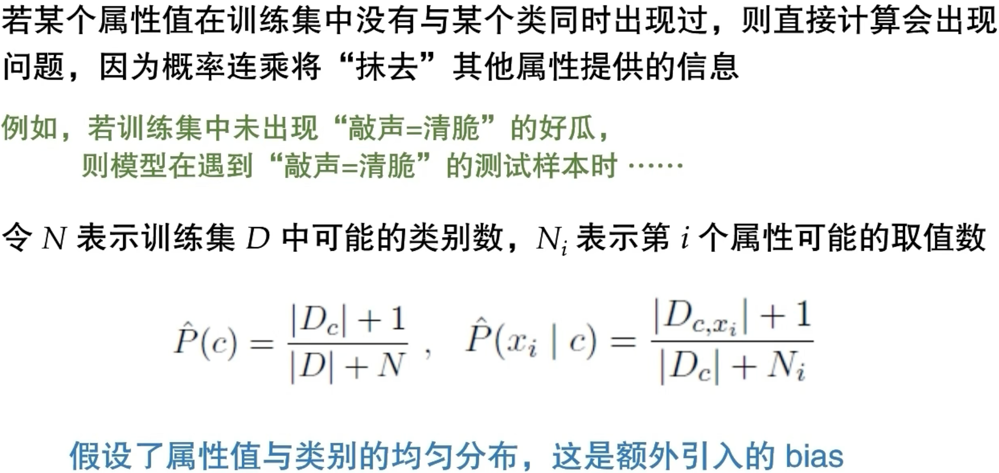

### （不考）7.4 - 半朴素贝叶斯分类器

### 7.5 - 贝叶斯网

贝叶斯网，亦称“信念网”，它借助有向无环图刻画属性之间的依赖关系，并使用**条件概率表（Conditional Probability Table, CPT）**来描述属性的联合概率分布。

- 构成（下图）：$B = \langle G, \Theta \rangle$。一个贝叶斯网由结构 $G$ （有向无环图）和参数 $\Theta$ （条件概率表）两部分构成。
- 三种依赖关系（下图）
  1. **同父结构 (Common Parent)**：$y$ 确定时，$x$ 与 $z$ 条件独立。
  2. **V 型结构 (V-structure)**：也称“冲撞”结构。若 $y$ 未知，则 $x$ 与 $z$ 相互独立；若 $y$ 已知，则 $x$ 与 $z$ 往往不独立。
  3. **顺序结构 (Linear)**：$y$ 确定时，$x$ 与 $z$ 条件独立。

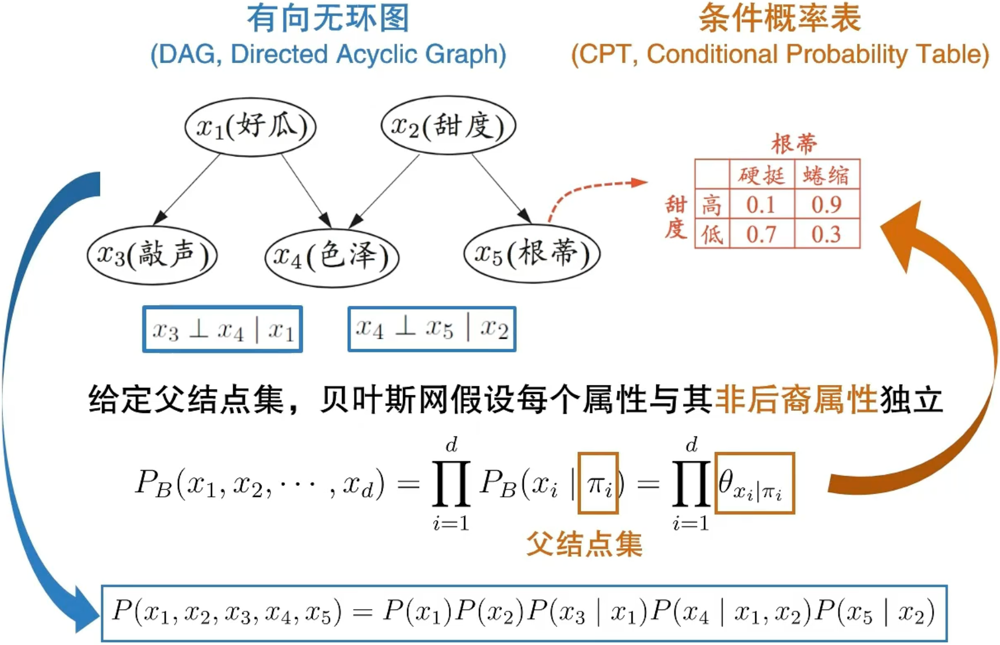
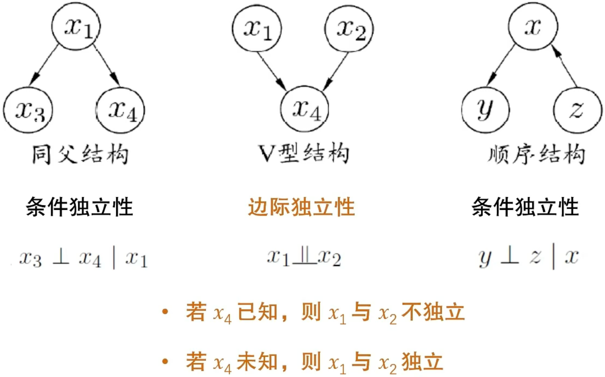

- **分析条件独立性**（下图）：先剪枝，仅保留有向图中 $x,y,\boldsymbol{z}$ 及其祖先。若 $x$ 和 $y$ 能在图上被 $\boldsymbol{z}$ 分入两个连通分支，则有 $x \perp y \mid \boldsymbol{z}$。

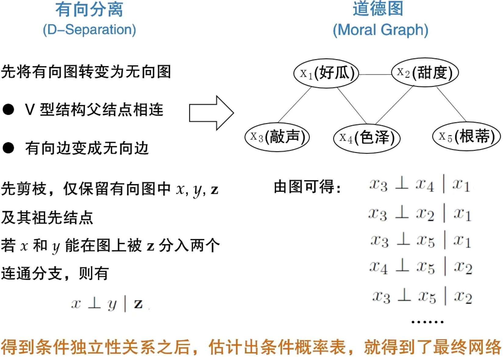
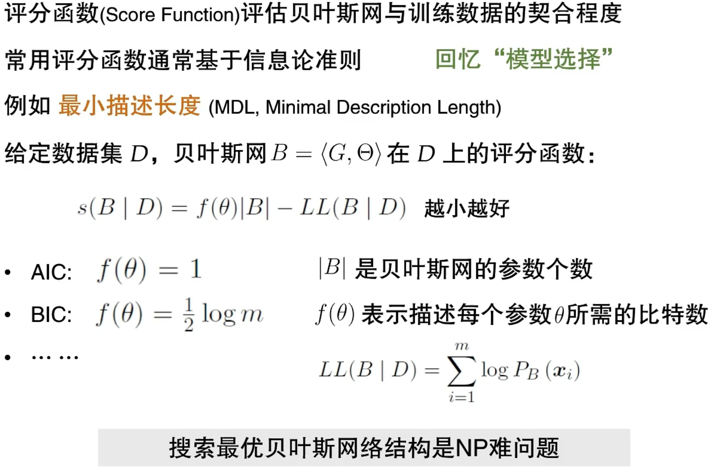

- **评分函数**（上图）：评估贝叶斯网与训练数据的契合程度，寻找结构最优的贝叶斯网。

  - 最小描述长度 MDL, Minimal Description Length：$s(B\mid D)=f(\theta)|B|-LL(B\mid D).$
  - 可理解为：现有一个贝叶斯网和一个数据集，我要把二者都刻画出来，需要多少信息？（正因如此，$s$ 越小越好）
  - $f(\theta)|B|$​ 表示：刻画贝叶斯网本身所需的信息。**$|B|$** 表示贝叶斯网中参数的总个数，**$f(\theta)$** 表示描述每个参数所需的比特数。
  - $\displaystyle{LL(B \mid D) = \sum_{i=1}^m \log P_B(\boldsymbol{x}_i)} <0$ 表示：拥有此贝叶斯网后，还需要多少信息刻画数据集。

- **推断 (Inference)**：基于已知属性变量的观测值，推测其他属性变量（隐变量）的取值。分为精确推断（NP 难）、近似推断。

  - **吉布斯推断**（近似推断，如下图）：

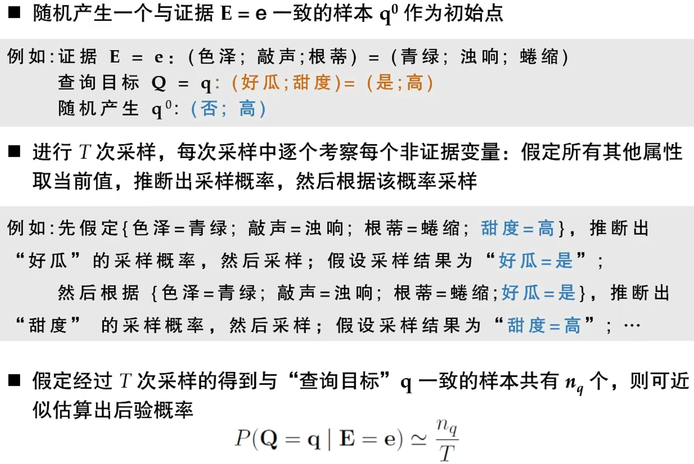

### 7.6 - [EM 算法](https://zhuanlan.zhihu.com/p/36331115)（期望最大化算法）

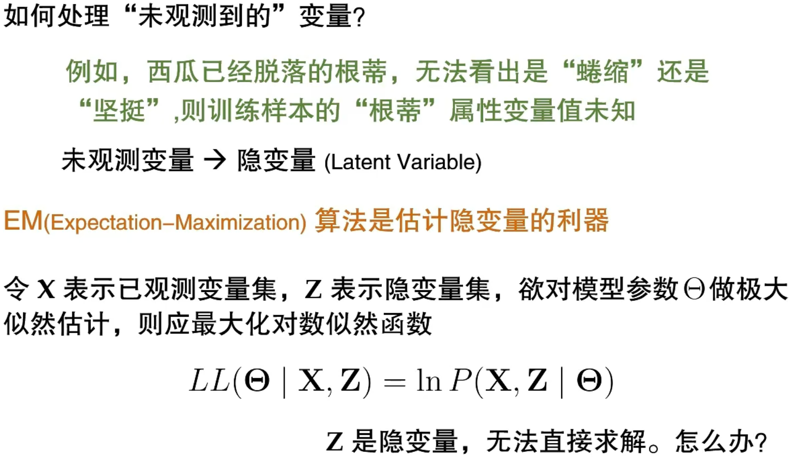
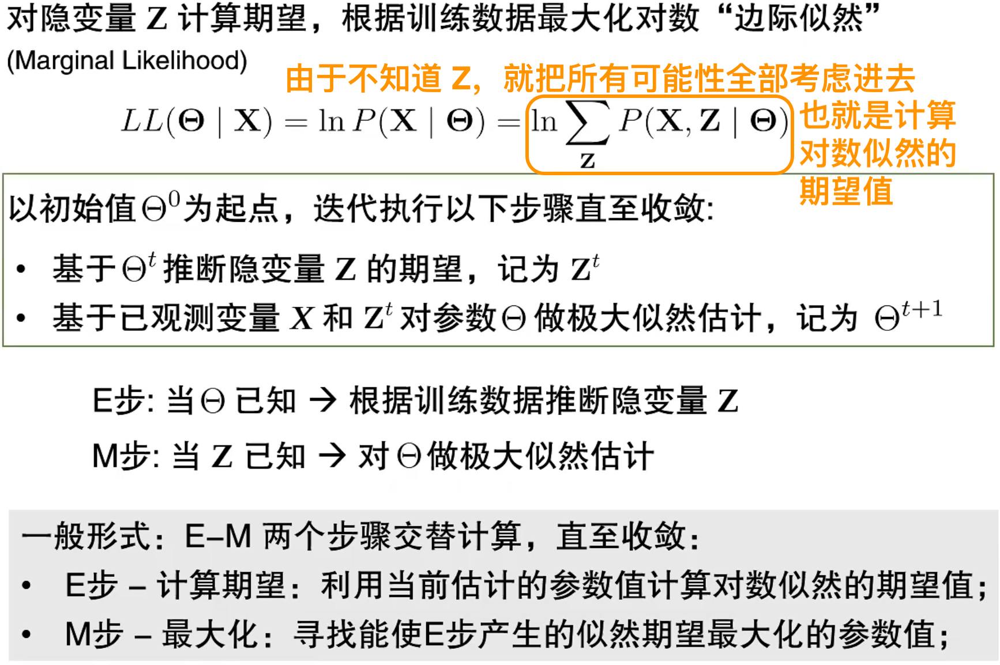

## 第 8 章 集成学习

- 集成学习：通过构建并结合多个学习器来完成学习任务，常可获得比单一学习器显著优越的泛化性能——**“好而不同”**！
  - 个体学习器间存在强依赖关系、必须串行生成的序列化方法：Boosting。
  - 个体学习器间不存在强依赖关系、可同时生成的并行化方法：Bagging 与随机森林。

### 8.2 - [Boosting（AdaBoost）](https://zhuanlan.zhihu.com/p/27126737)P173

1. 算法按顺序串行训练一系列基学习器。最初，所有样本权重相等。
2. 每训练完一个基学习器，Boosting 都会分析它的表现。对于**被错误分类的样本**，算法会**提高**它们的权重；对于分类正确的样本，则**降低**它们的权重。
3. 带着这个**新的样本权重分布**，算法训练下一个基学习器。由于错误样本的权重更高，下一个基学习器在训练时就会**更加关注**这些难点样本，试图将其分类正确。
5. 最终的强分类器是将所有这些基学习器**加权组合**而成的。其中，**分类性能越好的基学习器，在最终模型中所占的权重也越大**。

  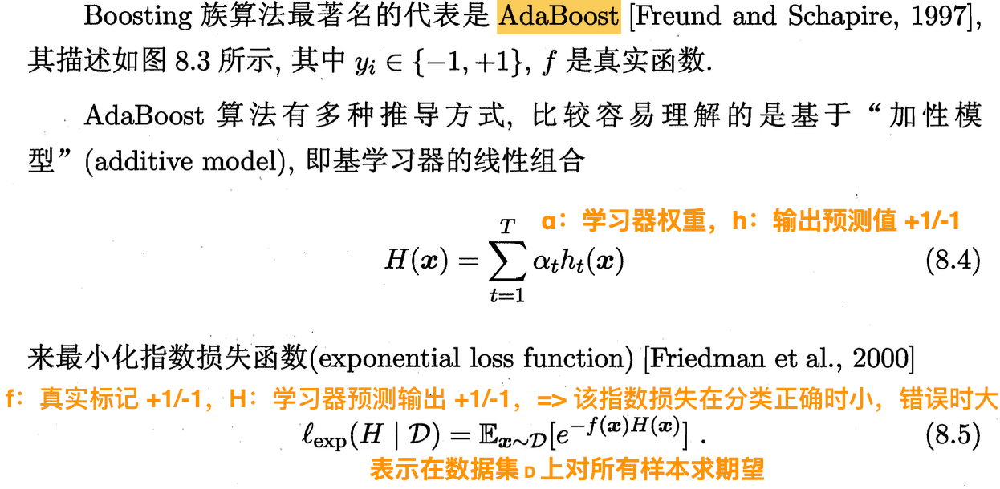
  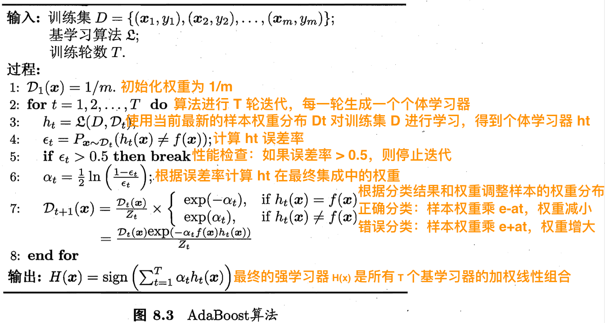

### 8.3 - Bagging 与随机森林

- Bagging：使用**自助采样法**，给定包含 $m$ 个样本的数据集，从中随机有放回抽取 $m$ 次，得到一个采样集。重复这个操作 $T$ 次，可得到 $T$ 组含 $m$ 个训练样本的采样集。然后，基于每个采样集训练出一个基学习器，再将这些基学习器进行结合。
- 随机森林 RF：Bagging 的一个扩展变体，具有两个随机过程：
  - **样本随机性**（与 Bagging 相同）：使用自助采样法为每棵决策树生成不同的训练子集。
  - **特征随机性（RF 独有）**：当决策树在生长，需要选择最佳划分属性时，它**不会考察所有的 $d$ 个属性**，而是从所有属性中随机挑选一个**包含 $k$​ 个属性的子集**，然后再从这个子集中选择一个最优属性用于划分。参数 $k$ 控制了随机性的引入程度（一般 $k=log_2d$）。

| **特性**              | **AdaBoost / Boosting**                                      | **Bagging / 随机森林 (RF)**                                  |
| --------------------- | ------------------------------------------------------------ | ------------------------------------------------------------ |
| **集成流派**          | **序列化集成 (Sequential)**                                  | **并行化集成 (Parallel)**                                    |
| **个体学习器依赖性**  | 强依赖。个体学习器**必须按顺序**生成，后一个依赖前一s个的结果。 | 无依赖。个体学习器**独立并行**生成。                         |
| **对样本的处理**      | **动态调整权重**。被错分的样本在下一轮中**权重增加**，得到更多关注。 | **自助采样 (Bootstrap)**。每轮从原始数据中**有放回采样**生成新的训练集。 |
| **对特征的处理 (RF)** | **无额外处理**。每轮训练使用全部特征。                       | **随机选择特征子集**。在节点划分时，只考虑随机选中的一小部分特征。 |
| **个体学习器权重**    | **加权组合**。性能好的学习器 ($\varepsilon_t$ 小) 会被赋予**更高的权重** $\alpha_t$。 | **简单投票或平均**。通常权重相等，每个模型一票（但也可以加权，较少见）。 |
| **主要目标**          | **降低偏差 (Bias)**。通过持续关注和修正错误，使模型能够拟合复杂的决策边界。 | **降低方差 (Variance)**。通过对多个独立强模型的预测结果进行平均，使模型输出更稳定。 |
| **对基学习器要求**    | **弱学习器**（性能略优于随机猜测即可）。                     | **强学习器**（例如未剪枝的深度决策树）。                     |
| **训练速度**          | **慢**。必须串行训练，无法并行。                             | **快**。可以并行训练所有基学习器。                           |

### 8.4 - 结合策略

假设我们有一个由 $T$ 个个体学习器 $\{h_1, h_2, \dots, h_T\}$ 组成的集成模型。对于一个新样本 $\boldsymbol{x}$，每个学习器都会给出一个预测值 $h_t(\boldsymbol{x})$。

1. 平均法：对数值型输出，最常见的结合策略是使用平均法。

   - 简单平均法：所有个体学习器平等对待，将它们的预测结果直接取算术平均。$$H(\boldsymbol{x}) = \frac{1}{T} \sum_{t=1}^{T} h_t(\boldsymbol{x})$$

   - 加权平均法：赋予不同个体学习器不同的权重，性能越好的学习器权重越高。$$H(\boldsymbol{x}) = \sum_{t=1}^{T} w_t h_t(\boldsymbol{x}),\ w_t \geq 0 \text{ 且 } \sum_{t=1}^{T} w_t = 1$$

2. 投票法：投票法主要用于**分类任务**，学习器 $h_i$ 将从类别标记集合 $\{c_1,c_2,\cdots,c_N\}$ 中预测出一个标记。
   - 绝对多数投票法：只有当某个类别获得的票数**超过总票数的一半**时，才接受该预测；否则，拒绝预测（即不确定）。
   - 相对多数投票法：直接选择得票数**最多的那个类别**作为最终预测结果。
   - 加权投票法：根据个体学习器的性能赋予其不同的权重，然后计算每个类别的**加权票数**，选择加权票数最高的类别。

3. 学习法：学习法是最复杂的结合策略，它**不直接使用**平均或投票，而是训练一个**新的学习器**来学习如何最佳地结合个体学习器的预测。

### （不考）8.5 - 多样性

## 第 9 章 聚类

- **聚类**：无监督学习。将样本集 $D$ 划分为若干个不相交的子集，每个子集称为一个**簇** cluster。
- **簇标记**：表示样本属于哪一个簇，与样本一一对应。

### 9.2 & 9.3 - 性能度量与距离计算

- **性能度量**：亦称聚类“有效性指标”。**簇内相似度高 & 簇间相似度低。**
  - 外部指标：将聚类结果与某个**“参考模型”**进行比较。如 Jaccard 系数，FM 指数，Rand 指数。方法是把样本两两配对，比较其在聚类结果 & 参考模型中的结果是否一致（是否同簇）。
  - 内部指标：**直接考察**聚类结果，而不利用任何参考模型。如 DB 指数，Dunn 指数。直接考察“簇内相似度”（越大越好），“簇间相似度”（越小越好）。
- **距离计算**：
  - 闵可夫斯基距离：可用于有序属性。$\displaystyle{\text{dist}_{\mathrm{mk}}(\boldsymbol{x}_i, \boldsymbol{x}_j) = \left( \sum_{u=1}^{n} |x_{iu} - x_{ju}|^p \right)^{\frac{1}{p}}}.$
    - 欧氏距离 $p=2$：空间中两点之间直线距离。适用于低维、稠密、且各维度具有相同量纲的数据。
    - 曼哈顿距离 $p=1$：沿着坐标轴的距离总和。对离群点的敏感度低于欧几里得距离，在某些需要抵抗极端值的场景中效果较好。

  - VDM 距离：用于计算无序属性。通过属性值出现的概率来评估它们是否相似。令 $m_{u,a}$ 表示属性 $u$ 上取值为 $a$ 的样本数，$m_{u,a,i}$ 表示在第 $i$ 个样本簇中在属性 $u$ 上取值为 $a$ 的样本数，$k$ 为样本簇数，则属性 $u$ 上两个离散值 $a$ 与 $b$ 之间的 VDM 距离为$\displaystyle{\text{VDM}_p(a,b)=\sum_{i=1}^k\left|\frac{m_{u,a,i}}{m_{u,a}}-\frac{m_{u,b,i}}{m_{u,b}}\right|}^p.$
  - 余弦相似度：两个向量之间夹角的余弦值。衡量两个向量在方向上的差异，适用于高维数据，且更关注向量**方向**而非大小的场景。

### 9.4 - 原型聚类

- 假设：聚类结构能通过一组原型刻画。（“原型”：指样本空间中具有代表性的点。）
- 过程：算法**先对原型进行初始化**，然后对原型进行**迭代更新**求解。
- 代表：**k 均值聚类**（分配样本+更新中心），学习向量量化 (LVQ)，高斯混合聚类。

#### 9.4.1 - **k 均值聚类**（k-means）

优缺点：简单、收敛速度快，但是 k 值难以确定、对初始值敏感、形状受限、抗造能力差。

1. 初始化：先随机选取 $k$ 个样本点作为簇中心（原型）。
2. **分配样本**：根据与簇中心的距离，将其他样本点划分给最近的簇。
3. **更新中心**：更新各簇的均值向量，将其作为新的簇中心。
4. 若所有簇中心未发生改变，则停止，否则重复步骤 2。

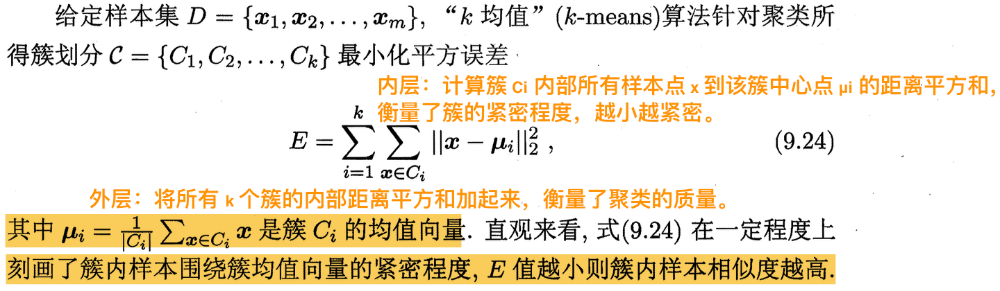

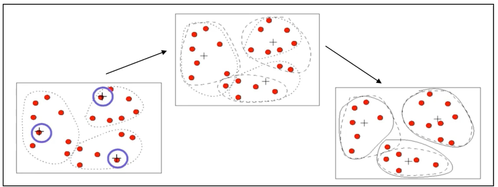

#### 9.4.2 - 学习向量量化 LVQ（形成类别的子类）

- 也是试图找到一组原型向量来刻画聚类结构，但**假设数据样本带有类别标记**，学习过程中利用样本的这些监督信息来辅助聚类。
- 给定样本集 $D=\{(x_1,y_1),(x_2,y_2),\cdots,(x_m,y_m)\}$，LVQ 的目标是学得一组 $n$ 维原型向量 $\{p_1,p_2,\cdots,p_q\}$，每个原型向量代表一个聚类簇。
- 实际上是通过聚类来**形成类别的“子类”**结构，每个子类对应一个聚类簇。
- 吸引（靠近）：当一个训练样本 $x$ 被正确地分类到与其**标记相同**的原型向量 $p$ 时，将 $p$ 向靠近 $x$ 的方向移动（拉近），以增强 $p$ 对该类样本的代表性。
- 排斥（远离）：当一个训练样本 $x$ 被错误地分类到与其**标记不同**的原型向量 $p$ 时，将 $p$ 向远离 $x$ 的方向移动（推远），以减少 $p$ 对错误类别样本的吸引力。

#### 9.4.3 - 高斯混合聚类（扩展版 k 均值聚类）

高斯混合聚类假设每个簇（Cluster）都对应一个高斯分布。整个数据集的概率密度函数由 $k$ 个高斯组件加权组合而成：
$$
P(\boldsymbol{x}) = \sum_{i=1}^{k} \alpha_i \cdot p(\boldsymbol{x} \mid \mu_i, \Sigma_i)
$$

- $\alpha_i$：第 $i$ 个高斯组件在整体中所占的权重。
- **$p(\boldsymbol{x} \mid \mu_i, \Sigma_i)$**：第 $i$ 个高斯分布，由均值 $\mu_i$ 和协方差矩阵 $\Sigma_i$ 决定。

在聚类任务中，我们观测到了样本 $\boldsymbol{x}$，但不知道这个样本到底是由哪一个高斯组件生成的。

- **隐变量 $Z$**：表示样本所属的组件。
- **后验概率**：模型会计算样本 $\boldsymbol{x}$ 属于第 $i$ 个组件的概率。聚类的结果就是将样本划分到后验概率最大的那个组件中。

由于参数（均值 $\mu$、方差 $\Sigma$、混合系数 $\alpha$）和样本所属的簇（隐变量 $Z$）互相依赖，无法直接求出最优解。因此，高斯混合聚类通常使用 **EM 算法**进行迭代求解：

- **E 步 (Expectation)**：根据当前的参数，计算每个样本属于每个高斯组件的后验概率（期望值）。
- **M 步 (Maximization)**：根据 E 步算出的概率，通过极大似然估计更新每个高斯组件的均值、协方差和权重，使得对数似然期望最大化。

**高斯混合聚类比 K-means 强在哪里？**

- **形状灵活**：K-means 默认簇是球形的，而高斯混合聚类通过协方差矩阵 $\Sigma_i$，可以识别出各种**长条形、斜向延伸**的椭圆形簇。

### 9.5 - 密度聚类

- 假设：聚类结构能通过样本分布的紧密程度确定。
- 过程：从**样本密度**的角度来考察样本之间的可连接性，并基于可连接样本不断扩展聚类簇。从一个核心点出发，把所有邻居拉进簇里。如果邻居也是核心点，就继续递归地把邻居的邻居也拉进来，直到找不到更多“连在一起”的人为止。
  - $ϵ$-邻域：以我为中心，多大范围内算我的邻居。
  - 最小样本数 ($MinPts$)：这个范围内至少有多少个邻居，我才算一个“核心点”。

- 代表：**DBSCAN**, OPTICS, DENCLUE。
- **三大优势**：
  1. **形状随意**：可以发现任何形状的簇（如环形、S 形），而 K-means 只能处理球形。
  2. **识别噪声**：不在任何高密度区域的点会被标记为“噪声/异常点”，它不强求每个点都必须归类。
  3. **无需指定 K**：不需要预先告诉它有多少个簇，它会根据密度自动发现。

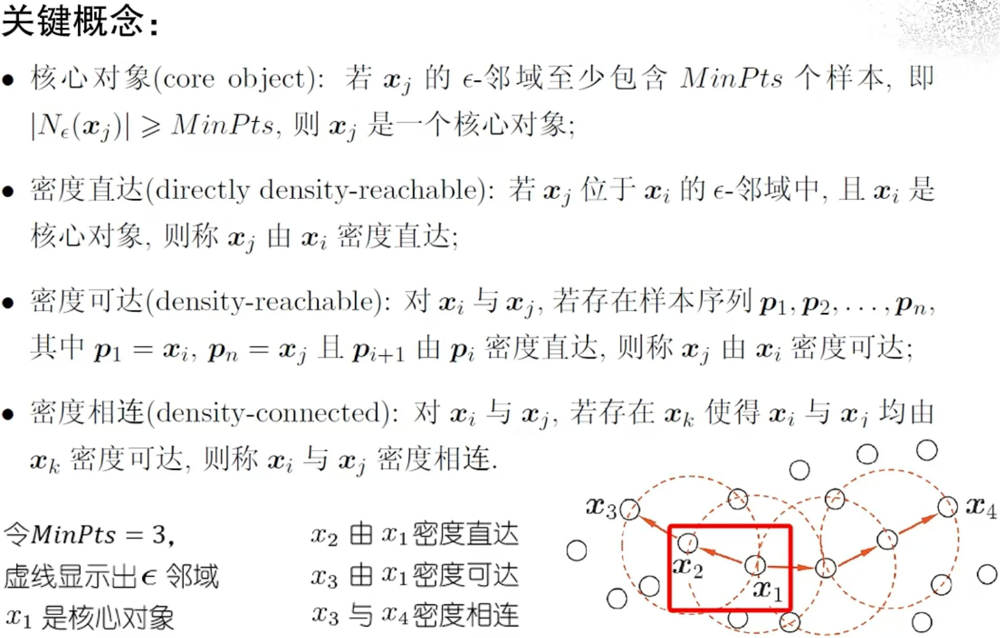

### 9.6 - 层次聚类

- 假设：能够产生不同粒度的聚类结果。
- 过程：在不同层次对数据集进行划分，从而形成树形的聚类结构。
- 代表：**AGNES** (自底向上)，DIANA (自顶向下)。

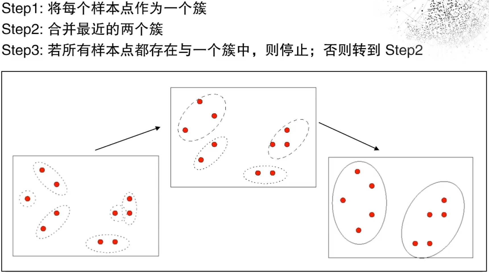

## 第 10 章 降维与度量学习

- $k$ **近邻学习** (k-Nearest Neighbor, kNN)：确定训练样本，以及某种距离度量，对于某个给定的测试样本，**根据训练集中与其最靠近的 $k$ 个训练样本的类别来决定它的类别**。

  - 对于分类问题，使用“投票法”；对于回归任务，使用“平均法”。
  
  
    - $k$ 近邻学习没有显式的训练过程，属于“懒惰学习”。
  
  
    - **局限性**：在高维空间下，样本分布极其稀疏，计算距离变得毫无意义（即维数灾难），这正是为什么我们需要后续的“降维”技术。
  
- **维数灾难**：高维情形下出现的**数据样本稀疏、距离计算困难**等问题。

- **降维**：缓解维数灾难的重要途径。即通过某种数学变换将原始高维属性空间转变为一个低维“子空间”，在这个子空间中，样本密度大幅提高，距离计算也变得更为容易。

  - 依据：在很多时候，人们观测或收集到的数据样本虽是高维的，但与学习任务密切相关的也许仅是某个低维分布，即高维空间中的一个**低维“嵌入”** embedding。

  - 核心：**多维缩放 MDS**——要求原始空间中样本之间的**距离在低维空间中得以保持**。

- **主成分分析 PCA**：**线性降维**。通过**线性投影**，将高维数据映射到低维空间，类似于直接压扁。

  - **最近重构性**：样本点到这个平面的距离要足够近。也就是说，投影后丢失的信息最少。

  - **最大可分性**：样本点投影到平面上后，要尽可能地“散开”（方差最大化），不要挤成一团。

- **核化主成分分析 KPCA**：是传统 PCA 的进阶版，基于核技巧对线性降维方法进行“核化”，专门用于处理**非线性分布**的数据。

  - 动机：传统的 PCA 是线性的，它只能在原始空间寻找直线的投影方向。但如果数据像“瑞士卷”一样弯曲分布，线性方法就失效了。

  - **基本思想**：如果数据在低维空间是非线性可分的，我们可以将它映射到一个**高维特征空间**，使得它在高维空间中变得线性可分。
  - **形象理解**：这就像把一张揉皱的纸（非线性数据）撑开拉直（高维映射），然后在拉直后的纸面上做线性切分。

- **流形学习**：**非线性降维**，类似于展开“瑞士卷“。

  - **局部性质**：流形在局部具有欧氏空间的性质，这意味着在很小的区域内，我们可以直接用欧氏距离来衡量样本间的相似性。
  - **低维嵌入**：如果高维数据实际上是一个低维流形嵌入在高维空间中，我们就可以通过某种映射关系，将它“展开”到低维空间。

## 第 11 章 特征选择与稀疏学习

- 子集搜索与评价：在处理**高维数据**时，并非所有属性都有用。我们希望从初始的属性集合中，选取一个包含了所有**重要信息**的属性子集。
  - 做法：产生一个“候选子集”，评价出它的好坏，基于评价结果，产生下一个候选子集，再对其进行评价。
  - 前向搜索（逐渐增加相关属性）、后向搜索、双向搜索，用**信息增益**指标来评价。
- **过滤式**选择：先对数据集进行属性选择（“过滤”），然后再训练学习器。属性选择过程与后续学习器无关。

  - **Relief 方法**：为每个特征（属性）赋予一个**相关统计量**。这个数值越大，说明该特征对区分不同类别的样本越有贡献。

    - **猜中近邻 (Near-hit)：** 在**同类**样本中，找一个离自己最近的邻居。

    - **猜错近邻 (Near-miss)：** 在**异类**样本中，找一个离自己最近的邻居。

    - 核心公式：$$\delta^j = \sum_{i} -\text{diff}(x_i^j, x_{i,nh}^j)^2 + \text{diff}(x_i^j, x_{i,nm}^j)^2$$

    - **第一项 $-\text{diff}(x_i^j, x_{i,nh}^j)^2$：** 计算自己与“同类邻居”在特征 $j$ 上的距离。**距离越小（负值越接近0），说明同类在这个特征上很接近，这个特征好。**

    - **第二项 $+\text{diff}(x_i^j, x_{i,nm}^j)^2$：** 计算自己与“异类邻居”在特征 $j$ 上的距离。**距离越大，说明异类在这个特征上区分度很高，这个特征好。**

    - 总结：如果一个特征能让“自己人”离得近，让“敌人”离得远，那么它的 $\delta^j$ 就会很大，这个特征就被认为是重要的。

- **包裹式**选择：直接把最终将要使用的学习器的性能作为当前属性子集的评价准则。性能优于过滤式，但开销更大。
  - **LVW (Las Vegas Wrapper)**：使用**随机策略**来搜索特征子集。它不断随机生成子集，并“试用”这些子集，看哪个子集能让分类器跑得最准。
    - 在循环的每一轮随机产生一个特征子集
    - 在随机产生的特征子集上通过交叉验证推断当前特征子集的误差
    - 进行多次循环，在多个随机产生的特征子集中选择误差最小的特征子集作为最终解
  
- **嵌入式**选择：属性选择的过程直接集成在模型训练的算法内部。模型在学习参数的过程中，自动就决定了哪些属性重要，哪些不重要。如决策树、随机森林。
  - **同一优化过程**：特征选择是在学习器的损失函数优化过程中同步完成的。
  - **自动筛选**：模型会自动赋予无用特征极小甚至为 0 的权重，从而实现筛选。
  - **岭回归 (Ridge Regression)**：在普通最小二乘法的损失函数后面引入 $L_2$ 范数正则化项 $\lambda\|\boldsymbol{w}\|_2^2$。它能防止过拟合，但不能剔除特征（权重只会趋近于 0，不会等于 0）。
  - **LASSO**：将正则化项改为 $L_1$ 范数 $\lambda\|\boldsymbol{w}\|_1$。易获得稀疏解。这就是一种经典的嵌入式特征选择方法。
  
- **稀疏表示**：把数据集看成一个矩阵，每一行是一个样本，每一列是一个特征。如果矩阵中有很多零元素，且这些零元素不是随机出现，而是“整行整列”地出现，我们称之为稀疏表达。

  - **线性可分性**：稀疏表达往往能让原本复杂的非线性数据在新的空间中变得线性可分。
  - **存储高效**：只需要存储非零元素及其位置，极大节省空间。

- **字典学习**：由于原始数据往往不具备稀疏性，我们需要寻找一个合适的字典，将普通、稠密的数据，转化为只有少数非零元素的稀疏形式。这个过程就称为**字典学习**。
- 过程：当数据本身不够稀疏时，我们通过学习一个“字典”（基向量矩阵），将原始信号表示为这些基向量的稀疏线性组合。

## 第 13 章 半监督学习

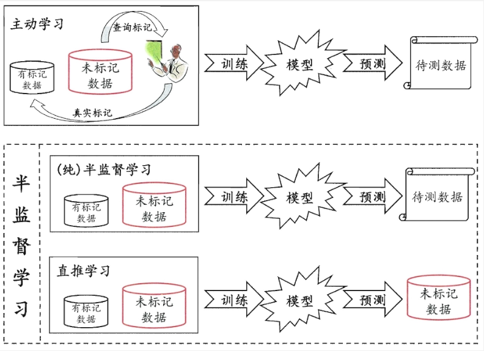

- **半监督学习**（**少量的有标记数据**和**大量的无标记数据**）：让学习器不依赖外界交互、自动地利用未标记样本来提升学习性能。

- **生成式方法**：
  
  - 假设：所有数据（有标记和无标记）都是由同一个潜在的模型“生成”的，都服从同一个潜在的概率分布。
  - 过程：通过已知标记的样本来确定模型的基本形态，再利用未标记样本来微调模型的参数。（EM 算法）
    - E 步：利用当前的参数估计，计算未标记样本属于各个高斯成分的概率。
    - M 步：结合有标记样本的真实标签和未标记样本的“估计概率”，重新计算并更新模型参数。
  - 此类方法简单、易于实现，在有标记数据极少的情形下往往比其他方法性能更好。
  - 然而，此类方法有一个关键：**模型假设必须准确**，即假设的生成式模型必须与真实数据分布吻合。
  
- **半监督支持向量机 S3VM**：传统的 SVM 只关心如何把有标记的点分得最开。而半监督 SVM 在支持向量机的基础上，试图找到能**将两类有标记样本分开**，且穿过**数据低密度区域**的划分超平面。

  - TSVM：采用的是一种**局部搜索、迭代优化**的策略，其流程可以拆解为以下三个通俗的步骤：

    第一步：初始指派（盲测）

    - 先用少量**有标记样本**训练出一个标准的 SVM 模型。
    - 用这个模型去预测所有的**未标记样本**，给它们打上“伪标记”（即暂时认定它们属于某类）。

    第二步：寻找“可疑”样本（纠错）

    - 此时，模型中既有真标签也有伪标签。TSVM 会尝试找出那些**可能指派错误**的样本对。
    - **判断准则**：如果交换两个未标记样本的伪标签后，能让整体的损失函数（目标函数）值下降，就说明之前的指派有问题。

    第三步：交换标签并重新训练

    - **交换标签**：将这两个样本的标签互换（比如从“+”改为“-”，或反之）。
    - **逐步加压**：图片中的算法步骤提到了一个参数 $C_u$。最开始我们不太信任伪标签，所以 $C_u$ 很小；随着迭代进行，我们逐渐增大 $C_u$，让未标记样本在模型优化中占据越来越重要的地位。
  - **计算开销巨大**：尝试交换每一对未标记样本的标签是一个巨大的组合优化问题，计算非常耗时。

  - **类别不平衡问题**：如果未标记样本被大量指派为同一类，会导致模型偏置。因此 TSVM 会引入 $C_u^+$ 和 $C_u^-$ 分别调节两类的惩罚权重，以维持类别比例的平衡。

- **图半监督学习**（标签传播）：

  - 将每个样本看作图中的一个节点，样本间的**相似度**看作边。相似度越高，边的强度越强。
  - 将有标记样本看作是**“染色”**过的结点，而未标记样本是透明的。颜色（标签信息）会沿着图中的边从有色结点向透明结点扩散。

  - 如果结点 A 和 B 之间的边很强（相似度高），那么 A 的颜色就很容易传给 B。最终，整个图会达到一种平衡状态，相似的结点倾向于拥有相同的颜色。

  - 优点：能够捕捉复杂的流形结构（即数据在空间中弯曲的分布情况），分类效果通常很优雅。
  - 缺点：**计算开销极大**。如果数据量达到百万级，构建和计算巨大的亲和矩阵 $\mathbf{W}$ 会变得非常吃力。此外，构图的方式（如何选近邻）对结果影响极大。

- **基于分歧的方法**：利用多个学习器彼此的分歧，筛选出对未标记数据最有价值的预测结果。

  - **协同训练 (Co-training)**：如果两个视角都足够充分（都能独立完成分类）且相互独立，那么它们就可以“互相当老师”，通过学习对方提供的“知识”，不断修正自己的边界。
  - 正是因为模型之间存在**显著的分歧或差异**，一方才能通过另一方提供的“确定性”信息，来减少自己在该区域的预测偏差。
  - **优点**：思路简单有效，不依赖复杂的损失函数优化，且理论基础坚实（只要两个视角充分且独立，性能就能提升到任意高）。
  - **缺点**：在现实任务中，很难找到完全独立且充分的多个视角。如果两个模型由于同样的错误而达成共识，模型性能反而会下降。

- **半监督聚类**：利用监督信息以获得更好的聚类效果。在聚类的算法流程中加入规则：

  - 必连约束 (Must-link)：即 $x_i$ 和 $x_j$ 必须在同一个簇中。
  - 勿连约束 (Cannot-link)：即 $x_i$ 和 $x_j$ 绝对不能在同一个簇中。

  在标准 k-means 的基础上增加了“约束检查”步骤：

  1. 在将样本指派给最近的簇中心时，算法会判断该指派是否违背了已有的必连或勿连约束。
  2. 如果违反了，算法会尝试将该样本指派给次优的簇，直到满足所有约束条件。
  3. 通过这种方式，聚类结果被强行修正以符合已知的逻辑规则。

## 第 16 章 强化学习

- **强化学习**：是一种通过“试错”来学习如何决策的范式。机器通过在环境中**不断尝试**从而学到一个策略 𝜋，使得**长期执行该策略后得到的期望累积奖赏最大**。

- **马尔可夫决策过程（Markov Decision Process）**：强化学习常用马尔可夫决策过程描述，包含四个关键要素

  - **状态空间 $X$**：智能体对环境的描述（如：西瓜处于“缺水”或“健康”状态）。
  - **动作空间 $A$**：智能体可以采取的行为（如：浇水或不浇水）。
  - **概率函数 $P$**：环境发生转移的规律。例如浇水后，西瓜有一定概率恢复健康。
  - **奖赏函数 $R$**：环境给出的反馈。如西瓜健康对应奖赏 $+1$，凋萎对应 $-10$。

- **K-摇臂赌博机**：强化学习中最基础的模型。用于研究**探索和利用**的平衡。

  - 探索：去拉那些尝试次数较少的摇臂，看看它们是否潜伏着更高的奖赏。
  - 利用：总是去拉那个已知平均奖赏最高的摇臂。
  - “探索-利用”窘境：只利用可能错过真正的“大奖”摇臂；只探索则会浪费大量机会在那些低回报的摇臂上。
  - **$\epsilon$-贪心算法**：以 $\epsilon$ 的概率进行“探索”，以 $1-\epsilon$ 的概率进行“利用”。
    - **调节作用**：如果 $\epsilon$ 较大，模型更倾向于冒险（探索）；如果 $\epsilon$ 较小，模型更倾向于稳健（利用）。
  - **Softmax 算法**：基于当前已知摇臂的**平均奖赏**来计算选择概率。某个摇臂的当前平均奖赏越大，被选中的概率越高。

- **有模型学习**：在有模型学习中，环境被建模为一个**四元组 $E = \langle X, A, P, R \rangle$**，且这四个要素对智能体都是**已知**的。即预测“在当前状态下做某个动作，下一步会变成什么状态”以及“会得到多少奖励”，是**基于动态规划的寻优**。

  - 目标：找到能使长期累积奖赏最大的**最优策略 $\pi$**——**Bellman 等式**。

  - 从学习转为规划：由于环境已知，强化学习任务其实退化为了一个基于动态规划的计算问题。我们不再关注如何通过试错去“探索”环境，而是关注如何通过“规划”找到最优路径。
  - **局限性**：在现实世界中，我们很难精确知道状态转移概率 $P$（例如：你无法精确预测浇水后西瓜 100% 会变健康）。当模型未知时，就需要转入“免模型学习”。

- **免模型学习**：不需要预先知道环境的运行机制（即状态转移概率 $P$ 和奖赏函数 $R$ 都是未知的），直接通过实际尝试来学习动作的好坏。

  - **蒙特卡罗强化学习** (Monte Carlo RL)：**“用多次试验的平均值来代替期望”**。

    - **采样轨迹**：智能体按照某个策略完整地走完一次任务（例如下一盘完整的棋，直到输赢），记录下整条路径上的所有奖赏。

    - **策略评估**：记录整条轨迹上获得的所有奖赏之和，并用多次实验的**平均奖赏**来近似作为该状态的期望累积奖赏。

    - **缺点**：必须等到一次任务**完全结束**后才能更新模型，效率较低。

  - **时序差分学习** (Temporal Difference, TD)：时序差分学习结合了动态规划和蒙特卡罗的优点，它是**“增量式”**的更新。

    - **边走边学**：它不需要等任务结束，而是每走一步就利用“当前获得的奖赏”和“对下一步价值的估计”来修正当前的判断。

    - **TD 误差**：它利用下一步的估值来更新当前步的估值。公式表现为：新的 $Q$ 值 = 旧的 $Q$ 值 + 学习率 $\times$ (即时奖赏 + 预期折扣价值 - 旧的 $Q$ 值)。

  - **Sarsa 算法（同策略）**：
    - **逻辑**：智能体“老老实实”地执行当前策略，并根据实际采取的下一个动作来更新价值。
    - **特点**：比较胆小、保守，会尽量避开高风险区域。
  - **Q-learning 算法（异策略）**：
    - **逻辑**：智能体在更新价值时，假设下一步总是会采取**最优动作**，即使它实际上可能去探索了一个随机动作。
    - **特点**：比较大胆、激进，旨在寻找理论上的全局最优路径。

- **值函数近似**：传统的强化学习使用表格记录每个状态的价值，但当状态太多时，表格根本存不下。**解决方案**是学习一个**函数**（通常是**神经网络**）来代替表格。给函数输入一个状态，它能计算出（预测出）该状态的价值。

- 模仿学习：

  传统的强化学习主要面临两个痛点：

  - **搜索空间巨大**：在多步决策任务中，如果不给指引，机器人很难通过随机尝试找到达成目标的正确路径。
  - **奖赏函数设计难**：在很多现实场景（如驾驶或行走）中，很难用简单的数学公式写出一个完美的奖赏函数来描述什么是“好”的行为。

  **缓解方法**：直接模仿人类专家的行为，相当于给机器引入了“监督信息”来学习策略。

  - 直接模仿学习：在开始自己探索之前，智能体先观察专家的操作范例，从而跳过了漫长且盲目的初始试错阶段。
  - 逆强化学习：逆强化学习不直接模仿动作，而是通过观察专家的行为轨迹，去**反推**环境背后的“奖赏函数”到底是什么样的。一旦找出了这个奖赏函数，智能体就可以基于这个新的、更稠密的奖赏信号，使用常规强化学习算法进行高效训练。
