## 整体流程

- **词法分析**：读入源程序的字符流，输出有意义的词素 (lexeme)，基于词素，产生词法单元 (token)。
- **语法分析（长相）**：根据文法规则（上下文无关文法，CFG），用各个词法单元的第一个分量来创建树形中间表示形式，通常是语法树。
- **语义分析（意义）**：使用语法树和符号表中的信息，检查源程序是否满足**语言定义的语义约束**。同时收集类型信息，用于代码生成。
- **中间代码生成**：根据语义分析的输出，生成类机器语言的中间表示（三地址代码）。
- **机器无关代码优化**：通过对中间代码的分析，改进中间代码，得到更好的目标代码，改善程序结构的效率。
- **代码生成**：把中间表示形式映射到目标语言（机器语言）。
- **机器相关代码优化**：关注寄存器的高效使用、指令的选择和流水线优化。

## 第 3 章 词法分析

### 3.1 - 词法分析器的作用、3.3 - 词法单元的规约、3.4 - 词法单元的识别

| **源代码文本** | **词素 (Lexeme)** | **词法单元名 (Token Name)** | 词法单元 (Token)  |
| -------------- | ----------------- | --------------------------- | --------------------- |
| `rate`         | `rate`            | `<id>` (标识符)             | `<id, "rate">`        |
| `=`            | `=`               | `<ASSIGN>` (赋值符)         | `<ASSIGN>`            |
| `60`           | `60`              | `<NUM>` (数)                | `<NUM, 60>`           |
| `;`            | `;`               | `<SEMI>` (分号)             | `<SEMI>`              |

- **词素 Lexeme**：编译器在源代码中识别出来的**实际文本**。
- **词法单元 Token**：词法分析器输出的**抽象符号 <token-name, attribute-value>**。
- **词法单元名 Token Name**：词法单元的第一部分，它是一个抽象的符号，用于表示**一类**词素。
- **模式**：描述了一个词法单元的词素可能具有的形式，通常用**正则表达式**来表示。 
- **符号表**：记录源程序中使用的变量的名字，收集各种属性。（名字的存储分配、类型、作用域、过程名字的参数数量、参数类型……）
- 字母表：一个有限的符号集合。
- 串：字母表中符号组成的一个有穷**序列**。（并、连接、闭包）
- 语言：给定字母表上一个任意的可数的串的**集合**。
- 正则表达式、正则集合（可以用一个正则表达式定义的语言）、正则定义（取个名字简化）
- 标识符：用户自定义的名字，用于标识变量、函数、数组、类等，不能与关键字重名。

### 3.6 - 有穷自动机、3.7 - 从正则表达式到自动机、3.9 - 基于 DFA 的模式匹配器的优化

#### 基本概念

- **不确定的有穷自动机 NFA**：每个状态对每个输入符号可以有多个转移目标状态，甚至可以没有。输入串可能有多条路径，只要有一条路径落在终态就接受（而 **DFA 路径唯一**）。
- **确定的有穷自动机 DFA**：
  - **对于每个状态及每个输入符号，有且只有一条【离开】该状态、以该符号为标号的边。**
  - 没有空串 $$\epsilon$$ 上的转换动作。
- **转换表**：表的各行表示状态，各列表示输入符号，内容表示从当前状态读入该输入符号后，NFA 可能到达的所有状态集合。（P94）

#### 【重要】NFA 转 DFA：**子集构造法（P96）**

- 基本思想：让构造得到的 DFA 的每个状态对应于 NFA 的一个状态集合。例如，NFA 在处理输入串时，最后可能到达多个状态 $$A,\ B$$，而 DFA 可以用一个单独的状态 $$X$$ 来“代表”此时 NFA 可能到达的所有状态的集合 $$\{A,\ B\}$$。
- 三种操作：
  - $$\epsilon - closure(s)$$： 从 NFA 的某**单个状态** $$s$$ 开始，只通过 $$ϵ$$ 转换到达的 NFA 状态集合。
  - $$\epsilon - closure(T)$$：从 NFA 的某**状态集合** $$T$$ 中的一个状态 $$s$$ 开始，只通过 $$ϵ$$ 转换到达的 NFA 状态集合，即 $$\cup_{s \in T}\ \epsilon - closure(s)$$。（其实就是对 $$T$$ 里每个状态都做一次 $$\epsilon - closure(s)$$ 的结果）
  - $$move(T,\ a)$$ ：从 $$T$$ 中某个状态 $$s$$ 出发，通过标号为 $$a$$ 的转换到达的 NFA 状态的集合。
- DFA 的接受状态是所有至少包含了 NFA 的一个接受状态的状态集合。

#### 【重要】正则表达式转 NFA：Thompson 算法（P100）

- 从正则表达式的内部（最小的子表达式）开始，**由内向外**逐步替换和组合。

<div align=center>
    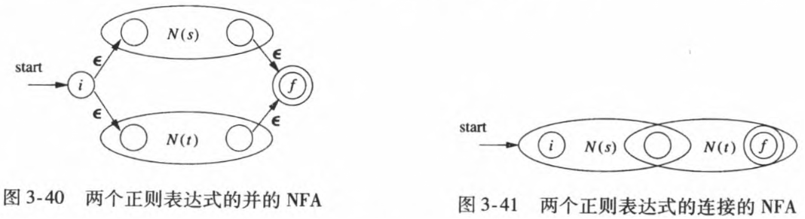
    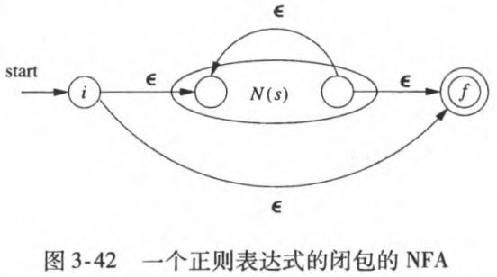
</div>
#### DFA 状态最小化（P114）

- 可区分：如果分别从状态 $$s$$ 和状态 $$t$$ 出发，沿着标号为 $$x$$ 的路径到达的两个状态**只有一个是接受状态**，则称串 $$x$$ 区分状态 $$s$$ 和 $$t$$。
- 原理：将一个 DFA 的状态集合分划成多个组，每个组中的各个状态之间相互**不可区分**，然后把这些不可区分的状态合并。
- 基本步骤：
  - 最初，该分划包含两个状态组：接受状态组和非接受状态组。
  - 从当前分划中取一个状态组 $$A$$，**对于每个输入符号** $$a$$，检查 $$a$$ 是否可以用于区分 $$A$$ 中的某些状态，即：**在 $$a$$ 上的转换落入多个组中**。
  - 如果 $$a$$ 可以区分某些状态（即落入多个组中），就将 $$A$$ 分割，并一直重复此过程。
  
<div align=center>
  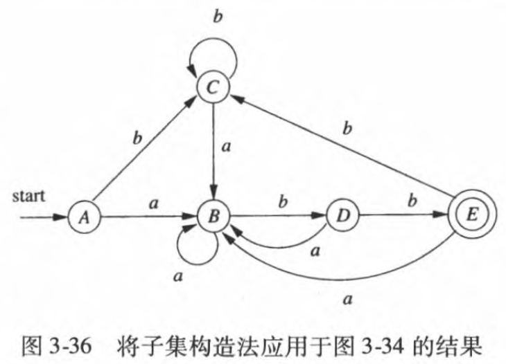
  
</div>

## 第 4 章 语法分析

### 4.2 - 上下文无关文法

$$
stmt \rightarrow \mathbf{if} \ (expr) \ stmt \ \mathbf{else} \ stmt
$$

- **终结符号**（= 词法单元名）：像关键字 $$\mathbf{if}$$ 和括号这样的**词法元素**称为终结符号 (terminal) ，终结符号不能再被语法规则替换或推导。
- **非终结符号**：像 $$expr$$ 和 $$stmt$$ 这样的**变量表示终结符号的序列**，称为非终结符号 (nonterminal)。非终结符号可以通过产生式被替换为其他非终结符或终结符。
- **产生式**：包括一个称为产生式头或左部的非终结符号，一个箭头，和一个称为产生式体或右部的由终结符号及非终结符号组成的序列。以同一个非终结符号为头部的多个产生式的体可以放在一起表示，不同体之间用符号 $$\mid$$ 分隔。
- **上下文无关文法** CFG（4 个元素）：终结符号集合、非终结符号集合、产生式集合、**指定一个非终结符号为开始符号**。
- 最左 / 右推导：每一步总是选择当前句型中最左 / 右边的非终结符号进行替换。
- **二义性**：文法有**多棵语法分析树能够生成同一个给定的终结符号串**。

### 4.3 - 设计文法

- 消除二义性：

  1. 强制实施运算符优先级：引入不同的非终结符来代表不同的优先级层次。

      | **原始歧义规则**                                  | **消除歧义的规则**                   | **解释**                                                     |
      | ------------------------------------------------- | ------------------------------------ | ------------------------------------------------------------ |
      | $$E \rightarrow E + E \mid E * E \mid \textbf{id}$$ | $$E \rightarrow E + T \mid T$$         | 确保只有 $$T$$ 层次的项能与 $$E$$ 相加，迫使 $$T$$ 层次的运算先进行。 |
      |                                                   | $$T \rightarrow T * F \mid F$$         | 确保只有 $$F$$ 层次的因子能与 $$T$$ 相乘。                       |
      |                                                   | $$F \rightarrow (E) \mid \textbf{id}$$ | 确保 $$id$$ 或括号内的表达式具有最高优先级。                   |
  
  2. 消除悬空 $$\text{else}$$ 问题：引入两个非终结符 $$\text{matched\_stmt}$$（匹配 $$\text{if}$$ 和 $$\text{else}$$ 的语句）和 $$\text{open\_stmt}$$（只匹配 $$\text{if}$$ 的语句），通过结构上的约束，强制 $$\text{else}$$ 只能与 $$\text{open\_stmt}$$ 中最靠近它的 $$\text{if}$$ 匹配。
  
     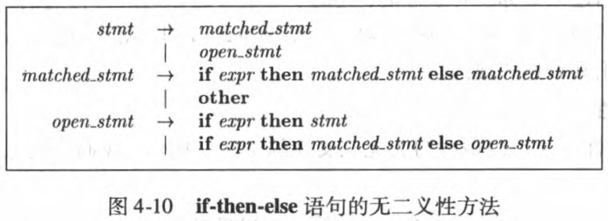

- 【重要】**消除左递归**：如果一个文法中有一个**非终结符号** $$A$$ 使得对某个串 $$a$$ 存在一个推导 $$A \xRightarrow{+} A \alpha$$，那么这个文法就是左递归的。
  将 $$A \rightarrow A\alpha \mid \beta$$ 替换为
  $$
  A \rightarrow \beta A', \ A' \rightarrow \alpha A' \mid \epsilon.
  $$
  即：**让 $$A$$ 先推出 $$β$$，然后 $$A$$′ 决定是否反复加上 $$α$$**。分组 + 替换。
  
- 【重要】**提取左公因子**：当不清楚应该在两个产生式中如何选择时，我们可以通过改写产生式来推后这个决定，获得足够信息后再做出正确选择。
  将 $$A \rightarrow \alpha \beta_1 \mid \alpha \beta_2$$ 改写为
  $$
  A \rightarrow \alpha A', \ A' \rightarrow \beta_1 \mid \beta_2.
  $$

### 4.4 - 自顶向下的语法分析

$$
E\rightarrow E+T \mid T, \quad T\rightarrow T*F \mid F, \quad F\rightarrow (E) \mid \textrm{id}
$$

$$
E → TE’, 
\quad E’→ + \ TE’ \mid \epsilon, 
\quad T → FT’, 
\quad T’ → * \ FT’ \mid \epsilon, 
\quad F → (E) \mid \mathbf{id}.
$$

- **递归下降的语法分析**：每个非终结符写成一个递归函数，遇到产生式就调用相应的函数，用程序的递归调用来模拟文法的推导过程。

  - 优点：结构直观，代码和文法结构很像，适合手工编写。
  - 缺点：不适合复杂文法，遇到左递归会死循环。

- **非递归的预测分析（表驱动分析）**：用一个显式的栈和预测分析表来控制推导过程，而不是通过递归调用的方式隐式地维护栈。分析器维护一个符号栈，**每次根据栈顶符号和当前输入符号查预测分析表，决定用哪条产生式**。

  - **优点**：适合自动生成，易于处理复杂文法，避免递归调用栈溢出。
  - **缺点**：实现比递归下降略复杂。

- **$$\text{LL}(1)$$​ 分析**：第一个 L：从左向右扫描输入，第二个 L：进行最左推导，1：使用 1 个向前看符号。

  - 工作方式：使用一张**预测分析表** $$M[A, a]$$。当分析器栈顶是非终结符 $$A$$，而当前输入符号是 $$a$$ 时，分析器查询 $$M[A, a]$$，找到唯一的产生式 $$A \to \alpha$$ 进行推导。
  - $$\mathrm{FIRST}(\alpha)$$：被定义为可从 $$\alpha$$ 推导得到的串的**首符号**的集合，其中 $$\alpha$$ 是任意的文法符号串。
  - $$\mathrm{FOLLOW}(A)$$：被定义为可能在某些句型中**紧跟**在 $$A$$ **右边的终结符号**的集合，其中 $$A$$ 是非终结符号。
  - $$\$$：是一个特殊的“结束标记”符号，只出现在 $$\mathrm{FOLLOW}$$ 集合中，且必须加入到**开始符号**的 $$\mathrm{FOLLOW}$$ 集合。

- 【重要】**求 $$\mathrm{FOLLOW}$$ 集合**：计算所有非终结符号 $$A$$ 的 $$\mathrm{FOLLOW}(A)$$ 集合时，不断应用下面的规则。

  1. 如果 $$S$$ 是开始符号，则将 $$\$$ 放入 $$\mathrm{FOLLOW}(S)$$。
  2. 如果存在一个产生式 $$B \rightarrow xAy$$，即 $$A$$ 后面有符号，就把 $$\mathrm{FIRST}(y)$$ 中**除 $$\epsilon$$ 之外的所有符号**加入 $$\mathrm{FOLLOW}(A)$$ 。
     （因为 $$\mathrm{FIRST}(y)$$ 是跟在 $$\mathrm{FOLLOW}(A)$$ 后面的第一个符号。）

  3) 如果存在一个产生式 $$B \rightarrow xA$$，即 $$A$$ 在式子末尾，或存在产生式 $$B \rightarrow xAy$$ 且 $$\mathrm{FIRST}(y)$$ 包含 $$\epsilon$$，那么就把 $$\mathrm{FOLLOW}(B)$$ 中的所有符号都加入 $$\mathrm{FOLLOW}(A)$$ 。
     （因为这种情况下 $$A$$ 在末尾，$$A$$ 后面跟什么符号 = $$B$$ 后面跟什么符号。）

- 【重要】**构造预测分析表**：根据当前**栈顶非终结符**和**输入符号**，快速选择合适的产生式。

  先求出每个非终结符的 $$\mathrm{FIRST}$$ 集合和 $$\mathrm{FOLLOW}$$ 集合。对于**每个产生式** $$A → α$$（**把合并的写法分开**）：

  - 把产生式 $$A → α$$ 填到表的 $$[A, \mathrm{FIRST}(\alpha)]$$ 的每个位置。
    （因为 $$\mathrm{FIRST}(\alpha)$$ 是 $$A$$ 右边第一个出现的符号。）
  - 如果 $$α$$ 能推出 $$\epsilon$$，则把 $$A → α$$ 填到表的 $$[A, \mathrm{FOLLOW}(A)]$$ 的每个位置。
    （$$\alpha$$ 变空串以后，$$A$$ 右边第一个出现的符号就是 $$\mathrm{FOLLOW}(A)$$。）

- $$ \$$ $$ 可以用于标记栈底和输入缓冲区的结束。

<div align=center>
    
    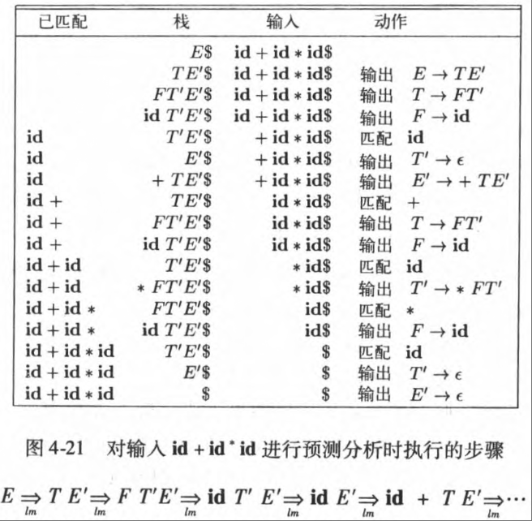
</div>

### 4.5 - 自底向上的语法分析

- 规约：即自底向上分析器“还原”句子的过程。

- 句柄：在当前推导的某个句型中，可以被一次规约还原成非终结符的、最右边的那一段符号串。即“当前可规约的、最合适的一段内容”。

- **移入-规约语法分析（栈 + 输入缓冲区）**：**使用一个栈来保存文法符号，并用一个输入缓冲区来存放将要进行语法分析的其余符号。**语法分析器将零个或多个输入符号移到栈的顶端，直到它可以对栈顶的一个文法符号串进行归约为止。

  - 句柄在被识别之前，总是出现在栈的顶部。
  - 会出现冲突问题，且无法完全解决。例如悬空 else 问题，当遇到 else 符号时发生移入/规约冲突。
  - **移入 (Shift):** 将下一个输入符号推入栈中。
  - **归约 (Reduce):** 识别栈顶的一串符号 $$\beta$$ 恰好是某个产生式的右部，将 $$\beta$$ 弹出，并将左部 $$A$$ 推入栈中 ($$A \to \beta$$ 的归约)。
  
  （与 LR 语法分析器对比：LR 语法分析器栈中存放的是状态，而不是文法符号。）
  
  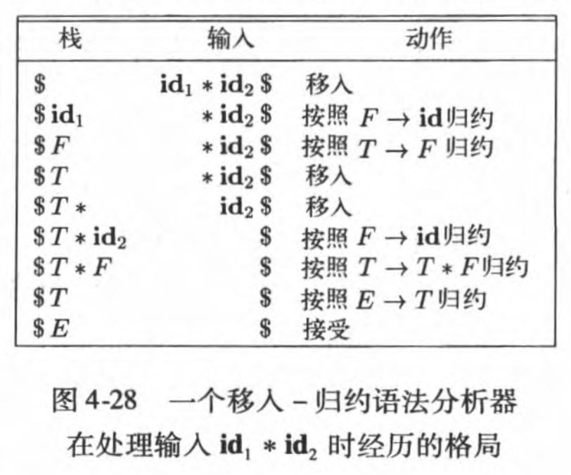
  
- **移入/归约冲突**：下一个输入符号 $$a$$ 既可以作为**当前正在识别的短语的末尾**（**归约**），又可以作为**新短语的开始**（**移入**）。

  - 发生条件： 某个项目集 $$I$$ 包含一个归约项目：$$[A \rightarrow \alpha \cdot, \ a]$$ 和一个移进项目：$$[B \rightarrow \beta \cdot a \gamma]$$。

    即输入符号 $$a$$ 既在归约项目 $$A \rightarrow \alpha$$ 的 $$\text{FOLLOW}$$ 集中，又是另一个正在分析的项目 $$B \rightarrow \beta \cdot a \gamma$$ 之后的期望输入。
  
- **归约/归约冲突**：下一个输入符号 $$a$$ 使得**栈顶内容可以归约为两条不同的产生式**。此时分析器无法确定应该使用哪条产生式进行归约。

  - 发生条件： 某个项目集 $$I$$ 包含归约项目 1：$$[A \rightarrow \alpha \cdot, \ a]$$ 和归约项目 2：$$[B \rightarrow \beta \cdot, \ a]$$。

    即输入符号 $$a$$ 既在 $$A \rightarrow \alpha$$ 的 $$\text{FOLLOW}$$ 集中，也在 $$B \rightarrow \beta$$ 的 $$\text{FOLLOW}$$ 集中。

|          | 自顶向下                                                     | 自底向上                                                     |
| -------- | ------------------------------------------------------------ | ------------------------------------------------------------ |
| 特点     | 从文法起始符号开始，尝试推导出输入串。                       | 从输入串开始，通过一系列归约，最终得到文法起始符号。         |
| 适用文法 | 消除左递归和左公共因子后的文法 (如 LL(k))。                  | 大多数实用的上下文无关文法 (如 LR(k))。                      |
| 核心     | **预测**：当前面临一个非终结符 $$A$$，我应该选择 $$A$$ 的哪个产生式来推导，以便最终能匹配输入串？ | **归约**：当前看到一串符号 $$\gamma$$，它是否与某个产生式的右部 $$A \to \gamma$$ 匹配？如果是，则将 $$\gamma$$ **归约**为 $$A$$。 |

###  4.6 - LR 语法分析技术介绍：简单 LR 技术（SLR）

LR 语法分析器是最强大的自底向上分析器，它由表格驱动，是**移入-归约**分析的改进，能够处理几乎所有上下文无关文法。

#### 4.6.2 - 项和 LR(0) 自动机

- 一个 LR 语法分析器通过维护一些状态（项的集合），用这些状态来表明我们在语法分析过程中所处的位置，从而做岀移入-归约决定。

- 项：指明正在分析某个产生式，并且已经分析到哪一步了。把产生式右边的符号用一个点分开，点前面的表示已分析过，点后面的表示还未分析，如 $$A \rightarrow X \cdot YZ$$。

- **增广文法**：在原有文法的基础上，增加一个新的开始符号 $$S'$$ 和一条新的产生式 $$S' \rightarrow S$$。目的是告诉语法分析器何时应该停止语法分析并宣称接受输入符号串。

- $$\textrm{CLOSURE}(I)$$：项集的闭包，把当前项集“可能需要用到的所有项”都补全。
  1. 首先，加入 $$I$$ 中各项。
  
  2. 如果 $$A→α \cdot Bβ$$ 在 $$\textrm{CLOSURE}(I)$$ 中（即点后有非终结符 $$B$$），则加入所有形如 $$B \rightarrow \cdot \gamma$$ 的产生式，并不断重复此操作。

     （意义：$$A→α \cdot Bβ$$ 表示正准备处理 $$B$$。为了让分析器“准备好”所有可能的推导方式，需要把所有以 $$B$$ 开头的产生式（$$B→γ$$）都加进来，并且点放在最左端（$$B→⋅γ$$），表示这些产生式的推导还没开始。）
  
- $$\textrm{GOTO}(I_i,X) = I_j$$：描述了在某项集 $$I_i$$ 中，如果点后面是文法符号 $$X$$，当读入 $$X$$ 后，点右移一位并做**闭包**，转到新项集 $$I_j$$。

- 【重要】求规范 $$\text{LR(0)}$$ 项集族：

  1. 先对新开始语句 $$S' \rightarrow S$$ 求闭包。
  2. 然后，**对每个项集的【每个文法符号】都求一遍 $$\textrm{GOTO}$$**，并不断重复此过程。

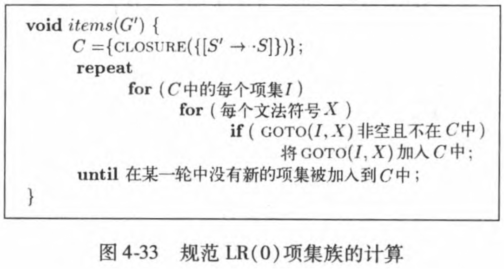

- 移入-规约决定：如果下一个输入符号为 $$a$$ 且状态 $$j$$ 有一个在 $$a$$ 上的转换，就移入 $$a$$。否则，我们就选择归约动作。
- 规约操作：如果栈中保存的是文法符号，那么归约就是通过将相应**产生式的体弹出**栈，并将**产生式头压入**栈中来实现的。

<div align=center>
    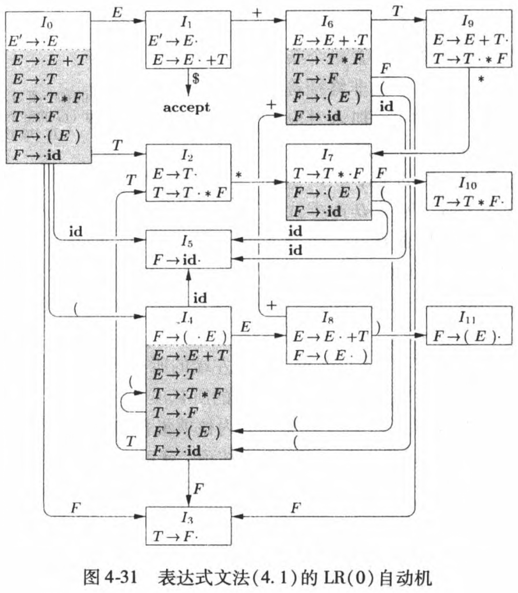
    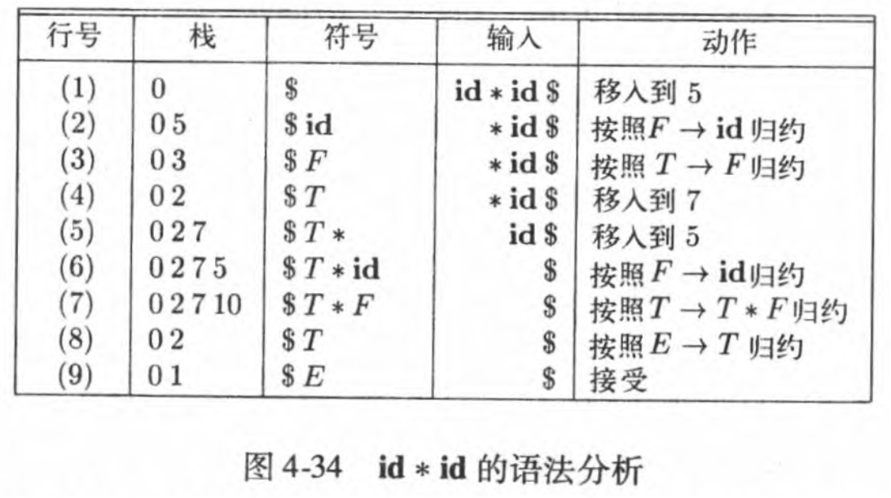
</div>
#### 4.6.3 - LR 语法分析算法

- LR 语法分析表的结构：一个语法分析动作函数 $$\mathrm{ACTION}$$（移入、规约、接受、报错）和一个转换函数 $$\mathrm{GOTO}$$。

- LR 语法分析器的格局：$$(s_0s_1\cdots s_m,a_ia_{i+1}\cdots a_n \ \$$)$$，第一个分量是栈中的内容（右侧是栈顶），第二个分量是余下的输入。

- LR 语法分析器的行为：主要注意规约 $$A \rightarrow \beta$$ 时，**先将 $$|\beta|$$ 个符号弹出栈，再压栈。**

  （$$\text{si}$$ 表示移入并将状态 $$i$$ 压栈，$$\text{rj}$$ 表示按照编号为 $$j$$ 的产生式进行归约。）

<div align=center>
    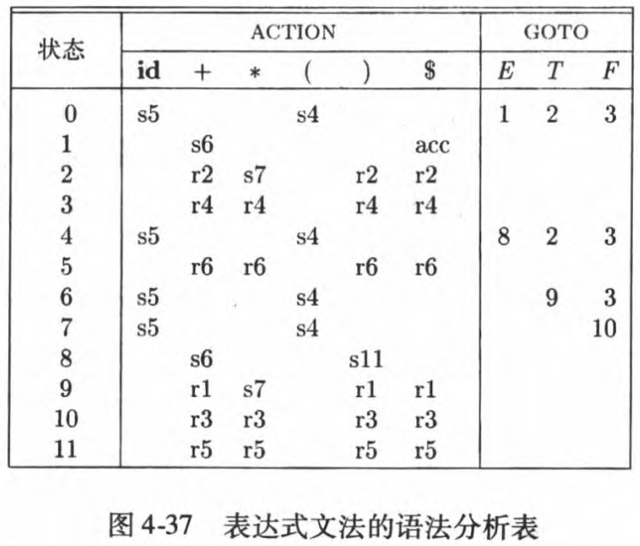
    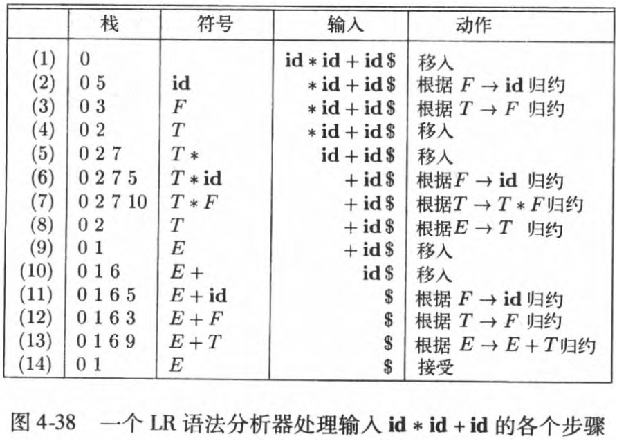
</div>
#### 4.6.4 - 构造 SLR 语法分析表

- SLR 分析是对 LR(0) 的改进，通过查看**非终结符的 $$\text{FOLLOW}$$ 集**（向前看符号）来解决冲突。

- 【重要】**构造 SLR 语法分析表：求出 LR(0) 项集族，写出 FOLLOW 集，画出框架，对照【每一个项集里的具体符号】来填表**

  1. 加入 $$S' \rightarrow S \cdot$$ 构成增广文法，用 $$\textrm{CLOSURE}$$ 和 $$\textrm{GOTO}$$ 得到所有 $$\textrm{LR}(0)$$ 项集，每个项集就是一个状态。

  2. 求出所有非终结符号的 $$\textrm{FOLLOW}$$ 集。

  3. **填 $$\textrm{ACTION}$$ 表**（由**【每个状态集中的状态】**决定！）：根据 $$I_i$$ 构造得到状态 $$i$$，
     - **移入（点后是终结符 $$a$$）**：如果 $$I_i$$ 有项 $$A \rightarrow \alpha \cdot a \beta$$，且 $$\textrm{GOTO}(I_i, a)=I_j$$，则将 $$\textrm{ACTION}[i,a]$$ 设置为 “移入 $$j$$”。
     - **归约（点在最右，且 $$\text{FOLLOW}$$ 集有终结符 $$a$$）**：如果 $$I_i$$ 有项 $$A \rightarrow \alpha \cdot$$，**则对 $$\textrm{FOLLOW}(A)$$ 中的每个符号 $$a$$，**将 $$\textrm{ACTION}[i,a]$$ 设置为 “规约 $$A \rightarrow \alpha$$”。
     - 接受：如果 $$I_i$$ 有项 $$S' \rightarrow S \cdot$$ ，则将 $$\textrm{ACTION}[i,\$$]$$ 设置为 “接受”。
     
  5. **填 $$\textrm{GOTO}$$ 表**：对于非终结符号 $$A$$，如果 $$\textrm{GOTO}(I_i,A)=I_j$$，那么 $$\textrm{GOTO}[i,A]=j$$。
  
  6. 语法分析器的初始状态就是根据 $$S' \rightarrow S \cdot$$ 所在项集构造得到的状态。
  
- **【重要】文法类型判定：LL(1) 不能有左递归、左公因子，SLR(1) 用 LR(0) 项集族和 FOLLOW 集构造的语法分析表不能有冲突。**
  - 一个文法 G 是 LL(1) 的，**当且仅当构造的预测分析表无冲突**，也就是 G 的任意两个不同产生式 $$A \to \alpha \mid \beta$$ 满足：
    - $$\text{FIRST}(\alpha)$$ 和 $$\text{FIRST}(\beta)$$ 是不相交的集合。
    - 如果 $$\epsilon$$ 在 $$\text{FIRST}(\beta)$$ 中，那么 $$\text{FIRST}(\alpha)$$ 和 $$\text{FOLLOW}(A)$$ 是不相交的集合，并且当 $$\epsilon$$ 在 $$\text{FIRST}(\alpha)$$ 中时类似结论成立。
  
  - 对于 SLR(1)，只有当一个状态同时出现“移进”和“归约”，且**移进的字符**恰好在**归约符号的 Follow 集**里时，才会失效。
  - 对于 LR(0)，只要状态中同时存在移入和归约项目，就会产生冲突，因为它不参考任何后续符号 。
  

### 4.7 - 更强大的 LR 语法分析器

#### 1. 规范 LR(1)

规范 LR(1) 分析器是最强大的一种 LR 分析器。

- **项目 (Item):** 使用 **LR(1) 项目**。一个 LR(1) 项目形如 $$[A \rightarrow \alpha \cdot \beta, \ a]$$，其中 $$A \rightarrow \alpha \beta$$ 是文法产生式，而 $$a$$ 是**向前看符号 (Lookahead Symbol)**。
- **向前看符号的作用：** $$a$$ 严格限制了当点 $$\cdot$$ 移到产生式末尾时（即归约发生时），允许在输入中出现的下一个符号。
- **分析能力：** **最强**。它可以识别所有 LR(1) 文法。
- **表大小：** **最大**。由于向前看符号是项目集的一部分，即使两个项目集的核心（即点 $$\cdot$$ 的位置）相同，只要它们的向前看符号集不同，它们就会被视为两个独立的状态。这导致分析表状态数量庞大，难以在实践中应用。
- **冲突解决：** 具有最精确的向前看信息，因此在归约时能做出最准确的判断，**消除的冲突最多**。

#### 2. LALR(1) (Lookahead LR)

LALR(1) 分析器在实践中应用最广泛，它是对 CLR(1) 分析表进行优化和压缩的产物。

- **构造方法：** LALR(1) 分析表是在构造出 CLR(1) 项目集规范族后，将**具有相同核心**（即忽略向前看符号后项目完全相同）的多个 CLR(1) 状态**合并**为一个状态。
- **向前看信息：** LALR(1) 保留了 CLR(1) 的**精确向前看信息**，但通过合并状态，可能将原本属于不同状态的向前看集合并在一起。
- **分析能力：** 略弱于 CLR(1)。LALR(1) 能够处理所有 LALR(1) 文法。
  - **LALR(1) 无法识别的文法：** LALR(1) 只能产生 **归约-归约冲突**，不会产生 CLR(1) 中不存在的**移进-归约冲突**。但由于合并了状态，如果两个被合并状态中包含两个不同产生式的归约项目，并且它们的向前看集合并后出现交集，就会产生 CLR(1) 中不存在的归约-归约冲突。
- **表大小：** **适中**。其状态数与 SLR(1) 相同，但分析能力更强，是**效率和能力平衡的最佳选择**。

#### 3. SLR(1) (Simple LR)

SLR(1) 是最简单、最容易构造的一种 LR 分析器。

- **项目 (Item):** 使用 **LR(0) 项目**，即 $$[A \rightarrow \alpha \cdot \beta]$$，不包含向前看符号。
- **归约决策：** 当点 $$\cdot$$ 移到产生式末尾时（如 $$A \rightarrow \alpha \cdot$$），SLR(1) 使用**全局**的 $$\text{FOLLOW}(A)$$ 集合来确定归约操作是否应该进行。
- **分析能力：** **最弱**。只能识别所有 SLR(1) 文法。
- **表大小：** **最小**。状态数基于 LR(0) 项目集。
- **冲突问题：** 由于使用全局的 $$\text{FOLLOW}$$ 集，它包含许多在该特定状态（上下文）下不可能出现的符号，这会导致**不必要的（假性）移进-归约冲突**和**归约-归约冲突**。

| **特性**     | **SLR(1)**                     | **LALR(1)**                       | **CLR(1)**                           |
| ------------ | ------------------------------ | --------------------------------- | ------------------------------------ |
| **文法能力** | 最弱（SLR 文法）               | 强（LALR 文法）                   | **最强**（LR(1) 文法）               |
| **项目类型** | LR(0) 项目（无向前看符号）     | LR(1) 核心项目 + 合并的向前看集合 | **LR(1) 项目**（包含精确向前看符号） |
| **归约决策** | 基于**全局** $$\text{FOLLOW}$$集 | 基于**局部、精确**的向前看符号    | 基于**局部、精确**的向前看符号       |
| **状态数量** | 最少 (与 LR(0) 相同)           | 适中 (与 SLR(1) 相同)             | **最多**                             |
| **冲突消除** | 最差（易产生假冲突）           | 优秀                              | **最佳**                             |

## 第 5 章 语法制导的翻译

### 语法制导定义 SDD

- **语法制导定义** SDD：将文法符号和某些属性相关联，并通过语义规则来描述如何计算属性的值。
  - 综合属性 **syn**thesized attribute：信息从下往上传递，比如表达式求值、拼接字符串等。
  - 继承属性 **inh**erited attribute：信息从上往下或横向传递，比如类型等。（终结符号没有继承属性）
- **注释语法分析树（下图）**：一个显示了各个属性值的语法分析树。

<div align=center>
    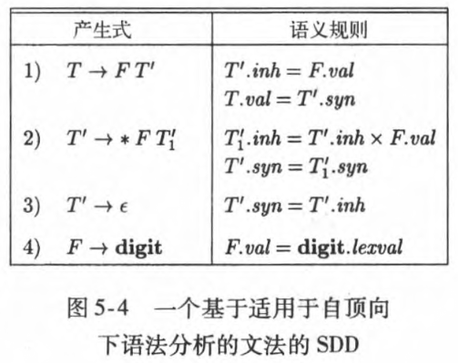
    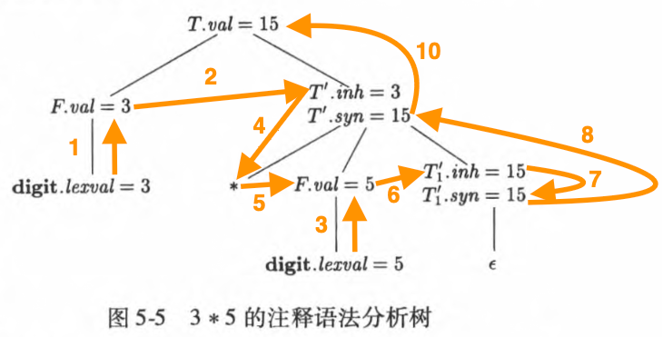
</div>

- S 属性：只包含综合属性的 SDD 称为 S 属性的 SDD，它可以和 LR 语法分析器一起实现。

- L 属性：每个属性要么是综合属性，要么是来自上边父节点 / 左边兄弟的继承属性。

### 【重要】构造自顶向下 SDD 语义规则的套路

1. 消除左递归
2. 属性传递的通用模式：在无左递归文法中，**$$A'$$ 总是处理 $$\alpha$$ 串，它需要知道 $$\beta$$ 部分计算出的初始值**。因此，属性传递总是遵循以下模式：

| **产生式**                   | **属性**                                                     | **作用**                                                     | **类型** |
| ---------------------------- | ------------------------------------------------------------ | ------------------------------------------------------------ | -------- |
| **1. **$$A \to \beta A'$$      | $$\mathbf{A'.inh} = \beta.\mathbf{val}$$                       | $$\beta$$ 计算出**初始值**，通过**继承属性**$$A'.inh$$ 传递给 $$A'$$。 | **继承** |
|                              | $$\mathbf{A.syn} = A'.\mathbf{syn}$$                           | $$A'$$ 计算出**最终值**，通过**综合属性** $$A'.syn$$返回给 $$A$$。 | **综合** |
| **2. ** $$A' \to \alpha A'_1$$ | $$\mathbf{A'_1.inh} = \mathbf{A'.inh} \ \text{op} \ \alpha.\mathbf{val}$$ | $$A'.inh$$ 接收**当前累积值**，与 $$\alpha$$ 的值运算后，<br />作为**新的累积值**传递给 $$A'_1$$。 | **继承** |
|                              | $$\mathbf{A'.syn} = A'_1.\mathbf{syn}$$                        | 最终值由下一层 $$A'_1$$ 返回。                                 | **综合** |
| **3. ** $$A' \to \epsilon$$    | $$\mathbf{A'.syn} = \mathbf{A'.inh}$$                          | 递归结束，**当前累积值**就是最终结果。                       | **综合** |

| 属性类型                   | **作用**                                                     | **适用情况**                                                 |
| -------------------------- | ------------------------------------------------------------ | ------------------------------------------------------------ |
| **Inherited (inh) 继承**   | **传递上下文信息或累积值**。用于将信息从父节点/左兄弟节点传递给子节点/右兄弟节点。 | **自顶向下分析**中处理**消除左递归**的**递归非终结符**（$$E', T'$$）。它是计算**累积值**的输入。 |
| **Synthesized (syn) 综合** | **返回计算结果**。用于将信息从子节点传递回父节点。           | 1. **基本单元**（如 $$F \to \mathbf{digit}$$）返回其值。2. **递归终结**（$$E' \to \epsilon$$）返回最终累积值。3. **启动非终结符**（$$E, T$$）返回整个表达式的值。 |

### 语法制导翻译 SDT


- **语法制导翻译** SDT：在产生式体中加入语义动作，并在适当的时候执行这些语义动作。

- 后缀翻译方案：所有动作都在产生式最右端的 SDT 称为后缀翻译方案。

- 从 SDT 中消除左递归：

  - 如果动作不涉及属性值，可将动作当成终结符号处理，动作的位置和顺序要像终结符号一样严格保留。

  - 当动作是计算属性的值时，一般转换形式如下：

    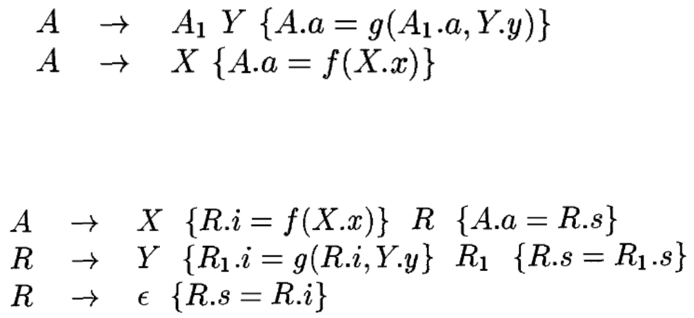

    为什么有些语义动作不能放到末尾？以 $$R \rightarrow Y \{R_1.i=\dots	\} R_1 \{\dots\}$$ 为例，如果动作放到末尾，$$R \rightarrow YR_1 \{R_1.i=\dots\}$$，那么顺序为：分析器推导 $$R$$ $$\to$$ 解析 $$Y$$ $$\rightarrow$$  **解析 $$R_1$$** $$\rightarrow$$ **$$R_1$$ 在被解析时，它需要的继承属性 $$R_1.i$$ 仍是未定义的！** $$\rightarrow$$  $$R_1$$ 无法正常工作，它会尝试访问一个空值。

    $$\Rightarrow$$ 【重要】由于继承属性的计算依赖于父节点/左兄弟节点的属性，故**在解析任何非终结符之前，它的所有继承属性必须被计算出来。**

  - 例：下面的 SDT 计算了一个由 0 和 1 组成的串的值。它把输入的符号串当做正二进制数来解释。

    ```
    B -> B_1 0 {B.val = 2 * B_1.val}
       | B_1 1 {B.val = 2 * B_1.val + 1}
       | 1 {B.val = 1}
    ```

    消除左递归后得

    ```
    B -> 1 {A.i = 1} A
    A -> digit {A_1.i = 2 * A.i + digit.val} A_1 {A.val = A_1.val}
       | ε {A.val = A.i}
    digit -> 0 {digit.val = 0} 
           | 1 {digit.val = 1}
    ```

###  如何在 SDT 中实现 L 属性

1. 继承属性的动作位置：计算子符号 $$X_k$$ 的继承属性的动作，必须放在**紧靠 $$X_k$$ 的左边**。**示例：** $$S \to \mathbf{do} \ \{\mathbf{S_1.next} = L2;\} \ \mathbf{S_1}$$
2. 综合属性的动作位置：计算产生式左部 $$S$$ 的综合属性的动作，必须放在**右部所有符号的右边**。**示例：** $$S \to \dots \ C \ S_1 \ \{\mathbf{S.code} = \dots \}$$
3. 局部变量/标签的处理（如 $$L1, L2$$）：在 L 属性 SDT 中，像 $$L1, L2$$ 这样的局部变量（标签）被视为产生式第一个语义动作的**临时综合属性**。它们必须在产生式**右侧所有符号之前**被计算出来，以便后续的 inh 属性计算可以使用它们。

### SDD 与 SDT 的区别

| **概念**   | **SDD (语法制导定义)**                                       | **SDT (语法制导翻译)**                                       |
| ---------- | ------------------------------------------------------------ | ------------------------------------------------------------ |
| **全称**   | Syntax-Directed **Definition**                               | Syntax-Directed **Translation**                              |
| **侧重**   | **定义 (What):** 描述文法符号属性之间的**数学关系**，<br />定义了编译器需要达成的目标。 | **实现 (How):** 描述翻译过程中**何时**、**以何种顺序**执行语义动作，<br />是对 SDD 的一种实现。 |
| **形式**   | 文法产生式 **+** 语义规则（赋值语句）。                      | 文法产生式 **+** 嵌入在产生式右侧的**语义动作**<br />（用花括号 $$\{\dots\}$$ 包裹的指令）。 |
| **约束**   | **没有**关于属性求值顺序的约束，只需要属性图无环即可。       | 动作位置至关重要，决定了翻译过程中代码的**执行顺序**。       |
| **适用性** | 适用于所有文法。                                             | 适用于 LL(1) 或 LR(1) 等特定分析器。                         |

## 第 6 章 中间代码生成

- 表达式的**有向无环图** (Directed Acyclic Graph, **DAG**)：指出了表达式中的公共子表达式，更简洁地表示表达式。

### 6.2 - 三地址代码

- **三地址代码**（如下图）：包含三个地址的指令 $$x=y \ \textbf{op} \ z$$，每条指令右侧最多有一个运算符。地址：用来表示数据的“名字”。
  - 带下标的复制指令：$$x=y[i],x[i]=y$$，注意：**$$i$$ 表示离开数组位置第 $$i$$ 个字节，而不是数组的第 $$i$$ 个元素！**
  - **四元式**：有四个字段，分别称为 $$op$$、$$arg_1$$、$$arg_2$$、$$result$$，代表运算符的内部编码、参数 1 **地址**、参数 2 **地址**、结果**地址**。
    **单目运算符不使用 $$arg_2$$**，条件转移/非条件转移将目标标号放在 $$result$$ 字段。指令位置变化时，四元式不受影响。
  - **三元式**：有三个字段 $$op$$、$$arg_1$$、$$arg_2$$，少了 $$result$$，用结果三元式对应的位置标号代替。指令位置变化时，三元式会改变。
  - **间接三元式**：包含了一个指向三元式的指针的列表，而不是列出三元式序列本身。优化编译器可以通过对列表重新排序来移动指令的位置，但不影响三元式本身。


<div align=center>
	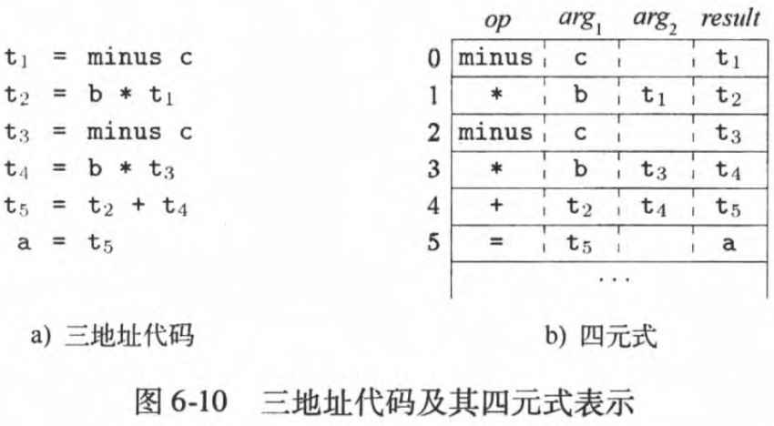
	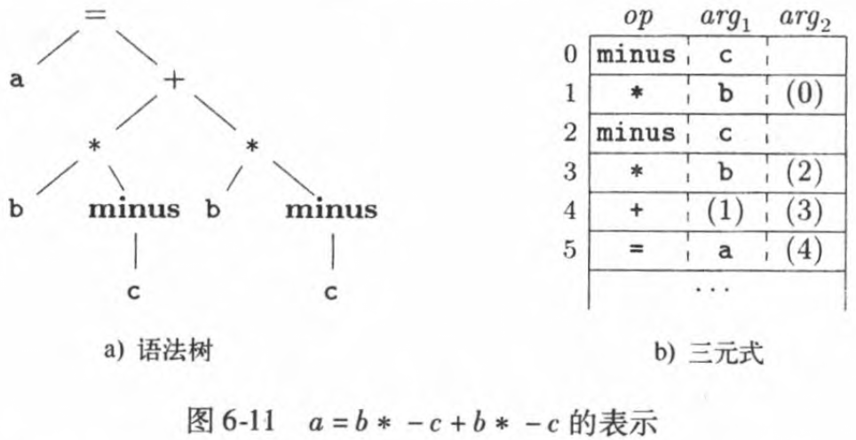
	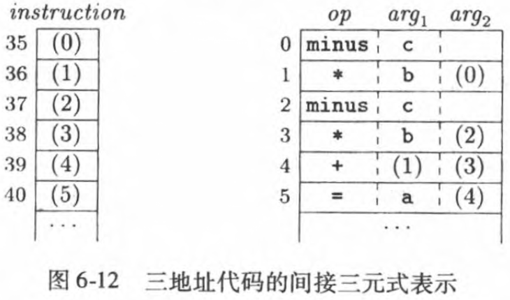
</div>

- 静态单赋值 SSA：**每个变量（名）只会被赋值一次**。当原始程序中的变量 $$x$$ 被多次赋值时，SSA 会为每次赋值生成一个新的、唯一的变量名（例如 $$x_1,x_2,x_3$$）。对于同一个变量在不同路径中定值的情况，可以使用 $$\Phi$$ 函数来合并不同的定值。

### 6.3 - 类型和声明

- 类型检查：利用一组规则来检查运算分量的类型和运算符的预期类型是否匹配。

- **类型表达式**：表示类型的结构。包含：基本类型（int）、类名（MyClass）、**类型构造算子作用于类型**（array、record、函数类型构造算子、笛卡尔积）、取值为类型表达式的变量（泛型 T）。
  
  - 例子：元素个数为 3x4 的二维数组，数组元素为记录类型，该记录类型中包含两个字段: x 和 y，其类型分别是 float 和 integer：
    `array[3,array[4,record[(x,float),(y,integer)]]]`
  
- **类型等价：**
  - **结构等价**（三选一）：**完全忽略了类型名称本身**，只关注类型如何由基本类型和构造算子构建而成。
    1. 它们是相同的基本类型（如 int、float）。
    2. 它们是相同的构造算子作用于结构等价的类型而得到的。
    3. 一个类型是另一个类型表达式的名字。
  - **名等价：类型名仅仅代表其自身。**
  
- **声明**：$$D$$ 生成一个声明列表，$$T$$ 生成不同的类型，$$B$$ 生成基本类型 int/float，$$C$$ 表示分量，生成 $$[\ \textbf{num}\ ]$$ 序列。

  

- 计算类型和宽度的 SDT（如下图）：$$B$$ 负责生成基本类型，$$C$$ 类似于构造算子，把结果返回给 $$T$$。$$t$$ 和 $$w$$ 为全局变量。

<div align=center>
    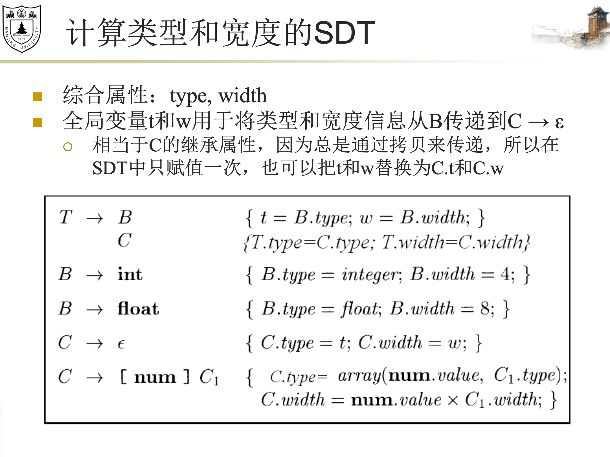
    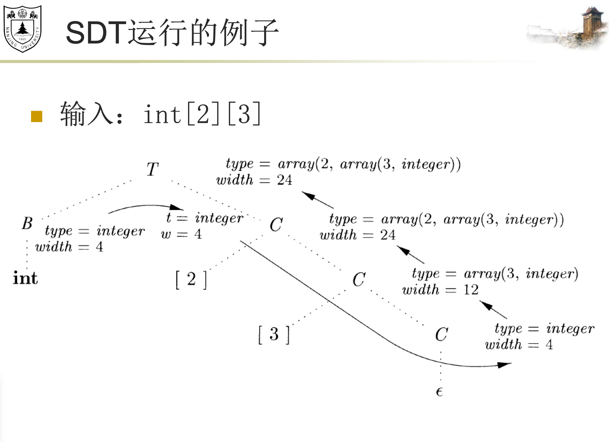
</div>

- 声明序列的 SDT：用于确定类型在符号表中的位置。变量 $$\mathit{offset}$$ 记录当前可用的相对地址。$$\mathit{top.put(\mathbf{id}.lexeme, T.type, offset)}$$ 表示在当前符号表（位于栈顶）中创建符号表条目，记录标识符的类型、偏移量。

  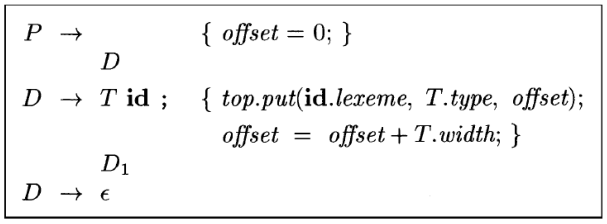

### 6.4 - 表达式的翻译

- **表达式代码的 SDD：将表达式翻译成三地址指令序列。**属性 $$code$$ 表示代码，$$addr$$ 表示存放表达式结果的地址（临时变量），$$\textbf{new} \ \textit{Temp}()$$ 可以生成一个临时变量，$$gen()$$ 生成一个指令。先计算子节点代码，再将子代码串联成父节点代码 $$.code$$。

  <div align=center>
      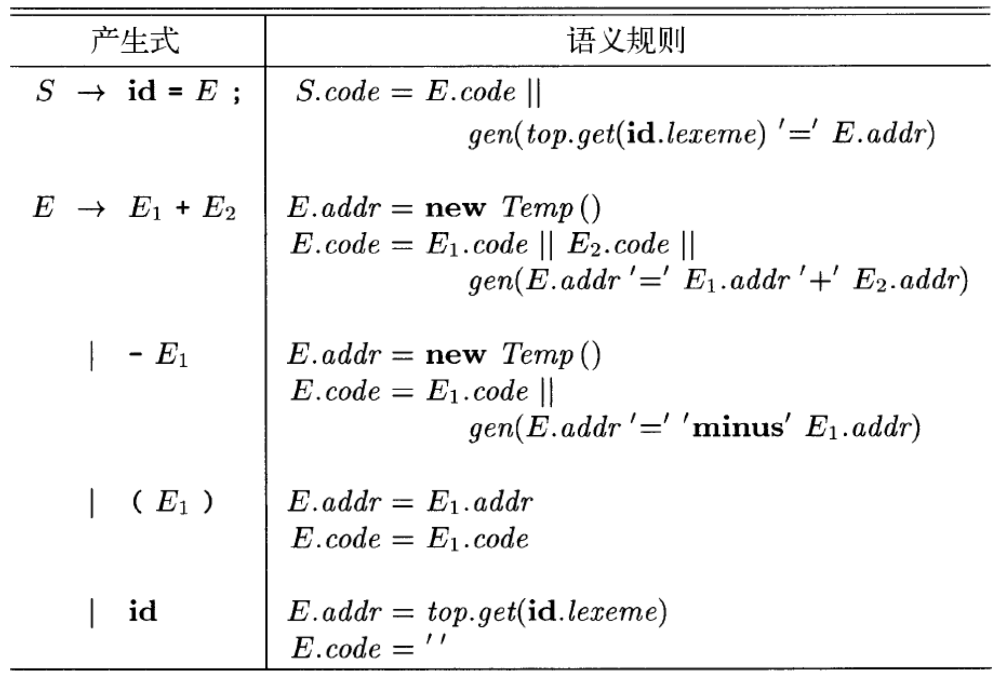
      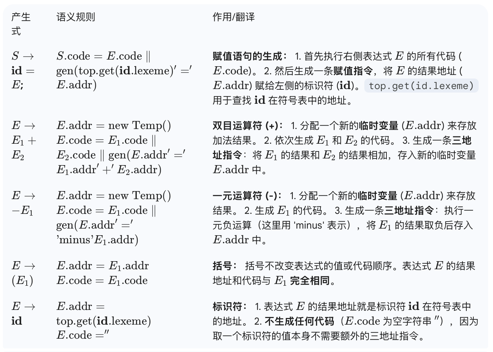
  </div>

- **增量式翻译方案（下图）：在识别出语法结构的瞬间，直接输出对应的中间代码，而不是将它们收集起来作为属性传递。**（懂了！）
  区别：在语法制导定义中，$$gen()$$ 构造出一条指令并返回它；在翻译方案中，$$gen()$$ 构造出一条指令，并增量地将它添加到指令流中去。

- 数组引用（形如 $$A[i]$$）生成代码的翻译方案：**计算地址** + 值的获取/存储。

  - $$L.addr$$ 指示一个临时变量，计算数组引用的偏移量
  - $$L.array$$ 是一个指向数组名字对应的符号表条目的指针，$$L.array.base$$ 为该数组的基地址
  - $$L.type$$ 是 $$L$$ 生成的子数组的类型，对于任何数组类型 $$t$$，其宽度由 $$t.width$$ 给出，$$t.elem$$ 给出其数组元素的类型。

  <div align=center>
      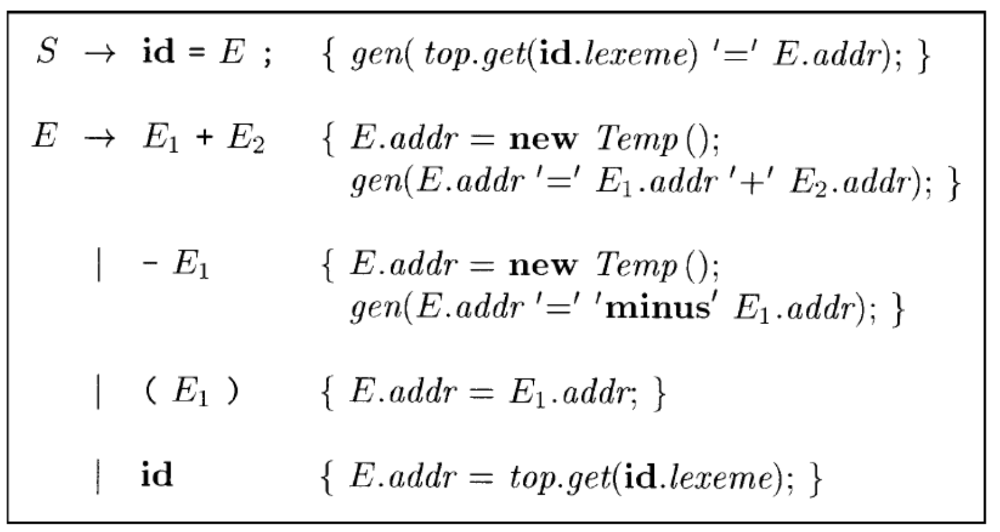
      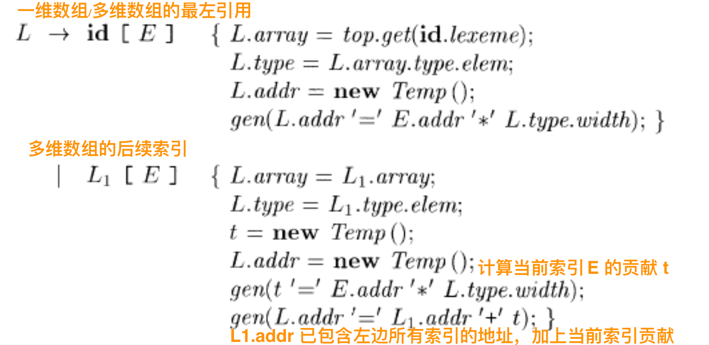
  </div>

- 【例】假设 $$a$$ 是一个 2x3 的整数数组，$$c,i,j$$ 都是整数，求表达式 $$c+a[i][j]$$ 的三地址代码？
  易知 $$a$$ 的宽度是 24，$$a[i]$$ 的宽度是 12，$$a[i][j]$$ 的宽度是 4。先求 $$i$$ 的贡献，再求 $$j$$ 的贡献，把他俩相加即可得到索引，取出对应元素。

  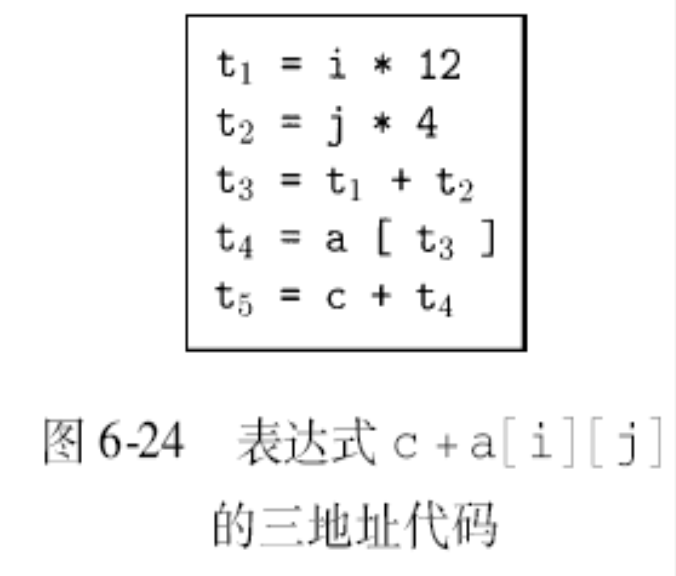

### 6.5 - 类型检查

- 类型系统：给每一个组成部分赋予一个类型表达式，通过一组逻辑规则来表示这些类型表达式必须满足的条件。
  - 类型综合：根据子表达式的类型构造出表达式的类型。
  - 类型推导：根据语言结构的使用方式来确定该结构的类型。

### 6.6 - 控制流

- rel 代表关系运算符（<、<=、=、!=、>、>=）。&& 和 || 左结合，优先级 || 最低，&& 其次，! 最高。

- 控制流语句翻译分析（左图）、布尔表达式的控制流翻译（右图）

    <div align=center>
        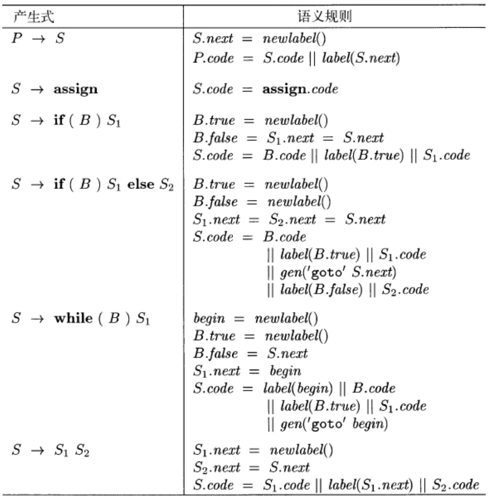
        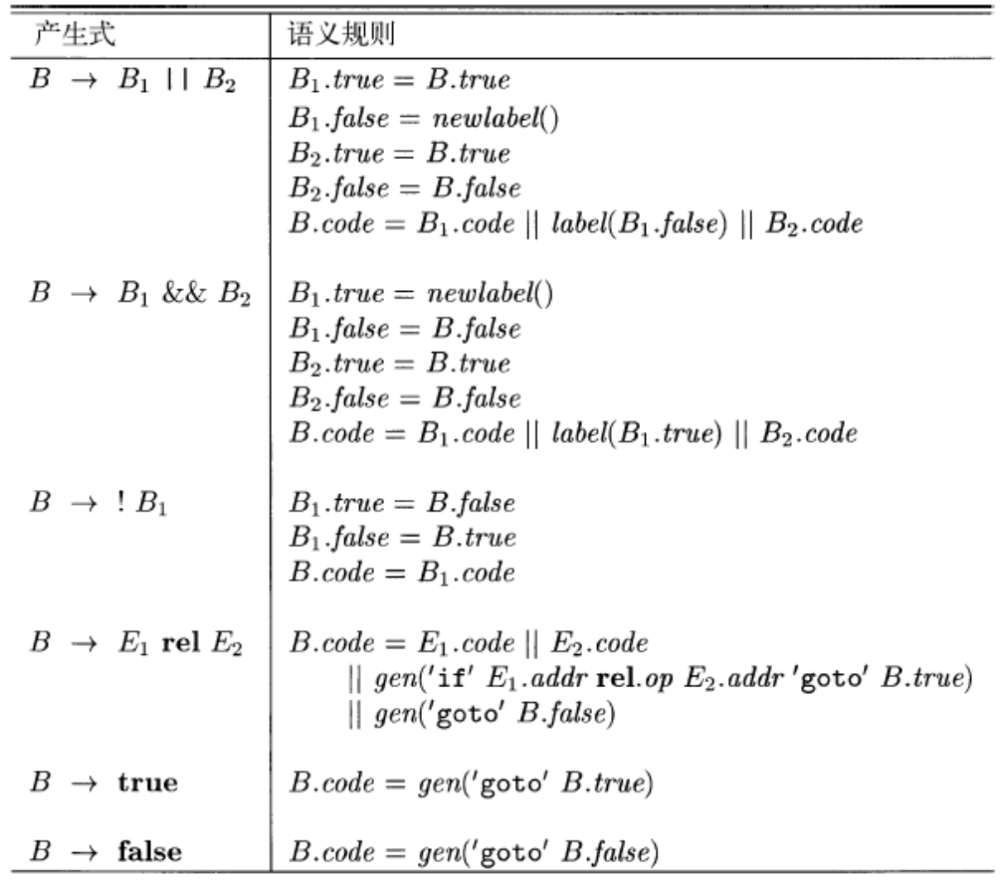
    </div>
    - $$P$$：代表程序的开始符号。
    
    
    - $$B$$：代表布尔表达式，有继承属性 $$B.true$$ 和 $$B.false$$（标号），**表示 $$B$$ 为真/假时应该跳转的位置**。
    
    
    - $$S$$：代表语句，有继承属性 $$S.next$$，表示跳转下一条语句的位置。
    
    
    - $$label$$ 标号：用来标记程序某个位置的名字，方便跳转或分支时定位。
    
    
    - $$fall$$ 穿越：一种特殊标号，表示“不要生成任何跳转指令”，让控制流自然顺序流动到下一条语句。用于消除冗余的 $$goto$$ 指令。
    

### 6.7 - 回填 Backpatching

<div align=center>
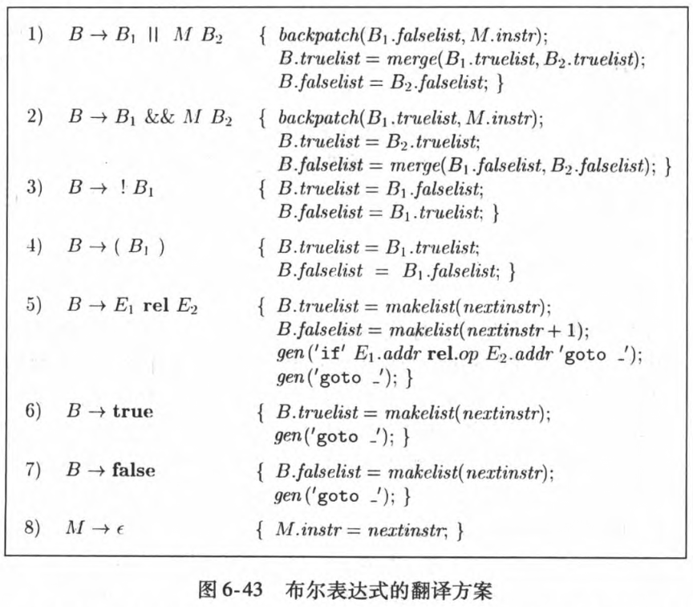
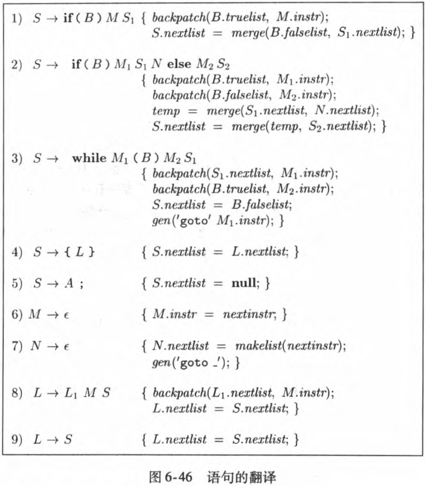
</div>
- **回填**：生成跳转指令时，暂时不指定跳转目标标号，而是使用列表记录这些不完整的指令，等知道正确的目标时再填写目标标号。
- $$\textit{truelist/falselist}$$: 包含跳转指令**位置**的列表，这些指令在取值 $$true/false$$ 时执行。（存的不是标号的名字，而是指令的行号！）
- $$Backpatch(p,i)$$：将 $$i$$ 作为目标标号，插入到 $$p$$ 所指列表中的各指令中。
- **$$M$$：用 $$M.instr$$ 记录下一个指令的位置，类似于 $$label$$。为了获得指令序号，我们将产生式 $$M-ε$$ 和语义动作 $$\{\mathit{M. instr = nextinstr;}\}$$ 关联起来。**（非回填方法生成 $$label$$ 的地方，在回填方案中使用 $$M$$ 来记录相应的代码位置）
- 用我的话讲，以 1) 为例子：

  - 先看 B1。假设 B1 正确，往 X 跳，那么 B 也跟着正确，往 X 跳。所以 B.truelist 包含 B1.truelist。
  - 如果 B1 错误，只能往 M 跳。因此 backpatch(B1.falselist, M.instr)。
  - 接下来，如果 B2 正确，往 X 跳，那么 B 也跟着正确，往 X 跳。所以 B.truelist 包含 B2.truelist。
  - 最后，如果 B2 错误，往 Y 跳。那么 B 也跟着错误，往 Y 跳。所以 B.falselist 包含 B2.falselist。


## 第 7 章 运行时刻环境（RTE）

- **运行时刻环境（Run-Time Environment, RTE）**：是编译器和目标机器上的系统软件（如操作系统、加载器、库函数等）共同为目标程序提供的执行上下文和支持系统。负责为数据分配安排存储位置；确定访问变量时使用的机制；过程之间的连接；参数传递；和操作系统、输入输出设备相关的其它接口。

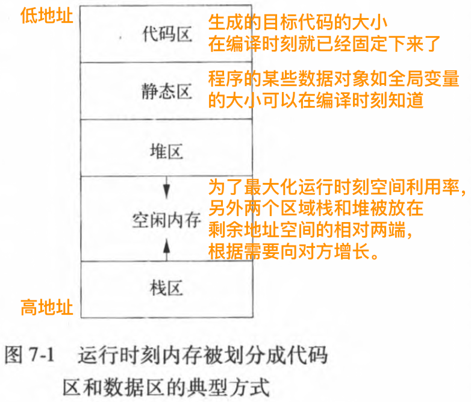

### 7.2 - 空间的栈式分配

- 静态分配：编译器在编译时刻就可以做出存储分配决定，不需要考虑程序运行时刻的情形，如全局变量。

- 动态分配：栈式存储、堆存储。

- 活动树（下图）：程序运行的所有过程活动可以用树表示。

- **活动记录 Activation Records：**过程调用和返回由控制栈进行管理，**每个活跃的活动对应于栈中的一个活动记录**，活动记录按照活动的开始时间，从栈底到栈顶排列。（布局原则如图）

- 调用/返回：调用代码序列：为活动记录分配空间，填写记录中的信息；返回代码序列：恢复机器状态，使调用者继续运行。

<div align=center>
  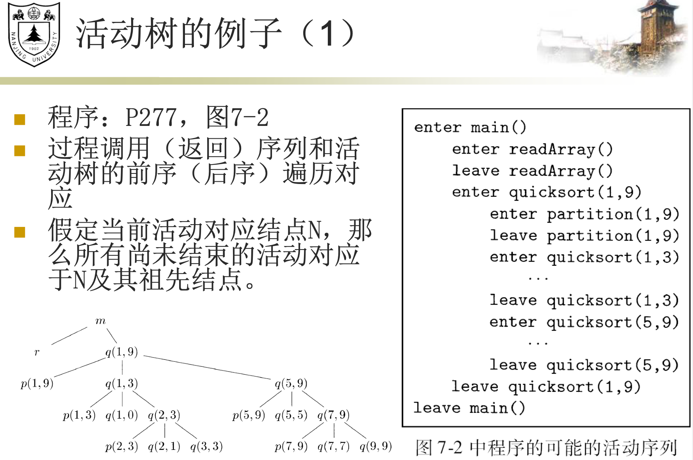
  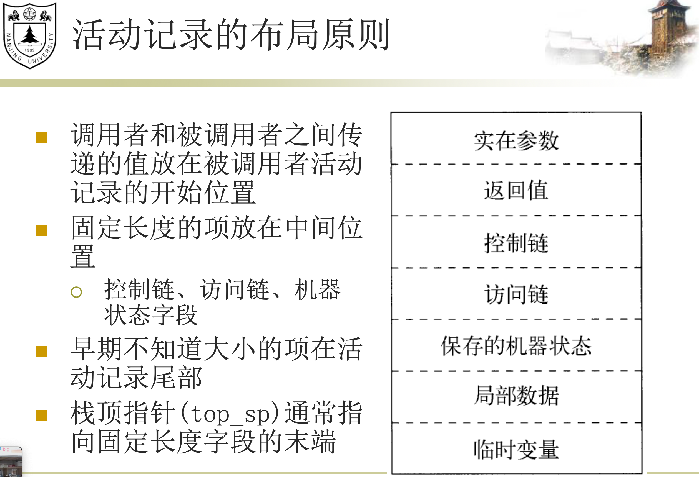
</div>
### 7.3 - 栈中非局部数据的访问（嵌套）

<div align=center>
    
    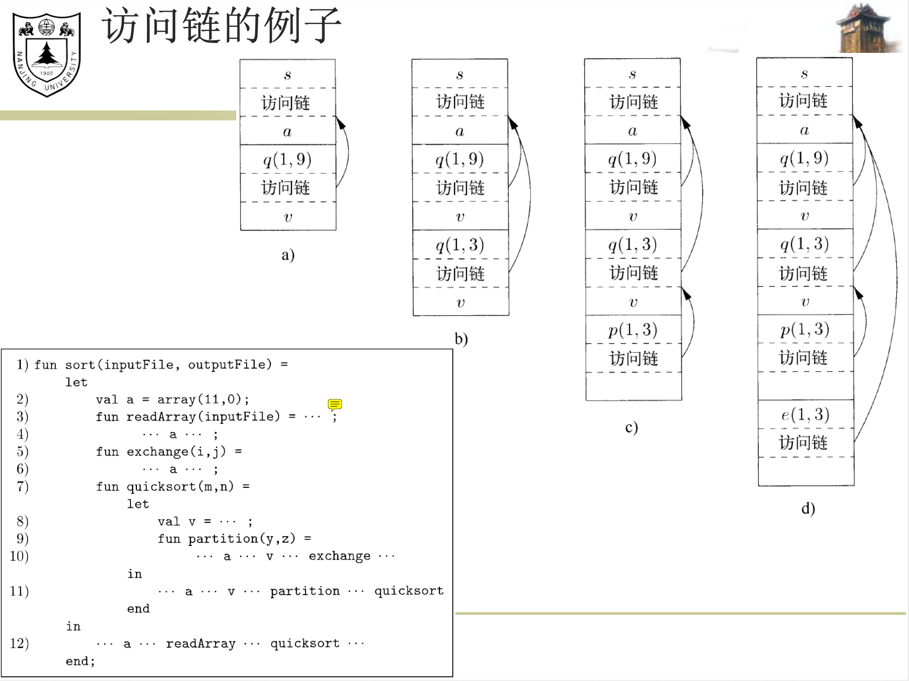
</div>

- 嵌套深度（可静态确定）：不内嵌于任何其他过程中的过程，嵌套深度为 1；嵌套在深度为 $$i$$ 的过程中的过程，深度为 $$i+1$$。
- 【重要】**访问链**：如果过程 $$p$$ 在声明时嵌套在过程 $$q$$ 的声明中，那么 $$p$$ 的活动记录中的访问链指向最上层的 $$q$$ 的活动记录。（举例如图）
  - 解决矛盾：$$B$$ 想要访问它外部的 $$A$$ 的变量，但 $$B$$ 的调用者可能是 $$C$$，而不是 $$A$$，$$A$$ 的活动记录可能在栈的某个更深处（如图）。
  - 作用：允许一个内嵌过程 $$P$$​ 准确地访问其外部过程中声明的变量。
  - 形式：**从栈顶活动记录开始**，访问链形成了一个链路，嵌套深度沿着链路逐一递减。
  - 注意：**访问链只关注程序代码的静态嵌套结构，而不关心程序运行时实际的调用关系！**例如，设深度为 $$n_p$$ 的过程 $$p$$ 访问变量 $$x$$，而变量 $$x$$ 在深度为 $$n_q$$ 的过程中声明，那么 $$n_p-n_q$$ 在编译时刻已知。从当前活动记录出发，沿访问链前进 $$n_p-n_q$$ 次，找到的活动记录中的 $$x$$ 就是要找的变量位置。$$x$$ 相对于这个活动记录的偏移量在编译时刻已知。
- 【重要】**显示表**：数组 $$d$$ 为每个嵌套深度保留一个指针。其中，指针 $$d[i]$$ 指向栈中**最高的（也就是最新的）、嵌套深度为 $$i$$ 的过程的活动记录**。
  - 目的：消除访问链中长链追溯带来的显著的运行时开销，极大地提高了嵌套过程语言中访问非局部数据的效率。
  - **维护：调用过程 $$p$$ 时，在 $$p$$ 的活动记录中保存 $$d[n_p]$$ 的旧值，并将 $$d[n_p]$$ 设置为当前活动记录 $$p$$。从 $$p$$ 返回时，恢复 $$d[n_p]$$ 的旧值。**

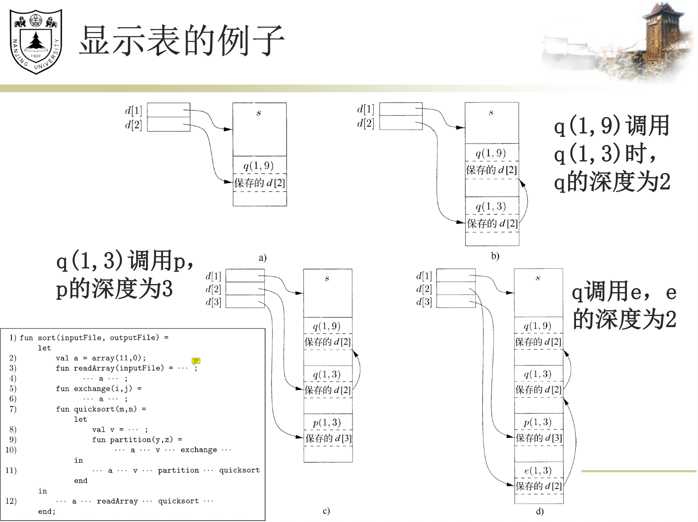

### 7.4 - 堆管理

- **堆空间**：用于存放生命周期不确定、或生存到被明确删除为止的数据对象，例如 new-delete, malloc-free。
  - 分配：Best-Fit 总是将请求的内存分配在满足请求的最小的窗口中；First-Fit 总是将对象放置在第一个能够容纳请求的窗口中。
  - 使用容器的堆管理方法：设定不同大小的空闲块规格，相同规格的块放在同一容器中，较小的（较常用的）尺寸设置较多的容器。
- 存储管理器：分配/回收堆区空间的子系统。
  - 分配：为每个内存请求分配一段连续的、适当大小的堆空间。
  - 回收：把被回收的空间返回空闲空间缓冲池，以满足其他内存需求。回收时，可以把回收块和相邻块接合起来，构成更大的块。

### 7.5 - 垃圾回收

- **垃圾**：不能被引用（不可达）的数据。

- **可达性**：指一个存储块可以被程序访问到的性质。

  - 根集（Java：静态成员、栈中变量）：不需要指针解引用就可以直接访问的数据。根集的成员都是可达的。
  - 对于任意一个对象，如果指向它的一个指针被保存在可达对象的某字段中、或数组元素中，那么这个对象也是可达的。
  - 性质：一旦一个对象变得不可达，它就不会再变成可达的。

- 【重要】**基于引用计数的垃圾回收器**：**每个对象有一个用于存放引用计数的字段，可统计当前指向这个对象的引用的数量**，按照如下方式维护：

  - 对象分配：返回一个指向新存储块的引用。引用计数设为 1。
  - 参数传递：函数调用时将实参传递给形参，或执行完毕时将返回值传递给调用者。引用计数加 1。
  - 引用赋值 $$u=v$$：$$v$$ 的引用被复制到 $$u$$ 中，$$u$$ 中原来的引用丢失。$$u$$ 指向的对象引用减 1，$$v$$ 指向的对象引用加 1。
  - 过程返回：一个函数/过程执行完毕并返回到调用者。局部变量指向对象的引用计数减 1。

  如果一个对象的引用计数为 0，在删除对象之前，此对象中各个指针所指对象的引用计数减 1。

  优缺点：不会引起停顿。但是开销较大，且回收器有缺陷，可能引起内存泄漏，例如“**循环垃圾”**：一组互相引用的对象，没有来自外部的引用指向它，是逻辑上不可达的垃圾。

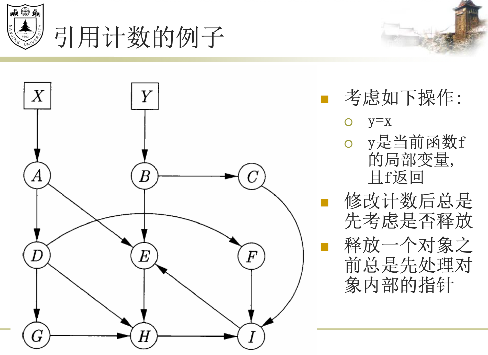

- 基于跟踪的垃圾回收：跟踪相关操作，捕获对象变得不可达的时刻，回收对象占用的空间。

  - 标记-清扫式垃圾回收：一种直接的、全面停顿的算法。分成两个阶段：

    - 标记：从根集开始，**跟踪并标记**出所有可达对象，即从根集开始的图遍历的过程。每个存储块处于四种状态之一：空闲、未被访问、待扫描、已扫描。
    - 清扫：遍历整个堆区，**释放不可达对象**。

    优缺点：能够完全解决循环引用问题。但会导致碎片化：清除阶段只是简单地回收内存，空闲空间形成许多小而分散的空闲块。

  - 压缩并标记垃圾回收：在标记之后**增加压缩阶段**，把可达对象移动到堆区的一端，另一端则是空闲空间。消除碎片化，但开销大。

  - 拷贝回收器：**堆空间被分为两个半空间**。应用程序在某个半空间内分配存储，当**充满这个半空间时，开始垃圾回收**。回收时，可达对象被**拷贝到另一个半空间**。回收完成后，两个半空间**角色对调**。效率高且无碎片化，但空间利用率低。

## 第 8 章 代码生成

### 8.4 - 基本块和流图

- **基本块** basic block：一段由**三地址指令**组成的序列，满足以下两个条件：

  1. **只有一个入口点：** 控制流只能从序列的**第一条指令**进入。
  2. **只有一个出口点：** 除了最后一条指令外，序列中的其他指令都**不会**导致程序控制流的跳转或停顿。

  - 性质： 编译器一旦开始执行基本块的第一条指令，就可以确定该块内的所有指令都会按顺序且无中断地执行到最后一条指令。

  - 用途： 基本块是进行**局部优化**的天然边界。例如，可以在一个基本块内部安全地进行公共子表达式消除、死代码消除等优化。

- **基本块的划分方法**：

  1. **确定首指令**：第一个三地址指令、任意一个条件/无条件转移指令的**目标指令**、紧跟在一个条件/无条件转移指令**之后的指令。**

  2. 确定基本块：每个首指令对应于一个基本块，包括从它开始到下一个首指令或中间程序的结尾指令之间的所有指令。

- 后续使用信息

  - **变量值的使用** use：假设三地址语句 $$i$$ 向 $$x$$ 赋值，如果另一语句 $$j$$ 的一个运算分量为 $$x$$，且从 $$i$$ 开始**有一条**没有对 $$x$$ 进行赋值的路径到达 $$j$$，那么 $$j$$ 就**使用**了 $$i$$ 处计算得到的 $$x$$ 的值。
    - 简单来说，就是**在 $$j$$ 引用 $$x$$ 之前， $$x$$ 的值一直没有被其他人动过，所以 $$x$$ 仍然是 $$i$$ 算出来的值。**

  - **变量值的活跃** live：上述情况下，称 $$x$$ 在语句 $$i$$ 后的程序点上**活跃**。
    - 即**在程序执行完语句 $$i$$ 的时刻，$$x$$ 中存放的值将被后面的语句使用。**
    - 不活跃是指变量中**存放的值**不会被使用，而不是变量不会被使用。

- 【重要】确定基本块中的活跃性、后续使用（**反向数据流分析方法**）

  - 输入：基本块 $$B$$，开始时 $$B$$ 的所有非临时变量都是**活跃**的。
  - 输出：各语句 $$i$$ 上的变量的活跃性、后续使用信息。
  - 方法：从 $$B$$ 的**最后一个语句开始反向扫描**。对于每个语句 $$i:x=y \ \textbf{op} \ z$$
    1. 令语句 $$i$$ 和 $$x,y,z$$ 的当前后续使用和活跃性信息关联；
    2. （先）设置 $$x$$ 为不活跃、无后续使用；
    3. （后）设置 $$y$$ 和 $$z$$ 为活跃，并指明它们的下一次使用为语句 $$i$$。

- **流图**：节点对应于基本块，边表示程序控制流的可能转移（前驱、后继），添加入口和出口节点。

### 8.5 - 基本块的优化（局部优化）

- **基本块的 DAG 表示**：每个变量有对应的 DAG 结点，代表初始值；每个语句 $$s$$ 有一个相关的结点 $$N$$，代表计算得到的值。

  - 结点 $$N$$ 的标号是 $$s$$ 的运算符，$$N$$ 的子结点对应于（其运算分量当前值的）其它语句。$$N$$ 和一组变量关联，表示 $$s$$ 是在此基本块内最晚对它们定值的语句。
  - **输出结点**：结点对应的变量在基本块出口处活跃。
  - 作用：从 DAG，我们可以知道各个变量**最后的值**和**初始值**的关系。
  - 构造和示例（下图）

  <div align = center>
      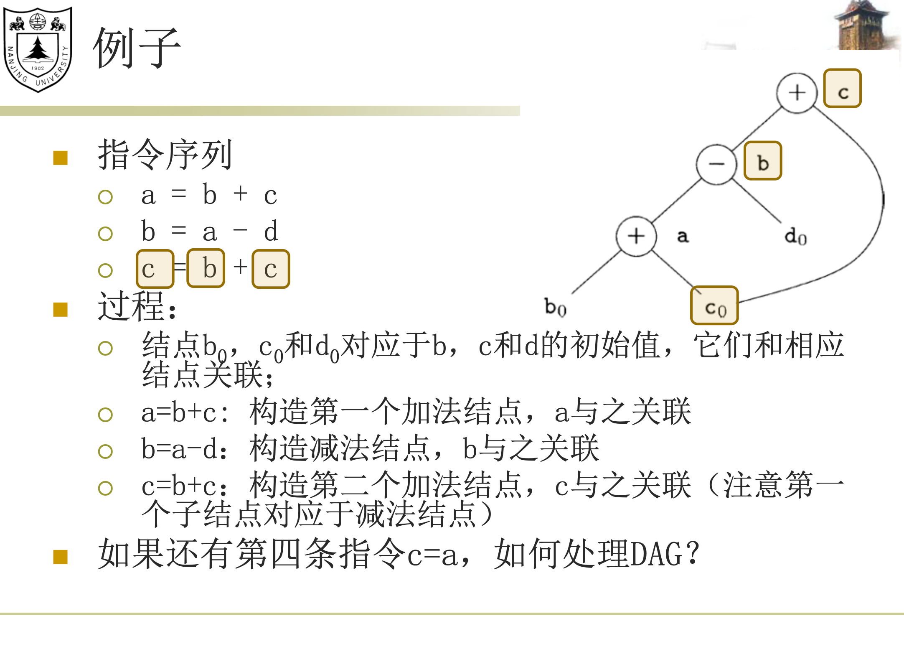
      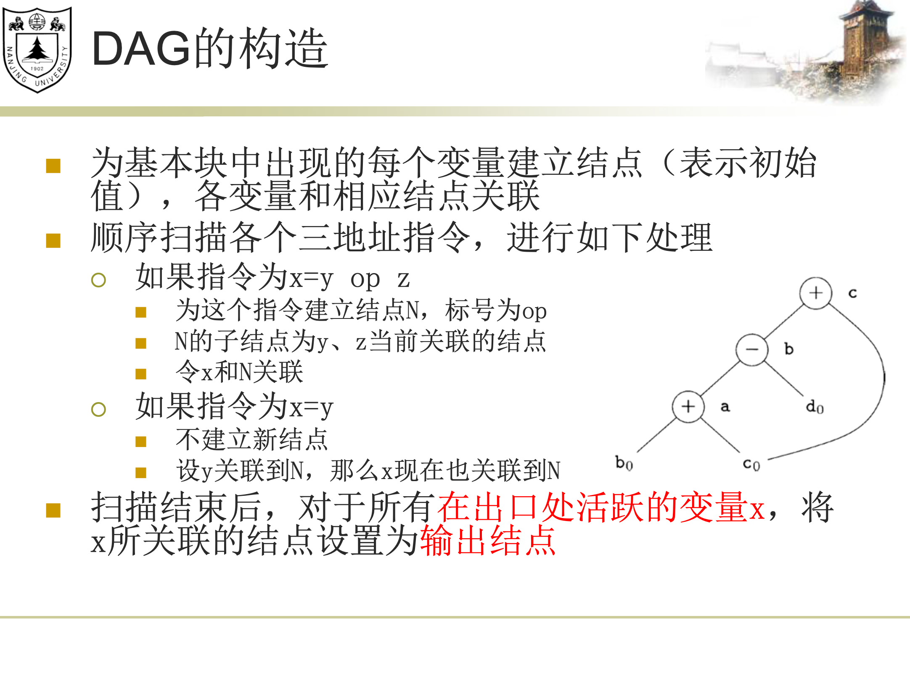
      </div>

- 检测局部公共子表达式：建立某个结点 $$M$$ 之前，首先检查是否存在一个结点 $$N$$，它和 $$M$$ 具有相同的运算符和子结点（顺序也相同），如果存在，则不需要生成新的结点，用 $$N$$ 代表 $$M$$。

- 消除死代码：在 DAG 上消除没有附加活跃变量的**根结点**。**死代码**是指程序中那些计算了结果，但这个结果在程序后续执行的任何路径上**都不会再被使用**的代码语句。

- 常量折叠：在编译时直接计算出常数结果。

- 数组引用的 DAG 表示：

  - 从数组取值的运算：$$x=a[i]$$ 对应于 =[ ] 的结点，该节点的左右子节点分别代表数组初始值和下标。
  - 对数组赋值的运算：$$a[j]=y$$ 对应于[ ]= 的结点，没有关联的变量、且**杀死所有依赖于 $$a$$ 的变量**。隐含的意思：将数组作为整体考虑，对数组元素赋值即改变整个数组。

### 8.6 - 代码生成器

- 基本思路：依次考虑各三地址指令，尽可能把值保留在寄存器中，以减少寄存器/内存之间的数据交换。

- 基本数据结构：用于记录各个值对应的位置。

  - **寄存器描述符**：跟踪各个**寄存器**都存放了哪些变量的当前值。决定哪个寄存器是**空闲的**，或者需要将哪个变量**写回内存**。
  - **地址描述符**：某个**变量**的当前值存放在哪个位置（内存/寄存器）上。决定访问变量时，应该从**内存加载**，还是直接从**寄存器读取**。

- 代码生成算法：遍历三地址指令 $$\to$$ 使用 $$getReg()$$ 选择寄存器 $$\to$$ 生成指令 $$\to$$ **基本块的收尾**：检查**活跃变量**的值是否在内存中更新。

- **重要子函数 $$getReg(I)$$**（下图）：根据寄存器描述符、地址描述符、数据流信息，为三地址指令 $$I$$ 选择最佳的寄存器。

  以“为指令 $$x=y+z$$ 选择寄存器”为例子，为运算分量 $$y$$ 分配寄存器时：

  - 如果已经在某个寄存器中，不需要进行处理，选择这个寄存器；
  - 如果不在寄存器中，且有空闲寄存器，选择一个空闲寄存器；
  - 如果不在寄存器中，且没有空闲寄存器（下图），优先选择**非活跃变量**占用的寄存器。
  - 如果没有，则选择一个活跃变量占用的寄存器，并生成一条**溢出指令** ST，将该变量的值写回内存。

<div align = center>
    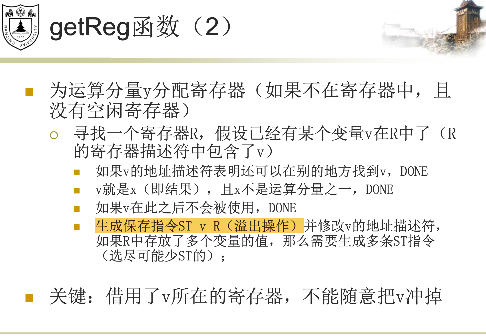
    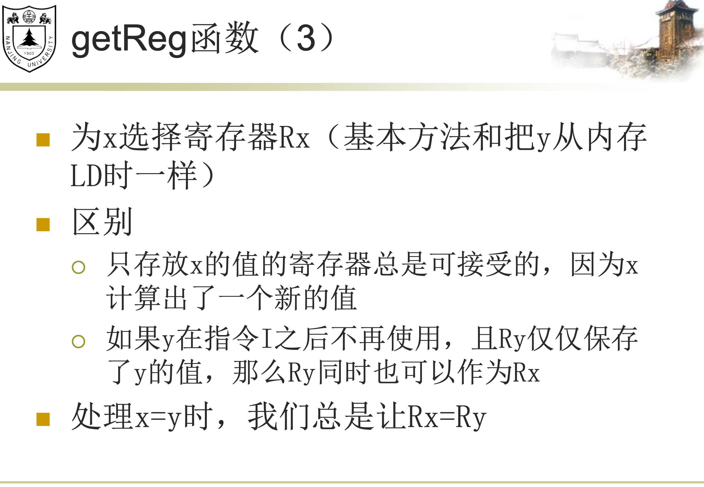
</div>
## 第 9 章 机器无关的优化

### 9.1 - 优化的主要来源

- 目标：在目标代码中，消除不必要的命令，或把一个指令序列替换为一个完成相同功能的更快的指令序列。
- **公共子表达式**（下图）：如果 $$E$$ 在某次出现之前必然已经被计算过，且 $$E$$ 的分量在该次计算之后一直没有被改变，那么 $$E$$ 的本次出现就是一个公共子表达式，可以被消除。
- **复制传播**（下图）：形如 $$u=v$$ 的复制语句，使得语句后面的程序点上 $$u$$ 的值等于 $$v$$ 的值。
  - 如果在某个位置上 $$u$$ 一定等于 $$v$$，那么可以把 $$u$$ 替换为 $$v$$。
  - 有时，可以彻底**消除对 $$u$$ 的使用**，从而消除对 $$u$$ 的赋值语句。
- **死代码消除**：
  - 如果一个变量在某个程序点上的值可能会在之后被使用，那么这个变量在这个点上活跃。
  - 否则，这个变量就是死的，此时对这个变量的赋值就是没有用的死代码，可以被消除。
- **循环不变表达式**：循环的同一次运行的不同迭代中，表达式的值不变。可以把循环不变表达式移动到循环入口之前计算，提高效率。
  - 例如，`while (i <= limit - 2)` ，如果循环体不改变 `limit` 的值，可以在循环外计算 `limit - 2`。

- **归纳变量与强度消减**（下图）：
  - 每次对 $$x$$ 的赋值都使得 $$x$$ 的值增加 $$c$$，那么 $$x$$ 就是归纳变量。
  - 把对 $$x$$ 的赋值改成增量操作，可消减计算强度，提高效率。
  - 如果两个归纳变量步调一致，还可以删除其中的某一个。
  - 例如：在循环中，如果有一个变量的值与循环计数器成线性比例（如数组寻址的 `i * 4`），则可以尝试把这个“乘法”变成“累加”。

<div align = center>
  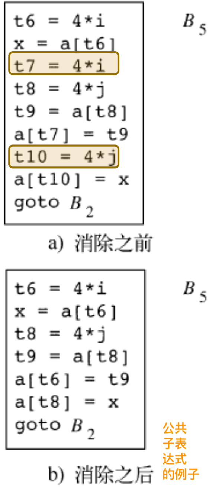
  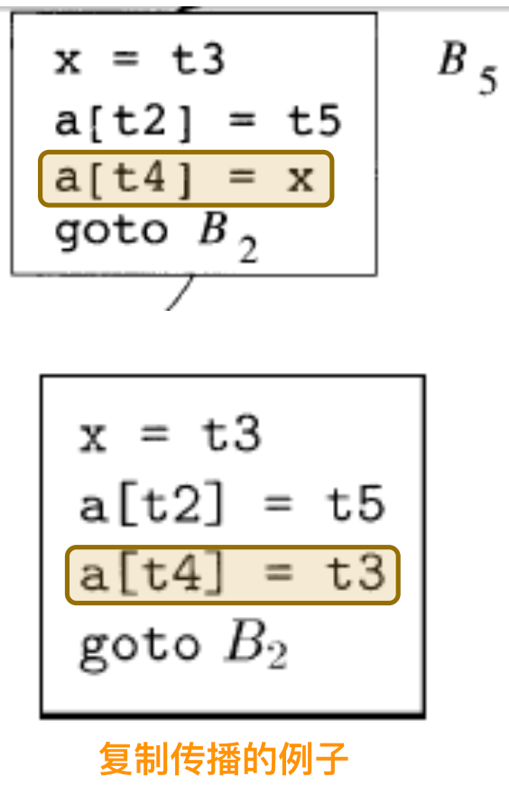
  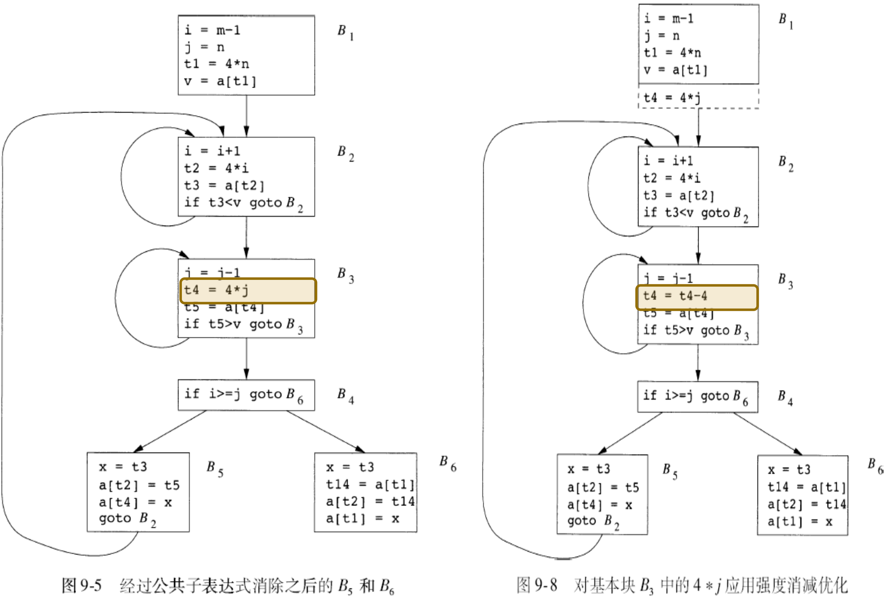
</div>

### 9.2 - 数据流分析

- 数据流分析：用于获取数据沿着程序执行路径流动的信息的相关技术，是优化的基础。
- 程序点：三地址语句之前或之后的位置。基本块内部：一个语句之后的程序点等于下一个语句之前的程序点。
- 数据流值：某个程序点所有可能的状态集合的抽象表示。把每个语句 $$s$$ 之前和之后的数据流值分别记为 $$\text{IN}[s]$$ 和 $$\text{OUT}[s]$$。
- 域：所有可能的数据流值的集合。
- 传递函数：一个赋值语句之前和之后的数据流值的关系被称为传递函数。

### 【重要】语句/基本块的传递方程

描述了信息（如变量的值或定值）如何穿过一条语句或一个基本块。

- **Gen (生成)**：基本块内部新产生的信息。
   - **定值 Gen**：块内对变量的赋值，且该赋值未被块内后续赋值覆盖。
   - **表达式 Gen**：块内计算了某表达式，且其操作数在计算后未被修改。
- **Kill (杀死)**：基本块使得块外的信息失效。
   - **定值 Kill**：块内对变量 $$x$$ 赋值，杀死了程序中其他地方对 $$x$$ 的定值。
   - **表达式 Kill**：块内对操作数 $$x$$ 赋值，杀死了所有包含 $$x$$ 的表达式。
- **IN / OUT**：
   - **IN**：进入基本块时的信息集合。
   - **OUT**：离开基本块时的信息集合。到达定值分析 (Reaching Definitions)
- **方程公式**：$$f_d(x) = gen_d \cup (x - kill_d)$$。
   - **含义**：输出的结果 =（本条语句新产生的信息）$$\cup$$（从前面传进来的信息 $$-$$ 被本条语句杀掉的信息）。

#### 1. 到达定值

- 定义：如果存在一条从定值 $$d$$ 后的程序点到达某点 $$p$$ 的路径，且这条路径上 $$d$$ 没有被杀死，那么定值 $$d$$ 到达 $$p$$。

- 作用：如果发现某个变量在某处只有唯一的定值且是常量，就可以把变量直接换成常量，即**常量传播**。

  - $$gen_B$$: 块内产生的定值。

  - $$kill_B$$: 被块内赋值覆盖的外部定值。

  - $$\text{OUT}[B] = gen_B \cup (\text{IN}[B] - kill_B)$$

  - $$\text{IN}[B] = \bigcup_{P \in pred(B)} \text{OUT}[P]$$ (前向分析，取**并集**)

#### 2. 可用表达式分析

- 定义：如果表达式 $$x+y$$ 在点 $$p$$ 可用，说明从入口到 $$p$$ 的每条路径都计算了 $$x+y$$，且之后 $$x,y$$ 未被修改。

- 作用：如果表达式算过且中间没改过，就直接拿结果，不用再算一遍，即**消除全局公共子表达式**。

  - $$e\_gen_B$$: 块内计算且之后未被杀死的表达式。

  - $$e\_kill_B$$: 操作数被块内赋值修改的表达式。

  - $$\text{OUT}[B] = e\_gen_B \cup (\text{IN}[B] - e\_kill_B)$$

  - $$\text{IN}[B] = \bigcap_{P \in pred(B)} \text{OUT}[P]$$ (前向分析，**取交集**)

#### 3. 活跃变量分析

- 定义：如果变量 $$x$$ 在点 $$p$$ 活跃，说明存在从 $$p$$ 出发的路径在 $$x$$ 被重新定义前使用了它。

- 作用：如果某个变量不用了，它占用的寄存器立刻给别人，或者干脆删掉这行赋值，即**寄存器分配/死代码删除**。

  - $$def_B$$: 块内先定义后引用的变量。

  - $$use_B$$: 块内先引用后定义的变量。

  - $$\text{IN}[B] = use_B \cup (\text{OUT}[B] - def_B)$$
  - $$\text{OUT}[B] = \bigcup_{S \in succ(B)} \text{IN}[S]$$ （**逆向分析**）


### 【重要】支配节点树

- **支配节点** dominate：如果每一条从入口结点到达 $$n$$ 的路径都经过 $$d$$，我们就说 $$d$$ 支配 $$n$$，记为 $$d \ dom \ n$$。
- 直接支配节点：从入口结点到达 $$n$$ 的任何路径（不含 $$n$$）中，它是路径中最后一个支配 $$n$$ 的结点。
- **支配节点树**：根结点为入口结点，每个结点 $$d$$ 支配且只支配树中的后代结点。
- **构建方法：**
  1. 初始化：入口初始化 $$D(1) = \{1\}$$，其他初始化为**全集**。
  2. 找节点：使用 $$D(x) = \{x\} \cup \left( \bigcap_{p \in preds(x)} D(p) \right)$$，得到各个节点对应的支配节点。（$$preds$$ 代表前驱）


- **自然循环**：有一个唯一的入口结点（循环头 header）。这个结点支配循环中的所有结点。

